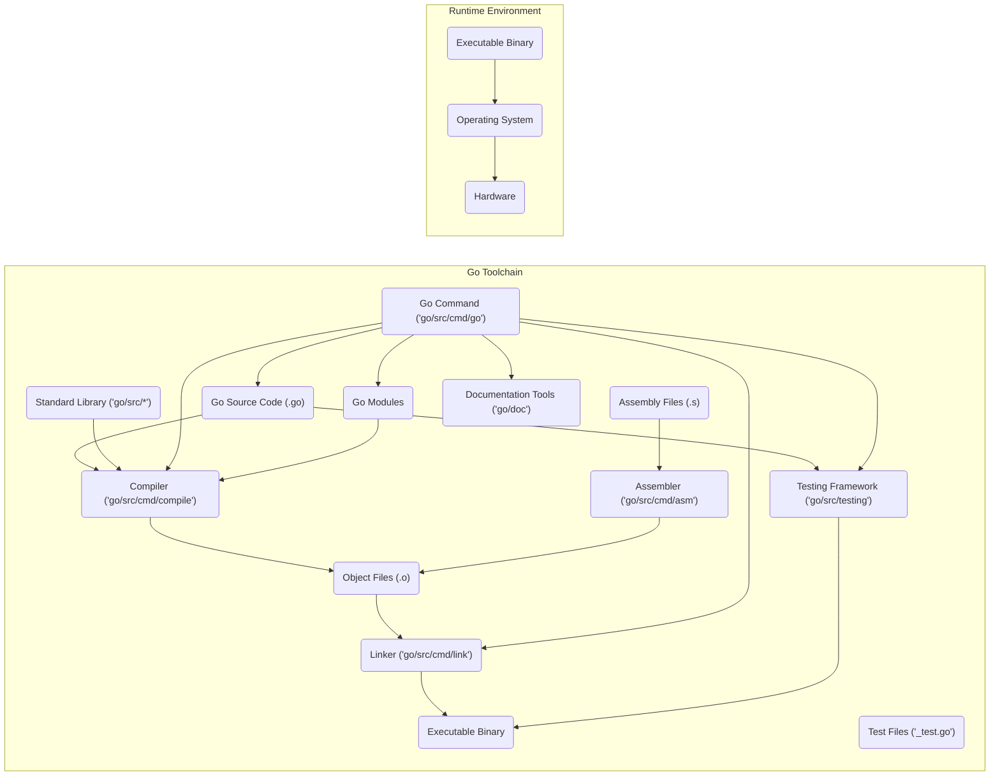
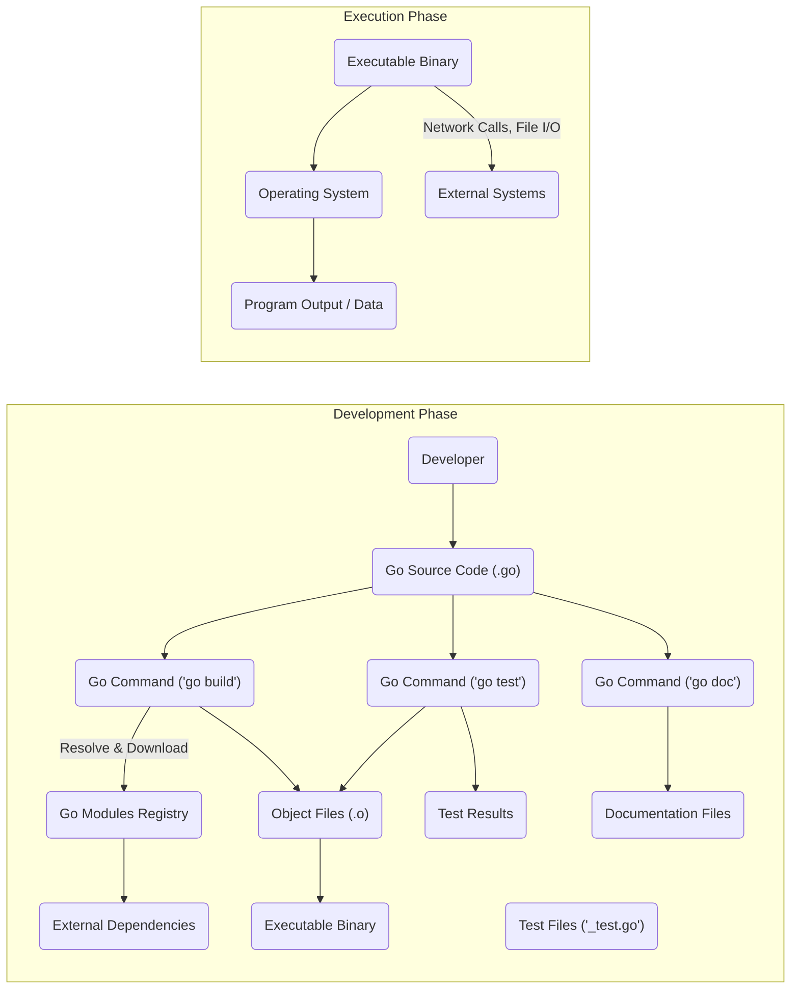

## Project Design Document: Go Programming Language

**Project URL:** https://github.com/golang/go

**Document Version:** 1.1
**Date:** October 26, 2023
**Author:** AI Software Architect

### 1. Introduction

This document provides a detailed architectural overview of the Go programming language project, hosted on GitHub at [https://github.com/golang/go](https://github.com/golang/go). This document is intended to serve as a comprehensive foundation for subsequent threat modeling activities. It outlines the key components, data flows, and technologies involved in the Go project, with a focus on aspects relevant to security.

### 2. Project Overview

The Go project encompasses the development, maintenance, and distribution of the Go programming language, its standard library, and a rich set of related tools. It is a mature, open-source project with a large and active community of contributors. The core design principles of Go prioritize efficiency, reliability, and simplicity, making it suitable for a wide range of software development tasks.

### 3. System Architecture

The Go project's architecture can be decomposed into several interacting components. Understanding these components is crucial for identifying potential threat vectors.

*   **Compiler (`go/src/cmd/compile`):**  The core component responsible for parsing Go source code, performing type checking, and generating architecture-specific machine code.
*   **Linker (`go/src/cmd/link`):**  Combines compiled object files, including those from the standard library and external packages, into a single executable binary. This process involves resolving symbols and handling relocations.
*   **Standard Library (`go/src/runtime`, `go/src/fmt`, `go/src/net`, etc.):** A vast collection of packages providing fundamental functionalities. Security vulnerabilities within the standard library can have widespread impact. Key areas include:
    *   Networking (`net`, `net/http`, `crypto/tls`)
    *   Cryptography (`crypto/*`)
    *   Input/Output (`io`, `os`)
    *   Data encoding and decoding (`encoding/*`)
*   **Runtime (`go/src/runtime`):**  Provides essential services for executing Go programs. This includes:
    *   Garbage Collection: Automatic memory management.
    *   Goroutine Scheduling: Management of concurrent execution units.
    *   Memory Management: Allocation and deallocation of memory.
    *   Interaction with the Operating System.
*   **Assembler (`go/src/cmd/asm`):**  Translates assembly language source code into machine code. Primarily used for low-level optimizations and interacting with hardware.
*   **Go Command (`go/src/cmd/go`):**  The central command-line tool for managing Go projects. Its functionalities include:
    *   Building (`go build`)
    *   Testing (`go test`)
    *   Running (`go run`)
    *   Dependency Management (`go mod`)
    *   Formatting (`go fmt`)
    *   Code analysis (`go vet`)
*   **Package Management (Go Modules):**  A system for managing dependencies, including downloading, versioning, and verifying external packages. Security considerations include dependency confusion and supply chain attacks.
*   **Testing Framework (`go/src/testing`):**  Provides tools and conventions for writing and executing unit tests, integration tests, and benchmarks.
*   **Documentation (`go/doc`):** Tools for extracting and generating documentation from Go source code.

### 4. Data Flow

Understanding how data flows through the Go project is essential for identifying potential points of interception or manipulation.

*   **Source Code Creation and Modification:** Developers write and modify Go source code. This code can be stored in various locations, including local file systems and version control systems.
*   **Compilation Process:** The `go build` command initiates the compilation process. The compiler reads source files, including those from the standard library and imported modules.
*   **Dependency Resolution and Download:** When building a project, the `go` command interacts with Go Modules to resolve and download necessary dependencies from remote repositories. This involves network communication and file system operations.
*   **Linking and Binary Generation:** The linker combines compiled object files into an executable binary. This binary contains the application logic and necessary runtime components.
*   **Execution of Go Programs:** The operating system loads and executes the generated binary. The program interacts with the operating system and potentially external systems through network calls, file I/O, and other mechanisms.
*   **Testing Process:** The `go test` command compiles and executes test files. Test data and results are generated and displayed.
*   **Documentation Generation:** The `go doc` tool parses source code and generates documentation files, often in HTML format.

### 5. Key Technologies

The Go project leverages several underlying technologies that are important to consider from a security perspective.

*   **Go Programming Language:**  Its features, such as memory safety and static typing, contribute to overall security.
*   **C (for parts of the runtime and low-level operations):**  Interoperability with C introduces potential vulnerabilities if not handled carefully.
*   **Assembly Language:** Direct manipulation of hardware can introduce security risks if not implemented correctly.
*   **Git:**  The version control system used for managing the project's source code. Security of the Git repository is crucial.
*   **GitHub:** The platform hosting the Go project. Security of the GitHub infrastructure is relevant.
*   **Operating System APIs (e.g., syscalls):**  Interactions with the OS kernel can introduce vulnerabilities if not handled securely.
*   **Network Protocols (TCP/IP, HTTP, etc.):**  The standard library's implementation of these protocols needs to be secure to prevent network-based attacks.
*   **Cryptography Libraries (within the standard library):**  The security of cryptographic implementations is paramount for secure communication and data handling.

### 6. Security Considerations (Design Level)

Security is a significant consideration in the design and development of the Go project.

*   **Memory Safety:** Go's built-in memory management (garbage collection) and bounds checking help prevent common memory corruption vulnerabilities.
*   **Static Typing:**  Early detection of type errors reduces the likelihood of runtime issues that could be exploited.
*   **Concurrency Safety:** Go's concurrency primitives (goroutines and channels) encourage safer concurrent programming, but developers must still be aware of potential race conditions and deadlocks.
*   **Standard Library Security:**  The Go team prioritizes the security of the standard library, with ongoing reviews and updates to address potential vulnerabilities.
*   **Go Modules Security:**  Features like checksum verification in `go.sum` help mitigate dependency confusion attacks and ensure the integrity of downloaded dependencies.
*   **Limited Implicit Conversions:**  Explicit type conversions reduce the risk of unintended behavior and potential security flaws.
*   **Regular Security Audits and Bug Fixes:** The Go project actively encourages security researchers to report vulnerabilities and has a process for addressing them.
*   **Security Best Practices Documentation:** The Go project provides guidance on secure coding practices for Go developers.

### 7. Deployment

Understanding the typical deployment models for Go applications is important for identifying deployment-specific threats.

*   **Local Development Environment:** Developers install the Go toolchain, which can introduce security risks if the installation process is compromised or if vulnerable versions are used.
*   **Continuous Integration/Continuous Deployment (CI/CD) Pipelines:**  Go is frequently used in CI/CD systems. Security of the CI/CD pipeline itself is crucial to prevent malicious code injection.
*   **Server Environments:** Go is a popular choice for building backend services. Security considerations include securing the server environment, network configurations, and access controls.
*   **Cloud Platforms:** Deploying Go applications on cloud platforms introduces dependencies on the security of the cloud provider's infrastructure.
*   **Containerization (Docker, etc.):**  Containerizing Go applications adds another layer of abstraction and security considerations related to container image security.
*   **Embedded Systems and IoT Devices:** Deploying Go on resource-constrained devices requires careful consideration of security due to limited resources and potential exposure.

### 8. Dependencies

The Go project has dependencies at various levels, which can introduce potential security risks.

*   **Operating System:** The security of the underlying operating system is critical for the security of the Go toolchain and applications.
*   **C Compiler (for building parts of the toolchain):**  A compromised C compiler could introduce vulnerabilities into the Go toolchain itself.
*   **Build Tools (e.g., Make):**  The security of build tools used in the Go project's build process is important.
*   **Network Connectivity:**  Required for downloading dependencies. A compromised network could lead to man-in-the-middle attacks during dependency downloads.
*   **Version Control System (Git):**  The security of the Git repository and the Git client used by developers is crucial.
*   **External Go Modules:**  Go projects depend on external modules. The security of these modules and the registries they are hosted on is a significant concern.

**Note:** This document provides a detailed architectural overview for threat modeling purposes. Further in-depth design documents may exist for specific sub-components within the Go project. This document should be considered a living document and updated as the project evolves.