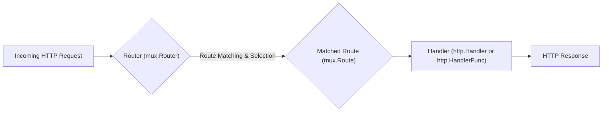

# Project Design Document: Gorilla Mux HTTP Router (Improved)

**Version:** 1.1
**Date:** October 26, 2023
**Author:** AI Software Architect

## 1. Introduction

This document provides an enhanced design overview of the `gorilla/mux` library, a widely used and powerful HTTP request router and dispatcher for Go applications. Building upon the previous version, this document offers further clarity and detail regarding the library's architecture, components, and data flow, specifically tailored for effective threat modeling exercises.

## 2. Goals and Objectives

The primary goals of this design document are to:

*   Provide a clear and comprehensive explanation of the `gorilla/mux` library's internal workings.
*   Detail the interaction between key components involved in request routing.
*   Explicitly highlight areas within the `gorilla/mux` architecture that are relevant for security considerations and threat identification.
*   Serve as a more robust and detailed reference for developers, security engineers, and anyone involved in the security assessment of systems utilizing `gorilla/mux`.

## 3. High-Level Architecture

`gorilla/mux` acts as a central control point for routing incoming HTTP requests to the appropriate handlers within a Go application. It leverages a pattern-matching approach to associate specific request characteristics with defined routes and their corresponding handler functions or `http.HandlerFunc`.



## 4. Component Details

This section provides a more in-depth look at the core components of the `gorilla/mux` library.

### 4.1. `mux.Router`

*   **Description:** The central orchestrator of the routing process. The `mux.Router` implements the `http.Handler` interface, making it directly usable with Go's `net/http` server infrastructure. It internally manages a collection of `mux.Route` instances.
*   **Responsibilities:**
    *   **Route Management:**  Stores and organizes defined routes, often in the order they are registered (though specific matchers can influence precedence).
    *   **Request Matching:**  Receives an incoming `http.Request` and iterates through its registered routes, applying the matching logic defined by each route's matchers.
    *   **Route Selection:** Selects the first route that successfully matches the incoming request.
    *   **Dispatching:**  Invokes the `ServeHTTP` method of the `http.Handler` (or `http.HandlerFunc`) associated with the matched route.
    *   **Subrouter Support:** Allows for the creation of nested routers, enabling modular organization of routes and middleware.
    *   **Route Building:** Provides methods to define new routes with various matching criteria (path, host, headers, methods, query parameters, schemes).

### 4.2. `mux.Route`

*   **Description:** Represents a single routing rule within the `mux.Router`. Each `mux.Route` encapsulates the criteria for matching an incoming request and the `http.Handler` to be executed upon a successful match.
*   **Responsibilities:**
    *   **Matching Rule Definition:** Stores the specific matching rules configured for the route, utilizing various matchers.
    *   **Handler Association:** Holds a reference to the `http.Handler` or `http.HandlerFunc` that will process requests matching this route.
    *   **URL Building:** Provides methods to construct URLs based on the route's defined parameters, useful for generating links.
    *   **Matcher Configuration:** Allows setting and retrieving different types of matchers associated with the route.

### 4.3. Matchers

*   **Description:**  Interfaces and concrete implementations responsible for determining if an incoming `http.Request` satisfies the matching criteria defined by a `mux.Route`. Multiple matchers can be combined on a single route, and all must succeed for the route to match.
*   **Types of Matchers:**
    *   **Path Matcher:** Compares the request URL path against a defined pattern. Supports exact matching, path prefixes (using `PathPrefix`), and regular expressions (using `PathRegexp`).
        *   *Example:* `/users/{id:[0-9]+}`
    *   **Host Matcher:** Matches based on the `Host` header of the request.
        *   *Example:* `api.example.com`
    *   **Method Matcher:** Matches based on the HTTP request method (e.g., `GET`, `POST`, `PUT`, `DELETE`).
        *   *Example:* `GET`
    *   **Header Matcher:** Matches based on the presence or specific value of HTTP headers.
        *   *Example:* `Content-Type: application/json`
    *   **Query Matcher:** Matches based on the presence or specific value of query parameters in the URL.
        *   *Example:* `debug=true`
    *   **Scheme Matcher:** Matches based on the URL scheme (`http` or `https`).
        *   *Example:* `https`
    *   **Custom Matchers:** Allows developers to implement their own matching logic by implementing the `MatcherFunc` interface.

### 4.4. `http.Handler` and `http.HandlerFunc`

*   **Description:** Standard Go interfaces for handling HTTP requests. `http.Handler` is an interface with a single method `ServeHTTP(http.ResponseWriter, *http.Request)`. `http.HandlerFunc` is a function type that implements the `http.Handler` interface.
*   **Responsibilities:**
    *   Receiving the `http.ResponseWriter` and `http.Request` objects.
    *   Implementing the application logic to process the request.
    *   Writing the HTTP response to the `http.ResponseWriter`.

### 4.5. Middleware (Interceptors)

*   **Description:** Functions that intercept HTTP requests as they pass through the routing process. Middleware can perform actions before or after the main handler is invoked.
*   **Mechanism:** `gorilla/mux` facilitates middleware primarily through handler wrapping. Middleware functions take an `http.Handler` as input and return a new `http.Handler` that wraps the original. This allows for the execution of pre- and post-processing logic.
*   **Implementation Patterns:**
    *   **Handler Decorators:** Functions that wrap handlers to add functionality.
    *   **Chained Middleware:**  Multiple middleware functions can be chained together, forming a pipeline.
*   **Use Cases:** Authentication, authorization, logging, request modification, response manipulation, setting headers, error handling.

## 5. Data Flow

The following sequence diagram provides a more detailed illustration of how an HTTP request is processed by `gorilla/mux`:

```mermaid
sequenceDiagram
    participant "Client" as C
    participant "Router (mux.Router)" as R
    participant "Route (mux.Route) 1..n" as RT
    participant "Matcher 1..m" as M
    participant "Handler (http.Handler)" as H

    C->>R: Incoming HTTP Request
    R->>RT: Iterate through Registered Routes
    loop For each Route
        RT->>M: Evaluate Matching Criteria
        alt Match Successful (All Matchers Pass)
            M-->>RT: Match Success
            RT->>H: Dispatch to Associated Handler
            H-->>RT: HTTP Response
            RT-->>R: Response
            break
        else Match Failed (At Least One Matcher Fails)
            M-->>RT: Match Failure
        end
    end
    alt No Route Matched
        R-->>C: 404 Not Found (Default) or Custom Not Found Handler
    else Route Matched
        R-->>C: HTTP Response from Handler
    end
```

**Detailed Flow:**

1. An HTTP request is received by the `mux.Router`.
2. The router iterates through its collection of registered `mux.Route` instances.
3. For each `mux.Route`, the router evaluates the configured matchers against the properties of the incoming request (URL path, host, headers, etc.).
4. Each matcher performs its specific matching logic. All matchers on a route must succeed for the route to be considered a match.
5. If all matchers on a route return a successful match, that route is selected.
6. The `ServeHTTP` method of the `http.Handler` (or `http.HandlerFunc`) associated with the matched route is invoked.
7. The handler processes the request and generates an HTTP response.
8. The response is returned to the client.
9. If the router iterates through all routes without finding a match, it typically invokes a default "not found" handler (which usually returns a 404 status code) or a custom not found handler if one is configured.

## 6. Security Considerations for Threat Modeling

This section details potential security vulnerabilities and considerations relevant to threat modeling when using `gorilla/mux`.

*   **Route Definition Vulnerabilities:**
    *   **Route Overlap and Precedence Issues:**  Ambiguous or overlapping route definitions can lead to requests being routed to unintended handlers. The order of route registration often dictates precedence, which can be a source of confusion and potential security flaws if not carefully managed.
    *   **Insufficiently Specific Route Constraints:**  Using overly broad matchers (e.g., wildcard paths without proper validation) can expose unintended endpoints or functionality.
    *   **Regular Expression Denial of Service (ReDoS):**  If `PathRegexp` is used with complex or poorly written regular expressions, attackers might craft URLs that cause excessive CPU consumption, leading to denial of service.

*   **Matcher Logic Exploits:**
    *   **Host Header Injection:** If routing logic relies solely on the `Host` header without validation against expected values, attackers can manipulate the `Host` header to access resources intended for different virtual hosts or bypass security checks.
    *   **Header Injection and Bypass:**  Improperly implemented header matchers might be susceptible to bypasses through carefully crafted header values.
    *   **Query Parameter Manipulation:**  If routing decisions are based on query parameters without proper sanitization or validation, attackers might manipulate these parameters to access unauthorized resources or trigger unintended actions.

*   **Middleware Security Risks:**
    *   **Vulnerable or Malicious Middleware:**  Using third-party or custom middleware with security vulnerabilities can expose the application to various attacks.
    *   **Middleware Ordering Vulnerabilities:**  Incorrect ordering of middleware can lead to security bypasses (e.g., authentication middleware being executed after a handler that assumes authentication). Ensure that security-critical middleware is executed early in the chain.
    *   **Information Leakage in Middleware:** Middleware might unintentionally log or expose sensitive information.

*   **URL Parameter Handling Weaknesses:**
    *   **Injection Attacks:** Route parameters extracted from the URL (e.g., using named capture groups in path patterns) must be carefully sanitized before being used in database queries or other sensitive operations to prevent injection attacks (SQL injection, command injection, etc.).

*   **Error Handling and Logging Security:**
    *   **Excessive Error Details:**  Verbose error messages returned to the client or logged without proper redaction can reveal sensitive information about the application's internal workings.

*   **Cross-Origin Resource Sharing (CORS) Misconfiguration:**
    *   **Permissive CORS Policies:**  Overly permissive CORS configurations can allow unauthorized access to resources from unintended origins, potentially leading to data breaches or other security issues. Ensure CORS policies are correctly configured to restrict access to trusted origins.

## 7. Deployment Considerations

*   `gorilla/mux` is typically integrated directly into the Go application's HTTP server setup using the `net/http` package.
*   It can be deployed in various environments, including bare metal servers, virtual machines, containers (Docker, Kubernetes), and serverless functions.
*   Security best practices for the deployment environment should be followed, such as using HTTPS, implementing proper network segmentation, and keeping dependencies up to date.
*   Consider the security implications of any reverse proxies or load balancers used in front of the application.

## 8. Future Enhancements (Potential)

*   More sophisticated route prioritization and conflict resolution mechanisms.
*   Built-in support for common security-related middleware (e.g., rate limiting, request size limiting).
*   Enhanced metrics and observability features for monitoring routing behavior and performance.

This improved design document provides a more detailed and nuanced understanding of the `gorilla/mux` library, specifically focusing on aspects relevant to security assessment and threat modeling. This information should empower security professionals and developers to identify and mitigate potential security risks associated with its use.
