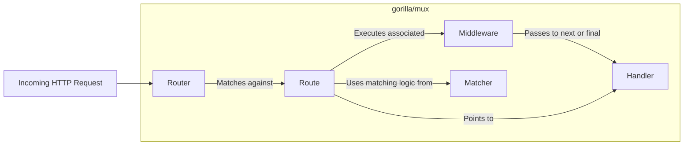
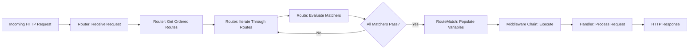

# Project Design Document: gorilla/mux HTTP Router

**Version:** 1.1
**Date:** October 26, 2023
**Author:** AI Software Architect

## 1. Introduction

This document provides an enhanced and more detailed design overview of the `gorilla/mux` library, a powerful HTTP request router and dispatcher for Go applications. This revised document aims to provide a stronger foundation for subsequent threat modeling activities by offering a deeper understanding of the library's architecture, components, and data flow.

### 1.1. Purpose

The primary purpose of this document is to describe the design of `gorilla/mux` with increased granularity to facilitate more effective and targeted threat modeling. It elaborates on the key components, their interactions, and the precise flow of data within the library, highlighting areas of potential security concern.

### 1.2. Scope

This document covers the core functionalities of the `gorilla/mux` library related to request routing and dispatching, with a focus on aspects relevant to security analysis. It delves deeper into the internal architecture, the lifecycle of an HTTP request, and the mechanisms used for route matching. It continues to exclude specifics of individual handler implementations and the broader application context, unless directly relevant to the router's security.

### 1.3. Audience

This document is primarily intended for security engineers, architects, and developers who will be involved in threat modeling the `gorilla/mux` library or applications that utilize it. The enhanced detail aims to provide a more comprehensive understanding for security assessments.

## 2. Overview

`gorilla/mux` is a widely adopted Go library that serves as an HTTP request router and multiplexer. It excels at matching incoming HTTP requests against a predefined set of routes and dispatching them to the appropriate handler functions. Its flexibility and extensibility make it a cornerstone for building robust web applications and APIs in Go. Key features include:

*   Precise path matching, including the extraction of variables from the URL path.
*   Support for regular expressions within path matching for complex routing scenarios.
*   Matching based on the HTTP host header, enabling routing based on domain or subdomain.
*   Matching based on arbitrary HTTP headers, allowing for content negotiation or API versioning.
*   Routing based on the request's scheme (HTTP or HTTPS).
*   The ability to define custom matching logic through user-defined `Matcher` interfaces.
*   A robust middleware system for intercepting and processing requests before they reach handlers.

The library acts as a central control point within a Go HTTP server, intercepting each incoming request and making routing decisions based on the configured rules. This centralized approach is crucial for understanding potential attack surfaces.

## 3. Architectural Design

The architecture of `gorilla/mux` is centered around the `Router` object, which manages a collection of `Route` objects.

### 3.1. Key Components

*   **Router:** The core component responsible for managing all registered routes and performing the matching of incoming requests. It acts as the initial receiver of HTTP requests within the `gorilla/mux` framework. The `Router` maintains an ordered list of `Route` objects.
*   **Route:** Represents a specific routing rule. Each `Route` encapsulates the matching criteria (path, methods, host, headers, scheme, custom matchers) and the associated handler to be executed upon a successful match. A `Route` is immutable once created.
*   **Handler:**  An `http.Handler` interface implementation (or a function that satisfies the `http.HandlerFunc` type) that contains the application logic to process a matched request. The `Router` dispatches the request to the matched `Route`'s handler.
*   **Middleware:** Functions conforming to the `func(http.Handler) http.Handler` signature. Middleware intercepts requests before they reach the final handler, allowing for cross-cutting concerns like logging, authentication, authorization, request modification, and setting response headers. Middleware is executed in the order it is added to the `Router` or `Route`.
*   **Matcher:** An interface defining the `Match(*http.Request, *RouteMatch) bool` method. `gorilla/mux` provides built-in `Matcher` implementations for path, host, headers, methods, and scheme. Custom `Matcher` implementations allow for extending the routing logic based on specific application needs. The `RouteMatch` struct stores information about the matched route and extracted variables.

### 3.2. Component Relationships

*   The `Router` is the central hub, receiving `Incoming HTTP Request` objects.
*   The `Router` iterates through its `Route` objects to find a match.
*   Each `Route` utilizes one or more `Matcher` objects to evaluate if the incoming request satisfies its criteria.
*   Upon a successful match, the `Route`'s associated `Middleware` chain is executed sequentially.
*   Finally, the `Handler` linked to the matching `Route` is invoked to process the request.

### 3.3. Data Flow

The journey of an HTTP request through `gorilla/mux` involves a series of steps:

1. An `Incoming HTTP Request` is received by the Go HTTP server and passed to the registered `Router` instance (which implements `http.Handler`).
2. The `Router` retrieves its ordered list of registered `Route` objects.
3. The `Router` iterates through each `Route` in the order they were added.
4. For each `Route`, the `Router` invokes the `Match` method of each of the `Route`'s associated `Matcher`s, passing the `http.Request` and a `RouteMatch` struct.
5. Each `Matcher` examines specific aspects of the `http.Request` (e.g., URL path, headers) and returns a boolean indicating a match.
6. If all `Matcher`s for a given `Route` return `true`, the `Route` is considered a match. The `RouteMatch` struct is populated with information like extracted path variables.
7. If a match is found, the `Router` retrieves the middleware chain associated with that `Route`.
8. The `Router` executes the middleware chain sequentially. Each middleware function receives the `http.Request` and the next `http.Handler` in the chain. Middleware can modify the request, the response, or terminate the chain.
9. After the middleware chain completes (or if there is no middleware), the `Handler` associated with the matching `Route` is invoked with the `http.ResponseWriter` and the `http.Request`.
10. The `Handler` processes the request, potentially using the information stored in the `RouteMatch` (e.g., path variables), and writes the `HTTP Response` to the `http.ResponseWriter`.
11. The `HTTP Response` is then sent back to the client.

## 4. Security Considerations

This section details potential security considerations based on the design of `gorilla/mux`.

*   **Route Definition Vulnerabilities:**
    *   **Overly Broad Path Matching:**  Using catch-all patterns (e.g., `/api/{}`) can unintentionally route requests to sensitive handlers.
    *   **Conflicting Routes:**  Ambiguous route definitions can lead to unexpected handler execution, potentially bypassing security checks. The order of route registration becomes critical.
    *   **Missing Security Headers:**  If routes serving sensitive content don't have middleware to enforce security headers (e.g., `Strict-Transport-Security`, `X-Frame-Options`), vulnerabilities can arise.
*   **Regular Expression Denial of Service (ReDoS):**
    *   Using complex or unbounded regular expressions in path matchers can be exploited by attackers sending crafted URLs that consume excessive CPU time.
    *   Care must be taken to validate and limit the complexity of regular expressions used in routing.
*   **Middleware Security:**
    *   **Vulnerable Middleware:** Security flaws in custom or third-party middleware can introduce vulnerabilities into the application.
    *   **Incorrect Middleware Ordering:**  Placing authentication or authorization middleware after other processing middleware can lead to bypasses.
    *   **Middleware Exhaustion:**  Resource-intensive middleware could be used to mount denial-of-service attacks.
*   **Input Validation (Handler Responsibility, but influenced by routing):**
    *   While `gorilla/mux` handles routing, the extracted path variables are passed to handlers. If handlers don't properly validate these inputs, injection vulnerabilities (e.g., SQL injection, command injection) can occur.
    *   The routing logic can influence which handler receives the request, making it crucial to ensure the correct handler with appropriate validation is invoked.
*   **Error Handling:**
    *   If handlers or middleware return errors that are not properly handled by `gorilla/mux` or the surrounding application, sensitive information might be leaked in error responses.
    *   Generic error handlers should be implemented to prevent exposing internal details.
*   **Resource Exhaustion (Routing Table Size):**
    *   A very large number of routes, especially with complex matching criteria, can increase memory consumption and potentially slow down request processing, leading to denial of service.
*   **Access Control (Middleware Responsibility):**
    *   `gorilla/mux` relies on middleware for authentication and authorization. Misconfigured or vulnerable authentication/authorization middleware can grant unauthorized access to resources.
    *   It's crucial to have robust and correctly implemented access control middleware in place.
*   **Route Hijacking:**
    *   In scenarios where route definitions are dynamically loaded or influenced by external factors, vulnerabilities could allow attackers to inject malicious routes, redirecting traffic or executing arbitrary handlers.

## 5. Dependencies

`gorilla/mux` aims to have minimal external dependencies, which reduces the overall attack surface. Its primary dependency is:

*   `github.com/gorilla/context`:  Provides request-scoped context. While being phased out in favor of the standard library's `context`, it's still a dependency in some versions. Understanding the security implications of this dependency is important.

It's crucial to regularly review the dependencies for known vulnerabilities.

## 6. Deployment Considerations

Secure deployment practices are essential when using `gorilla/mux`:

*   **TLS Configuration:** Ensure that the server using `gorilla/mux` is properly configured for HTTPS to encrypt communication.
*   **Secure Headers:**  Utilize middleware to enforce security headers (e.g., `Content-Security-Policy`, `X-Content-Type-Options`) to mitigate various client-side attacks.
*   **Dependency Management:** Regularly update `gorilla/mux` and its dependencies to patch security vulnerabilities. Use tools for dependency scanning.
*   **Resource Limits:** Configure appropriate resource limits (e.g., memory, CPU) for the application to prevent denial-of-service attacks.
*   **Input Sanitization:** While routing directs the request, ensure that the handlers receiving the requests perform thorough input sanitization to prevent injection attacks.
*   **Monitoring and Logging:** Implement robust monitoring and logging to detect suspicious activity and potential attacks.

## 7. Future Considerations

Potential future enhancements to `gorilla/mux` that could impact security include:

*   **Integration with Security Policies:**  Direct integration with security policy enforcement mechanisms could enhance security.
*   **Built-in Rate Limiting:**  Native rate limiting capabilities could help mitigate denial-of-service attacks.
*   **Improved Route Validation:**  More rigorous validation of route definitions could prevent common misconfigurations.

These future considerations should be taken into account during ongoing security assessments.

## 8. Conclusion

This enhanced design document provides a more detailed and security-focused overview of the `gorilla/mux` HTTP router library. By elaborating on the components, data flow, and potential security considerations, this document aims to equip security professionals with the necessary information for effective threat modeling. Understanding the intricacies of `gorilla/mux`'s design is crucial for building secure and resilient Go applications.