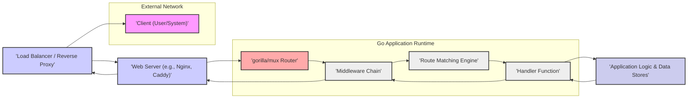

# Project Design Document: gorilla/mux Router for Threat Modeling - Improved Version

**Document Version:** 1.1
**Date:** 2023-10-27
**Author:** AI Software Architecture Expert
**Target Audience:** Security Engineers, Developers, DevOps Engineers, Threat Modeling Team

## 1. Project Overview

This document outlines the design of the `gorilla/mux` project, a powerful HTTP request router and dispatcher for Go. This document is specifically created to facilitate threat modeling activities using methodologies like STRIDE. It provides a detailed overview of the architecture, components, data flow, and technology stack of `gorilla/mux`, explicitly highlighting areas relevant to security considerations and potential threat vectors.

`gorilla/mux` is a fundamental component in many Go web applications, responsible for:

*   **Advanced HTTP Request Routing:**  Matching incoming HTTP requests based on a wide range of criteria, including path patterns (with variables and regular expressions), hostnames, HTTP methods, headers, and query parameters. This flexibility is powerful but requires careful configuration to avoid security missteps.
*   **Efficient Request Dispatching:**  Directing matched requests to specific handler functions, enabling modular application design.
*   **Middleware Pipeline:**  Supporting a chain of middleware functions for request pre-processing and post-processing. This is critical for implementing cross-cutting concerns, including security measures.
*   **URL Building and Reverse Routing:**  Generating URLs based on route names and parameters, useful for maintainability and reducing hardcoded URLs.

This document will delve into the inner workings of `gorilla/mux`'s routing and dispatching mechanisms, emphasizing security implications at each stage and its interaction with the broader application environment.

## 2. System Architecture

The following diagram illustrates the high-level architecture of a system using `gorilla/mux`, focusing on the request lifecycle and components relevant for security threat modeling.

**Detailed Component Description (Security Focused):**

*   **"'Client (User/System)'"**: The origin of all requests. Represents potential attackers. Security concerns: Malicious input injection, DoS attacks, unauthorized access attempts.
*   **"'Load Balancer / Reverse Proxy'"**:  Acts as the first line of defense. Can provide SSL termination (protecting data in transit), basic WAF functionalities (filtering malicious requests), rate limiting (DoS protection), and request routing. Security benefits: DDoS mitigation, SSL/TLS enforcement, basic attack filtering. Security risks: Misconfiguration can create vulnerabilities or bypass security measures.
*   **"'Web Server (e.g., Nginx, Caddy)'"**: Handles low-level HTTP processing, static file serving, and request proxying to the Go application. Security benefits: Offloads static content serving, can provide additional security modules (e.g., mod_security for Apache, security headers in Nginx). Security risks: Vulnerabilities in web server software itself, misconfiguration leading to information disclosure or bypasses.
*   **"'gorilla/mux Router'"**: The core routing engine. Security critical aspects:
    *   **Route Definition Parsing:** How `mux` parses and interprets route patterns. Vulnerabilities can arise from complex regex handling (ReDoS) or incorrect pattern matching logic.
    *   **Route Matching Algorithm:** Efficiency and security of the matching algorithm.  DoS potential if matching is computationally expensive for certain patterns.
    *   **Variable Extraction:**  Mechanism for extracting variables from URLs.  Potential for injection if extracted variables are not handled securely in handlers.
    *   **Route Configuration Storage:** How routes are stored and managed internally.  Less direct security impact, but potential for configuration errors.
*   **"'Middleware Chain'"**:  Security Gateway.  Crucial for implementing security policies. Security benefits: Centralized security checks (authentication, authorization, input validation, output encoding, logging). Security risks: Middleware vulnerabilities, incorrect middleware ordering, middleware bypass if not applied to all relevant routes, performance overhead if middleware is inefficient.
*   **"'Route Matching Engine'"**:  Internal component within `mux` responsible for comparing incoming requests against defined routes. Security relevance:  Efficiency to prevent DoS, correctness to ensure intended routes are matched and no unintended routes are accessible.
*   **"'Handler Function'"**:  Application Logic Entry Point.  Where the actual request processing happens. Security critical aspects: Input validation, authorization enforcement, secure data handling, output encoding, error handling. Vulnerabilities here are direct application vulnerabilities, not necessarily in `mux` itself, but `mux` directs traffic here.
*   **"'Application Logic & Data Stores'"**:  Backend systems and databases. Security relevance:  Backend vulnerabilities are often exposed through handler functions reached via `mux` routing.  `mux` indirectly impacts backend security by controlling access paths.

## 3. Component Details - Security Deep Dive

### 3.1. Router (`mux.Router`) - Security Focus

*   **Route Definition and Overlap (STRIDE: Information Disclosure, DoS, Privilege Escalation):**
    *   **Issue:**  Overlapping or poorly defined routes can lead to unintended handler execution. For example, a more general route might unintentionally catch requests intended for a more specific route, potentially bypassing security checks or exposing unintended functionality.
    *   **Example:** Defining both `/users/{id}` and `/users/admin` without careful ordering could lead to `/users/admin` being treated as a request for `/users/{id}` with `id="admin"`.
    *   **Mitigation:**  Define routes with clear and non-overlapping patterns. Use specific route matching criteria (methods, headers, etc.) to disambiguate routes. Test route configurations thoroughly.
*   **Route Variable Extraction (STRIDE: Injection, Information Disclosure):**
    *   **Issue:**  Route variables extracted from URLs are user-controlled input. If handlers directly use these variables in database queries, system commands, or file paths without proper sanitization, injection vulnerabilities (SQL Injection, Command Injection, Path Traversal) can occur.
    *   **Example:** A route `/files/{filename}` where the handler directly opens a file named by `filename` without validation is vulnerable to path traversal if `filename` is "../../../etc/passwd".
    *   **Mitigation:**  Always validate and sanitize route variables in handler functions before using them. Use parameterized queries for database interactions. Implement input validation middleware.
*   **Method Matching (STRIDE: Authorization Bypass, Privilege Escalation):**
    *   **Issue:**  Incorrectly restricting HTTP methods for routes can lead to unauthorized access. For example, if a route intended for POST requests is also accessible via GET due to misconfiguration, CSRF protection might be bypassed, or unintended state changes could occur.
    *   **Example:**  A route for updating user profiles should only accept POST or PUT requests. If GET is also allowed, an attacker might be able to trigger unintended updates via crafted links.
    *   **Mitigation:**  Explicitly define allowed HTTP methods for each route using `Methods()`.  Enforce method restrictions consistently.
*   **Host Matching (STRIDE: Host Header Injection, Information Disclosure):**
    *   **Issue:**  If routes are defined based on the Host header, and the application logic relies on the Host header without validation, Host Header Injection vulnerabilities can arise. Attackers can manipulate the Host header to bypass security checks, redirect users, or poison caches.
    *   **Example:**  An application might generate URLs based on the Host header. If the Host header is not validated, an attacker can inject a malicious hostname, leading to phishing attacks.
    *   **Mitigation:**  Validate the Host header against a whitelist of allowed hostnames. Avoid directly using the Host header for security-sensitive operations without validation.
*   **Regular Expression Usage in Routes (STRIDE: DoS - ReDoS):**
    *   **Issue:**  Using complex or poorly written regular expressions in route patterns can lead to Regular Expression Denial of Service (ReDoS) vulnerabilities.  Attackers can craft input strings that cause the regex engine to consume excessive CPU time, leading to DoS.
    *   **Example:**  A route with a regex like `/(a+)+b/` is vulnerable to ReDoS. Input like "aaaaaaaaaaaaaaaaaaaaaaaaaaaaa!" can cause significant performance degradation.
    *   **Mitigation:**  Avoid overly complex regular expressions in routes.  Test regex performance with various inputs, including potentially malicious ones. Consider using simpler path patterns when possible.

### 3.2. Route (`mux.Route`) - Security Configuration

*   **Route Configuration Errors (STRIDE: All Categories):**
    *   **Issue:**  Incorrectly configured routes are a primary source of vulnerabilities. Missing method restrictions, overly permissive path patterns, or incorrect header/query parameter matching can all create security gaps.
    *   **Example:**  Forgetting to add authentication middleware to a sensitive route, or accidentally making a route publicly accessible when it should be restricted to administrators.
    *   **Mitigation:**  Implement infrastructure-as-code for route definitions to ensure consistency and reviewability. Use automated testing to verify route configurations and access control policies.
*   **Data Exposure through Route Patterns (STRIDE: Information Disclosure):**
    *   **Issue:**  Embedding sensitive information directly in route patterns can expose it in logs, browser history, and potentially to attackers.
    *   **Example:**  Routes like `/api/v1/users/{apiKey}/{userId}/data` expose the `apiKey` in the URL.
    *   **Mitigation:**  Avoid embedding sensitive data in route patterns. Use secure methods for passing sensitive information (e.g., headers, request body, encrypted cookies).
*   **Route Precedence and Ordering (STRIDE: Authorization Bypass, Unexpected Behavior):**
    *   **Issue:**  The order in which routes are defined in `mux` matters. If routes overlap, the first matching route will be used. Incorrect ordering can lead to unintended handler execution, potentially bypassing security checks or exposing unexpected functionality.
    *   **Example:**  If a general route `/` is defined before a more specific route `/admin`, requests to `/admin` might be incorrectly handled by the `/` route handler.
    *   **Mitigation:**  Define routes in a logical order, from most specific to most general. Carefully consider route precedence when defining overlapping routes. Test route matching behavior thoroughly.

### 3.3. Middleware (`mux.MiddlewareFunc`) - Security Enforcement

*   **Security Middleware Placement (STRIDE: Authorization Bypass, Information Disclosure):**
    *   **Issue:**  The order of middleware in the chain is critical. Incorrect placement can lead to security vulnerabilities. For example, placing authorization middleware before authentication middleware is ineffective.
    *   **Example:**  If logging middleware is placed before authentication middleware, unauthenticated requests might be logged, potentially revealing information about attempted attacks before authentication is even checked.
    *   **Mitigation:**  Carefully design the middleware chain order. Authentication should generally come first, followed by authorization, input validation, and then application-specific middleware. Document the intended middleware order and enforce it consistently.
*   **Middleware Bypass (STRIDE: Authorization Bypass, All Categories):**
    *   **Issue:**  If middleware is not correctly applied to all relevant routes, it can be bypassed, negating its security benefits. This can happen due to incorrect route configuration or errors in middleware application logic.
    *   **Example:**  Forgetting to apply authentication middleware to a newly added route, or incorrectly configuring middleware application logic so that it doesn't apply to certain request types.
    *   **Mitigation:**  Ensure middleware is applied to all routes that require security checks. Use router-level middleware application to apply middleware globally. Implement automated tests to verify middleware application and coverage.
*   **Middleware Vulnerabilities (STRIDE: All Categories):**
    *   **Issue:**  Bugs or vulnerabilities in custom or third-party middleware can introduce security risks. Middleware has direct access to request and response data, making vulnerabilities in middleware potentially critical.
    *   **Example:**  A vulnerable logging middleware might be susceptible to log injection attacks, or a flawed authentication middleware might have authentication bypass vulnerabilities.
    *   **Mitigation:**  Thoroughly review and test custom middleware. Use well-vetted and regularly updated third-party middleware. Perform security audits of middleware components.
*   **Error Handling in Middleware (STRIDE: Information Disclosure, DoS):**
    *   **Issue:**  Improper error handling in middleware can lead to information disclosure (e.g., exposing stack traces in error responses) or DoS (e.g., middleware panics causing application crashes).
    *   **Example:**  Middleware that catches panics but then returns a generic error message without proper logging might mask critical errors and hinder debugging. Middleware that exposes detailed error messages to clients can leak sensitive information.
    *   **Mitigation:**  Implement robust error handling in middleware. Log errors appropriately (without disclosing sensitive information). Return generic error responses to clients while logging detailed errors server-side. Use error handling middleware to centralize error management.
*   **Performance Impact of Middleware (STRIDE: DoS):**
    *   **Issue:**  Excessive or inefficient middleware can degrade application performance and potentially contribute to denial-of-service conditions.  Each middleware function adds processing overhead.
    *   **Example:**  Overly complex or inefficient authentication or authorization middleware can significantly slow down request processing, making the application vulnerable to slowloris attacks or other DoS attempts.
    *   **Mitigation:**  Optimize middleware for performance. Profile middleware execution to identify bottlenecks. Avoid unnecessary middleware. Consider caching or other performance optimization techniques in middleware.

### 3.4. Handler Functions (`http.HandlerFunc`) - Application Security Responsibility

*   **Input Validation (STRIDE: Injection, Data Integrity):** Handlers are the primary point for input validation. Lack of validation is the root cause of many vulnerabilities.
    *   **Example:**  Validating user input to ensure it conforms to expected formats, lengths, and character sets. For example, validating email addresses, phone numbers, or dates. Sanitizing input to remove potentially harmful characters or code before using it in further processing.
    *   **Mitigation:** Implement input validation for all request data (path variables, query parameters, headers, request body). Use validation libraries to simplify and standardize validation. Fail securely when invalid input is detected (return appropriate error codes and messages).
*   **Authorization and Access Control (STRIDE: Authorization Bypass, Privilege Escalation):** Handlers must enforce authorization rules to ensure users only access resources they are permitted to.
    *   **Example:**  Checking user roles or permissions before allowing access to specific functionalities or data. Implementing role-based access control (RBAC) or attribute-based access control (ABAC).
    *   **Mitigation:**  Implement authorization checks in handler functions or using authorization middleware. Use a consistent authorization mechanism across the application. Follow the principle of least privilege.
*   **Data Sanitization and Output Encoding (STRIDE: Injection - XSS, SQL Injection, etc.):** Handlers must sanitize data before using it in operations and properly encode output data to prevent injection vulnerabilities.
    *   **Example:**  Sanitizing user-provided data before including it in SQL queries to prevent SQL injection. Encoding user-generated content before displaying it in HTML to prevent Cross-Site Scripting (XSS) attacks.
    *   **Mitigation:**  Use parameterized queries or ORMs to prevent SQL injection. Encode output data based on the output context (HTML encoding, URL encoding, JSON encoding, etc.). Use templating engines that provide automatic output encoding.
*   **Error Handling and Information Disclosure (STRIDE: Information Disclosure, DoS):** Handlers should handle errors gracefully and avoid disclosing sensitive information in error messages.
    *   **Example:**  Returning generic error messages to clients while logging detailed error information server-side. Avoiding exposing stack traces or internal server details in error responses.
    *   **Mitigation:**  Implement centralized error handling. Log errors comprehensively but securely. Return user-friendly error messages to clients that do not reveal sensitive information.
*   **Session Management and Authentication (STRIDE: Authentication Bypass, Session Hijacking):** Handlers often interact with session management and authentication mechanisms.
    *   **Example:**  Setting secure cookies for session management (using `HttpOnly` and `Secure` flags). Validating session tokens on each request. Implementing secure authentication protocols (OAuth 2.0, OpenID Connect).
    *   **Mitigation:**  Use established and secure session management libraries. Implement strong authentication mechanisms. Protect session tokens from theft and manipulation.

## 4. Data Flow - Security Perspective

The data flow, from a security viewpoint, highlights where security controls should be applied and potential attack surfaces exist.

1.  **Request Ingress (External Network -> Load Balancer/Reverse Proxy):**
    *   **Data:** Raw HTTP request (URL, headers, body).
    *   **Security Concerns:** Initial attack surface. DDoS attacks, malicious requests, protocol-level attacks.
    *   **Security Controls:** Load balancer/Reverse proxy WAF, rate limiting, SSL/TLS termination, request filtering.
2.  **Web Server Processing (Load Balancer/Reverse Proxy -> Web Server):**
    *   **Data:** HTTP request (potentially modified by reverse proxy).
    *   **Security Concerns:** Web server vulnerabilities, misconfiguration.
    *   **Security Controls:** Web server security hardening, security modules (e.g., mod_security), security headers.
3.  **Routing and Dispatch (Web Server -> gorilla/mux Router -> Middleware Chain -> Route Matching Engine -> Handler):**
    *   **Data:** Parsed HTTP request, route variables.
    *   **Security Concerns:** Route configuration vulnerabilities, ReDoS in route matching, middleware bypass, vulnerabilities in middleware, injection via route variables.
    *   **Security Controls:** Secure route configuration, middleware chain (authentication, authorization, input validation), secure coding practices in middleware and handlers.
4.  **Handler Execution & Application Logic (Handler -> Application Logic & Data Stores -> Handler):**
    *   **Data:** Request data, application data, database queries, responses.
    *   **Security Concerns:** Application vulnerabilities (injection, authorization bypass, business logic flaws), backend vulnerabilities, data breaches.
    *   **Security Controls:** Input validation in handlers, authorization enforcement, secure data handling, output encoding, secure database interactions, backend security measures.
5.  **Response Egress (Handler -> Middleware Chain -> Web Server -> Load Balancer/Reverse Proxy -> Client):**
    *   **Data:** HTTP response (headers, body).
    *   **Security Concerns:** Information disclosure in responses, output encoding vulnerabilities (XSS), response manipulation.
    *   **Security Controls:** Output encoding in handlers, response middleware (security headers), web server security headers, load balancer/reverse proxy response filtering.

**Key Data Flow Security Principles:**

*   **Defense in Depth:** Implement security controls at multiple layers of the data flow.
*   **Least Privilege:** Grant only necessary permissions at each stage.
*   **Input Validation at Entry Points:** Validate all external input as early as possible.
*   **Secure Data Handling Throughout:** Protect sensitive data in transit and at rest.
*   **Output Encoding at Exit Points:** Encode output data to prevent injection vulnerabilities.
*   **Logging and Monitoring:** Log security-relevant events at each stage for auditing and incident response.

## 5. Technology Stack - Security Implications

*   **Go (Golang):** Memory-safe language, reducing certain classes of vulnerabilities (buffer overflows). Standard library `net/http` is generally well-vetted. Security considerations: Go applications still susceptible to logic flaws, injection vulnerabilities, and dependency vulnerabilities.
*   **`gorilla/mux`:**  Relatively small and focused library. Minimal dependencies reduces the attack surface from transitive dependencies. Security considerations:  Potential for vulnerabilities in `mux` itself (though less likely due to its focused nature), misconfiguration of routes and middleware is the primary security concern.
*   **Dependencies (Application Specific):**  Applications using `mux` will depend on various libraries. Security considerations: Dependency vulnerabilities are a significant risk. Regularly audit and update dependencies. Use dependency scanning tools. Be mindful of the security posture of third-party libraries. Common dependencies to consider for security:
    *   **Database Drivers (e.g., `database/sql`, `pq`, `go-sql-driver/mysql`):** SQL injection vulnerabilities if not used securely.
    *   **Authentication Libraries (e.g., `golang.org/x/oauth2`, `github.com/gorilla/sessions`):** Authentication bypass, session hijacking if vulnerabilities exist or they are misconfigured.
    *   **Serialization Libraries (e.g., `encoding/json`, `encoding/xml`, `gopkg.in/yaml.v2`):** Deserialization vulnerabilities if handling untrusted data.
    *   **Logging Libraries (e.g., `log`, `logrus`, `zap`):** Log injection vulnerabilities if not used carefully.

## 6. Detailed Security Considerations & Threat Modeling Inputs

This section provides a more structured list of security considerations, directly usable as inputs for threat modeling exercises (e.g., STRIDE analysis).

**Categories for Threat Modeling (STRIDE):**

*   **Spoofing:**
    *   Can attackers spoof requests to bypass authentication or authorization? (e.g., Host Header Injection, session hijacking)
    *   Can attackers spoof responses from the application? (Less relevant to `mux` directly, more application logic)
*   **Tampering:**
    *   Can attackers tamper with request data to inject malicious input or bypass validation? (e.g., URL manipulation, header injection, request body manipulation)
    *   Can attackers tamper with route configurations to redirect traffic or bypass security checks? (Configuration management security)
    *   Can attackers tamper with middleware to disable security controls? (Middleware integrity)
*   **Repudiation:**
    *   Are security-relevant events logged adequately for auditing and non-repudiation? (Logging in middleware and handlers)
*   **Information Disclosure:**
    *   Can error messages disclose sensitive information? (Error handling in middleware and handlers)
    *   Can route patterns expose sensitive data? (Route definition security)
    *   Can middleware or handlers leak sensitive data in logs? (Logging security)
    *   Can vulnerabilities in dependencies lead to information disclosure? (Dependency security)
*   **Denial of Service (DoS):**
    *   Can complex route patterns or regex lead to ReDoS? (Route definition security)
    *   Can inefficient middleware cause performance degradation and DoS? (Middleware performance)
    *   Can vulnerabilities in `mux` or dependencies lead to application crashes or resource exhaustion? (Software vulnerabilities)
    *   Can attackers exploit route matching logic to cause DoS? (Route matching algorithm efficiency)
*   **Elevation of Privilege:**
    *   Can attackers bypass authorization checks due to route misconfiguration or middleware bypass? (Route configuration, middleware application)
    *   Can vulnerabilities in handlers or application logic, reached via `mux` routing, lead to privilege escalation? (Application logic security)

**Specific Threat Questions for `gorilla/mux`:**

*   **Route Configuration Threats:**
    *   Are route patterns overly permissive?
    *   Are there overlapping routes that could lead to unintended behavior?
    *   Are HTTP method restrictions correctly applied?
    *   Is host-based routing used securely?
    *   Are route definitions reviewed and managed securely?
*   **Middleware Threats:**
    *   Is middleware applied to all relevant routes?
    *   Is the middleware chain order correctly configured?
    *   Are middleware components secure and up-to-date?
    *   Is error handling in middleware robust and secure?
    *   Is middleware performance optimized to prevent DoS?
*   **Handler Threats:**
    *   Is input validation performed in all handlers?
    *   Is authorization enforced in all handlers?
    *   Is output encoding implemented to prevent injection vulnerabilities?
    *   Is error handling in handlers secure and informative (for developers, not attackers)?
    *   Are session management and authentication handled securely in handlers?
*   **Dependency Threats:**
    *   Are all dependencies up-to-date and patched against known vulnerabilities?
    *   Are dependency licenses and security policies reviewed?
    *   Are dependency scanning tools used regularly?

## 7. Conclusion

This improved design document provides a more comprehensive and security-focused foundation for threat modeling applications built with `gorilla/mux`. It details the architecture, components, data flow, and technology stack, explicitly highlighting security considerations and potential threat vectors relevant to each aspect. By using this document in conjunction with threat modeling methodologies like STRIDE, security teams and developers can proactively identify and mitigate security risks, building more robust and secure Go web applications leveraging the `gorilla/mux` router.  This document serves as a starting point and should be further tailored and expanded upon based on the specific application context and security requirements.