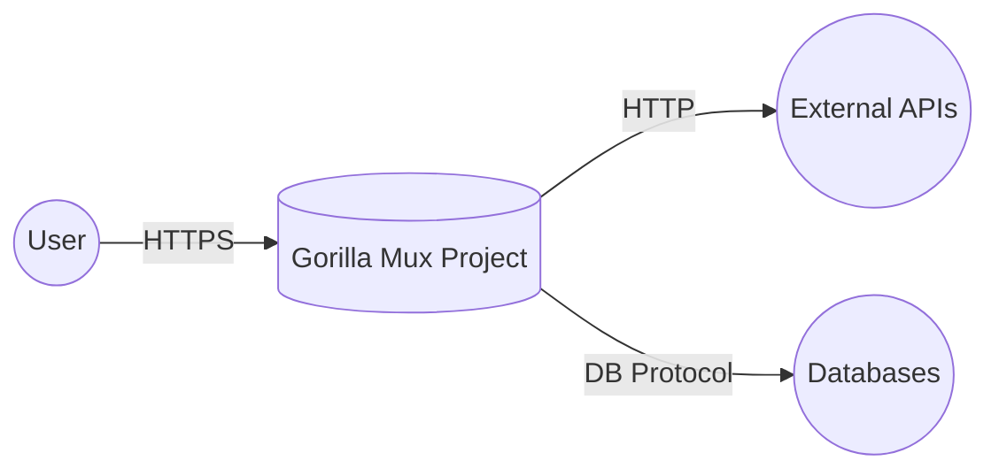
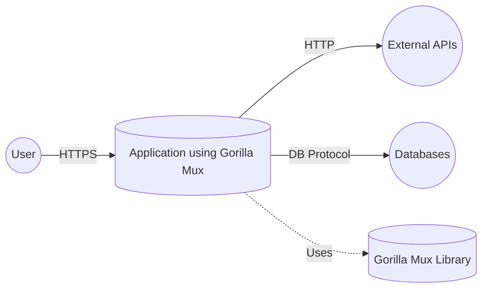
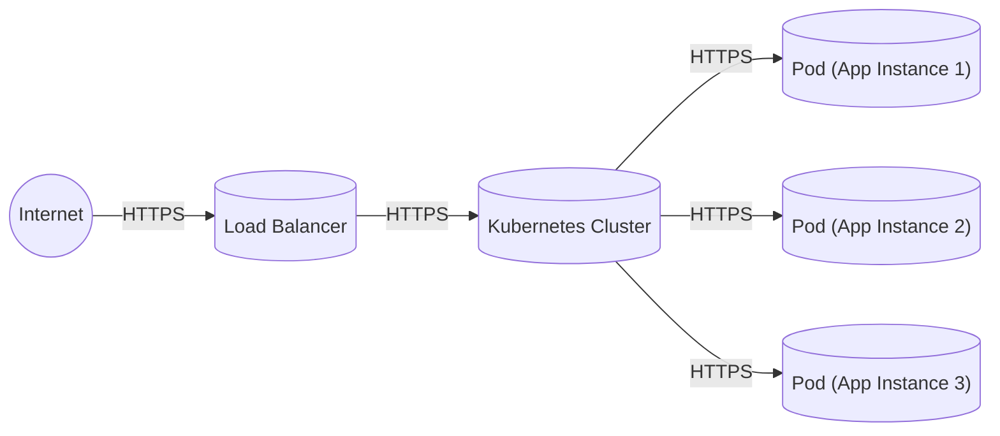
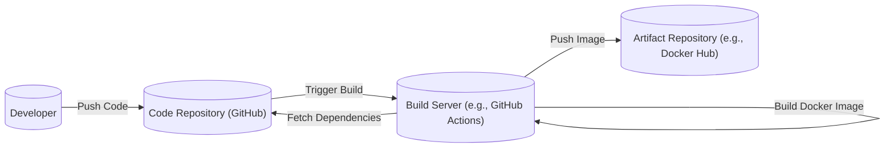

Okay, let's create a design document for the Gorilla Mux project, focusing on aspects relevant to threat modeling.

# BUSINESS POSTURE

Gorilla Mux is a popular Go package used for building HTTP servers, particularly RESTful APIs.  It acts as a request multiplexer (router) and dispatcher.  It's a foundational component, meaning many applications rely on its correct and secure operation.

Priorities:

*   Reliability: Mux must reliably route requests to the correct handlers.  Incorrect routing can lead to application errors, denial of service, or even unintended exposure of functionality.
*   Performance: As a core component in the request handling pipeline, Mux needs to be performant.  Slow routing adds latency to every request.
*   Maintainability:  The project must be maintainable and extensible to adapt to evolving HTTP standards and community needs.
*   Security:  While Mux itself doesn't handle authentication or authorization directly, it plays a crucial role in ensuring that security policies implemented by the application are correctly enforced.  Incorrect routing could bypass security checks.
*   Ease of Use: The library should be easy to use and understand, reducing the likelihood of developers introducing security vulnerabilities due to misconfiguration.

Business Risks:

*   Routing Errors: Incorrectly configured routes could expose sensitive endpoints or internal functionality to unauthorized users.
*   Denial of Service (DoS):  Poorly designed routing or inefficient regular expressions used in routes could be exploited for DoS attacks.
*   Dependency Vulnerabilities:  Vulnerabilities in Mux's dependencies could be exploited to compromise applications using it.
*   Future Vulnerabilities:  As with any software, undiscovered vulnerabilities in Mux itself could be found and exploited.

# SECURITY POSTURE

Existing Security Controls:

*   security control: Input Validation (Partial): Mux performs some basic input validation related to URL parsing and matching.  However, it does *not* validate the content of request bodies or headers beyond what's necessary for routing. This is described in the project's documentation and Go code.
*   security control: Regular Expression Handling: Mux uses Go's `regexp` package.  Care must be taken by developers using Mux to avoid ReDoS (Regular Expression Denial of Service) vulnerabilities. This is implicitly part of using the library and understanding Go's `regexp` package.
*   security control: Community Scrutiny: Being a popular open-source project, Mux benefits from community scrutiny, increasing the likelihood of vulnerabilities being discovered and reported. This is inherent to its open-source nature.
*   security control: Testing: Mux has a comprehensive test suite that helps ensure the correctness of its routing logic and prevent regressions. This is visible in the project's GitHub repository.
*   security control: Code Reviews: Contributions to Mux are subject to code review, providing another layer of defense against introducing vulnerabilities. This is part of the project's contribution guidelines.

Accepted Risks:

*   accepted risk: ReDoS Vulnerability Responsibility: Mux relies on developers to use regular expressions safely.  The library itself does not provide specific ReDoS protection mechanisms.
*   accepted risk: Application-Level Security: Mux explicitly does *not* handle authentication, authorization, or other application-level security concerns.  These are the responsibility of the application using Mux.
*   accepted risk: Dependency Vulnerabilities: Mux, like any software, may have dependencies with vulnerabilities. While the project aims to keep dependencies up-to-date, there's always a risk.

Recommended Security Controls:

*   security control: ReDoS Mitigation Guidance: Provide clear documentation and examples demonstrating how to avoid ReDoS vulnerabilities when defining routes.
*   security control: Dependency Management: Implement automated dependency scanning and updating to minimize the risk of known vulnerabilities in dependencies.
*   security control: Security Audits: Consider periodic security audits by external experts to identify potential vulnerabilities.

Security Requirements:

*   Authentication: Mux itself does not handle authentication. Applications using Mux must implement their own authentication mechanisms *before* request routing occurs (e.g., using middleware).
*   Authorization: Mux does not handle authorization.  Applications must implement authorization checks *within* their request handlers, after Mux has routed the request.
*   Input Validation: While Mux performs basic URL validation, applications must perform thorough input validation on all request data (headers, bodies, query parameters) *within* their handlers. This includes validating data types, lengths, and formats.
*   Cryptography: Mux does not directly handle cryptography. Applications requiring secure communication (HTTPS) should configure their servers appropriately. Mux should be used in conjunction with a properly configured TLS setup.

# DESIGN

## C4 CONTEXT

Element Descriptions:

*   Element:
    *   Name: User
    *   Type: Person
    *   Description: Represents a user interacting with an application that uses Gorilla Mux.
    *   Responsibilities: Sends HTTP requests to the application.
    *   Security controls: Uses HTTPS for secure communication.

*   Element:
    *   Name: Gorilla Mux Project
    *   Type: Software System
    *   Description: The Gorilla Mux request multiplexer, the core of this design document.
    *   Responsibilities: Routes incoming HTTP requests to the appropriate handlers based on defined routes.
    *   Security controls: Basic URL parsing and validation. Relies on application-level security for authentication, authorization, and input validation.

*   Element:
    *   Name: External APIs
    *   Type: Software System
    *   Description: External APIs that the application using Gorilla Mux might interact with.
    *   Responsibilities: Provides services to the application.
    *   Security controls: Assumed to have their own security mechanisms.

*   Element:
    *   Name: Databases
    *   Type: Software System
    *   Description: Databases that the application using Gorilla Mux might interact with.
    *   Responsibilities: Stores and retrieves data for the application.
    *   Security controls: Assumed to have their own security mechanisms (authentication, authorization, encryption).

## C4 CONTAINER

Since Gorilla Mux is a library, the container diagram is essentially an extension of the context diagram. The "container" is the application that *uses* Mux.

Element Descriptions:

*   Element:
    *   Name: User
    *   Type: Person
    *   Description: Represents a user interacting with the application.
    *   Responsibilities: Sends HTTP requests to the application.
    *   Security controls: Uses HTTPS for secure communication.

*   Element:
    *   Name: Application using Gorilla Mux
    *   Type: Container (Web Application)
    *   Description: A web application that uses Gorilla Mux for request routing.
    *   Responsibilities: Handles user requests, interacts with external APIs and databases, and implements business logic.
    *   Security controls: Implements authentication, authorization, input validation, and other application-level security measures.

*   Element:
    *   Name: External APIs
    *   Type: Container (External Service)
    *   Description: External APIs that the application interacts with.
    *   Responsibilities: Provides services to the application.
    *   Security controls: Assumed to have their own security mechanisms.

*   Element:
    *   Name: Databases
    *   Type: Container (Database)
    *   Description: Databases that the application interacts with.
    *   Responsibilities: Stores and retrieves data for the application.
    *   Security controls: Assumed to have their own security mechanisms (authentication, authorization, encryption).

*   Element:
    *   Name: Gorilla Mux Library
    *   Type: Library
    *   Description: The Gorilla Mux library, used by the application for request routing.
    *   Responsibilities: Routes incoming HTTP requests to the appropriate handlers.
    *   Security controls: Basic URL parsing and validation.

## DEPLOYMENT

Gorilla Mux, being a library, is deployed *as part of* the application that uses it. There isn't a separate deployment for Mux itself. Therefore, the deployment diagram depends entirely on the application using it. Here are a few common scenarios, with one described in detail:

Possible Deployment Solutions:

1.  Standalone Go Application: The Go application (with Mux embedded) is compiled into a single executable and run directly on a server.
2.  Docker Container: The Go application is packaged into a Docker container and deployed to a container orchestration platform (e.g., Kubernetes, Docker Swarm).
3.  Serverless Function: The Go application (or parts of it) is deployed as a serverless function (e.g., AWS Lambda, Google Cloud Functions).

Chosen Solution (Docker Container on Kubernetes):

Element Descriptions:

*   Element:
    *   Name: Internet
    *   Type: Network
    *   Description: The public internet.
    *   Responsibilities: Routes traffic to the load balancer.
    *   Security controls: Standard internet security protocols.

*   Element:
    *   Name: Load Balancer
    *   Type: Infrastructure
    *   Description: Distributes incoming traffic across multiple instances of the application.
    *   Responsibilities: Load balancing, SSL termination.
    *   Security controls: SSL/TLS termination, potentially a Web Application Firewall (WAF).

*   Element:
    *   Name: Kubernetes Cluster
    *   Type: Infrastructure
    *   Description: A Kubernetes cluster managing the application's containers.
    *   Responsibilities: Orchestrates container deployment, scaling, and networking.
    *   Security controls: Kubernetes RBAC, network policies, pod security policies.

*   Element:
    *   Name: Pod (App Instance 1/2/3)
    *   Type: Container Instance
    *   Description: A single instance of the application running within a Docker container.  Contains the compiled Go application, including the Gorilla Mux library.
    *   Responsibilities: Handles user requests.
    *   Security controls: Application-level security controls, container security context.

## BUILD

The build process for an application using Gorilla Mux typically involves the following steps:

1.  Developer writes code, including route definitions using Mux.
2.  Dependencies are managed using Go Modules (`go mod`).
3.  The code is compiled using the Go compiler (`go build`).
4.  (Optional) The compiled application is packaged into a Docker image.

Security Controls in Build Process:

*   security control: Dependency Management: Go Modules helps ensure that the correct versions of dependencies are used, reducing the risk of using vulnerable versions.
*   security control: Static Analysis: SAST tools (e.g., `go vet`, `staticcheck`, or dedicated security scanners) can be integrated into the build process to identify potential vulnerabilities in the code.
*   security control: Dependency Scanning: Tools like `snyk` or `dependabot` can scan dependencies for known vulnerabilities.
*   security control: Code Signing: The compiled binary or Docker image can be signed to ensure its integrity and authenticity.
*   security control: Build Automation: Using a CI/CD system (e.g., GitHub Actions, Jenkins) ensures that the build process is consistent and repeatable, reducing the risk of manual errors.

# RISK ASSESSMENT

Critical Business Processes:

*   Request Handling: The core process is handling incoming HTTP requests and routing them to the appropriate application logic.  Any disruption to this process directly impacts the application's functionality.
*   API Functionality (if applicable): If the application exposes an API, the correct and secure operation of that API is critical.

Data to Protect:

*   Sensitivity depends entirely on the application using Mux. Mux itself does not handle data persistence or storage.
*   Examples of data that *might* be handled by an application using Mux:
    *   User Authentication Data (e.g., usernames, passwords, tokens): Highly sensitive.
    *   Personal Data (e.g., names, addresses, email addresses): Sensitive, subject to privacy regulations (e.g., GDPR, CCPA).
    *   Financial Data (e.g., credit card numbers, transaction details): Highly sensitive, subject to strict regulations (e.g., PCI DSS).
    *   Application-Specific Data: The sensitivity of this data depends on the specific application.

# QUESTIONS & ASSUMPTIONS

Questions:

*   What specific types of applications are most commonly built using Gorilla Mux? (This helps prioritize security considerations.)
*   Are there any plans to add built-in features for ReDoS protection or other security-related functionality?
*   What is the project's policy on addressing reported security vulnerabilities?

Assumptions:

*   BUSINESS POSTURE: Assumes that users of Gorilla Mux are aware of its role as a routing library and understand that they are responsible for implementing application-level security.
*   SECURITY POSTURE: Assumes that developers using Gorilla Mux will follow secure coding practices and take responsibility for securing their applications.
*   DESIGN: Assumes a standard deployment model (e.g., Docker containers on Kubernetes) for illustrative purposes. The actual deployment may vary.
*   BUILD: Assumes that the build process will include some form of dependency management and static analysis.