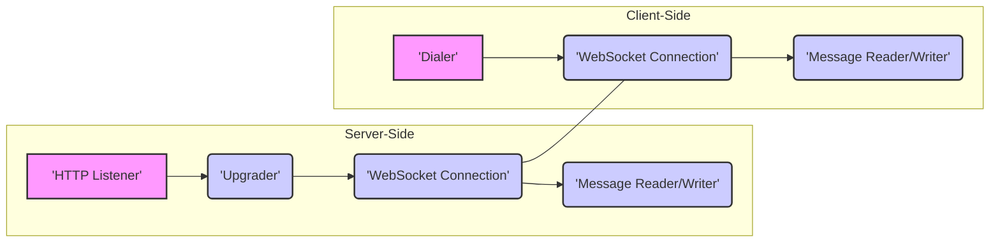

# Project Design Document: gorilla/websocket Library

**Version:** 1.1
**Date:** October 26, 2023
**Author:** AI Software Architect

## 1. Introduction

This document provides a detailed design overview of the `gorilla/websocket` library, a widely adopted Go library facilitating the implementation of WebSocket servers and clients. This document is specifically crafted to serve as a foundational resource for subsequent threat modeling exercises. It meticulously outlines the library's architecture, key components, data flow mechanisms, and interactions with external systems, with a strong emphasis on aspects relevant to security analysis.

## 2. Goals

The primary objectives of this design document are:

*   To furnish a comprehensive and technically accurate description of the `gorilla/websocket` library's internal design and operational principles.
*   To clearly identify the library's core components and elucidate their interrelationships and dependencies.
*   To illustrate the intricate pathways of data flow within the library during various operational scenarios.
*   To explicitly define the library's interfaces and interactions with external entities and systems.
*   To serve as a precise and detailed reference point for identifying potential security vulnerabilities and attack vectors during subsequent threat modeling activities.

## 3. Scope

This document comprehensively covers the essential functionalities of the `gorilla/websocket` library, encompassing:

*   Establishment of WebSocket connections, detailing both server-side acceptance and client-side initiation processes.
*   Management of the WebSocket handshake procedure, including header negotiation and validation.
*   Transmission and reception of WebSocket messages, supporting both textual and binary data formats.
*   Oversight of connection state transitions and lifecycle management, including opening, maintaining, and closing connections.
*   Handling of WebSocket control frames, specifically focusing on ping, pong, and close frame processing.
*   Core configuration parameters and their impact on the library's behavior.
*   Mechanisms for handling message fragmentation and defragmentation.
*   Basic error handling within the library's core functionalities.

This document explicitly excludes:

*   Specific application-level business logic implemented using the library as a foundation.
*   In-depth performance benchmarking and optimization strategies.
*   Comparative analysis with alternative WebSocket library implementations.
*   Detailed examination of advanced extensions or sub-protocols built on top of WebSockets.

## 4. Architecture Overview

The `gorilla/websocket` library's architecture can be effectively visualized through its primary interacting components, highlighting the distinct roles on the server and client sides.



Key architectural elements and their responsibilities:

*   **`HTTP Listener` (Server-Side):**  The entry point for incoming network connections. It accepts standard HTTP connections, some of which may be candidates for WebSocket upgrades. This component is typically part of the Go standard library's `net/http` package.
*   **`Upgrader` (Server-Side):**  The central component responsible for orchestrating the WebSocket handshake process on the server. It validates the client's upgrade request, negotiates WebSocket parameters (like subprotocols and extensions), and manages the transition from an HTTP connection to a WebSocket connection.
*   **`Dialer` (Client-Side):**  The component responsible for initiating a WebSocket connection to a server. It constructs and sends the WebSocket handshake request, handles the server's response, and establishes the underlying network connection.
*   **`WebSocket Connection` (Both Sides):**  Represents the established, persistent WebSocket connection. It encapsulates the underlying network socket and manages the connection's lifecycle, including handling disconnections and errors. This component provides the primary interface for sending and receiving WebSocket messages.
*   **`Message Reader/Writer` (Both Sides):**  Handles the crucial task of framing outgoing messages into WebSocket frames and un-framing incoming WebSocket frames to extract the message payload. This includes managing control frames, data frames, and handling message fragmentation and reassembly.

## 5. Component Details

### 5.1. Server-Side Components

*   **`Upgrader`:**
    *   **Functionality:**  Manages the server-side of the WebSocket handshake. It verifies the `Upgrade` and `Connection` headers, checks the `Sec-WebSocket-Key`, and generates the `Sec-WebSocket-Accept` header.
    *   **Configuration Options (Security Implications):**
        *   `HandshakeTimeout`:  Sets a time limit for the handshake. A short timeout can mitigate slowloris-style attacks during handshake.
        *   `ReadBufferSize` and `WriteBufferSize`:  Determines the buffer sizes for reading and writing. Insufficient buffer sizes can lead to errors or performance issues, while excessively large buffers could contribute to memory exhaustion attacks.
        *   `CheckOrigin` (Crucial for CSWSH prevention): A user-defined function to validate the `Origin` header of the handshake request. Proper implementation is paramount to prevent cross-site WebSocket hijacking.
        *   `EnableCompression`: Enables the `permessage-deflate` extension. While beneficial for bandwidth, misconfiguration or vulnerabilities in the compression implementation could introduce security risks.
        *   `Subprotocols`:  Allows the server to accept specific subprotocols. Restricting allowed subprotocols can limit potential attack surfaces.
    *   **Potential Vulnerabilities:** Improper `CheckOrigin` implementation is a primary vulnerability. Failure to handle malformed handshake requests can lead to unexpected behavior or crashes.

*   **`Conn` (Server-Side):**
    *   **Functionality:** Represents an active WebSocket connection on the server. It provides methods for reading and writing messages, managing deadlines, and closing the connection.
    *   **Methods (Security Implications):**
        *   `ReadMessage()`: Reads the next message. Applications must validate the content of received messages to prevent injection attacks or other vulnerabilities.
        *   `WriteMessage()`: Sends a message. Care should be taken to sanitize outgoing data if it includes user-provided input to prevent issues on the client-side.
        *   `SetReadDeadline()` and `SetWriteDeadline()`:  Essential for preventing resource exhaustion by closing idle or unresponsive connections.
        *   `Close()`:  Properly closing connections is important for releasing resources.
        *   `PingHandler()` and `PongHandler()`:  Handlers for control frames. Custom handlers should be implemented carefully to avoid vulnerabilities.
    *   **Potential Vulnerabilities:**  Memory exhaustion if message sizes are not limited. Failure to handle connection closure gracefully can lead to resource leaks.

### 5.2. Client-Side Components

*   **`Dialer`:**
    *   **Functionality:** Initiates a WebSocket connection to a specified server URL. It constructs the handshake request and processes the server's response.
    *   **Configuration Options (Security Implications):**
        *   `HandshakeTimeout`: Similar to the server-side, protects against slow connection attempts.
        *   `ReadBufferSize` and `WriteBufferSize`:  Client-side buffer management.
        *   `Proxy`:  Allows connecting through a proxy. Ensure the proxy connection is secure (e.g., HTTPS proxy) to prevent eavesdropping.
        *   `TLSClientConfig`:  Configuration for TLS when connecting to `wss://` URLs. Properly configuring trusted CAs is crucial to prevent man-in-the-middle attacks.
        *   `Jar`: Cookie management. Sensitive cookies should be handled with care.
        *   `EnableCompression`:  Negotiates compression with the server.
        *   `Subprotocols`:  Allows the client to request specific subprotocols.
    *   **Potential Vulnerabilities:**  Ignoring server certificate validation can lead to MITM attacks. Improper handling of cookies can expose sensitive information.

*   **`Conn` (Client-Side):**
    *   **Functionality:** Represents the active WebSocket connection from the client's perspective. Provides the same methods as the server-side `Conn` for communication and connection management.
    *   **Methods (Security Implications):** Mirrors the server-side `Conn` methods, with similar security considerations regarding data validation, resource management, and connection closure.
    *   **Potential Vulnerabilities:** Similar to the server-side `Conn`, potential for memory exhaustion and resource leaks if not managed properly.

## 6. Data Flow

The following diagram illustrates the typical flow of data when sending and receiving messages over a WebSocket connection established using the `gorilla/websocket` library.

```mermaid
graph LR
    subgraph "Sender"
        A["'Application Logic'"] --> B("'Write Message to Conn'");
        B --> C("'Message Framing'");
        C --> D("'Network Socket'"];
    end
    subgraph "Receiver"
        E["'Network Socket'"] --> F("'Message Un-framing'");
        F --> G("'Read Message from Conn'");
        G --> H["'Application Logic'"];
    end
    D -- "WebSocket Frames" --> E;
    style A fill:#ccf,stroke:#333,stroke-width:2px
    style B fill:#ccf,stroke:#333,stroke-width:2px
    style C fill:#ccf,stroke:#333,stroke-width:2px
    style D fill:#f9f,stroke:#333,stroke-width:2px
    style E fill:#f9f,stroke:#333,stroke-width:2px
    style F fill:#ccf,stroke:#333,stroke-width:2px
    style G fill:#ccf,stroke:#333,stroke-width:2px
    style H fill:#ccf,stroke:#333,stroke-width:2px
```

Detailed data flow description:

*   **Sending a Message:**
    *   The application logic initiates the send operation by providing data to the `WriteMessage()` method of the `Conn` object.
    *   The `Message Framing` component within the `Conn` object encapsulates the data into one or more WebSocket frames. This involves adding appropriate headers indicating the payload type (text or binary), whether it's a control frame, and handling fragmentation if the message is large.
    *   The framed message is then transmitted over the underlying `Network Socket`.

*   **Receiving a Message:**
    *   Incoming data arrives via the `Network Socket`.
    *   The `Message Un-framing` component within the `Conn` object processes the incoming WebSocket frames. It reassembles fragmented messages, extracts the payload, and identifies the message type.
    *   The `ReadMessage()` method on the `Conn` object returns the complete, un-framed message payload to the `Application Logic`.

## 7. External Interfaces

The `gorilla/websocket` library interacts with the following external components, each presenting potential security considerations:

*   **Network Socket (TCP):** The fundamental communication channel. Vulnerabilities in the underlying network infrastructure or operating system can affect the library. Exposure to the public internet necessitates careful firewall configuration.
*   **HTTP Server (`net/http`):** On the server-side, the library relies on Go's standard `net/http` package for handling initial HTTP requests and the upgrade handshake. Security vulnerabilities in the HTTP server implementation could be exploited.
*   **TLS Library (`crypto/tls`):** When using secure WebSockets (WSS), the library leverages Go's `crypto/tls` package for encryption. Proper configuration of TLS, including certificate management and cipher suite selection, is critical to ensure confidentiality and integrity. Outdated TLS versions or weak cipher suites can introduce vulnerabilities.
*   **Application Logic:** The user's application code interacts directly with the `gorilla/websocket` library. Security vulnerabilities in the application logic, such as improper input validation or insecure data handling, can be exposed through WebSocket communication.
*   **Proxy Server (Optional):** When configured to use a proxy, the library's security depends on the security of the proxy connection. Using an unencrypted proxy can expose WebSocket traffic.
*   **DNS Resolver:** The client-side `Dialer` uses the system's DNS resolver to resolve server hostnames. DNS spoofing attacks could redirect connections to malicious servers.

## 8. Security Considerations (Detailed)

This section expands on the high-level security considerations, providing more specific details:

*   **Cross-Site WebSocket Hijacking (CSWSH):** Occurs when a malicious website tricks a user's browser into making a WebSocket connection to a legitimate server. The `Upgrader`'s `CheckOrigin` function is the primary defense. It should be carefully implemented to only allow connections from trusted origins. Failing to validate the `Origin` header allows attackers to bypass same-origin policy restrictions for WebSockets.
*   **Denial of Service (DoS):**
    *   **Connection Exhaustion:** Attackers can flood the server with connection requests, exhausting server resources. Implementing connection limits and rate limiting can mitigate this.
    *   **Message Flooding:** Sending a large number of messages or very large messages can overwhelm the server. Setting limits on message size and implementing message queuing or backpressure mechanisms can help.
    *   **Slowloris Attacks (during handshake):** Attackers send incomplete handshake requests to tie up server resources. Setting appropriate `HandshakeTimeout` values is crucial.
*   **Message Injection/Manipulation:** While the WebSocket protocol provides basic framing, it doesn't inherently prevent malicious content within messages. Applications must implement robust input validation and sanitization of received data to prevent vulnerabilities like script injection or command injection.
*   **Data Confidentiality:**  Using WSS (`wss://` scheme) is essential for encrypting WebSocket communication using TLS. Ensure proper TLS configuration, including strong cipher suites and valid certificates, to prevent eavesdropping.
*   **Resource Exhaustion:**
    *   **Memory Leaks:** Improper handling of connections or messages can lead to memory leaks. Ensure resources are properly released when connections are closed.
    *   **File Descriptor Exhaustion:** Each WebSocket connection consumes file descriptors. Failing to close connections promptly can lead to exhaustion.
*   **Input Validation:**  Applications must meticulously validate all data received over WebSocket connections. Failure to do so can lead to vulnerabilities in the application logic, even if the WebSocket layer itself is secure.
*   **Control Frame Abuse:** Malicious clients might send excessive ping frames to keep connections alive indefinitely or send close frames unexpectedly. Implement logic to handle control frames appropriately and enforce timeouts.
*   **Compression Vulnerabilities:** While `permessage-deflate` can improve performance, vulnerabilities in the compression implementation or improper configuration could introduce security risks.

## 9. Deployment Considerations

Deploying applications using `gorilla/websocket` requires careful consideration of security best practices:

*   **Secure Configuration of TLS (WSS):**
    *   Use valid and up-to-date TLS certificates issued by a trusted Certificate Authority.
    *   Enforce strong cipher suites and disable insecure protocols (e.g., SSLv3, TLS 1.0).
    *   Regularly update TLS libraries to patch known vulnerabilities.
*   **Robust Origin Validation:**  Implement the `CheckOrigin` function on the server-side with strict validation logic to prevent CSWSH. Consider using allow-lists of trusted origins.
*   **Setting Appropriate Timeouts and Buffer Sizes:** Configure `HandshakeTimeout`, read/write deadlines, and buffer sizes to prevent resource exhaustion and mitigate DoS attacks.
*   **Implementing Rate Limiting and Connection Limits:** Protect the server from connection floods by implementing rate limiting on connection attempts and setting maximum connection limits.
*   **Input Validation and Sanitization:**  Thoroughly validate and sanitize all data received from WebSocket clients before processing it in the application logic.
*   **Secure Handling of Credentials:** If authentication is required over WebSockets, ensure credentials are transmitted securely (ideally after the WSS connection is established) and stored securely on the server.
*   **Regular Security Audits:** Conduct periodic security audits and penetration testing of applications using `gorilla/websocket` to identify potential vulnerabilities.
*   **Keep Dependencies Updated:** Regularly update the `gorilla/websocket` library and its dependencies to benefit from security patches and bug fixes.

This enhanced design document provides a more detailed and security-focused overview of the `gorilla/websocket` library, making it a more effective foundation for subsequent threat modeling activities.