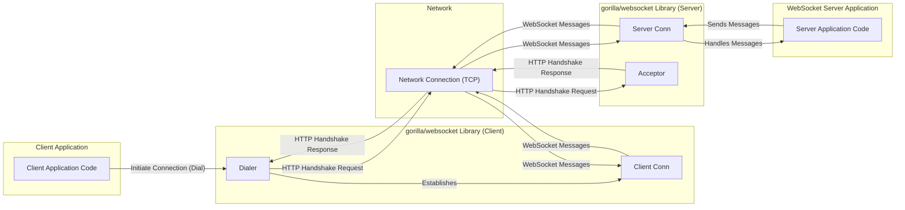

# Project Design Document: gorilla/websocket Library

**Version:** 1.1
**Date:** October 26, 2023
**Author:** Gemini (AI Language Model)

## 1. Project Overview

This document details the design of the `gorilla/websocket` library, a widely used Go library implementing the WebSocket protocol as defined in RFC 6455. It aims to provide a clear understanding of the library's internal structure, data handling, and key interfaces, specifically for the purpose of informing threat modeling activities. The library facilitates bidirectional, full-duplex communication over a single TCP connection, enabling real-time interactions between clients and servers.

## 2. Goals and Non-Goals

**Goals:**

* Clearly articulate the architectural design of the `gorilla/websocket` library.
* Identify and describe the core components and their interactions within the library.
* Detail the flow of data during connection establishment, message transmission, and connection closure.
* Highlight potential security-relevant aspects and initial areas of concern for subsequent threat modeling.
* Serve as a foundational reference for security assessments, code audits, and secure development practices related to this library.

**Non-Goals:**

* Provide a comprehensive, line-by-line code analysis of the `gorilla/websocket` library.
* Document every single function, method, or internal variable.
* Include performance metrics, benchmarking results, or optimization strategies.
* Offer specific security fixes or mitigation recommendations (these will be outcomes of the threat modeling process).

## 3. System Architecture

The `gorilla/websocket` library operates on both the client and server sides of a WebSocket connection. While sharing core functionalities, their initiation and handling of connections differ.

### 3.1. High-Level Architecture Diagram

### 3.2. Key Components

* **`Dialer`:** (Client-side) The entry point for initiating a WebSocket connection. It constructs and sends the initial HTTP handshake request to the server, validates the server's response, and establishes the underlying network connection.
* **`Acceptor`:** (Server-side) Responsible for accepting incoming connection requests. It listens for HTTP requests, validates the upgrade request headers, and sends the appropriate HTTP 101 Switching Protocols response to complete the handshake.
* **`Conn`:** Represents an active WebSocket connection. Both client and server sides have a `Conn` instance after a successful handshake. It provides methods for reading and writing WebSocket messages, managing the connection state, handling control frames (ping, pong, close), and managing the underlying network connection.
* **`Config` (within `Dialer` and `Acceptor`):**  Allows for customization of connection parameters. On the client-side, this includes setting headers, timeouts, TLS configuration, and proxy settings. On the server-side, it includes options for origin checking, handshake timeouts, and TLS configuration.
* **`Message Types`:** Defines the different types of WebSocket messages as per the RFC:
    * Text Message
    * Binary Message
    * Close Frame
    * Ping Frame
    * Pong Frame
* **`Frame Handling`:** Internal logic responsible for encoding outgoing messages into WebSocket frames and decoding incoming frames. This includes handling:
    * Fragmentation of large messages.
    * Masking of client-to-server messages.
    * Processing of control frames.
* **`Error Handling`:** Mechanisms for managing and reporting errors that occur during various stages of the connection lifecycle, including handshake failures, read/write errors, and protocol violations.
* **`Close Handshake Logic`:** Implements the procedures for gracefully closing a WebSocket connection, involving the exchange of Close frames.

## 4. Data Flow

The flow of data within the `gorilla/websocket` library can be categorized into connection establishment and message exchange.

### 4.1. Client-Side Connection Establishment

* The client application invokes `Dialer.Dial()` with the target WebSocket URL.
* The `Dialer` constructs an HTTP GET request with specific headers:
    * `Upgrade: websocket`
    * `Connection: Upgrade`
    * `Sec-WebSocket-Key: <random value>`
    * `Sec-WebSocket-Version: 13`
    * Optional subprotocol and extension headers.
* The `Dialer` sends this HTTP request to the server.
* The `Dialer` receives the HTTP response from the server.
* The `Dialer` validates the response:
    * HTTP status code `101 Switching Protocols`.
    * `Upgrade: websocket` header.
    * `Connection: Upgrade` header.
    * `Sec-WebSocket-Accept` header containing the correct derived value from the `Sec-WebSocket-Key`.
* Upon successful validation, a `Conn` object is created, representing the established WebSocket connection.

### 4.2. Server-Side Connection Establishment

* The server application uses an `Acceptor` to listen for incoming TCP connections.
* When a client sends an HTTP request, the `Acceptor` receives it.
* The `Acceptor` examines the request headers for WebSocket upgrade indicators:
    * `Upgrade: websocket`
    * `Connection: Upgrade`
    * `Sec-WebSocket-Key`
    * `Sec-WebSocket-Version: 13`
* Optionally, the `Acceptor` may perform origin checking based on the `Origin` header.
* If the request is valid, the `Acceptor` constructs an HTTP 101 Switching Protocols response:
    * `HTTP/1.1 101 Switching Protocols`
    * `Upgrade: websocket`
    * `Connection: Upgrade`
    * `Sec-WebSocket-Accept: <derived value>`
    * Optional subprotocol and extension headers.
* The `Acceptor` sends this response to the client.
* A `Conn` object is created, associated with the established connection.

### 4.3. Sending Messages

* The application calls methods on the `Conn` object (e.g., `WriteMessage`, `WriteTextMessage`, `WriteBinaryMessage`).
* The `Conn` object's internal frame writer encodes the message into one or more WebSocket frames:
    * Sets the opcode (text, binary, control).
    * Handles fragmentation if the message is large.
    * Applies masking to the payload for client-sent messages.
* The encoded frame(s) are written to the underlying network connection.

### 4.4. Receiving Messages

* The `Conn` object reads data from the underlying network connection.
* The internal frame reader parses the incoming data into WebSocket frames.
* The frame reader handles:
    * Identifying the opcode.
    * Unmasking the payload (for server-received messages).
    * Reassembling fragmented messages.
* The complete message and its type are made available to the application through methods like `ReadMessage`.

### 4.5. Connection Closure

* Either endpoint can initiate the closing handshake.
* The initiating endpoint calls `Conn.WriteMessage(websocket.CloseMessage, ...)` to send a Close frame.
* The receiving endpoint receives the Close frame.
* The receiving endpoint typically responds with its own Close frame.
* After both endpoints have sent and received Close frames (or a timeout occurs), the `Conn` object and the underlying network connection are closed.

### 4.6. Error Handling

* Errors can occur at various stages: during handshake, while reading or writing messages, or due to protocol violations.
* The `Dialer` and `Acceptor` return errors if the handshake fails.
* The `Conn` object's read and write methods return errors to indicate issues with data transfer or connection state.
* The library provides specific error types for common WebSocket errors (e.g., `CloseError`).

## 5. Key Components in Detail

* **`Conn` Struct:**
    * Contains the underlying `net.Conn` representing the TCP connection.
    * Manages read and write deadlines for the connection.
    * Includes buffers for reading and writing data.
    * Tracks the current state of the connection (open, closing, closed).
    * Provides methods for:
        * `ReadMessage()`: Reads the next complete message.
        * `WriteMessage()`: Writes a complete message.
        * `SetReadDeadline()`, `SetWriteDeadline()`: Configure timeouts.
        * Handling ping and pong control frames automatically or manually.
        * Initiating and handling the closing handshake.
    * Holds configuration options like maximum message size and compression settings.

* **`Dialer` Struct:**
    * Holds configuration options for client connections:
        * `Timeout`: Overall timeout for the dial operation.
        * `HandshakeTimeout`: Timeout for the HTTP handshake.
        * `TLSClientConfig`: Configuration for TLS connections.
        * `Proxy`: Function to specify a proxy server.
        * `Jar`: Cookie jar for managing cookies.
        * `Header`: Custom headers to include in the handshake request.
    * The `Dial()` method performs the client-side handshake and returns a `Conn` object.

* **`Acceptor` Struct:**
    * Holds configuration options for server connections:
        * `HandshakeTimeout`: Timeout for the HTTP handshake.
        * `ReadBufferSize`, `WriteBufferSize`: Sizes of the read and write buffers.
        * `CheckOrigin`: Function to validate the `Origin` header.
        * `Subprotocols`: List of supported subprotocols.
        * `EnableCompression`: Enables per-message compression.
        * `Error`: Optional error handler function.
    * The `Accept()` method handles the server-side handshake and returns a `Conn` object.

* **Frame Reader/Writer (Internal):**
    * These are internal components not directly exposed to the user.
    * The frame writer takes a message payload and constructs WebSocket frames, setting the opcode, fragmentation bits, and applying masking if necessary.
    * The frame reader parses incoming bytes, identifies frame boundaries, unmasks the payload, and reassembles fragmented messages.

## 6. Security Considerations (Initial)

This section outlines initial security considerations relevant to the `gorilla/websocket` library, serving as a starting point for more in-depth threat modeling.

* **Input Validation Vulnerabilities:**
    * **Handshake Manipulation:**  Malicious clients might send crafted handshake requests with invalid headers to exploit parsing vulnerabilities or bypass security checks.
    * **Message Payload Injection:**  Insufficient validation of message content could lead to injection attacks if the data is processed without proper sanitization on the receiving end.
    * **Control Frame Abuse:**  Improper handling of control frames (ping, pong, close) could be exploited for denial-of-service or connection manipulation.

* **Resource Exhaustion Attacks:**
    * **Connection Flooding:**  An attacker could attempt to open a large number of connections to exhaust server resources.
    * **Large Message Attacks:** Sending extremely large messages (potentially fragmented) could consume excessive memory or processing power.
    * **Slowloris Attacks (WebSocket Equivalent):**  Maintaining many connections and sending data slowly to keep connections alive indefinitely, exhausting server resources.

* **Denial of Service (DoS) Attacks:**
    * **Malformed Frame Attacks:** Sending invalid or malformed WebSocket frames could crash the server or client.
    * **Compression Bomb:**  Sending compressed data that expands to a much larger size upon decompression, overwhelming memory.

* **Man-in-the-Middle (MitM) Attacks:**
    * **Lack of TLS:**  If connections are not secured with TLS, attackers can eavesdrop on communication and potentially inject or modify messages.
    * **Improper TLS Configuration:** Weak cipher suites or outdated TLS versions can make connections vulnerable.

* **Cross-Site WebSocket Hijacking (CSWSH):**
    * **Insufficient Origin Validation:** If the server does not properly validate the `Origin` header during the handshake, malicious websites could establish unauthorized WebSocket connections.

* **Implementation Vulnerabilities:**
    * **Memory Safety Issues:** Bugs in the library's code could lead to memory corruption or other memory-related vulnerabilities.
    * **Concurrency Issues:**  Improper handling of concurrent operations could lead to race conditions or deadlocks.

* **Error Handling and Information Disclosure:**
    * **Verbose Error Messages:**  Detailed error messages could reveal sensitive information about the server's internal state or configuration.
    * **Uncaught Exceptions:**  Unhandled exceptions could lead to unexpected program termination or security vulnerabilities.

## 7. Deployment Considerations

The security posture of applications using `gorilla/websocket` is also influenced by deployment choices.

* **Standalone WebSocket Servers:**  Require careful configuration of network security, TLS certificates, and resource limits.
* **Integration with HTTP Servers:**  Security considerations of the underlying HTTP server also apply to the WebSocket endpoint. Ensure proper integration and handling of upgrades.
* **Client Applications (e.g., Browsers, Native Apps):**  Browser security models provide some protection, but developers need to be mindful of potential vulnerabilities in their client-side logic.
* **Proxies and Load Balancers:**  Ensure that proxies and load balancers are configured to correctly handle WebSocket connections (including the `Upgrade` header) and do not introduce new vulnerabilities. Consider WebSocket-aware proxies.
* **Containerized Environments (e.g., Docker, Kubernetes):**  Secure container configurations and network policies are crucial.

## 8. Conclusion

This document provides a comprehensive design overview of the `gorilla/websocket` library, focusing on aspects relevant to security analysis. It details the architecture, data flow, and key components, along with initial security considerations. This information serves as a solid foundation for conducting a thorough threat modeling exercise to identify potential vulnerabilities and inform the development of appropriate security mitigations. The next step involves leveraging this document to systematically analyze potential threats and design countermeasures.