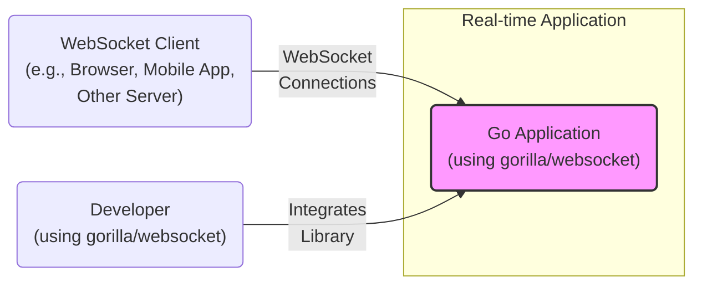
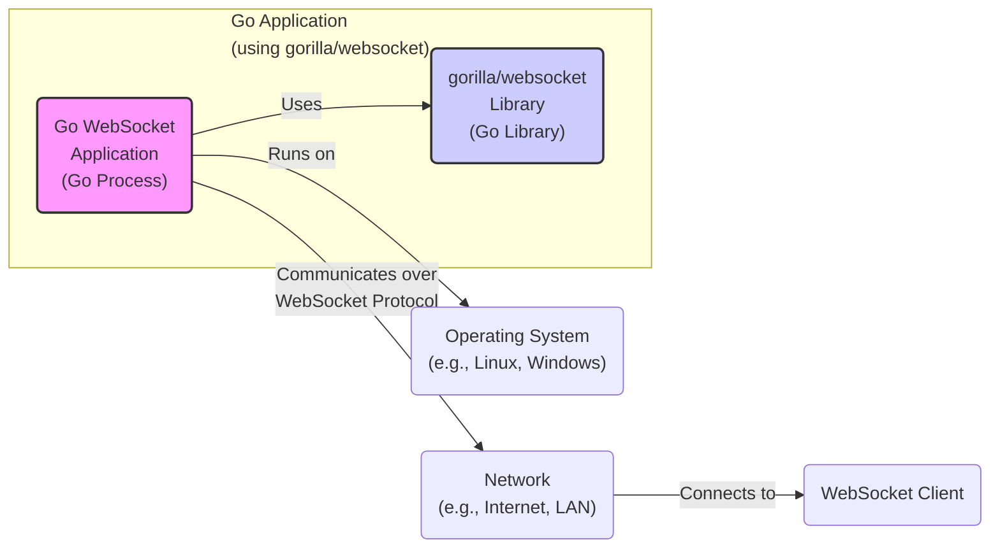
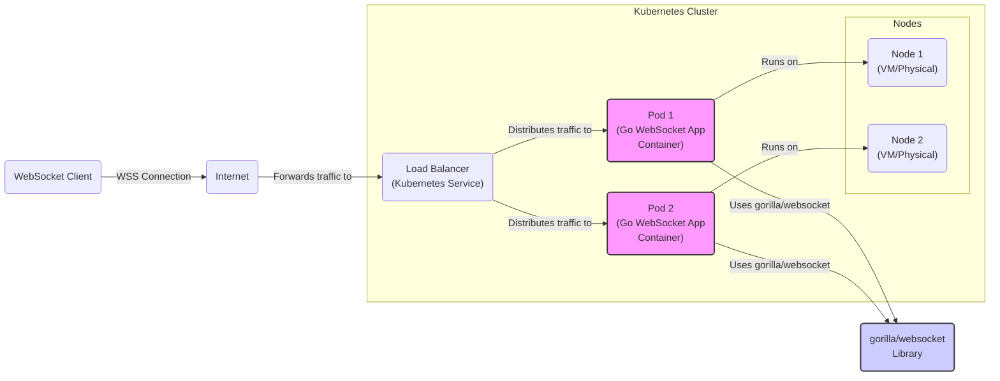
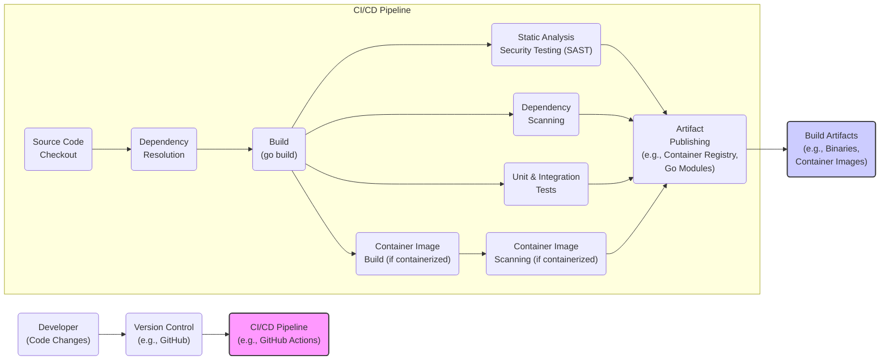

# BUSINESS POSTURE

- Business Priorities and Goals:
 - Priority: Provide a robust, efficient, and widely adopted WebSocket library for the Go programming language.
 - Goal: Enable developers to easily build real-time communication features into their Go applications.
 - Goal: Maintain the library's performance and stability while incorporating new WebSocket standards and features.
 - Goal: Foster a strong community around the library to encourage contributions and ensure long-term maintainability.

- Business Risks:
 - Risk: Security vulnerabilities in the library could be exploited in applications using it, leading to data breaches, service disruption, or other security incidents.
 - Risk: Performance bottlenecks or instability in the library could negatively impact the performance and reliability of applications using it.
 - Risk: Lack of maintenance or slow response to bug fixes and security issues could lead to developer dissatisfaction and migration to alternative libraries.
 - Risk: Incompatibility with new WebSocket standards or Go versions could limit the library's usefulness and adoption.

# SECURITY POSTURE

- Existing Security Controls:
 - security control: Code is hosted on GitHub, leveraging GitHub's infrastructure security. Implemented by: GitHub.
 - security control: Publicly accessible repository, allowing for community review and scrutiny. Implemented by: GitHub.
 - security control: Standard Go security practices are likely followed by maintainers. Implemented by: Project maintainers (implicitly).
 - accepted risk: Reliance on community contributions for security vulnerability discovery and patching.
 - accepted risk: Open-source nature means vulnerabilities are publicly discoverable, potentially increasing the window of exploitation before patches are available.

- Recommended Security Controls:
 - security control: Implement automated static analysis security testing (SAST) in the CI/CD pipeline to identify potential code vulnerabilities.
 - security control: Integrate dependency scanning to detect and alert on known vulnerabilities in third-party dependencies.
 - security control: Conduct regular security audits and penetration testing, potentially engaging external security experts.
 - security control: Establish a clear vulnerability disclosure and response process.
 - security control: Sign releases to ensure integrity and authenticity of the library.
 - security control: Implement fuzz testing to discover unexpected behavior and potential vulnerabilities caused by malformed inputs.

- Security Requirements:
 - Authentication:
  - Requirement: The library itself does not handle authentication, but applications using it must implement appropriate authentication mechanisms to verify the identity of WebSocket clients.
  - Requirement: Applications should leverage secure authentication protocols suitable for WebSocket communication, such as OAuth 2.0 or token-based authentication.
 - Authorization:
  - Requirement: The library itself does not handle authorization, but applications using it must implement authorization controls to manage access to WebSocket resources and operations based on authenticated user identities.
  - Requirement: Applications should enforce the principle of least privilege, granting WebSocket clients only the necessary permissions.
 - Input Validation:
  - Requirement: The library must perform robust input validation on all incoming WebSocket messages to prevent injection attacks, buffer overflows, and other input-related vulnerabilities.
  - Requirement: Applications using the library should also implement application-level input validation to enforce business logic and data integrity.
 - Cryptography:
  - Requirement: The library should support secure WebSocket connections (WSS) using TLS/SSL to encrypt communication between clients and servers, protecting data confidentiality and integrity during transmission.
  - Requirement: The library should correctly handle TLS handshake and certificate validation to prevent man-in-the-middle attacks.
  - Requirement: If application-level encryption is needed for message payloads, the library should provide mechanisms or guidance for integrating with cryptographic libraries.

# DESIGN

## C4 CONTEXT

- Context Diagram Elements:
 - - Name: Go Application (using gorilla/websocket)
  - - Type: Software System
  - - Description: A Go application that utilizes the `gorilla/websocket` library to provide real-time communication capabilities over WebSockets.
  - - Responsibilities:
   - - Establishing and managing WebSocket connections with clients.
   - - Sending and receiving WebSocket messages.
   - - Implementing application-specific logic for real-time features.
   - - Handling WebSocket events (e.g., connection open, close, errors).
  - - Security controls:
   - - security control: Input validation on received WebSocket messages. Implemented by: Go Application.
   - - security control: Authorization checks for WebSocket operations. Implemented by: Go Application.
   - - security control: TLS/SSL encryption for WebSocket connections (WSS). Implemented by: Go Application & gorilla/websocket library.
   - - security control: Authentication of WebSocket clients. Implemented by: Go Application.
 - - Name: WebSocket Client (e.g., Browser, Mobile App, Other Server)
  - - Type: Software System
  - - Description: A client application (running in a browser, mobile device, or another server) that connects to the Go application via WebSockets to exchange real-time data.
  - - Responsibilities:
   - - Initiating WebSocket connections to the Go application.
   - - Sending and receiving WebSocket messages.
   - - Presenting real-time data to the user or processing it.
   - - Handling WebSocket connection events.
  - - Security controls:
   - - security control: TLS/SSL encryption for WebSocket connections (WSS). Implemented by: WebSocket Client.
   - - security control: Authentication credentials management and transmission. Implemented by: WebSocket Client.
 - - Name: Developer (using gorilla/websocket)
  - - Type: Person
  - - Description: Software developers who use the `gorilla/websocket` library to build real-time features into their Go applications.
  - - Responsibilities:
   - - Integrating the `gorilla/websocket` library into Go applications.
   - - Writing code to handle WebSocket connections and messages.
   - - Configuring and deploying Go applications that use WebSockets.
   - - Ensuring secure and correct usage of the library.
  - - Security controls:
   - - security control: Secure coding practices when using the library. Implemented by: Developer.
   - - security control: Following security guidelines and best practices for WebSocket applications. Implemented by: Developer.

## C4 CONTAINER

- Container Diagram Elements:
 - - Name: Go WebSocket Application (Go Process)
  - - Type: Container (Process)
  - - Description: The running Go process of the application that incorporates the `gorilla/websocket` library. This is where the application's business logic and WebSocket handling reside.
  - - Responsibilities:
   - - Application-specific logic for real-time communication.
   - - Managing WebSocket connections using the `gorilla/websocket` library.
   - - Handling application-level input validation and authorization.
   - - Processing and responding to WebSocket messages.
  - - Security controls:
   - - security control: Application-level input validation. Implemented by: Go WebSocket Application.
   - - security control: Application-level authorization. Implemented by: Go WebSocket Application.
   - - security control: Secure configuration of the Go application environment. Implemented by: Deployment Environment.
 - - Name: gorilla/websocket Library (Go Library)
  - - Type: Container (Library)
  - - Description: The `gorilla/websocket` Go library, providing the core WebSocket protocol implementation and API for Go applications.
  - - Responsibilities:
   - - Implementing the WebSocket protocol (RFC 6455 and related extensions).
   - - Handling WebSocket handshake, framing, and control messages.
   - - Providing API for sending and receiving WebSocket messages.
   - - Basic input validation and protocol compliance.
  - - Security controls:
   - - security control: Input validation at the WebSocket protocol level. Implemented by: gorilla/websocket Library.
   - - security control: Prevention of common WebSocket protocol vulnerabilities. Implemented by: gorilla/websocket Library.
 - - Name: Operating System (e.g., Linux, Windows)
  - - Type: Infrastructure
  - - Description: The operating system on which the Go WebSocket Application is running. Provides the runtime environment and system resources.
  - - Responsibilities:
   - - Providing system resources (CPU, memory, network) for the Go application.
   - - Enforcing operating system level security controls.
   - - Managing process isolation and resource allocation.
  - - Security controls:
   - - security control: Operating system level security hardening. Implemented by: System Administration/Deployment Environment.
   - - security control: Access control to system resources. Implemented by: Operating System.
 - - Name: Network (e.g., Internet, LAN)
  - - Type: Infrastructure
  - - Description: The network infrastructure over which WebSocket communication occurs. Could be the public internet or a private local area network.
  - - Responsibilities:
   - - Providing network connectivity between the Go application and WebSocket clients.
   - - Routing WebSocket traffic.
   - - Network level security controls (firewalls, intrusion detection).
  - - Security controls:
   - - security control: Network firewalls. Implemented by: Network Infrastructure.
   - - security control: Intrusion detection and prevention systems (IDS/IPS). Implemented by: Network Infrastructure.

## DEPLOYMENT

- Deployment Options:
 - Option 1: Bare Metal/Virtual Machines - Deploying the Go application directly onto servers (physical or virtual).
 - Option 2: Containerized Deployment (Docker/Kubernetes) - Packaging the Go application in a Docker container and deploying it using container orchestration platforms like Kubernetes.
 - Option 3: Serverless Deployment - Deploying the Go application as a serverless function (less common for persistent WebSocket connections but possible for specific use cases).

- Detailed Deployment (Option 2: Containerized Deployment with Kubernetes):

- Deployment Diagram Elements:
 - - Name: Kubernetes Cluster
  - - Type: Infrastructure
  - - Description: A Kubernetes cluster providing container orchestration for the Go WebSocket application.
  - - Responsibilities:
   - - Orchestrating and managing container deployments.
   - - Load balancing and service discovery.
   - - Scaling and health monitoring of applications.
  - - Security controls:
   - - security control: Kubernetes Role-Based Access Control (RBAC). Implemented by: Kubernetes.
   - - security control: Network policies to control traffic within the cluster. Implemented by: Kubernetes.
   - - security control: Secrets management for sensitive data. Implemented by: Kubernetes.
 - - Name: Nodes (Node 1, Node 2)
  - - Type: Infrastructure (Compute)
  - - Description: Worker nodes in the Kubernetes cluster, which are VMs or physical servers where application pods are deployed.
  - - Responsibilities:
   - - Running container runtimes (e.g., Docker).
   - - Providing compute resources for application pods.
   - - Node-level security and hardening.
  - - Security controls:
   - - security control: Node operating system hardening. Implemented by: System Administration/Cloud Provider.
   - - security control: Container runtime security. Implemented by: Kubernetes/Node Configuration.
 - - Name: Load Balancer (Kubernetes Service)
  - - Type: Infrastructure (Networking)
  - - Description: A Kubernetes Service of type LoadBalancer that distributes incoming WebSocket traffic across multiple application pods.
  - - Responsibilities:
   - - Load balancing WebSocket connections.
   - - Exposing the application to the internet.
   - - TLS termination (optional, can also be done in the application).
  - - Security controls:
   - - security control: TLS termination and certificate management. Implemented by: Load Balancer/Ingress Controller.
   - - security control: Rate limiting and DDoS protection. Implemented by: Load Balancer/WAF.
 - - Name: Pods (Pod 1, Pod 2)
  - - Type: Container (Application Instance)
  - - Description: Kubernetes pods, each containing a Go WebSocket Application container. These are instances of the application using the `gorilla/websocket` library.
  - - Responsibilities:
   - - Running the Go WebSocket application.
   - - Handling WebSocket connections and messages.
   - - Application-level security controls.
  - - Security controls:
   - - security control: Application-level security controls (input validation, authorization). Implemented by: Go WebSocket Application.
   - - security control: Container image security scanning. Implemented by: CI/CD Pipeline.
 - - Name: gorilla/websocket Library
  - - Type: Library
  - - Description: The `gorilla/websocket` library included within the Go WebSocket Application container.
  - - Responsibilities:
   - - WebSocket protocol implementation.
   - - Core WebSocket functionality.
  - - Security controls:
   - - security control: Library-level security controls (input validation, protocol compliance). Implemented by: gorilla/websocket Library.
 - - Name: Internet
  - - Type: Network
  - - Description: The public internet, providing connectivity between WebSocket clients and the Kubernetes cluster.
  - - Responsibilities:
   - - Public network connectivity.
  - - Security controls:
   - - security control: General internet security considerations. Implemented by: Internet Infrastructure.
 - - Name: WebSocket Client
  - - Type: Software System
  - - Description: Client application connecting to the Go WebSocket application over the internet.
  - - Responsibilities:
   - - Initiating WebSocket connections.
   - - Sending and receiving messages.
  - - Security controls:
   - - security control: Client-side security controls. Implemented by: WebSocket Client Application.

## BUILD

- Build Process Elements:
 - - Name: Developer (Code Changes)
  - - Type: Person
  - - Description: Software developers making code changes to the Go WebSocket application.
  - - Responsibilities:
   - - Writing and committing code.
   - - Performing local testing.
   - - Adhering to coding standards and security best practices.
  - - Security controls:
   - - security control: Secure coding practices. Implemented by: Developer.
   - - security control: Code review process. Implemented by: Development Team.
 - - Name: Version Control (e.g., GitHub)
  - - Type: Tool/Service
  - - Description: A version control system (like Git and GitHub) used to manage the source code of the application.
  - - Responsibilities:
   - - Source code management and versioning.
   - - Collaboration and code review workflows.
   - - Audit trail of code changes.
  - - Security controls:
   - - security control: Access control to the repository. Implemented by: Version Control System.
   - - security control: Branch protection and code review enforcement. Implemented by: Version Control System Configuration.
 - - Name: CI/CD Pipeline (e.g., GitHub Actions)
  - - Type: Tool/Service
  - - Description: An automated CI/CD pipeline that builds, tests, and publishes the Go WebSocket application.
  - - Responsibilities:
   - - Automated build process.
   - - Running security scans and tests.
   - - Publishing build artifacts.
   - - Automating deployments (optional, deployment diagram focuses on runtime).
  - - Security controls:
   - - security control: Automated security checks (SAST, dependency scanning, container image scanning). Implemented by: CI/CD Pipeline Configuration.
   - - security control: Secure build environment. Implemented by: CI/CD Infrastructure.
   - - security control: Access control to the CI/CD pipeline. Implemented by: CI/CD Platform.
 - - Name: Source Code Checkout
  - - Type: CI/CD Step
  - - Description: Step in the CI/CD pipeline that retrieves the source code from the version control system.
  - - Responsibilities:
   - - Fetching the latest code changes.
  - - Security controls:
   - - security control: Secure connection to version control system. Implemented by: CI/CD Pipeline.
 - - Name: Dependency Resolution
  - - Type: CI/CD Step
  - - Description: Step in the CI/CD pipeline that resolves and downloads project dependencies (e.g., Go modules).
  - - Responsibilities:
   - - Managing project dependencies.
  - - Security controls:
   - - security control: Dependency scanning for known vulnerabilities. Implemented by: Dependency Scanning Tool.
   - - security control: Verification of dependency integrity (e.g., checksums). Implemented by: Go Toolchain/Dependency Management.
 - - Name: Build (go build)
  - - Type: CI/CD Step
  - - Description: Step in the CI/CD pipeline that compiles the Go source code into executable binaries.
  - - Responsibilities:
   - - Compiling the application.
  - - Security controls:
   - - security control: Secure build environment. Implemented by: CI/CD Infrastructure.
 - - Name: Static Analysis Security Testing (SAST)
  - - Type: CI/CD Step
  - - Description: Step in the CI/CD pipeline that performs static analysis of the source code to identify potential security vulnerabilities.
  - - Responsibilities:
   - - Identifying potential code-level vulnerabilities.
  - - Security controls:
   - - security control: SAST tools and rulesets. Implemented by: SAST Tool Configuration.
 - - Name: Dependency Scanning
  - - Type: CI/CD Step
  - - Description: Step in the CI/CD pipeline that scans project dependencies for known security vulnerabilities.
  - - Responsibilities:
   - - Identifying vulnerable dependencies.
  - - Security controls:
   - - security control: Dependency vulnerability database. Implemented by: Dependency Scanning Tool Provider.
 - - Name: Unit & Integration Tests
  - - Type: CI/CD Step
  - - Description: Step in the CI/CD pipeline that runs unit and integration tests to verify the functionality and stability of the application.
  - - Responsibilities:
   - - Ensuring code quality and functionality.
  - - Security controls:
   - - security control: Security-focused test cases (e.g., input validation tests). Implemented by: Test Suite.
 - - Name: Container Image Build (if containerized)
  - - Type: CI/CD Step
  - - Description: Step in the CI/CD pipeline that builds a container image for the application (if containerized deployment is used).
  - - Responsibilities:
   - - Creating container images.
  - - Security controls:
   - - security control: Base image selection and hardening. Implemented by: Container Image Build Process.
   - - security control: Minimizing image layers and size. Implemented by: Container Image Build Process.
 - - Name: Container Image Scanning (if containerized)
  - - Type: CI/CD Step
  - - Description: Step in the CI/CD pipeline that scans the built container image for known vulnerabilities.
  - - Responsibilities:
   - - Identifying vulnerabilities in container images.
  - - Security controls:
   - - security control: Container image vulnerability database. Implemented by: Container Image Scanning Tool Provider.
 - - Name: Artifact Publishing (e.g., Container Registry, Go Modules)
  - - Type: CI/CD Step
  - - Description: Step in the CI/CD pipeline that publishes the build artifacts (e.g., binaries, container images) to a repository.
  - - Responsibilities:
   - - Storing and distributing build artifacts.
  - - Security controls:
   - - security control: Access control to artifact repository. Implemented by: Artifact Repository.
   - - security control: Integrity verification of published artifacts (e.g., signatures, checksums). Implemented by: Artifact Repository & Publishing Process.
 - - Name: Build Artifacts (e.g., Binaries, Container Images)
  - - Type: Artifact
  - - Description: The output of the build process, such as executable binaries or container images, ready for deployment.
  - - Responsibilities:
   - - Deployable application components.
  - - Security controls:
   - - security control: Integrity and authenticity of build artifacts. Implemented by: Artifact Publishing Process & Repository.

# RISK ASSESSMENT

- Critical Business Processes:
 - Real-time communication features enabled by applications using the `gorilla/websocket` library.
 - Data exchange and interaction between users and applications via WebSockets.
 - Application functionality that relies on bidirectional, low-latency communication.

- Data to Protect and Sensitivity:
 - Data transmitted over WebSockets: Sensitivity depends entirely on the application using the library. It could range from public information to highly sensitive personal data, financial transactions, or confidential business communications.
 - Example data types (application-dependent):
  - Chat messages (potentially sensitive).
  - Real-time sensor data (sensitivity varies).
  - Financial transaction data (highly sensitive).
  - User activity data (potentially sensitive).
 - Sensitivity classification should be determined by the application context, not by the library itself. The library must be secure enough to handle any type of data that an application might transmit over WebSockets.

# QUESTIONS & ASSUMPTIONS

- Questions:
 - What types of applications are intended to use this library? (e.g., chat applications, real-time dashboards, gaming servers, IoT platforms).
 - What are the specific security requirements and compliance needs of applications using this library? (e.g., GDPR, HIPAA, PCI DSS).
 - What is the expected deployment environment for applications using this library? (e.g., cloud, on-premises, hybrid).
 - Are there any specific performance or scalability requirements for applications using this library?
 - What is the process for reporting and addressing security vulnerabilities in the library?

- Assumptions:
 - BUSINESS POSTURE Assumptions:
  - The primary business goal is to provide a general-purpose, high-quality WebSocket library for Go developers.
  - Adoption and community growth are important metrics of success.
  - Security and stability are critical for maintaining user trust and library reputation.
 - SECURITY POSTURE Assumptions:
  - Applications using this library will handle sensitive data to varying degrees.
  - Security vulnerabilities in the library could have significant impact on applications using it.
  - Secure development practices are important for the library's maintainers.
 - DESIGN Assumptions:
  - The library is primarily used in server-side Go applications.
  - Applications will typically be deployed in containerized environments or on virtual machines.
  - Standard CI/CD practices are used for building and publishing the library and applications using it.
  - WebSocket connections will often be secured using WSS (TLS/SSL).