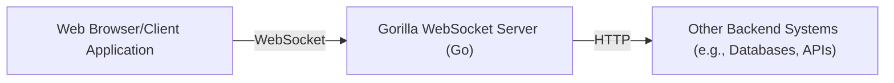
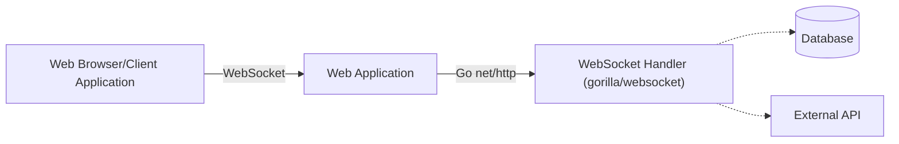
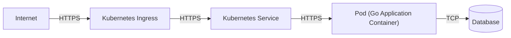
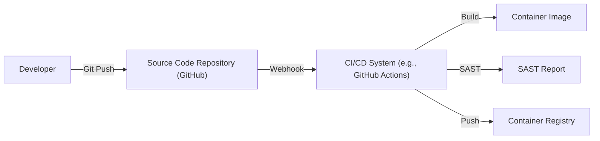

Okay, let's create a design document for the Gorilla WebSocket project.

# BUSINESS POSTURE

Business Priorities and Goals:

*   Provide a robust, efficient, and well-maintained WebSocket implementation for Go applications.
*   Enable real-time, bidirectional communication between clients and servers.
*   Offer a developer-friendly API that simplifies WebSocket usage.
*   Maintain high performance and low resource consumption.
*   Ensure compatibility with relevant WebSocket standards (RFC 6455).
*   Foster a strong community and encourage contributions.

Most Important Business Risks:

*   Security vulnerabilities in the WebSocket implementation could lead to data breaches, denial-of-service attacks, or other security incidents.
*   Performance bottlenecks or resource exhaustion could impact the scalability and responsiveness of applications using the library.
*   Lack of compatibility with evolving WebSocket standards or browser implementations could limit the library's usefulness.
*   Inadequate documentation or support could hinder adoption and lead to developer frustration.
*   Failure to address reported bugs or security issues in a timely manner could damage the library's reputation.

# SECURITY POSTURE

Existing Security Controls:

*   security control: Follows secure coding practices, as evidenced by the project's maturity and community scrutiny. (Implicit in the project's history and community involvement)
*   security control: Offers TLS support for secure communication. (Mentioned in the README and examples)
*   security control: Handles cross-origin resource sharing (CORS). (Mentioned in the documentation and implemented in the `gorilla/websocket` package)
*   security control: Provides options for setting read and write deadlines to mitigate slowloris attacks. (Available through the `Conn` type)
*   security control: Includes checks for valid UTF-8 in text messages. (Implemented in the message reading functions)

Accepted Risks:

*   accepted risk: The library relies on the underlying Go standard library's `net/http` and TLS implementations for security. Any vulnerabilities in those libraries could potentially impact Gorilla WebSocket.
*   accepted risk: Developers are responsible for implementing appropriate authentication and authorization mechanisms in their applications. Gorilla WebSocket itself does not provide these features.
*   accepted risk: Developers are responsible for handling potential denial-of-service attacks beyond the basic protections provided (e.g., rate limiting, connection limits).

Recommended Security Controls:

*   security control: Implement fuzz testing to proactively identify potential vulnerabilities.
*   security control: Conduct regular security audits and code reviews.
*   security control: Provide clear guidance on secure configuration and usage in the documentation.
*   security control: Establish a security reporting process for handling vulnerability disclosures.
*   security control: Consider integrating with a static analysis tool to automatically detect potential security issues.

Security Requirements:

*   Authentication:
    *   The library itself does not handle authentication. Applications using Gorilla WebSocket MUST implement their own authentication mechanisms.
    *   Authentication SHOULD be performed before establishing the WebSocket connection (e.g., using cookies, tokens, or other standard HTTP authentication methods).

*   Authorization:
    *   The library itself does not handle authorization. Applications MUST implement their own authorization logic to control access to resources and operations.
    *   Authorization checks SHOULD be performed based on the authenticated user's identity and permissions.

*   Input Validation:
    *   The library MUST validate incoming data according to the WebSocket protocol (RFC 6455).
    *   Applications MUST validate application-specific data received over WebSocket connections to prevent injection attacks and other vulnerabilities.
    *   Input validation SHOULD include checks for data type, length, format, and allowed values.

*   Cryptography:
    *   The library MUST support TLS for secure communication.
    *   Applications SHOULD use TLS for all WebSocket connections.
    *   Applications MUST use strong cryptographic algorithms and key management practices.
    *   The library SHOULD use the Go standard library's crypto packages, which are regularly reviewed and updated.

# DESIGN

## C4 CONTEXT

Element Descriptions:

*   Element 1:
    *   Name: User
    *   Type: Person
    *   Description: A user interacting with the application through a web browser or other client application that supports WebSockets.
    *   Responsibilities: Initiates WebSocket connections, sends and receives messages.
    *   Security controls: Relies on browser security mechanisms, application-level authentication, and authorization.

*   Element 2:
    *   Name: WebSocketServer
    *   Type: Software System
    *   Description: A Go server application using the Gorilla WebSocket library to handle WebSocket connections.
    *   Responsibilities: Accepts WebSocket connections, handles message framing, manages connection state, sends and receives messages.
    *   Security controls: TLS, CORS handling, read/write deadlines, UTF-8 validation, application-level security.

*   Element 3:
    *   Name: OtherSystems
    *   Type: Software System
    *   Description: Other backend systems that the WebSocket server might interact with, such as databases, APIs, or other services.
    *   Responsibilities: Varies depending on the specific system.
    *   Security controls: Depends on the specific system; should include appropriate security measures.

## C4 CONTAINER

Element Descriptions:

*   Element 1:
    *   Name: User
    *   Type: Person
    *   Description: A user interacting with the application through a web browser or other client application.
    *   Responsibilities: Initiates WebSocket connections, sends and receives messages.
    *   Security controls: Relies on browser security mechanisms, application-level authentication, and authorization.

*   Element 2:
    *   Name: Web Application
    *   Type: Container: Go Web Application
    *   Description: The main web application, potentially serving HTML, CSS, JavaScript, and handling HTTP requests.
    *   Responsibilities: Serves static content, handles initial HTTP requests, upgrades connections to WebSocket.
    *   Security controls: Standard web application security practices (e.g., input validation, output encoding, session management).

*   Element 3:
    *   Name: WebSocket Handler
    *   Type: Container: Go Code (using gorilla/websocket)
    *   Description: The specific part of the Go application that uses the Gorilla WebSocket library.
    *   Responsibilities: Handles WebSocket connection upgrades, manages connection state, sends and receives messages, implements application-specific WebSocket logic.
    *   Security controls: TLS, CORS handling, read/write deadlines, UTF-8 validation, application-level security.

*   Element 4:
    *   Name: Database
    *   Type: Container: Database
    *   Description: A database used by the application.
    *   Responsibilities: Stores and retrieves data.
    *   Security controls: Database security best practices (e.g., access control, encryption, auditing).

*   Element 5:
    *   Name: External API
    *   Type: Container: External API
    *   Description: An external API that the application interacts with.
    *   Responsibilities: Provides external services.
    *   Security controls: API security best practices (e.g., authentication, authorization, rate limiting).

## DEPLOYMENT

Possible Deployment Solutions:

1.  Standalone Go application running on a virtual machine or bare-metal server.
2.  Go application packaged as a Docker container and deployed to a container orchestration platform (e.g., Kubernetes, Docker Swarm).
3.  Go application deployed to a serverless platform (e.g., AWS Lambda, Google Cloud Functions, Azure Functions) using a WebSocket gateway.

Chosen Solution (Example: Docker Container on Kubernetes):

Element Descriptions:

*   Element 1:
    *   Name: Internet
    *   Type: Network
    *   Description: The public internet.
    *   Responsibilities: Routes traffic to the Kubernetes cluster.
    *   Security controls: Standard internet security protocols (e.g., TLS).

*   Element 2:
    *   Name: Ingress
    *   Type: Kubernetes Ingress
    *   Description: A Kubernetes Ingress controller that manages external access to services in the cluster.
    *   Responsibilities: Terminates TLS, routes traffic to the appropriate service based on hostnames and paths.
    *   Security controls: TLS termination, potentially WAF (Web Application Firewall) integration.

*   Element 3:
    *   Name: Service
    *   Type: Kubernetes Service
    *   Description: A Kubernetes Service that provides a stable endpoint for accessing the Go application pods.
    *   Responsibilities: Load balances traffic across multiple pods.
    *   Security controls: Network policies.

*   Element 4:
    *   Name: Pod
    *   Type: Kubernetes Pod
    *   Description: A Kubernetes Pod containing the Go application container.
    *   Responsibilities: Runs the Go application.
    *   Security controls: Container security best practices (e.g., minimal base image, non-root user, security context).

*   Element 5:
    *   Name: Database
    *   Type: Database
    *   Description: Database instance.
    *   Responsibilities: Stores and retrieves data.
    *   Security controls: Database security best practices (e.g., access control, encryption, auditing).

## BUILD

Build Process Description:

1.  Developer pushes code changes to the source code repository (GitHub).
2.  A webhook triggers the CI/CD system (e.g., GitHub Actions).
3.  The CI/CD system checks out the code.
4.  The CI/CD system builds the Go application.
5.  The CI/CD system runs unit tests and integration tests.
6.  The CI/CD system runs a SAST (Static Application Security Testing) tool to scan for vulnerabilities.
7.  The CI/CD system builds a Docker container image.
8.  The CI/CD system pushes the container image to a container registry.

Security Controls:

*   security control: Source code management with Git, providing version control and auditability.
*   security control: CI/CD system (e.g., GitHub Actions) for automated builds and tests.
*   security control: Unit tests and integration tests to verify code correctness.
*   security control: SAST tool to identify potential security vulnerabilities in the code.
*   security control: Container image scanning to identify vulnerabilities in the container image.
*   security control: Secure container registry for storing container images.
*   security control: Use of signed commits.
*   security control: Use minimal base image for container.

# RISK ASSESSMENT

Critical Business Processes:

*   Real-time communication between clients and servers.
*   Data exchange between clients and the server.

Data Sensitivity:

*   The sensitivity of the data transmitted over WebSocket connections depends on the specific application using the library. It could range from non-sensitive public data to highly sensitive personal or financial information.
*   Application developers are responsible for classifying the data handled by their applications and implementing appropriate security measures.

# QUESTIONS & ASSUMPTIONS

Questions:

*   What specific types of applications will be using this library? (This will help determine the data sensitivity and security requirements.)
*   What are the expected traffic patterns and load requirements? (This will inform performance and scalability considerations.)
*   Are there any specific compliance requirements (e.g., GDPR, HIPAA) that need to be considered?
*   What is the existing security infrastructure and tooling in place?
*   What level of security expertise is available within the development team?

Assumptions:

*   BUSINESS POSTURE: The project prioritizes security and is willing to invest in necessary security measures.
*   SECURITY POSTURE: Developers using the library have a basic understanding of WebSocket security concepts.
*   DESIGN: The underlying Go standard library's `net/http` and TLS implementations are secure.
*   DESIGN: The deployment environment will be properly secured.
*   DESIGN: The build process will include security checks.