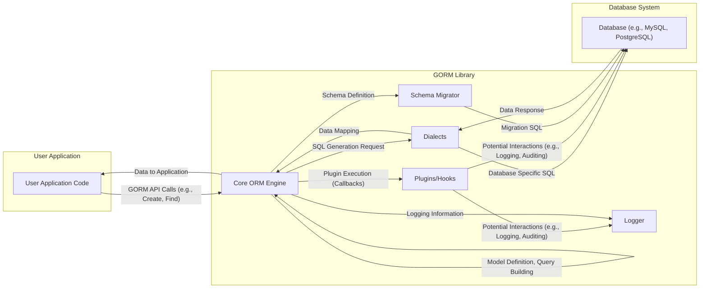
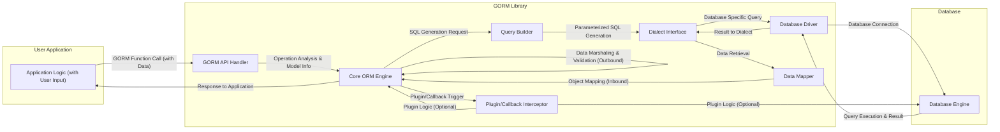

# Project Design Document: Go-GORM (ORM Library)

**Version:** 1.1
**Date:** October 26, 2023
**Author:** AI Architecture Expert

## 1. Introduction

This document provides an enhanced design overview of the Go-GORM library, a widely adopted Object-Relational Mapper (ORM) for the Go programming language. Building upon the previous version, this document offers a more granular articulation of GORM's architecture, components, and data flow, specifically tailored for comprehensive threat modeling activities. The focus remains on core functionalities and interactions that are pertinent to security considerations.

## 2. Goals and Objectives

The primary goals of GORM are to:

* Offer a user-friendly and idiomatic Go interface for interacting with relational databases.
* Abstract the complexities of direct SQL query construction and execution.
* Provide robust features including data mapping between Go structs and database tables, relationship management, transaction handling, and database schema migrations.
* Ensure compatibility and support for a diverse range of relational database backends.
* Maintain a high level of performance and reliability in database interactions.

For the specific purpose of threat modeling, the key objectives of this design document are to:

* Clearly delineate the distinct components within the GORM library and their responsibilities.
* Provide a detailed understanding of the data flow within GORM, with a particular emphasis on the handling of user-supplied input and interactions with the underlying database.
* Precisely identify potential security-sensitive areas, trust boundaries, and points of interaction within the system.
* Offer a clear and comprehensive representation of how GORM integrates with both the user application code and the target database system.

## 3. System Architecture

GORM's architecture can be decomposed into the following key components:

* **Core ORM Engine:** The central processing unit of GORM, responsible for:
    * **Model Definition and Management:**  Handling the registration and metadata of Go structs representing database tables.
    * **Query Building and Translation:**  Constructing SQL queries based on ORM operations defined through the GORM API.
    * **Session Management:** Managing database connections, transactions, and the overall lifecycle of database interactions.
    * **Data Marshaling and Unmarshaling:** Converting data between Go types and database-compatible formats.
* **Dialects:**  An abstraction layer providing database-specific implementations for:
    * **SQL Dialect Generation:** Adapting SQL syntax to the specific requirements of the target database (e.g., MySQL, PostgreSQL).
    * **Connection Handling:** Managing the establishment and maintenance of connections to the specific database system.
    * **Data Type Mapping:**  Translating between Go data types and the corresponding data types supported by the database.
    * **Error Handling:**  Interpreting and translating database-specific error codes.
* **Plugins/Hooks:** An extensible mechanism allowing developers to inject custom logic into GORM's workflow at various points:
    * **Callback Registration:**  Defining functions to be executed before or after specific ORM operations (e.g., before create, after update).
    * **Middleware Functionality:** Implementing cross-cutting concerns like auditing, logging, and soft deletes.
    * **Custom Data Type Handling:** Extending GORM's ability to work with specialized data types.
* **Schema Migrator:**  A component dedicated to managing database schema changes:
    * **Schema Definition:**  Representing database table structures in Go code.
    * **Migration Generation:**  Creating SQL scripts to alter the database schema based on model changes.
    * **Migration Execution and Tracking:** Applying and recording database schema migrations.
* **Logger:**  Provides an interface for logging SQL queries and other relevant information:
    * **Query Logging:**  Outputting the SQL queries executed by GORM.
    * **Error Logging:**  Recording any errors encountered during database interactions.
    * **Customizable Output:** Allowing developers to configure the logging destination and format.
* **User Application Interface (GORM API):** The set of functions and methods exposed to developers for interacting with GORM:
    * **CRUD Operations:** Functions for creating, reading, updating, and deleting database records.
    * **Relationship Management:**  Methods for defining and querying relationships between models.
    * **Transaction Management:**  Functions for initiating, committing, and rolling back database transactions.
    * **Raw SQL Execution (Escape Hatch):**  A mechanism to execute arbitrary SQL queries when necessary.
    * **Migration Management:** Functions to interact with the Schema Migrator.

## 4. Data Flow

The typical data flow within a system utilizing GORM involves these detailed steps:

* **User Application Initiates an ORM Operation:** The application code invokes a GORM function, such as `db.Create(&User{Name: "Alice"})` or `db.Where("name = ?", userName).Find(&users)`. This includes providing data, which might originate from user input.
* **GORM API Handler Receives the Request:** The appropriate handler within the GORM API processes the call, identifying the intended database operation and the involved model.
* **Core ORM Engine Processes the Request:**
    * **Model Metadata Retrieval:** The engine accesses metadata about the Go struct (model) to understand its mapping to the database table.
    * **Query Building Logic Invoked:** Based on the requested operation (Create, Read, Update, Delete), the core engine initiates the query building process.
    * **Data Marshaling/Validation (Outbound):**  For operations involving data persistence (Create, Update), GORM marshals the Go data into database-compatible formats. Basic validation based on data types might occur here.
* **SQL Query Generation via Dialect:**
    * **Dialect Selection:** The Core ORM Engine selects the appropriate database dialect based on the configured database.
    * **SQL Construction:** The selected dialect generates the specific SQL query. For data manipulation operations, GORM uses parameterized queries to prevent SQL injection. Placeholders are used for user-provided data.
* **Database Interaction:**
    * **Connection Acquisition:** GORM obtains a database connection from its connection pool or establishes a new connection.
    * **Query Execution:** The generated SQL query, with parameters bound to the placeholders, is sent to the database.
    * **Database Processing:** The database executes the query.
* **Database Response Handling:**
    * **Result Retrieval:** The database returns the results of the query (e.g., affected rows, retrieved data).
    * **Error Handling:** The dialect intercepts any database errors.
* **Data Mapping (Inbound):**
    * **Data Unmarshaling:** GORM unmarshals the data received from the database into Go struct instances.
    * **Result Population:** The retrieved data populates the fields of the corresponding Go objects.
* **Plugins/Hooks Execution (Optional):** If any relevant plugins or callbacks are registered for the performed operation (e.g., `AfterCreate`, `BeforeUpdate`), they are executed at this stage.
* **Response Returned to Application:** The processed data or operation status is returned to the user application code.

## 5. Security Considerations

A comprehensive threat model for GORM must consider the following security aspects:

* **SQL Injection Prevention:**
    * **Parameterized Queries:** GORM's default use of parameterized queries for data manipulation is the primary defense against SQL injection. User-provided data is treated as parameters, not executable SQL code.
    * **Escaping for Raw Queries:** When using raw SQL queries (the escape hatch), developers are responsible for manually escaping user input. GORM provides functions for this, but misuse can lead to vulnerabilities.
* **Database Credentials Security:**
    * **Configuration Management:** Securely storing and managing database credentials (usernames, passwords) is critical. This is typically handled by the application's deployment environment or configuration management tools, not GORM itself.
    * **Connection String Handling:**  Care must be taken to avoid hardcoding credentials in the application code. Environment variables or secure configuration stores are recommended.
* **Logging and Information Disclosure:**
    * **Sensitive Data in Logs:**  Logging SQL queries, especially those containing user input, can expose sensitive information if logs are not properly secured.
    * **Log Level Configuration:**  Properly configuring GORM's logging level to avoid excessive or unnecessary logging of sensitive data is important.
* **Mass Assignment Vulnerabilities:**
    * **`Omit` and `Select`:** GORM provides mechanisms like `Omit` and `Select` in its API to explicitly control which fields can be modified during create and update operations, mitigating the risk of attackers manipulating unintended fields.
    * **Guard Clauses:** Implementing application-level checks or guard clauses before data is passed to GORM can further prevent unauthorized modifications.
* **Denial of Service (DoS):**
    * **Inefficient Queries:**  Poorly designed ORM queries (e.g., fetching large amounts of data unnecessarily, N+1 query problems) can lead to performance issues and potentially contribute to DoS conditions at the database level.
    * **Database Connection Exhaustion:**  Improper handling of database connections (e.g., not closing connections) can lead to connection exhaustion and DoS.
* **Dependency Vulnerabilities:**
    * **Regular Updates:** Keeping GORM and its underlying database driver dependencies up-to-date is crucial to patch known security vulnerabilities in those libraries.
    * **Dependency Scanning:** Utilizing dependency scanning tools can help identify and manage potential vulnerabilities in GORM's dependencies.
* **Authentication and Authorization (Application Level):**
    * **GORM's Role:** GORM itself does not handle application-level authentication or authorization. These controls must be implemented within the user application logic.
    * **Database Level Security:** GORM respects the authentication and authorization configured at the database level based on the provided connection credentials.
* **Data Validation:**
    * **Application Layer Validation:** Comprehensive data validation should be performed in the application layer *before* data reaches GORM to prevent invalid or malicious data from being persisted.
    * **GORM's Basic Validation:** GORM provides some basic data type validation based on model definitions, but this should not be relied upon as the primary validation mechanism.
* **Plugin Security:**
    * **Third-Party Plugins:** When using third-party GORM plugins, it's important to assess their security and trustworthiness, as vulnerabilities in plugins can impact the overall application security.
    * **Plugin Permissions:**  Consider the level of access and capabilities granted to GORM plugins.

## 6. Deployment Considerations

Deployment considerations for applications using GORM include:

* **Secure Application Environment:** Deploying the Go application in a secure environment with appropriate access controls and security hardening is essential.
* **Database Security Hardening:** Ensuring the database system itself is securely configured, patched, and has strong access controls is paramount.
* **Network Security:** Secure network communication between the application and the database (e.g., using TLS/SSL encryption) is crucial to protect sensitive data in transit.
* **Secrets Management:** Employing secure secrets management practices for storing and accessing database credentials (e.g., using vault solutions, environment variables with restricted access).
* **Monitoring and Logging:** Implementing robust monitoring and logging for both the application and the database to detect and respond to potential security incidents.

## 7. Technologies Used

* **Go Programming Language:** The foundational language for GORM's development.
* **Relational Databases:**  Supports a wide array of relational databases, including MySQL, PostgreSQL, SQLite, SQL Server, TiDB, and others.
* **Database Drivers:**  Relies on Go database drivers (e.g., `go-sql-driver/mysql`, `github.com/lib/pq`) to interact with specific database systems.

## 8. Future Considerations (Relevant for Ongoing Threat Assessment)

* **Introduction of New Database Dialects:**  Supporting new database systems may introduce novel security considerations specific to those databases' features and vulnerabilities.
* **Enhancements to the Plugin System:**  New plugin capabilities or changes to the plugin API could introduce new attack surfaces if not carefully designed and reviewed from a security perspective.
* **Performance Optimizations and Query Generation Changes:** Modifications to GORM's query generation logic or performance optimization efforts could inadvertently introduce SQL injection vulnerabilities or other security flaws if not thoroughly tested.
* **Changes to Data Marshaling/Unmarshaling:**  Alterations in how GORM handles data conversion between Go and the database could potentially introduce vulnerabilities related to data integrity or unexpected behavior.
* **Adoption of New Go Features:** As the Go language evolves, GORM's adoption of new features should be assessed for potential security implications.

This enhanced design document provides a more detailed and nuanced understanding of the Go-GORM library, specifically tailored to facilitate comprehensive threat modeling activities. By clearly outlining the components, data flow, and security considerations, this document serves as a valuable resource for identifying and mitigating potential security risks associated with using GORM in applications.
