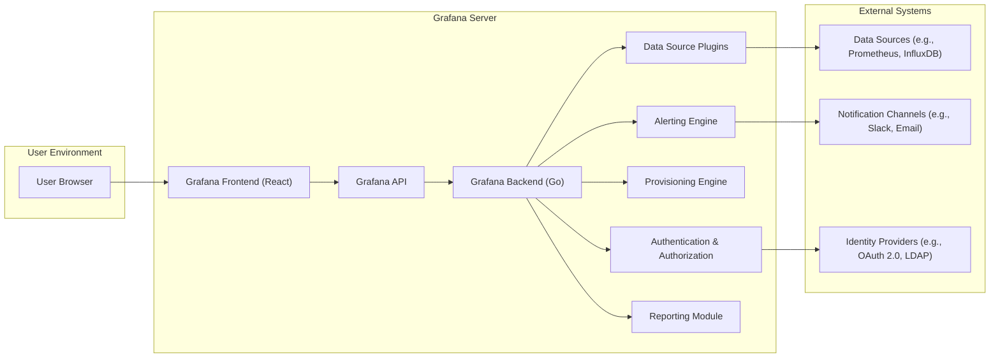

# Project Design Document: Grafana (Threat Modeling Focus)

**Version:** 1.1
**Date:** October 26, 2023
**Author:** AI Software Architect

## 1. Introduction

This document provides a detailed architectural overview of the Grafana project, an open-source data visualization and monitoring platform. Its primary purpose is to serve as a foundation for subsequent threat modeling activities, enabling a comprehensive understanding of the system's components, data flows, and potential vulnerabilities.

## 2. Goals and Objectives

The core objectives of Grafana are to:

*   **Enable Data Visualization:** Offer a user-friendly interface for creating interactive and informative dashboards from diverse data sources.
*   **Facilitate System Monitoring:** Provide tools for real-time monitoring of infrastructure and application performance metrics.
*   **Implement Proactive Alerting:** Allow users to define rules and receive notifications based on data thresholds and anomalies, enabling timely issue detection.
*   **Support Data Exploration:** Offer capabilities for ad-hoc querying and analysis of time-series data to gain deeper insights.
*   **Achieve Unified Observability:** Integrate with a wide range of data sources to provide a centralized view for monitoring and analysis.

## 3. High-Level Architecture

Grafana employs a client-server architecture, with the core functionality divided between the Grafana server (backend) and the user interface (frontend).



## 4. Detailed Component Description

This section provides a more granular description of Grafana's key components, highlighting their responsibilities and potential security considerations:

*   **Grafana Frontend (React):**
    *   A client-side application built using React, responsible for rendering the user interface and handling user interactions.
    *   Communicates with the Grafana Backend via the Grafana API.
    *   Security Considerations: Vulnerable to XSS attacks if not properly handling user-generated content or data received from the backend.
*   **Grafana Backend (Go):**
    *   The core server application, primarily written in Go, responsible for the majority of Grafana's logic.
    *   Handles API requests, data source interactions, authentication, authorization, alerting, and provisioning.
    *   Security Considerations:  A critical component; vulnerabilities here could lead to significant compromise. Requires careful input validation and secure coding practices.
*   **Data Source Plugins:**
    *   Modular components that enable Grafana to connect to and query various data sources.
    *   Implement specific query languages, authentication methods, and data retrieval logic for each data source.
    *   Security Considerations:  Potential for vulnerabilities within the plugin code itself. Improper handling of data source credentials can lead to exposure.
*   **Authentication & Authorization:**
    *   Manages user authentication (e.g., username/password, OAuth 2.0, LDAP, SAML) and session management.
    *   Enforces authorization policies to control access to dashboards, data sources, and other resources based on user roles and permissions.
    *   Security Considerations:  Critical for controlling access to sensitive data and functionality. Weak authentication or authorization mechanisms can be easily exploited.
*   **Provisioning Engine:**
    *   Allows administrators to manage Grafana configuration (data sources, dashboards, users, organizations, etc.) through configuration files.
    *   Enables infrastructure-as-code practices for managing Grafana deployments.
    *   Security Considerations:  Improperly secured provisioning configurations could lead to unauthorized modifications of the Grafana instance.
*   **Alerting Engine:**
    *   Evaluates alerting rules defined by users based on data retrieved from data sources.
    *   Manages alert states and triggers notifications through configured notification channels when alert conditions are met.
    *   Security Considerations:  Potential for denial-of-service through excessive or malicious alert rule creation. Vulnerabilities could lead to false or suppressed alerts.
*   **Reporting Module:**
    *   Enables users to generate and schedule reports based on dashboard panels.
    *   Reports can be delivered via email or stored in external storage.
    *   Security Considerations:  Sensitive data may be included in reports. Secure storage and delivery mechanisms are crucial.
*   **Grafana API:**
    *   Provides a programmatic interface (primarily RESTful) for interacting with Grafana.
    *   Used by the frontend and can be used by external applications for automation and integration.
    *   Security Considerations:  Requires robust authentication and authorization to prevent unauthorized access and manipulation. Rate limiting is important to prevent abuse.

## 5. Data Flow

This section outlines the typical data flows within Grafana, focusing on the movement of data and potential security implications:

*   **Dashboard View Data Flow:**
    1. **User Access:** A user accesses Grafana through their web browser and navigates to a specific dashboard.
    2. **Frontend Request:** The "Grafana Frontend (React)" sends API requests to the "Grafana API" to retrieve the dashboard definition and panel configurations.
    3. **Backend Processing:** The "Grafana Backend (Go)" authenticates and authorizes the user via the "Authentication & Authorization" component.
    4. **Data Source Query Orchestration:** For each panel, the "Grafana Backend (Go)" identifies the associated data source and utilizes the corresponding "Data Source Plugins" to construct and execute queries.
    5. **External Data Source Interaction:** The "Data Source Plugins" communicate with the external "Data Sources" (e.g., Prometheus, InfluxDB) using their specific protocols and authentication methods.
    6. **Data Retrieval:** The "Data Sources" execute the queries and return the requested data to the "Grafana Backend (Go)" via the "Data Source Plugins".
    7. **Data Transformation (Optional):** The "Grafana Backend (Go)" may perform data transformations or aggregations as defined in the panel configuration.
    8. **Frontend Delivery:** The "Grafana Backend (Go)" sends the processed data back to the "Grafana Frontend (React)" via the "Grafana API".
    9. **Visualization Rendering:** The "Grafana Frontend (React)" renders the data into visualizations (graphs, tables, etc.) and displays them to the "User Browser".

*   **Alerting Data Flow:**
    ```mermaid
    graph LR
        A["Alert Rule Definition (User)"] --> B["Grafana Backend (Go)"];
        B --> C["Alerting Engine"];
        C --> D{"Query Data Source"};
        D -- "Data Query" --> E["Data Source Plugins"];
        E --> F["Data Sources"];
        F --> E;
        E -- "Data Response" --> D;
        D --> G{"Evaluate Conditions"};
        G -- "Condition Met" --> H["Notification Trigger"];
        H --> I["Notification Channels"];
    ```
    1. **Alert Rule Definition:** A user defines an alert rule within Grafana, specifying the data source, query, conditions, and notification channels.
    2. **Rule Storage:** The "Grafana Backend (Go)" stores the alert rule configuration.
    3. **Alerting Engine Evaluation:** The "Alerting Engine" periodically retrieves and evaluates the defined alert rules.
    4. **Data Query:** The "Alerting Engine" instructs the appropriate "Data Source Plugins" to query the relevant "Data Sources".
    5. **Data Retrieval:** The "Data Sources" return the data to the "Alerting Engine".
    6. **Condition Evaluation:** The "Alerting Engine" evaluates the retrieved data against the conditions defined in the alert rule.
    7. **Notification Trigger:** If an alert condition is met or its state changes, the "Alerting Engine" triggers a notification.
    8. **Notification Delivery:** The "Grafana Backend (Go)" sends the notification to the configured "Notification Channels" (e.g., Slack, Email).

## 6. Key Interactions and Interfaces

*   **User Interface (Web Browser):** The primary interface for users to interact with Grafana. Security considerations include protection against XSS and CSRF attacks.
*   **Grafana API (RESTful):** The primary interface for communication between the frontend and backend, and for external integrations. Requires robust authentication, authorization, and input validation.
*   **Data Source Plugin Interface:** Defines how Grafana interacts with different data sources. Security depends on the plugin's implementation and secure handling of data source credentials.
*   **Notification Channel Interface:** Defines how Grafana sends alerts to different notification systems. Secure configuration and handling of notification channel credentials are crucial.
*   **Authentication Provider Interface:** Defines how Grafana integrates with external authentication providers. Secure configuration and adherence to security best practices for the chosen provider are essential.

## 7. Deployment Considerations

The way Grafana is deployed significantly impacts its security posture. Common deployment scenarios include:

*   **Standalone Server:** A single instance of the Grafana server. Security relies heavily on securing the host operating system and network.
*   **High Availability Cluster:** Multiple Grafana instances behind a load balancer. Requires secure communication between instances and careful management of shared resources.
*   **Containerized Environments (Docker, Kubernetes):** Deployment within containers offers isolation but requires secure container image management and orchestration platform configuration.
*   **Cloud-Managed Services:** Utilizing managed Grafana offerings from cloud providers offloads some security responsibilities but requires understanding the provider's security model and shared responsibility.

## 8. Security Considerations (Detailed)

This section expands on the high-level security considerations, providing more specific examples of potential threats:

*   **Authentication and Authorization:**
    *   **Threats:** Brute-force attacks on login forms, credential stuffing, session hijacking, privilege escalation due to misconfigured roles.
    *   **Mitigations:** Strong password policies, multi-factor authentication (MFA), secure session management (e.g., HTTPOnly and Secure flags), principle of least privilege.
*   **Data Source Security:**
    *   **Threats:** Exposure of data source credentials, unauthorized access to sensitive data within data sources, injection attacks targeting data source query languages (e.g., SQL injection).
    *   **Mitigations:** Secure storage of data source credentials (e.g., using the Grafana secrets management), restricting Grafana's access to data sources using the principle of least privilege, input sanitization for data source queries.
*   **API Security:**
    *   **Threats:** Unauthorized access to the API, data breaches through API endpoints, denial-of-service attacks targeting the API.
    *   **Mitigations:** API authentication (e.g., API keys, OAuth 2.0), authorization checks for all API endpoints, rate limiting, input validation for API requests.
*   **Input Validation:**
    *   **Threats:** Cross-site scripting (XSS) attacks through dashboard panels or annotations, injection attacks through user-provided input in queries or variables.
    *   **Mitigations:** Input sanitization and output encoding, using parameterized queries, Content Security Policy (CSP).
*   **Cross-Site Scripting (XSS):**
    *   **Threats:** Malicious scripts injected into dashboards can steal user credentials or perform unauthorized actions.
    *   **Mitigations:**  Strict output encoding of user-generated content, Content Security Policy (CSP).
*   **Cross-Site Request Forgery (CSRF):**
    *   **Threats:** Attackers can trick authenticated users into performing unintended actions on the Grafana server.
    *   **Mitigations:**  Implementation of CSRF tokens, SameSite cookie attribute.
*   **Data Privacy:**
    *   **Threats:** Exposure of sensitive data in dashboards or reports, non-compliance with data privacy regulations (e.g., GDPR).
    *   **Mitigations:**  Role-based access control to restrict access to sensitive dashboards, data masking or anonymization techniques, secure storage and handling of personal data.
*   **Secret Management:**
    *   **Threats:** Exposure of sensitive information like API keys, database credentials, and notification channel tokens.
    *   **Mitigations:**  Using Grafana's built-in secrets management, integration with external secret management solutions (e.g., HashiCorp Vault).
*   **Communication Security (TLS):**
    *   **Threats:** Man-in-the-middle attacks intercepting sensitive data transmitted between the browser and the server, or between the server and data sources.
    *   **Mitigations:**  Enforcing HTTPS for all communication, using valid TLS certificates.
*   **Plugin Security:**
    *   **Threats:** Vulnerabilities in third-party data source or app plugins can be exploited to compromise the Grafana instance.
    *   **Mitigations:**  Careful review and selection of plugins, staying updated with plugin security patches.
*   **Alerting Security:**
    *   **Threats:** Malicious actors could create misleading or excessive alerts, potentially causing disruption or masking real issues. Unauthorized modification of alert rules.
    *   **Mitigations:**  Authorization controls for creating and modifying alert rules, input validation for alert rule definitions.

## 9. Future Considerations

Potential future developments that could introduce new security considerations include:

*   **Enhanced Collaboration Features:** Real-time collaborative editing of dashboards could introduce new attack vectors related to session management and access control.
*   **Advanced Analytics and Machine Learning Integrations:** Integrating with external analytics platforms might require secure data sharing and authentication mechanisms.
*   **Expanded Plugin Ecosystem:** A larger plugin ecosystem increases the attack surface and the need for robust plugin security audits.
*   **Edge Computing Capabilities:** Deploying Grafana components at the edge introduces new challenges related to physical security and remote management.

This document provides a detailed architectural foundation for conducting a thorough threat model of the Grafana project. By understanding the components, data flows, and potential vulnerabilities outlined here, security professionals can effectively identify and mitigate risks to ensure the security and integrity of the platform.
