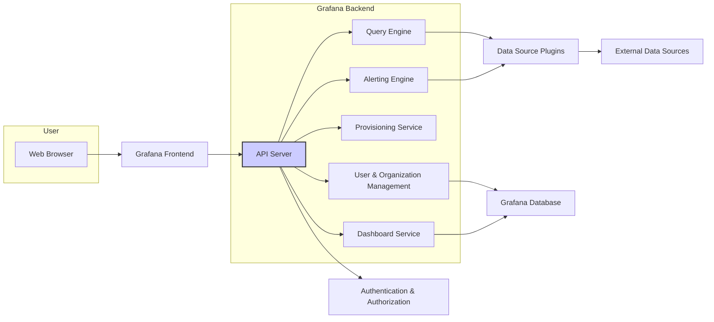
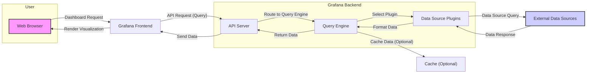
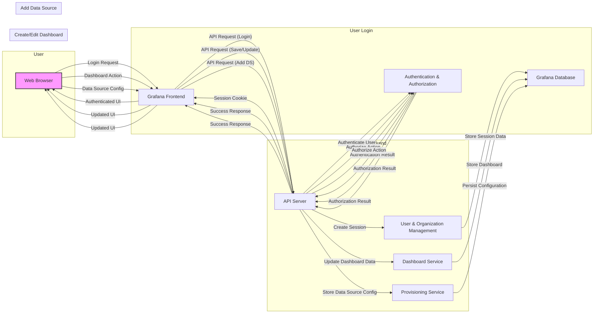

# Project Design Document: Grafana for Threat Modeling (Improved)

**Version:** 2.0
**Date:** October 26, 2023
**Prepared By:** AI Software Architecture Expert

## 1. Introduction

This document provides an enhanced and more detailed design overview of the Grafana project, specifically tailored for use in subsequent threat modeling activities. It expands upon the previous version by providing greater granularity in component descriptions and elaborating on data and user interaction flows. This document aims to offer a more comprehensive understanding of the system's architecture to facilitate a more thorough and effective identification of potential security vulnerabilities and risks. The information is based on the publicly available Grafana repository: [https://github.com/grafana/grafana](https://github.com/grafana/grafana).

## 2. Goals

*   Provide a clear, comprehensive, and more granular architectural overview of Grafana.
*   Identify key components and their specific responsibilities in greater detail.
*   Describe the data flow within the system with more precision.
*   Illustrate user interaction patterns for various functionalities.
*   Establish a robust foundation for effective and detailed threat modeling.

## 3. High-Level Architecture

Grafana maintains a client-server architecture with a web-based frontend interacting with a robust backend service. This backend orchestrates data retrieval from various sources and manages core functionalities.

## 4. Key Components (Detailed)

*   **Web Browser:** The user's entry point for interacting with Grafana, rendering the user interface and handling user inputs.
*   **Grafana Frontend:**  A sophisticated single-page application built primarily with React and TypeScript. It is responsible for:
    *   Rendering dashboards and visualizations.
    *   Handling user interactions and events.
    *   Communicating with the backend API through HTTP requests.
    *   Managing the application state.
*   **Grafana Backend:** The core of the application, implemented in Go, responsible for the business logic and data orchestration. It comprises several sub-components:
    *   **API Server:** Handles incoming HTTP requests from the frontend, manages routing, and delegates tasks to other backend services.
    *   **Query Engine:**  Processes queries received from the frontend, interacts with data source plugins to retrieve data, and formats the results.
    *   **Alerting Engine:** Evaluates alert rules against data retrieved by the Query Engine and manages the lifecycle of alerts, including sending notifications.
    *   **Provisioning Service:**  Automates the configuration of Grafana resources (data sources, dashboards, users, etc.) based on configuration files.
    *   **User & Organization Management:**  Handles user authentication, authorization, organization management, and user roles and permissions.
    *   **Dashboard Service:** Manages the creation, storage, retrieval, and updating of dashboards and their associated panels.
*   **Authentication & Authorization:** A logical component within the backend responsible for:
    *   Verifying user credentials during login.
    *   Managing user sessions and tokens.
    *   Enforcing access control policies based on user roles and permissions.
    *   Supporting various authentication methods (e.g., basic auth, OAuth 2.0, LDAP, SAML).
*   **Data Source Plugins:**  Independent modules that enable Grafana to connect to and query different types of data sources. Each plugin:
    *   Implements the specific protocol and API for a particular data source.
    *   Translates Grafana's query language into the data source's native query language.
    *   Handles authentication and authorization with the data source.
*   **Grafana Database:** Stores Grafana's internal state and configuration data. This includes:
    *   User accounts and organization details.
    *   Dashboard definitions and configurations.
    *   Alert rules and notification channels.
    *   Data source configurations.
    *   API keys and other settings.
*   **External Data Sources:** The external systems where the actual monitoring data, logs, or other data to be visualized resides (e.g., Prometheus, Graphite, InfluxDB, Elasticsearch, relational databases).

## 5. Data Flow (Detailed)

This section elaborates on the data flow, providing more specific steps and component interactions.

**Detailed Data Flow Steps:**

1. The user requests a dashboard through the **Web Browser**.
2. The **Grafana Frontend** sends an API request (typically an HTTP GET request) to the **API Server** in the Grafana Backend to retrieve data for the dashboard panels.
3. The **API Server** routes the request to the **Query Engine**.
4. The **Query Engine** identifies the necessary **Data Source Plugin** based on the data source configured for each panel.
5. The **Query Engine** invokes the appropriate methods within the **Data Source Plugin**, passing the query parameters.
6. The **Data Source Plugin** constructs and sends a query in the **External Data Source's** native query language.
7. The **External Data Source** processes the query and returns the data to the **Data Source Plugin**.
8. The **Data Source Plugin** formats the data into a standardized format that Grafana understands.
9. The **Query Engine** may optionally cache the data in a **Cache**.
10. The **Query Engine** returns the formatted data to the **API Server**.
11. The **API Server** sends the data back to the **Grafana Frontend** in the HTTP response.
12. The **Grafana Frontend** processes the data and renders the visualizations in the **Web Browser**.

## 6. User Interaction Flow (Detailed)

This section details common user interactions with Grafana.

**Detailed User Interaction Flows:**

*   **User Login:**
    1. The user submits login credentials through the **Web Browser**.
    2. The **Grafana Frontend** sends an API request (typically a POST request) to the **API Server** with the credentials.
    3. The **API Server** delegates the authentication to the **Authentication & Authorization** component.
    4. The **Authentication & Authorization** component verifies the credentials against the data stored in the **Grafana Database** or an external authentication provider.
    5. The **Authentication & Authorization** component returns the authentication result to the **API Server**.
    6. Upon successful authentication, the **API Server** instructs the **User & Organization Management** component to create a session.
    7. The **User & Organization Management** component stores the session data in the **Grafana Database**.
    8. The **API Server** sends a session cookie back to the **Grafana Frontend**.
    9. The **Grafana Frontend** stores the cookie, and the user is presented with the authenticated UI.

*   **Create/Edit Dashboard:**
    1. The user interacts with the dashboard editor in the **Web Browser**.
    2. The **Grafana Frontend** sends an API request (typically a POST or PUT request) to the **API Server** to save or update the dashboard definition.
    3. The **API Server** verifies the user's authorization with the **Authentication & Authorization** component.
    4. If authorized, the **API Server** instructs the **Dashboard Service** to update the dashboard data.
    5. The **Dashboard Service** stores the updated dashboard definition in the **Grafana Database**.
    6. The **API Server** sends a success response to the **Grafana Frontend**.
    7. The **Grafana Frontend** updates the UI to reflect the changes.

*   **Add Data Source:**
    1. The user configures a new data source through the **Web Browser**.
    2. The **Grafana Frontend** sends an API request (typically a POST request) to the **API Server** to add the new data source.
    3. The **API Server** verifies the user's authorization with the **Authentication & Authorization** component.
    4. If authorized, the **API Server** instructs the **Provisioning Service** to handle the data source configuration.
    5. The **Provisioning Service** persists the data source configuration in the **Grafana Database**.
    6. The **API Server** sends a success response to the **Grafana Frontend**.
    7. The **Grafana Frontend** updates the UI to reflect the newly added data source.

## 7. Deployment Considerations

Grafana's deployment options significantly impact its security posture.

*   **Standalone Binary:** Simplest deployment, but requires careful management of the host operating system's security.
*   **Docker Container:** Provides isolation and simplifies deployment, but requires securing the Docker environment and image.
*   **Kubernetes:** Offers scalability and resilience, but introduces complexities in securing the Kubernetes cluster and its components.
*   **Cloud Platforms (Managed Grafana):** Offloads infrastructure management and security to the cloud provider, but requires trust in the provider's security measures.

## 8. Security Considerations (Categorized)

This section categorizes potential security considerations for more effective threat modeling.

*   **Authentication & Authorization:**
    *   Weak password policies and lack of multi-factor authentication.
    *   Vulnerabilities in authentication mechanisms (e.g., OAuth misconfigurations).
    *   Authorization bypass due to improper role-based access control.
    *   Session fixation and hijacking vulnerabilities.
*   **API Security:**
    *   Lack of proper input validation leading to injection attacks (SQLi, command injection).
    *   Cross-Site Scripting (XSS) vulnerabilities in API responses.
    *   Cross-Site Request Forgery (CSRF) vulnerabilities.
    *   Insecure Direct Object References (IDOR).
    *   Rate limiting and denial-of-service (DoS) vulnerabilities.
*   **Frontend Security:**
    *   DOM-based XSS vulnerabilities.
    *   Dependency vulnerabilities in frontend libraries.
    *   Sensitive data exposure in client-side code or local storage.
    *   Clickjacking vulnerabilities.
*   **Data Source Security:**
    *   Stored credentials for data sources being compromised.
    *   Injection vulnerabilities in queries to data sources.
    *   Unauthorized access to data sources due to misconfigurations.
*   **Alerting Security:**
    *   Spoofing of alert notifications.
    *   Exposure of sensitive information in alert messages.
    *   Manipulation of alert rules by unauthorized users.
*   **Provisioning Security:**
    *   Exposure of sensitive credentials in provisioning configuration files.
    *   Unauthorized modification of provisioning configurations.
*   **Database Security:**
    *   SQL injection vulnerabilities in Grafana's own database queries.
    *   Unauthorized access to the Grafana database.
    *   Data breaches from the database.
*   **Network Security:**
    *   Unencrypted communication (HTTP instead of HTTPS).
    *   Exposure of Grafana services to public networks without proper firewall rules.
*   **Plugin Security:**
    *   Vulnerabilities in third-party data source plugins.
    *   Malicious plugins potentially compromising the Grafana instance.

## 9. Technologies Used

*   **Backend:** Go
*   **Frontend:** React, TypeScript, Redux, Emotion
*   **Database:** SQLite (default), PostgreSQL, MySQL
*   **Data Source Plugins:** Varies depending on the data source; often Go, Python, or Node.js.
*   **Communication Protocols:** HTTP/HTTPS, WebSockets, gRPC (internally for some features).

This improved design document provides a more detailed and structured overview of Grafana's architecture, enhancing its suitability for comprehensive threat modeling. The increased granularity in component descriptions and the detailed flow diagrams will aid in identifying a wider range of potential security vulnerabilities.