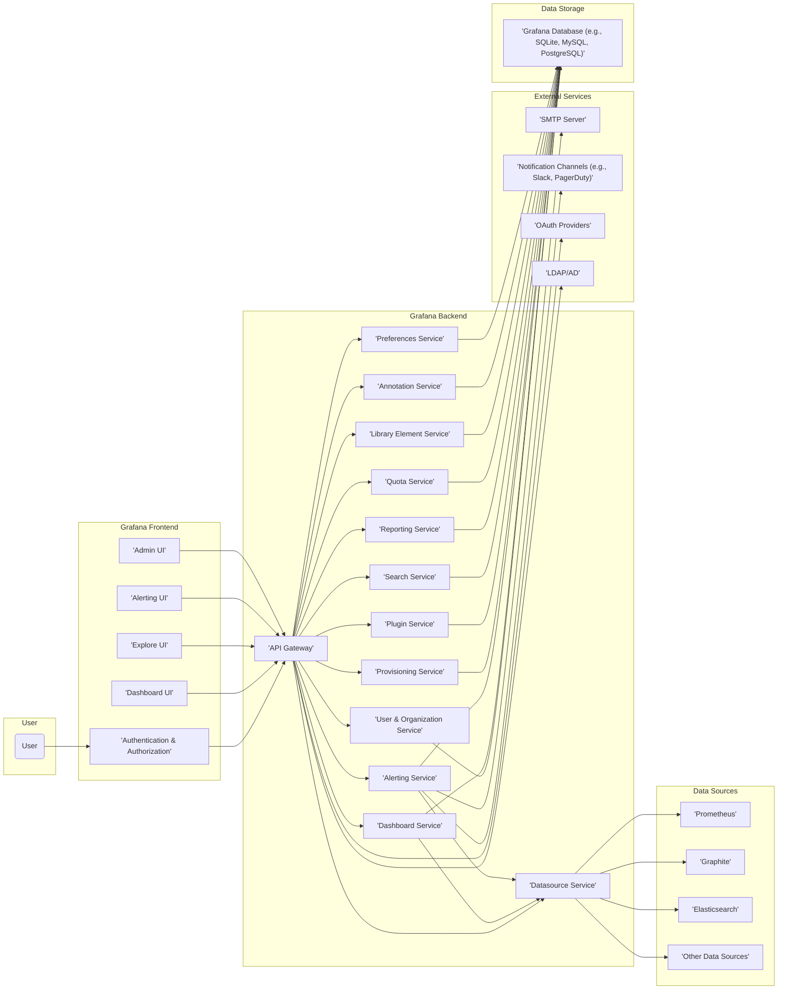

# Project Design Document: Grafana for Threat Modeling (Improved)

**Version:** 2.0
**Date:** October 26, 2023
**Author:** AI Software Architect

## 1. Introduction

This document provides an enhanced architectural overview of the Grafana project (as represented by the codebase at [https://github.com/grafana/grafana](https://github.com/grafana/grafana)). Building upon the previous version, this iteration provides more granular detail and clarifies key interactions, specifically tailored for effective threat modeling. The aim is to offer a robust understanding of Grafana's internal workings, data flows, and security-relevant components.

## 2. Goals and Objectives

The primary goal remains to provide a comprehensive and understandable description of Grafana's architecture to facilitate effective threat modeling. Improved objectives include:

*   Providing more detailed descriptions of key components and their specific responsibilities.
*   Mapping data flow with greater granularity, including specific interactions between services.
*   Clarifying the roles and interactions of internal backend services.
*   Highlighting potential areas of security concern with more specific examples.
*   Providing a more robust basis for identifying potential threats, vulnerabilities, and attack vectors.

## 3. System Architecture Overview

Grafana's architecture centers around providing a unified platform for data visualization and monitoring. The core remains divided into distinct areas, but this version provides a more detailed breakdown of the backend services.

*   **Frontend:** The user interface, responsible for user interaction and presentation.
*   **Backend:** The core application logic, encompassing various microservices responsible for specific functionalities.
*   **Data Sources:** External systems providing the data visualized by Grafana.
*   **Alerting Engine:**  The component that evaluates alert rules and manages notifications.
*   **Provisioning:** Mechanisms for automated configuration of Grafana resources.
*   **Data Storage:** Internal storage used by Grafana for configuration and state.

## 4. Key Components

This section provides more detailed descriptions of the major components.

*   **Frontend (grafana/ui):**
    *   **Authentication & Authorization:** Manages user login sessions, API key authentication, and enforces access control policies based on user roles, organization roles, and permissions. This includes handling multi-factor authentication and integration with external authentication providers.
    *   **Dashboard UI:**  Provides an interactive interface for creating, editing, viewing, and managing dashboards. This involves rendering visualizations, handling user interactions, and managing dashboard layouts.
    *   **Explore UI:**  Offers an ad-hoc query interface for directly interacting with data sources, allowing users to explore metrics, logs, and traces without pre-configured dashboards.
    *   **Alerting UI:**  Enables users to define alert rules based on data source queries, configure notification channels, and manage alert silences and contact points.
    *   **Admin UI:**  Provides administrative functionalities for managing users, organizations, server settings, plugins, API keys, and security settings.

*   **Backend (pkg/api, pkg/services, etc.):**
    *   **API Gateway:**  The central entry point for all API requests. It handles request routing to the appropriate backend services, performs authentication and authorization checks, and can implement rate limiting and other security policies.
    *   **Dashboard Service:**  Manages the lifecycle of dashboards, including creation, retrieval, updating, deletion, and versioning. It also handles dashboard permissions and sharing.
    *   **Datasource Service:**  Responsible for managing data source configurations, securely storing data source credentials, and proxying queries to the configured data sources through plugin interfaces. It handles data source health checks and manages connections.
    *   **Alerting Service:**  Evaluates alert rules at defined intervals, queries data sources via the Datasource Service, manages alert states (Pending, Firing, Resolved), and triggers notifications through configured notification channels. It also handles alert rule provisioning and management.
    *   **User & Organization Service:**  Manages user accounts, organizations, teams, and their associated roles and permissions. It handles user authentication, password management, and integration with external authentication providers (OAuth, LDAP).
    *   **Provisioning Service:**  Allows for the programmatic configuration of Grafana resources (dashboards, data sources, notifiers, organizations, alert rules) using configuration files. This is crucial for Infrastructure-as-Code deployments.
    *   **Plugin Service:**  Manages the installation, updating, and lifecycle of Grafana plugins (data sources, panels, apps). It handles plugin signature verification and provides an API for plugin developers.
    *   **Search Service:**  Provides indexing and search capabilities for dashboards, data sources, users, and other Grafana resources, enabling efficient discovery of relevant items.
    *   **Reporting Service:**  Generates reports based on dashboard panels, allowing for scheduled delivery of visualizations in PDF format.
    *   **Quota Service:**  Enforces limits on various resources, such as the number of dashboards, users, data sources, and alert rules, to prevent resource exhaustion and abuse.
    *   **Library Element Service:** Manages reusable panels and dashboard rows that can be shared across multiple dashboards, promoting consistency and efficiency.
    *   **Annotation Service:**  Allows users to add annotations to graphs, marking significant events or milestones. These annotations are stored and can be queried.
    *   **Preferences Service:** Manages user-specific and organization-wide preferences and settings.

*   **Data Sources (pkg/tsdb):**
    *   Grafana's plugin architecture allows it to connect to a wide variety of data sources. Each data source plugin handles the specific communication protocol and query language of the underlying system. Examples include:
        *   Time-series databases (Prometheus, Graphite, InfluxDB)
        *   Logging systems (Elasticsearch, Loki)
        *   SQL databases (MySQL, PostgreSQL, SQL Server)
        *   Cloud monitoring services (AWS CloudWatch, Azure Monitor, Google Cloud Monitoring)
        *   APM tools (Jaeger, Zipkin)

*   **Alerting Engine (pkg/services/alerting):**
    *   The core of the alerting functionality, responsible for scheduling alert rule evaluations, querying data sources, comparing results against thresholds, and managing alert states. It also handles the throttling and grouping of notifications.

*   **Provisioning (pkg/provisioning):**
    *   Reads configuration files (typically YAML) to automatically create or update Grafana resources. This simplifies the management of Grafana configurations in automated environments.

*   **Data Storage (pkg/infra/database):**
    *   Grafana uses a database to store its configuration and state, including:
        *   User accounts and organizations
        *   Dashboards and their definitions
        *   Data source configurations (including potentially sensitive credentials)
        *   Alert rules and their states
        *   API keys
        *   Plugin configurations
        *   User preferences
        *   Annotations

## 5. Data Flow

This section provides a more detailed breakdown of data flow scenarios.

*   **User Interaction (Visualization):**
    1. A **User** interacts with the **Frontend** (e.g., views a dashboard, runs an Explore query).
    2. The **Frontend** sends an authenticated API request to the **Backend's API Gateway**.
    3. The **API Gateway** authenticates and authorizes the request, potentially using session cookies or API keys.
    4. The **API Gateway** routes the request to the appropriate service (e.g., **Dashboard Service** for dashboard requests, **Datasource Service** for Explore queries).
    5. The **Dashboard Service** retrieves the dashboard definition from the **Data Storage**.
    6. The **Dashboard Service** identifies the data sources and queries required for the panels on the dashboard.
    7. The **Dashboard Service** makes requests to the **Datasource Service** for each data source query.
    8. The **Datasource Service** retrieves the connection details and credentials for the specified **Data Source** from the **Data Storage**.
    9. The **Datasource Service** uses the appropriate data source plugin to query the **Data Source**.
    10. The **Data Source** returns the requested data to the **Datasource Service**.
    11. The **Datasource Service** returns the data to the originating service (e.g., **Dashboard Service**).
    12. The **Dashboard Service** sends the data to the **Frontend**.
    13. The **Frontend** renders the visualizations in the user's browser.

*   **Alerting Process:**
    1. The **Alerting Service** scheduler triggers an alert rule evaluation.
    2. The **Alerting Service** retrieves the alert rule definition from the **Data Storage**.
    3. The **Alerting Service** uses the **Datasource Service** to query the configured **Data Source**.
    4. The **Datasource Service** retrieves connection details and credentials and queries the **Data Source**.
    5. The **Data Source** returns the data to the **Datasource Service**.
    6. The **Datasource Service** returns the data to the **Alerting Service**.
    7. The **Alerting Service** evaluates the data against the alert rule thresholds.
    8. If an alert condition is met, the **Alerting Service** updates the alert state in the **Data Storage**.
    9. The **Alerting Service** retrieves the configured notification channels for the alert rule from the **Data Storage**.
    10. The **Alerting Service** sends notifications to the configured **Notification Channels** via the **Backend**, potentially interacting with **External Services** like SMTP servers or Slack APIs.

*   **User Management:**
    1. A **User** interacts with the **Frontend** (e.g., logs in, creates an account, manages profile).
    2. The **Frontend** sends an authenticated API request to the **Backend's API Gateway**.
    3. The **API Gateway** routes the request to the **User & Organization Service**.
    4. The **User & Organization Service** interacts with the **Data Storage** to manage user accounts, organizations, teams, and roles.
    5. For authentication, the **User & Organization Service** may interact with **External Services** like OAuth providers or LDAP/AD servers.

## 6. Security Considerations

This section expands on security considerations with more specific examples.

*   **Authentication and Authorization:**
    *   **Threats:** Brute-force attacks on login forms, credential stuffing, session hijacking, privilege escalation due to misconfigured roles.
    *   **Considerations:** Strong password policies, multi-factor authentication enforcement, secure session management (e.g., HTTPOnly and Secure flags on cookies), proper role-based access control configuration.
*   **Data Source Security:**
    *   **Threats:** Exposure of data source credentials, unauthorized access to sensitive data within data sources, injection attacks against data sources (e.g., SQL injection).
    *   **Considerations:** Secure storage of data source credentials (e.g., using encryption or secrets management systems), least privilege access to data sources, input validation and sanitization of queries.
*   **Input Validation:**
    *   **Threats:** Cross-site scripting (XSS) attacks, SQL injection, command injection, path traversal vulnerabilities.
    *   **Considerations:**  Strict input validation on all user-provided data, output encoding to prevent XSS, parameterized queries to prevent SQL injection.
*   **API Security:**
    *   **Threats:** Unauthorized access to API endpoints, data breaches through API vulnerabilities, denial-of-service attacks targeting the API.
    *   **Considerations:**  Authentication and authorization for all API endpoints, rate limiting to prevent abuse, input validation on API requests, secure API design principles.
*   **Plugin Security:**
    *   **Threats:** Malicious plugins introducing vulnerabilities or backdoors, insecure plugin code leading to exploits.
    *   **Considerations:**  Plugin signature verification, sandboxing or isolation of plugins, regular security audits of popular plugins, clear guidelines for plugin development.
*   **Secret Management:**
    *   **Threats:** Exposure of sensitive information like API keys, database credentials, and encryption keys.
    *   **Considerations:**  Secure storage of secrets (e.g., using HashiCorp Vault or cloud provider secrets management), avoiding hardcoding secrets in code, proper access control for secrets.
*   **Communication Security (TLS):**
    *   **Threats:** Man-in-the-middle attacks intercepting sensitive data in transit.
    *   **Considerations:**  Enforcing HTTPS for all communication, using strong TLS configurations, ensuring proper certificate management.
*   **Content Security Policy (CSP):**
    *   **Threats:** Cross-site scripting (XSS) attacks.
    *   **Considerations:**  Implementing a strict CSP to control the resources the browser is allowed to load, mitigating the impact of XSS vulnerabilities.
*   **Rate Limiting:**
    *   **Threats:** Denial-of-service attacks.
    *   **Considerations:**  Implementing rate limiting on API endpoints to prevent abuse and resource exhaustion.
*   **Auditing:**
    *   **Threats:** Lack of visibility into security events and potential breaches.
    *   **Considerations:**  Comprehensive logging of authentication attempts, authorization decisions, API requests, and other security-relevant events.

## 7. Deployment

The deployment method significantly impacts the security posture.

*   **Standalone Installation:** Requires careful management of the underlying operating system and dependencies. Security updates and firewall configurations are crucial.
*   **Containerized Deployment (Docker, Kubernetes):** Offers isolation and simplifies deployment, but requires securing the container runtime and orchestration platform. Image security and vulnerability scanning are important.
*   **Managed Grafana Services:** Offloads some security responsibilities to the cloud provider, but requires understanding the provider's security model and configurations. Data residency and compliance considerations may apply.

## 8. Future Considerations

Security should be a continuous focus in Grafana's development.

*   **Enhanced Role-Based Access Control (RBAC):** Implement more granular permissions, allowing for finer-grained control over access to specific dashboards, data sources, and features.
*   **Improved Audit Logging:**  Expand audit logging to cover more actions and provide more detailed information for security analysis and incident response.
*   **Strengthened Plugin Security Mechanisms:**  Implement stricter plugin validation processes, potentially including static and dynamic analysis, and explore more robust sandboxing techniques.
*   **Integration with Security Information and Event Management (SIEM) systems:**  Provide native integration with SIEM platforms for centralized security monitoring and alerting.
*   **Advanced Threat Detection Capabilities:** Explore incorporating anomaly detection or other threat detection mechanisms within Grafana itself.
*   **Regular Penetration Testing and Security Audits:**  Conduct regular security assessments to identify and address potential vulnerabilities.

This improved document provides a more detailed and nuanced understanding of Grafana's architecture, specifically tailored for threat modeling activities. It highlights key components, data flows, and security considerations, offering a solid foundation for identifying potential threats and vulnerabilities.