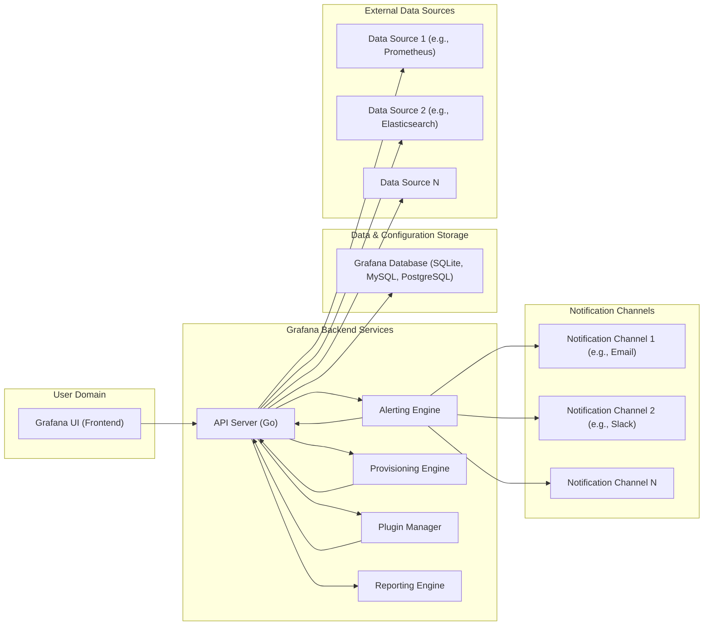

# Grafana Project Design Document for Threat Modeling

**Version:** 1.1
**Date:** 2023-10-27
**Author:** AI Software Architecture Expert

## 1. Project Overview

### 1.1. Project Name

Grafana

### 1.2. Project Description

Grafana is a versatile open-source platform designed for monitoring and observability. It empowers users to query, visualize, alert on, and explore metrics, logs, and traces from diverse data sources, regardless of their location. By providing a unified view across disparate data sources, Grafana facilitates effective system understanding, performance analysis, and rapid troubleshooting.

### 1.3. Project Goals

*   **Core Functionality:** Deliver a robust and adaptable data visualization and exploration platform.
*   **Data Source Agnostic:** Support a broad spectrum of data sources, encompassing time-series databases, logging systems, cloud monitoring services, and more.
*   **Actionable Insights:** Enable users to construct interactive dashboards and configure alerts for proactive system health and performance monitoring.
*   **Extensibility:** Offer a plugin architecture to extend functionality with new data sources, visualization panels, and specialized applications.
*   **Security & Reliability:** Maintain a secure, stable, and reliable platform suitable for mission-critical monitoring infrastructure.

### 1.4. Target Audience

*   DevOps Engineers and SREs
*   System Administrators
*   Software Developers
*   Security Engineers and Security Operations
*   Business Analysts and Data Scientists

## 2. System Architecture

### 2.1. High-Level Architecture Diagram



### 2.2. Component Description

#### 2.2.1. Grafana UI (Frontend)

*   **Description:** A sophisticated single-page application built using React and TypeScript, serving as the primary user interface for Grafana. It facilitates user interaction with all Grafana features.
*   **Functionality:**
    *   **Dashboard Management:** Creation, editing, viewing, and sharing of interactive dashboards.
    *   **Visualization Rendering:** Displaying data through various visualizations (graphs, charts, tables, gauges, etc.).
    *   **Querying & Exploration:** Building and executing queries against configured data sources using Grafana's query language or data source-specific languages.
    *   **User & Session Management:** Handling user authentication, authorization, and session persistence.
    *   **Configuration Interface:** Providing access to Grafana settings, user preferences, and system configurations.
    *   **Plugin Interface:** Managing and configuring installed plugins.
*   **Technology Stack:** React, TypeScript, JavaScript, HTML, CSS, leveraging browser APIs and communication over HTTP/HTTPS.
*   **Security Considerations:**
    *   **Cross-Site Scripting (XSS):** Vulnerable to XSS attacks if user-supplied data is not properly sanitized before rendering in the UI.
    *   **Client-Side Input Validation:** Limited client-side validation; server-side validation is paramount.
    *   **Session Security:** Secure management of user sessions using cookies or tokens, protection against session hijacking.
    *   **Clickjacking:** Potential vulnerability if not properly mitigated with frame protection mechanisms.
    *   **Dependency Vulnerabilities:** Risk of vulnerabilities in frontend JavaScript libraries and frameworks.

#### 2.2.2. API Server (Backend)

*   **Description:** The core backend component of Grafana, implemented in Go. It acts as the central control point, handling API requests from the frontend, managing data source connections, executing queries, enforcing security policies, and orchestrating other backend services.
*   **Functionality:**
    *   **REST API Gateway:** Exposing a comprehensive REST API for all frontend interactions and external integrations.
    *   **Authentication & Authorization:** Implementing user authentication and role-based access control (RBAC) to secure access to Grafana resources and APIs.
    *   **Data Source Proxying:** Securely proxying requests to configured data sources, abstracting data source specifics from the frontend.
    *   **Query Execution & Transformation:** Executing queries against data sources, transforming and aggregating data as needed.
    *   **Dashboard & Alert Management:** Managing dashboards, alert rules, and related configurations.
    *   **Plugin Management & Execution (Backend Plugins):** Loading, managing, and executing backend plugins.
    *   **Provisioning Management:** Handling configuration as code through the provisioning engine.
    *   **Reporting Orchestration:** Triggering and managing report generation.
    *   **Background Task Management:** Handling asynchronous tasks and scheduled operations.
*   **Technology Stack:** Go, utilizing various Go libraries for web frameworks, database interaction, data source clients, and security functionalities.
*   **Security Considerations:**
    *   **Injection Attacks:** Susceptible to SQL injection (if direct SQL queries are used, though ORM usage mitigates this), command injection, and other injection vulnerabilities if input validation is insufficient.
    *   **Authentication & Authorization Bypass:** Risk of vulnerabilities leading to authentication bypass or authorization flaws, granting unauthorized access.
    *   **Remote Code Execution (RCE):** Potential for RCE vulnerabilities, especially in plugin execution or through insecure dependencies.
    *   **API Security:** Vulnerabilities related to API design, rate limiting, input validation, output encoding, and secure API key management.
    *   **Data Source Credential Management:** Secure storage and retrieval of data source credentials, preventing exposure.
    *   **Cross-Site Request Forgery (CSRF):** Vulnerable to CSRF attacks if proper CSRF protection mechanisms are not in place.
    *   **Secure Logging & Auditing:** Importance of comprehensive and secure logging and auditing of security-relevant events.
    *   **Dependency Vulnerabilities:** Risk of vulnerabilities in Go libraries and dependencies used in the backend.

#### 2.2.3. Alerting Engine

*   **Description:** A critical backend service responsible for evaluating alert rules defined by users against data retrieved from data sources. When alert conditions are met, it triggers notifications through configured notification channels.
*   **Functionality:**
    *   **Alert Rule Scheduling & Evaluation:** Periodically scheduling and executing alert rule evaluations.
    *   **Data Source Querying for Alerts:** Querying data sources to retrieve data necessary for evaluating alert conditions.
    *   **Alert State Management:** Maintaining the state of alerts (firing, resolved, pending) and alert history.
    *   **Notification Routing & Delivery:** Routing alert notifications to configured notification channels (email, Slack, PagerDuty, webhooks, etc.).
    *   **Alert Rule Configuration & Management:** Providing APIs for managing alert rules, notification policies, and silences.
*   **Technology Stack:** Go, tightly integrated within the backend API server, leveraging scheduling libraries and notification channel client libraries.
*   **Security Considerations:**
    *   **Alert Rule Manipulation & Injection:** Risk of malicious users manipulating alert rules to cause false alarms, suppress real alerts, or inject malicious payloads into notifications.
    *   **Notification Channel Security:** Security of notification channels, ensuring secure webhook endpoints, authentication for notification services, and protection against unauthorized access to notification configurations.
    *   **Alert Notification Spoofing:** Potential for attackers to spoof alert notifications, leading to confusion or malicious actions.
    *   **Denial of Service (DoS) through Excessive Alerting:** Risk of DoS attacks by triggering a large volume of alerts, overwhelming the system or notification channels.
    *   **Data Exfiltration through Alert Notifications:** Potential for data exfiltration if sensitive data is inadvertently included in alert notifications.

#### 2.2.4. Provisioning Engine

*   **Description:** Enables "Configuration as Code" for Grafana. It reads configuration files (YAML, JSON) from local disk or remote sources (Git, etc.) and automatically configures Grafana entities like dashboards, data sources, alerts, and organizations.
*   **Functionality:**
    *   **Configuration File Parsing & Validation:** Reading and parsing configuration files in supported formats (YAML, JSON).
    *   **Grafana Entity Creation & Update:** Creating, updating, and deleting Grafana entities (dashboards, data sources, alerts, users, organizations, folders, etc.) based on configuration.
    *   **Configuration Versioning & Management:** Potentially supporting configuration versioning and change management.
    *   **Configuration Source Integration:** Integrating with various configuration sources (local files, Git repositories, HTTP endpoints).
*   **Technology Stack:** Go, integrated within the backend API server, utilizing YAML/JSON parsing libraries and Grafana's internal API for configuration management.
*   **Security Considerations:**
    *   **Access Control to Provisioning Configuration Files:** Critical to control access to provisioning configuration files, as they can define the entire Grafana setup. Unauthorized access could lead to malicious configuration changes.
    *   **Secure Storage & Retrieval of Provisioning Configurations:** Securely storing and retrieving provisioning configurations, especially if they contain sensitive information (e.g., data source credentials).
    *   **Misconfiguration Leading to Security Vulnerabilities:** Potential for misconfigurations in provisioning files to introduce security vulnerabilities (e.g., overly permissive access controls, insecure data source configurations).
    *   **Injection Vulnerabilities in Configuration Parsing:** Risk of injection vulnerabilities if configuration parsing is not robust and secure, especially when handling external configuration sources.
    *   **Configuration Drift & Synchronization Issues:** Potential security implications if provisioning configurations drift out of sync with the actual Grafana state.

#### 2.2.5. Plugin Manager

*   **Description:** Manages the lifecycle of Grafana plugins, which extend Grafana's capabilities. Plugins can be for data sources, panels (visualizations), and applications.
*   **Functionality:**
    *   **Plugin Installation & Uninstallation:** Installing plugins from the Grafana plugin repository or local files, and uninstalling plugins.
    *   **Plugin Updates & Management:** Managing plugin updates and listing installed plugins.
    *   **Plugin Discovery & Repository Interaction:** Discovering plugins in the Grafana plugin repository and interacting with the repository API.
    *   **Plugin Loading & Execution:** Loading and executing plugin code (both frontend and backend components of plugins).
    *   **Plugin Configuration Management:** Managing plugin-specific configurations.
*   **Technology Stack:** Go (backend plugin management), JavaScript (frontend plugins), Go (backend plugins), plugin distribution via HTTP/HTTPS.
*   **Security Considerations:**
    *   **Plugin Vulnerabilities:** Plugins, especially those from untrusted sources, can contain vulnerabilities (both frontend and backend) that can compromise Grafana or the underlying system.
    *   **Untrusted Plugins from External Sources:** High risk associated with installing plugins from untrusted or unverified sources.
    *   **Code Injection through Malicious Plugins:** Malicious plugins can inject arbitrary code into Grafana, potentially leading to RCE, data theft, or other malicious activities.
    *   **Access Control for Plugin Installation & Management:** Restricting plugin installation and management to authorized users only.
    *   **Plugin Isolation & Sandboxing (Limited):** Current Grafana architecture has limited plugin isolation or sandboxing, meaning a compromised plugin can potentially impact the entire Grafana instance.
    *   **Supply Chain Security of Plugins:** Ensuring the integrity and security of the plugin supply chain, from plugin development to distribution and installation.

#### 2.2.6. Reporting Engine

*   **Description:**  Generates reports from dashboards, allowing users to schedule and distribute dashboard snapshots as PDFs or other formats.
*   **Functionality:**
    *   **Report Scheduling:** Allowing users to schedule reports to be generated at specific intervals.
    *   **Dashboard Snapshotting:** Capturing dashboard snapshots for report generation.
    *   **Report Generation (PDF, etc.):** Generating reports in various formats (primarily PDF).
    *   **Report Delivery (Email, etc.):** Delivering generated reports via email or other configured channels.
    *   **Report Management:** Managing report schedules and history.
*   **Technology Stack:** Go (backend), potentially leveraging headless browser technology for rendering dashboards to PDF.
*   **Security Considerations:**
    *   **Data Exposure in Reports:** Risk of unintentionally exposing sensitive data in generated reports if dashboards are not properly designed or access controls are not correctly configured.
    *   **Unauthorized Report Access:** Ensuring that reports are only accessible to authorized users, especially if reports are stored or delivered insecurely.
    *   **Report Generation Vulnerabilities:** Potential vulnerabilities in the report generation process itself, especially if external libraries or services are used.
    *   **Spoofing of Report Delivery:** Risk of attackers spoofing report delivery emails or channels.
    *   **Denial of Service through Report Generation:** Potential for DoS attacks by triggering a large number of report generation requests.

#### 2.2.7. Grafana Database

*   **Description:**  Persistent storage for Grafana's configuration data, including dashboards, users, organizations, data sources, alerts, plugins, and settings. Supports SQLite (default for smaller setups), MySQL, and PostgreSQL for larger, production deployments.
*   **Functionality:**
    *   **Configuration Data Persistence:** Storing all Grafana configuration and metadata persistently.
    *   **Data Retrieval & Querying (Internal):** Providing data retrieval and querying capabilities for Grafana's internal operations.
    *   **Transaction Management & Data Integrity:** Ensuring data integrity and consistency through transaction management.
    *   **User & Access Control Data Storage:** Storing user accounts, roles, permissions, and access control policies.
*   **Technology Stack:** SQLite (default), MySQL, PostgreSQL, accessed via Go database drivers and potentially an ORM (Object-Relational Mapper).
*   **Security Considerations:**
    *   **Database Security:** Standard database security best practices apply: access control, strong authentication, encryption at rest and in transit, regular security patching.
    *   **SQL Injection Vulnerabilities:** While ORMs are used to mitigate SQL injection, there's still a potential risk if raw SQL queries are used or ORM usage is flawed.
    *   **Data Breach & Data Leakage:** Risk of data breaches if the database is compromised, potentially exposing sensitive configuration data, user credentials (if not properly hashed and salted), and potentially sensitive data source connection details.
    *   **Unauthorized Access to Database:** Preventing unauthorized access to the database server and database files.
    *   **Database Backup & Restore:** Implementing robust database backup and restore procedures to ensure data availability and recoverability in case of failures or attacks.

#### 2.2.8. Data Sources

*   **Description:** External systems that Grafana connects to for retrieving monitoring data. Grafana supports a wide range of data sources through plugins.
*   **Functionality:**
    *   **Data Source Connection:** Establishing connections to various data sources using specific protocols and APIs (e.g., HTTP, database drivers, cloud provider SDKs).
    *   **Query Execution (Data Source Specific):** Executing queries in the data source's native query language or API.
    *   **Data Retrieval & Transformation (Minimal):** Retrieving data from data sources and performing minimal transformation to format it for Grafana.
    *   **Credential Management (Data Source Specific):** Managing credentials required to connect to data sources.
*   **Technology Stack:** Varies greatly depending on the data source. Includes HTTP clients, database drivers, cloud provider SDKs, and data source-specific client libraries.
*   **Security Considerations:**
    *   **Data Source Credential Management & Secure Storage:** Securely storing and managing data source credentials, preventing exposure.
    *   **Secure Communication Channels to Data Sources:** Ensuring secure communication channels (HTTPS, TLS, SSH tunnels) when connecting to data sources, especially over untrusted networks.
    *   **Data Source Access Control & Permissions (External):** Relying on the data source's own access control mechanisms to restrict access to data based on user permissions. Grafana typically proxies user identity or uses service accounts.
    *   **Vulnerabilities in Data Source Client Libraries & Protocols:** Risk of vulnerabilities in data source client libraries or communication protocols used by Grafana.
    *   **Data Leakage through Insecure Data Source Configurations:** Potential for data leakage if data sources are misconfigured or have weak security settings.
    *   **Injection Attacks via Data Source Queries:** Risk of injection attacks if Grafana constructs data source queries based on user input without proper sanitization and validation.

#### 2.2.9. Notification Channels

*   **Description:** External services or systems used to deliver alert notifications triggered by the Alerting Engine.
*   **Functionality:**
    *   **Notification Delivery:** Sending alert notifications to various channels (email, Slack, PagerDuty, SMS, webhooks, etc.).
    *   **Channel Configuration Management:** Managing configuration for different notification channels (API keys, webhook URLs, email server settings, etc.).
    *   **Notification Formatting & Templating:** Formatting alert notifications for specific channels and potentially using templating to customize notification content.
*   **Technology Stack:** Varies depending on the notification channel. Typically involves HTTP clients for webhooks and API integrations, SMTP clients for email, and specific SDKs for other services.
*   **Security Considerations:**
    *   **Notification Channel Credential Management & Secure Storage:** Securely storing and managing credentials for notification channels (API keys, tokens, etc.).
    *   **Secure Communication Channels to Notification Services:** Ensuring secure communication channels (HTTPS, TLS) when sending notifications to external services.
    *   **Unauthorized Access to Notification Channel Configurations:** Preventing unauthorized access to notification channel configurations, which could allow attackers to redirect or intercept notifications.
    *   **Data Leakage through Notification Channels:** Risk of data leakage if sensitive data is inadvertently included in alert notifications sent through insecure channels.
    *   **Webhook Security:** If using webhooks, ensuring webhook endpoints are properly secured and authenticated to prevent unauthorized access or manipulation.

## 3. Data Flow Diagram

```mermaid
graph LR
    subgraph "User Interaction"
        U["User (Browser)"]
    end
    subgraph "Grafana System"
        FE["Frontend (UI)"]
        BE["Backend (API Server)"]
        DS["Data Sources"]
        DB["Grafana Database"]
        AL["Alerting Engine"]
        RE["Reporting Engine"]
        PM["Plugin Manager"]
        PE["Provisioning Engine"]
    end
    subgraph "External Systems"
        EXDS["External Data Sources"]
        NC["Notification Channels"]
    end

    U --> FE{{"API Request"}}
    FE --> BE{{"API Request"}}
    BE --> DB{{"Data Read/Write (Config)"}}
    BE --> EXDS{{"Query Data"}}
    EXDS --> BE{{"Data Response"}}
    BE --> FE{{"API Response"}}
    FE --> U{{"UI Update"}}

    BE --> AL{{"Alert Rule Evaluation"}}
    AL --> EXDS{{"Query Data for Alerting"}}
    EXDS --> AL{{"Data Response"}}
    AL --> BE{{"Alert Notification"}}
    BE --> NC{{"Send Notification"}}

    BE --> RE{{"Report Generation Request"}}
    RE --> BE{{"Request Dashboard Data"}}
    BE --> EXDS{{"Query Data for Report"}}
    EXDS --> BE{{"Data Response"}}
    BE --> RE{{"Data for Report"}}
    RE --> DB{{"Store Report Metadata"}}
    RE --> NC{{"Deliver Report"}}

    BE --> PM{{"Plugin Management Request"}}
    PM --> DB{{"Plugin Data Read/Write"}}
    PM --> External_Plugin_Repo["External Plugin Repository"]{{"Plugin Download"}}

    BE --> PE{{"Provisioning Request"}}
    PE --> Config_Source["Configuration Source (e.g., File, Git)"]{{"Read Configuration"}}
    PE --> DB{{"Config Data Write"}}


    style U fill:#f9f,stroke:#333,stroke-width:2px
    style FE fill:#ccf,stroke:#333,stroke-width:2px
    style BE fill:#cff,stroke:#333,stroke-width:2px
    style EXDS fill:#cfc,stroke:#333,stroke-width:2px
    style DB fill:#fcc,stroke:#333,stroke-width:2px
    style AL fill:#ffc,stroke:#333,stroke-width:2px
    style RE fill:#eee,stroke:#333,stroke-width:2px
    style PM fill:#eee,stroke:#333,stroke-width:2px
    style PE fill:#eee,stroke:#333,stroke-width:2px
    style NC fill:#eee,stroke:#333,stroke-width:2px
    style External_Plugin_Repo fill:#eee,stroke:#333,stroke-width:2px
    style Config_Source fill:#eee,stroke:#333,stroke-width:2px
```

## 4. Deployment Architecture

*(No changes from previous version, deployment architectures remain relevant)*

Grafana can be deployed in various architectures depending on the scale and requirements. Common deployment scenarios include:

### 4.1. Single Instance Deployment

*   **Description:** All Grafana components (Frontend, Backend, Database) are deployed on a single server.
*   **Use Case:** Small deployments, development environments, personal use.
*   **Advantages:** Simple to set up and manage.
*   **Disadvantages:** Single point of failure, limited scalability.

### 4.2. High Availability (HA) Deployment

*   **Description:** Multiple Grafana backend instances are deployed behind a load balancer, sharing a common database (e.g., MySQL, PostgreSQL). The frontend can be served by the load balancer or directly by each backend instance.
*   **Use Case:** Production environments, critical monitoring infrastructure, large-scale deployments.
*   **Advantages:** High availability, scalability, improved performance.
*   **Disadvantages:** More complex to set up and manage, requires a shared database.

### 4.3. Cloud-Native Deployment (Kubernetes)

*   **Description:** Grafana is deployed as a containerized application in a Kubernetes cluster. Kubernetes manages scaling, deployment, and orchestration of Grafana instances.
*   **Use Case:** Cloud environments, large-scale deployments, automated infrastructure management.
*   **Advantages:** Scalability, resilience, automated management, integration with cloud infrastructure.
*   **Disadvantages:** Requires Kubernetes expertise, increased complexity.

## 5. Security Considerations

*(No changes from previous version, general security principles and specific measures remain relevant)*

### 5.1. General Security Principles

*   **Principle of Least Privilege:** Grant users and components only the necessary permissions to perform their tasks.
*   **Input Validation and Output Encoding:** Validate all user inputs and encode outputs to prevent injection attacks.
*   **Secure Configuration Management:** Securely store and manage configuration files and secrets.
*   **Regular Security Updates:** Keep Grafana and its dependencies up-to-date with the latest security patches.
*   **Secure Communication:** Use HTTPS for all communication between the frontend, backend, and data sources.
*   **Authentication and Authorization:** Implement strong authentication and authorization mechanisms to control access to Grafana resources.
*   **Security Auditing and Logging:** Log security-relevant events and regularly audit security configurations.

### 5.2. Specific Security Measures in Grafana

*   **Authentication:** Supports various authentication methods including built-in user/password, OAuth 2.0, LDAP, SAML, and more.
*   **Authorization:** Role-based access control (RBAC) to manage user permissions at organization, folder, and dashboard levels.
*   **Data Source Proxy:** Grafana backend acts as a proxy for data source queries, preventing direct frontend access to data sources and enabling credential management in the backend.
*   **HTTPS Enforcement:** Configuration options to enforce HTTPS for all communication.
*   **Content Security Policy (CSP):** Implemented to mitigate XSS attacks.
*   **CSRF Protection:** Implemented to protect against Cross-Site Request Forgery attacks.
*   **Security Headers:** Grafana sets various security headers (e.g., X-Frame-Options, X-Content-Type-Options) to enhance security.

## 6. Threat Modeling Focus Areas

*(Improved and more specific focus areas)*

Based on the architecture, component descriptions, and security considerations, the following areas are prioritized for threat modeling. These are categorized by component and attack vector for a more structured approach:

**6.1. API Server (Backend) Threats:**

*   **Authentication & Authorization Flaws:**
    *   Bypass authentication mechanisms to gain unauthorized access.
    *   Exploit authorization vulnerabilities to escalate privileges or access resources beyond permitted scope.
    *   Session hijacking or fixation attacks to impersonate legitimate users.
*   **Injection Vulnerabilities:**
    *   SQL Injection: Exploit vulnerabilities in database queries to read, modify, or delete data.
    *   Command Injection: Execute arbitrary commands on the server through vulnerable API endpoints.
    *   LDAP Injection (if LDAP authentication is used): Manipulate LDAP queries to bypass authentication or retrieve sensitive information.
    *   NoSQL Injection (if NoSQL databases are used as data sources): Exploit vulnerabilities in NoSQL queries.
*   **API Abuse & DoS:**
    *   API Rate Limiting Bypass: Circumvent rate limiting mechanisms to overload the API.
    *   Denial of Service (DoS) attacks by flooding API endpoints with requests.
    *   Resource exhaustion attacks targeting backend services.
*   **Data Exposure & Leakage:**
    *   Expose sensitive data in API responses due to insufficient output encoding or access control.
    *   Leak data through error messages or verbose logging.
*   **Dependency Vulnerabilities:**
    *   Exploit known vulnerabilities in Go libraries and dependencies used by the backend.

**6.2. Data Source Security Threats:**

*   **Credential Compromise:**
    *   Steal or expose data source credentials stored by Grafana.
    *   Gain unauthorized access to data sources using compromised credentials.
*   **Data Source Injection:**
    *   Exploit vulnerabilities in data source query construction to inject malicious queries.
    *   Manipulate data retrieved from data sources through injection attacks.
*   **Insecure Communication:**
    *   Man-in-the-middle (MitM) attacks on connections to data sources if communication is not properly encrypted (HTTPS/TLS).
    *   Data leakage due to unencrypted communication channels.
*   **Data Source Access Control Bypass (External):**
    *   Exploit vulnerabilities in data source's own access control mechanisms (though Grafana's responsibility is limited here, understanding the interaction is important).

**6.3. Plugin Security Threats:**

*   **Malicious Plugins:**
    *   Install and execute malicious plugins that contain backdoors, malware, or data theft capabilities.
    *   Compromise Grafana instance or data sources through malicious plugin code.
*   **Plugin Vulnerabilities:**
    *   Exploit vulnerabilities in plugins (both frontend and backend) to gain unauthorized access or execute arbitrary code.
    *   Cross-Site Scripting (XSS) vulnerabilities in panel plugins.
    *   Backend plugin vulnerabilities leading to RCE.
*   **Supply Chain Attacks:**
    *   Compromised plugin repository or distribution channels leading to the distribution of malicious plugins.

**6.4. Alerting Engine Security Threats:**

*   **Alert Rule Manipulation:**
    *   Manipulate alert rules to disable critical alerts, create false positives, or inject malicious content into notifications.
*   **Notification Spoofing & Tampering:**
    *   Spoof alert notifications to mislead users or trigger malicious actions.
    *   Tamper with alert notifications to inject malicious links or content.
*   **Notification Channel Security Weaknesses:**
    *   Exploit vulnerabilities in notification channels (e.g., insecure webhook endpoints) to intercept or manipulate notifications.
    *   Credential theft for notification channels.
*   **DoS through Alerting:**
    *   Trigger a large volume of alerts to cause a Denial of Service (DoS) on Grafana or notification channels.

**6.5. Frontend (UI) Security Threats:**

*   **Cross-Site Scripting (XSS):**
    *   Stored XSS vulnerabilities in dashboards or visualizations, allowing execution of malicious JavaScript in user browsers.
    *   Reflected XSS vulnerabilities through manipulated URLs or user input.
*   **Clickjacking:**
    *   Embed Grafana UI in a malicious frame to trick users into performing unintended actions.
*   **Client-Side Data Leakage:**
    *   Leak sensitive data through client-side JavaScript code or browser storage.
*   **Dependency Vulnerabilities:**
    *   Exploit known vulnerabilities in frontend JavaScript libraries and frameworks.

**6.6. Reporting Engine Security Threats:**

*   **Data Exposure in Reports:**
    *   Unintentionally expose sensitive data in generated reports due to misconfigured dashboards or access controls.
*   **Unauthorized Report Access:**
    *   Gain unauthorized access to generated reports if stored or delivered insecurely.
*   **Report Spoofing & Tampering:**
    *   Spoof report delivery emails or channels.
    *   Tamper with report content to mislead users.

**6.7. Provisioning Engine Security Threats:**

*   **Configuration File Manipulation:**
    *   Gain unauthorized access to provisioning configuration files and modify them to introduce malicious configurations.
    *   Inject malicious code or configurations through provisioning files.
*   **Configuration Source Compromise:**
    *   Compromise configuration sources (e.g., Git repositories) to inject malicious configurations into Grafana.
*   **Misconfiguration through Provisioning:**
    *   Introduce security vulnerabilities through misconfigurations applied via provisioning.

**6.8. Grafana Database Security Threats:**

*   **Unauthorized Database Access:**
    *   Gain unauthorized access to the Grafana database server or database files.
*   **SQL Injection (Database Layer):**
    *   Exploit SQL injection vulnerabilities in database queries (though mitigated by ORM, still a potential risk).
*   **Data Breach & Data Leakage (Database):**
    *   Breach the database to steal sensitive configuration data, user credentials, or data source connection details.
*   **Database Integrity & Availability Attacks:**
    *   Compromise database integrity by modifying data.
    *   Launch Denial of Service (DoS) attacks against the database to disrupt Grafana availability.

This refined list of threat modeling focus areas provides a more detailed and actionable guide for security assessments and threat modeling exercises for the Grafana project. It is recommended to use frameworks like STRIDE or PASTA in conjunction with this document to systematically identify, classify, and mitigate potential threats.