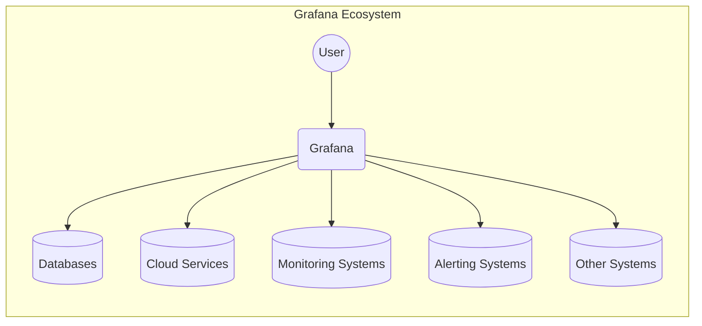
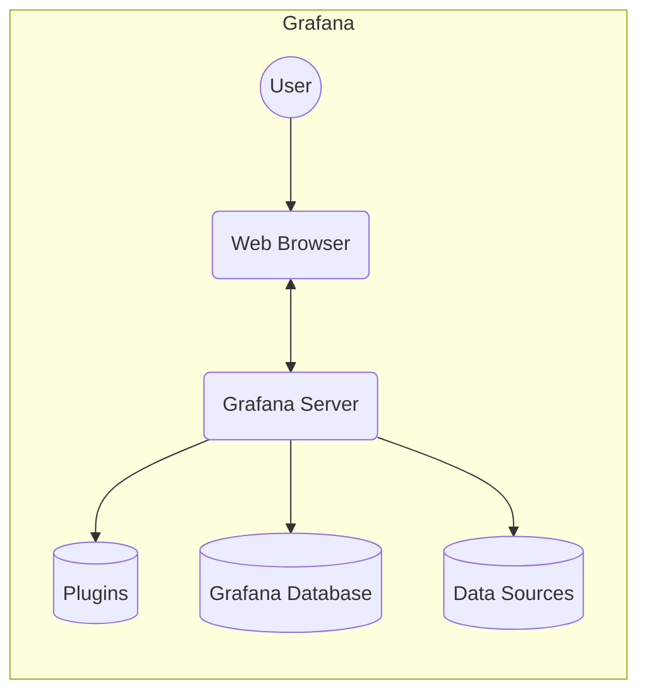
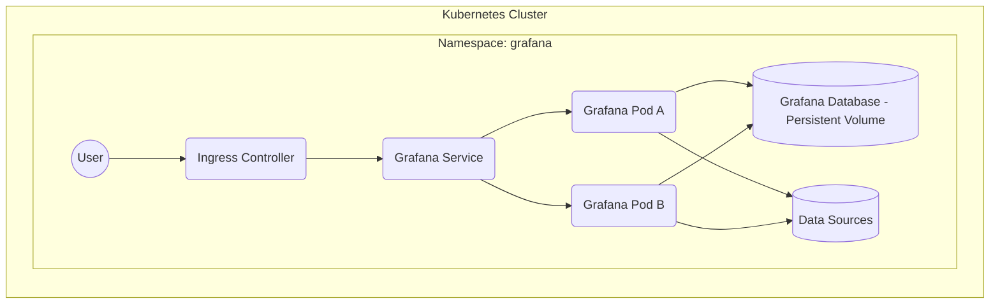
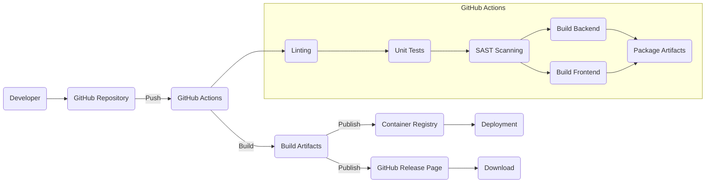

Okay, let's create a design document for the Grafana project, focusing on aspects relevant for threat modeling.

# BUSINESS POSTURE

Grafana is a widely used open-source analytics and monitoring platform.  It allows users to visualize and analyze data from various sources.  Given its role in visualizing sensitive operational and potentially business data, the primary business concerns revolve around data integrity, availability, and confidentiality.  Since it's open source and widely adopted, its reputation and community trust are also critical assets.

Business Priorities:

*   Provide a stable and reliable platform for data visualization and analysis.
*   Maintain user trust in the accuracy and integrity of displayed data.
*   Enable broad compatibility with various data sources and deployment environments.
*   Foster a vibrant open-source community and ecosystem.
*   Ensure the platform can scale to handle large datasets and high user loads.
*   Provide features for user and access management.

Business Goals:

*   Become/maintain the leading open-source platform for observability and data visualization.
*   Attract and retain a large and active user base.
*   Continuously improve the platform's features, performance, and security.
*   Offer enterprise-grade features and support for commercial users.

Most Important Business Risks:

*   Data breaches or unauthorized access to sensitive data visualized through Grafana.
*   Data manipulation or corruption leading to incorrect visualizations and decisions.
*   Service disruptions or performance degradation impacting users' ability to monitor their systems.
*   Reputational damage due to security vulnerabilities or mishandling of user data.
*   Loss of community trust and contributions due to perceived lack of security or stability.
*   Vulnerabilities that allow attackers to use Grafana to attack connected data sources.

# SECURITY POSTURE

Grafana has implemented various security controls and addresses several security aspects.  However, being a complex platform with numerous integrations, it also has a significant attack surface.

Existing Security Controls:

*   security control: Authentication mechanisms: Support for various authentication methods, including username/password, OAuth (GitHub, GitLab, Google, Azure AD, Okta), LDAP, and API keys. (Documented in Grafana's authentication documentation).
*   security control: Authorization: Role-Based Access Control (RBAC) to manage user permissions and restrict access to dashboards, data sources, and features. (Documented in Grafana's user management and permissions documentation).
*   security control: Data source proxy: Grafana acts as a proxy for data sources, which can help protect backend systems from direct exposure. (Documented in Grafana's data source configuration).
*   security control: Alerting: Secure alerting mechanisms with notifications through various channels (e.g., email, Slack, PagerDuty). (Documented in Grafana's alerting documentation).
*   security control: Security Hardening guidelines: Grafana provides documentation and recommendations for secure deployment and configuration. (Documented in Grafana's security documentation).
*   security control: Regular security audits and penetration testing: Grafana Labs conducts regular security assessments. (Mentioned in Grafana's security announcements and blog posts).
*   security control: Active community and vulnerability disclosure program: Grafana has a process for reporting and addressing security vulnerabilities. (Documented in Grafana's security policy).
*   security control: Data encryption in transit: Support for HTTPS to encrypt communication between the browser and the Grafana server, and between Grafana and data sources. (Configurable in Grafana's settings).
*   security control: Input validation: Some level of input validation is performed to prevent common web vulnerabilities like XSS and SQL injection. (Implemented in the Grafana codebase).
*   security control: CSRF protection: Grafana includes protection against Cross-Site Request Forgery attacks. (Implemented in the Grafana codebase).

Accepted Risks:

*   accepted risk: Reliance on third-party data source security: Grafana's security is partially dependent on the security of the configured data sources.
*   accepted risk: Potential for misconfiguration:  The flexibility of Grafana's configuration can lead to insecure setups if not properly managed.
*   accepted risk: Plugin security: Third-party plugins may introduce vulnerabilities.
*   accepted risk: Complexity of access control: Managing fine-grained permissions can be complex, potentially leading to overly permissive configurations.

Recommended Security Controls (High Priority):

*   Implement comprehensive audit logging of all user actions and configuration changes.
*   Provide stronger session management controls, including session timeout and concurrent session limits.
*   Offer more granular control over data source access, including per-user or per-role data source permissions.
*   Implement a robust content security policy (CSP) to mitigate XSS vulnerabilities.
*   Provide built-in support for data encryption at rest (for Grafana's internal database).
*   Enhance input validation and sanitization across all user-facing components.
*   Implement a formal secure software development lifecycle (SSDLC) with integrated security testing (SAST, DAST, IAST).

Security Requirements:

*   Authentication:
    *   Support for multi-factor authentication (MFA).
    *   Strong password policies and enforcement.
    *   Secure storage of user credentials (e.g., hashing and salting).
    *   Integration with existing identity providers (e.g., SAML, OpenID Connect).

*   Authorization:
    *   Fine-grained access control based on roles and permissions.
    *   Ability to restrict access to specific dashboards, data sources, and features.
    *   Regular review and auditing of user permissions.

*   Input Validation:
    *   Strict validation of all user inputs to prevent XSS, SQL injection, and other injection attacks.
    *   Use of output encoding to prevent stored XSS.
    *   Validation of data source queries to prevent unauthorized data access.

*   Cryptography:
    *   Use of strong, industry-standard cryptographic algorithms and protocols.
    *   Secure key management practices.
    *   Encryption of sensitive data in transit and at rest.
    *   Regular review and updates of cryptographic libraries.

# DESIGN

## C4 CONTEXT

Element Descriptions:

*   Element:
    *   Name: User
    *   Type: Person
    *   Description: A person who interacts with Grafana to visualize and analyze data.
    *   Responsibilities: View dashboards, create and edit dashboards, configure data sources, manage users, set up alerts.
    *   Security controls: Authentication (MFA, strong passwords), Authorization (RBAC), Session Management.

*   Element:
    *   Name: Grafana
    *   Type: Software System
    *   Description: The Grafana platform itself.
    *   Responsibilities: Data visualization, data source proxying, user management, alerting, dashboard management.
    *   Security controls: Authentication, Authorization, Input Validation, Data Encryption, CSRF Protection, Security Hardening.

*   Element:
    *   Name: Databases
    *   Type: Software System
    *   Description: Various databases used as data sources (e.g., Prometheus, InfluxDB, MySQL, PostgreSQL).
    *   Responsibilities: Store and provide data to Grafana.
    *   Security controls: Database-specific security controls (authentication, authorization, encryption, access controls).

*   Element:
    *   Name: Cloud Services
    *   Type: Software System
    *   Description: Cloud-based data sources and services (e.g., AWS CloudWatch, Azure Monitor, Google Cloud Monitoring).
    *   Responsibilities: Provide monitoring data and services to Grafana.
    *   Security controls: Cloud provider's security controls (IAM, encryption, network security).

*   Element:
    *   Name: Monitoring Systems
    *   Type: Software System
    *   Description: Systems that collect and provide monitoring data (e.g., Prometheus, Graphite, Datadog).
    *   Responsibilities: Collect and aggregate metrics, logs, and traces.
    *   Security controls: System-specific security controls (authentication, authorization, encryption).

*   Element:
    *   Name: Alerting Systems
    *   Type: Software System
    *   Description: Systems used for sending alerts (e.g., email servers, Slack, PagerDuty).
    *   Responsibilities: Deliver alerts triggered by Grafana.
    *   Security controls: System-specific security controls (authentication, authorization, encryption).

*   Element:
    *   Name: Other Systems
    *   Type: Software System
    *   Description: Any other systems that Grafana interacts with (e.g., custom APIs, external data sources).
    *   Responsibilities: Varies depending on the specific system.
    *   Security controls: System-specific security controls.

## C4 CONTAINER

Element Descriptions:

*   Element:
    *   Name: User
    *   Type: Person
    *   Description: A person who interacts with Grafana to visualize and analyze data.
    *   Responsibilities: View dashboards, create and edit dashboards, configure data sources, manage users, set up alerts.
    *   Security controls: Authentication (MFA, strong passwords), Authorization (RBAC), Session Management.

*   Element:
    *   Name: Web Browser
    *   Type: Container
    *   Description: The user's web browser used to access the Grafana UI.
    *   Responsibilities: Render the Grafana UI, handle user interactions, communicate with the Grafana Server.
    *   Security controls: Browser security settings, HTTPS, CSP.

*   Element:
    *   Name: Grafana Server
    *   Type: Container
    *   Description: The main Grafana server application.
    *   Responsibilities: Handle user requests, authenticate users, authorize access, query data sources, render dashboards, manage alerts.
    *   Security controls: Authentication, Authorization, Input Validation, Data Encryption, CSRF Protection, Session Management.

*   Element:
    *   Name: Plugins
    *   Type: Container
    *   Description: Grafana plugins that extend functionality (e.g., data source plugins, panel plugins, app plugins).
    *   Responsibilities: Provide additional data sources, visualizations, and features.
    *   Security controls: Plugin-specific security controls, sandboxing (if implemented).

*   Element:
    *   Name: Grafana Database
    *   Type: Container
    *   Description: The database used by Grafana to store its configuration, user data, and dashboard definitions.
    *   Responsibilities: Store and retrieve Grafana's internal data.
    *   Security controls: Database security controls (authentication, authorization, encryption, access controls).

*   Element:
    *   Name: Data Sources
    *   Type: Container
    *   Description: External data sources that Grafana connects to (e.g., Prometheus, InfluxDB, MySQL, PostgreSQL, cloud services).
    *   Responsibilities: Store and provide data to Grafana.
    *   Security controls: Data source-specific security controls (authentication, authorization, encryption, access controls).

## DEPLOYMENT

Grafana can be deployed in various ways, including:

1.  Standalone binary: Running the Grafana server as a standalone executable.
2.  Docker container: Running Grafana within a Docker container.
3.  Kubernetes: Deploying Grafana to a Kubernetes cluster using Helm charts or other deployment methods.
4.  Cloud-managed services: Using cloud-provided Grafana instances (e.g., Amazon Managed Grafana, Azure Managed Grafana).

We'll describe the Kubernetes deployment in detail, as it's a common and complex scenario.

Element Descriptions:

*   Element:
    *   Name: User
    *   Type: Person
    *   Description: A person who interacts with Grafana.
    *   Responsibilities: Access Grafana through a web browser.
    *   Security controls: Authentication (MFA, strong passwords), Authorization (RBAC), Session Management.

*   Element:
    *   Name: Ingress Controller
    *   Type: Node
    *   Description: A Kubernetes Ingress controller that manages external access to the Grafana service.
    *   Responsibilities: Route traffic to the Grafana service, handle TLS termination.
    *   Security controls: TLS configuration, access controls, rate limiting.

*   Element:
    *   Name: Grafana Service
    *   Type: Node
    *   Description: A Kubernetes Service that exposes the Grafana pods.
    *   Responsibilities: Load balance traffic across Grafana pods.
    *   Security controls: Network policies.

*   Element:
    *   Name: Grafana Pod A, Grafana Pod B
    *   Type: Node
    *   Description: Kubernetes Pods running the Grafana server container. Multiple pods provide high availability and scalability.
    *   Responsibilities: Run the Grafana server application.
    *   Security controls: Container security (image scanning, resource limits), network policies, pod security policies.

*   Element:
    *   Name: Grafana Database - Persistent Volume
    *   Type: Node
    *   Description: A Persistent Volume used to store Grafana's data.
    *   Responsibilities: Provide persistent storage for Grafana's configuration and data.
    *   Security controls: Storage encryption, access controls.

*   Element:
    *   Name: Data Sources
    *   Type: Node
    *   Description: External data sources accessed by Grafana.
    *   Responsibilities: Provide data to Grafana.
    *   Security controls: Data source-specific security controls.

*   Element:
    *   Name: Kubernetes Cluster
    *   Type: Deployment Environment
    *   Description: The Kubernetes cluster where Grafana is deployed.
    *   Responsibilities: Orchestrate and manage the Grafana deployment.
    *   Security controls: Kubernetes security best practices (RBAC, network policies, pod security policies, secrets management).

*   Element:
    *   Name: Namespace: grafana
    *   Type: Deployment Environment
    *   Description: Kubernetes namespace to logically isolate Grafana deployment.
    *   Responsibilities: Provide isolation and resource management for the Grafana deployment.
    *   Security controls: Network policies, resource quotas.

## BUILD

Grafana's build process involves multiple steps, from source code to deployable artifacts. The process leverages GitHub Actions for automation.

Build Process Description:

1.  Developers commit and push code to the Grafana repository on GitHub.
2.  GitHub Actions workflows are triggered by push events or pull requests.
3.  Linting: Code linters (e.g., gofmt, eslint) check for code style and potential errors.
4.  Unit Tests: Unit tests are executed to verify the functionality of individual components.
5.  SAST Scanning: Static Application Security Testing (SAST) tools (e.g., GoSec, SonarQube) scan the codebase for security vulnerabilities.
6.  Build Backend: The Grafana backend (written in Go) is compiled.
7.  Build Frontend: The Grafana frontend (written in TypeScript/React) is built.
8.  Package Artifacts: The backend and frontend are packaged into various formats, including binaries, Docker images, and tarballs.
9.  Build Artifacts are published to a container registry (e.g., Docker Hub) and as GitHub Releases.
10. Deployment process can pull artifacts from container registry or GitHub Releases.

Security Controls in Build Process:

*   security control: Code linters: Enforce code style and identify potential errors.
*   security control: Unit tests: Verify the functionality of individual components and prevent regressions.
*   security control: SAST scanning: Detect security vulnerabilities in the codebase.
*   security control: Dependency management: Track and manage dependencies to identify and mitigate known vulnerabilities.
*   security control: Build automation: Ensure consistent and reproducible builds.
*   security control: Artifact signing (optional): Sign build artifacts to ensure their integrity.

# RISK ASSESSMENT

Critical Business Processes to Protect:

*   Data visualization and analysis: Ensuring the accuracy, integrity, and availability of data displayed to users.
*   Alerting: Reliable and timely delivery of alerts to notify users of critical events.
*   User and access management: Securely managing user accounts and permissions to prevent unauthorized access.
*   Data source connectivity: Maintaining secure connections to various data sources.

Data to Protect and Sensitivity:

*   Dashboard definitions: Contains information about data sources, queries, and visualizations. Sensitivity: Medium (can expose data source details and query logic).
*   User data: Usernames, email addresses, API keys, and other user-related information. Sensitivity: High (PII and credentials).
*   Data source credentials: Credentials used to connect to data sources. Sensitivity: High (allows access to sensitive data).
*   Alerting rules: Definitions of alert conditions and notification channels. Sensitivity: Medium (can expose monitoring configurations).
*   Data retrieved from data sources: The actual data visualized in Grafana, which can range from low to extremely high sensitivity depending on the data source and the nature of the data.

# QUESTIONS & ASSUMPTIONS

Questions:

*   What specific compliance requirements (e.g., GDPR, HIPAA, SOC 2) apply to Grafana deployments?
*   What are the specific threat models and attack scenarios that are most concerning to Grafana users and maintainers?
*   What is the process for handling security vulnerabilities discovered in third-party plugins?
*   What are the specific performance and scalability requirements for Grafana deployments?
*   Are there any specific security configurations or hardening guidelines that are recommended for different deployment environments?
*   What level of detail is required for the component-level design (C4 Component diagrams)?
*   What are the specific data retention policies for Grafana's internal data?

Assumptions:

*   BUSINESS POSTURE: Grafana is used to visualize and analyze sensitive operational and potentially business data.
*   BUSINESS POSTURE: Users rely on Grafana for critical monitoring and decision-making.
*   BUSINESS POSTURE: Maintaining user trust and community reputation is crucial for Grafana's success.
*   SECURITY POSTURE: Grafana is deployed and configured according to security best practices.
*   SECURITY POSTURE: Data sources connected to Grafana are also secured appropriately.
*   SECURITY POSTURE: Users are aware of the security implications of using Grafana and follow security guidelines.
*   DESIGN: The Kubernetes deployment model is representative of a typical complex deployment scenario.
*   DESIGN: The build process described is accurate and reflects the current state of Grafana's CI/CD pipeline.
*   DESIGN: The provided diagrams and descriptions are sufficient for the initial threat modeling exercise.