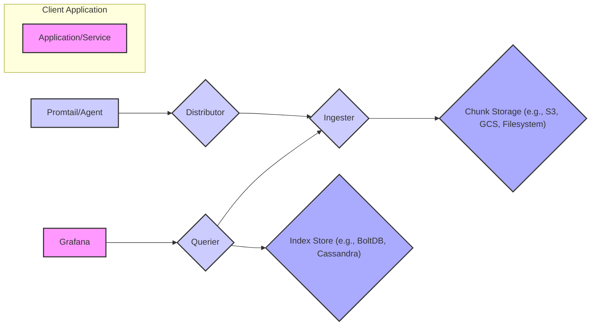
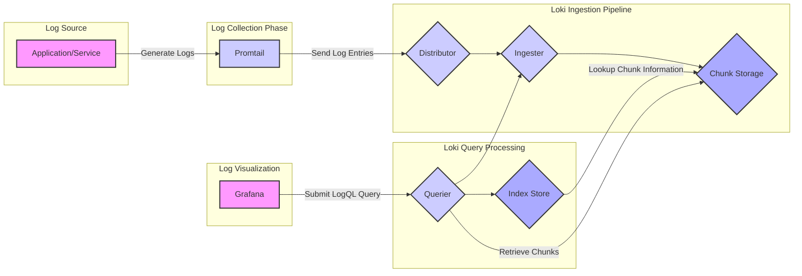

# Project Design Document: Grafana Loki

**Version:** 1.1
**Date:** October 26, 2023
**Author:** AI Software Architect

## 1. Introduction

This document provides an enhanced design overview of Grafana Loki, a horizontally scalable, highly available, and cost-efficient log aggregation system inspired by Prometheus. It details Loki's architecture, components, and data flow, specifically tailored for use in subsequent threat modeling exercises. This revision aims for greater clarity and detail based on the initial version.

## 2. Goals and Objectives

The core objectives of Grafana Loki are:

*   **Cost-Effective Log Aggregation:** To significantly reduce infrastructure costs associated with log management by indexing only metadata (labels) and compressing log content.
*   **Horizontal Scalability and High Availability:** To handle massive log volumes and maintain continuous operation even with component failures through distributed architecture and replication.
*   **Native Multi-tenancy:** To securely support multiple independent tenants with robust data isolation, access control, and resource management.
*   **Seamless Grafana Integration:** To provide a first-class experience for querying, visualizing, and alerting on logs directly within the Grafana ecosystem using LogQL.
*   **Efficient and Flexible Querying:** To enable powerful and adaptable querying of log data based on both metadata labels and full-text search capabilities within specific log streams.

## 3. High-Level Architecture

Loki employs a microservices architecture where each component performs a specific function in the log aggregation pipeline.

## 4. Detailed Architecture and Components

Loki's architecture is composed of several interacting components, each with specific responsibilities.

### 4.1. Promtail (Log Collection Agent)

*   **Core Function:** Discovers log sources, tails log files, and forwards log entries to the Loki ingestion pipeline.
*   **Key Capabilities:**
    *   **Service Discovery:** Integrates with various service discovery mechanisms (e.g., Kubernetes, Consul) to automatically identify log targets.
    *   **Log Parsing and Transformation:**  Applies configurable pipelines (using regular expressions or other methods) to parse and structure log lines, extracting relevant information.
    *   **Label Enrichment:** Adds metadata labels to log streams based on the source, environment, or other contextual information.
    *   **Efficient Transmission:** Batches and compresses log entries to optimize network bandwidth usage.
    *   **Secure Communication:** Supports TLS encryption for secure transmission of logs to Loki.
    *   **Authentication and Authorization:**  Authenticates with Loki using configured credentials (e.g., basic auth, bearer tokens).

### 4.2. Distributor

*   **Core Function:** The initial point of contact for incoming log streams, responsible for routing them to the appropriate Ingester.
*   **Key Capabilities:**
    *   **Log Reception:** Accepts log entries from Promtail and other compatible agents via gRPC or HTTP(S).
    *   **Tenant Validation:** Verifies the tenant ID associated with the incoming log stream to enforce multi-tenancy.
    *   **Label Hashing and Routing:**  Hashes the labels of a log stream to consistently determine the set of Ingester instances responsible for that stream.
    *   **Ingester Forwarding:**  Forwards the log entries to the designated Ingester instances.
*   **Security Relevance:** Enforces initial authentication and authorization, and plays a crucial role in tenant isolation.

### 4.3. Ingester

*   **Core Function:** Builds and persists chunks of log data in memory and eventually flushes them to the long-term Chunk Storage.
*   **Key Capabilities:**
    *   **Log Stream Aggregation:** Receives log entries from the Distributor and groups them into streams based on their unique label sets.
    *   **Chunk Creation:**  Organizes log entries within a stream into time-based chunks.
    *   **Compression and Encryption:** Compresses chunks to reduce storage costs and optionally encrypts them for data confidentiality.
    *   **Chunk Flushing:** Periodically writes completed chunks to the configured Chunk Storage backend.
    *   **In-Memory Indexing:** Maintains an in-memory index of the chunks it currently holds.
    *   **Replication:** Replicates in-memory chunks to other Ingesters for data durability and fault tolerance.
*   **Security Relevance:** Handles potential encryption of sensitive log data and manages in-memory data that could be targeted.

### 4.4. Chunk Storage

*   **Core Function:** Provides durable and scalable long-term storage for compressed and potentially encrypted log data chunks.
*   **Supported Backends:**
    *   Object Storage Services: AWS S3, Google Cloud Storage, Azure Blob Storage (recommended for scalability and cost-effectiveness).
    *   Filesystem Storage: Suitable for smaller deployments or development environments.
*   **Key Considerations:**
    *   **Durability and Availability:** The chosen backend should offer high levels of data durability and availability.
    *   **Cost and Performance:**  Balance cost considerations with the required read/write performance.
    *   **Encryption at Rest:**  Leverage the storage backend's encryption at rest capabilities for enhanced security.
    *   **Access Control:** Implement appropriate access control policies (e.g., IAM roles, bucket policies) to restrict access to log data.
*   **Security Relevance:**  The primary repository of log data, requiring robust security measures to protect confidentiality and integrity.

### 4.5. Querier

*   **Core Function:**  Receives and processes LogQL queries, retrieving and filtering log data from both the Ingesters and the Chunk Storage.
*   **Key Capabilities:**
    *   **LogQL Processing:** Parses and executes LogQL queries.
    *   **Index Lookup:** Queries the Index Store to identify the chunks relevant to the query.
    *   **Chunk Retrieval:** Fetches necessary chunks from the Chunk Storage.
    *   **Ingester Querying:** Directly queries Ingesters for recent logs still residing in memory.
    *   **Log Filtering and Processing:** Filters and processes log entries within the retrieved chunks based on the query criteria.
    *   **Result Merging and Sorting:** Merges and sorts results from multiple sources (Ingesters and Chunk Storage).
*   **Security Relevance:**  Handles potentially sensitive query requests and accesses stored log data.

### 4.6. Index Store

*   **Core Function:** Stores an index that maps labels to the chunks containing log entries with those labels, enabling efficient query execution.
*   **Supported Backends:**
    *   BoltDB: An embedded key-value store, suitable for smaller deployments or single-node setups.
    *   Cassandra: A distributed NoSQL database, recommended for larger, more scalable deployments requiring high availability.
    *   Other experimental backends may exist.
*   **Key Considerations:**
    *   **Scalability and Performance:** The chosen backend should scale to handle the volume of indexed data and provide fast lookups.
    *   **Data Consistency and Durability:** Ensure data consistency and durability of the index.
    *   **Resource Requirements:** Consider the resource requirements (CPU, memory, storage) of the chosen backend.
*   **Security Relevance:**  While not containing the raw log data, the index is crucial for accessing it, and its integrity is important.

### 4.7. Gateway (Optional Component)

*   **Core Function:**  An optional component placed in front of Loki to provide enhanced security and management capabilities.
*   **Common Implementations:** NGINX, HAProxy, cloud provider load balancers with added security features.
*   **Key Capabilities:**
    *   **Authentication and Authorization:**  Centralized authentication and authorization point for all incoming requests.
    *   **TLS Termination:** Handles TLS encryption and decryption, offloading this task from backend components.
    *   **Rate Limiting:**  Protects Loki from excessive requests and potential denial-of-service attacks.
    *   **Request Routing:**  Routes requests to the appropriate Loki components.
*   **Security Relevance:**  A critical component for enforcing security policies and protecting the Loki infrastructure.

## 5. Data Flow

The journey of a log entry through the Loki system involves several stages:

1. **Log Generation:** Applications and services produce log events.
2. **Log Collection:** Promtail tails log files, processes log lines, extracts labels, and batches entries.
3. **Ingestion:**
    *   Promtail sends batches of log entries to the Distributor.
    *   The Distributor validates the tenant and routes the entries to the appropriate Ingester(s).
    *   Ingesters build in-memory chunks of log data, compressing and potentially encrypting them.
    *   Once chunks are full or a time threshold is reached, Ingesters flush them to the Chunk Storage.
    *   Ingesters update the Index Store with metadata about the newly created chunks.
4. **Querying:**
    *   Grafana (or another client) sends a LogQL query to the Querier.
    *   The Querier consults the Index Store to identify relevant chunks.
    *   The Querier retrieves the necessary chunks from the Chunk Storage and may also query Ingesters for recent in-memory data.
    *   The Querier filters and processes the log entries within the chunks based on the query.
    *   The Querier returns the results to Grafana.
5. **Visualization:** Grafana displays the queried log data in dashboards and exploration views.

## 6. Key Component Interactions (Focus on Security)

*   **Promtail to Distributor:**  Communication should be secured with TLS. Authentication (e.g., basic auth, bearer tokens) is crucial to verify the source of logs.
*   **Distributor to Ingester:**  Internal communication, often over gRPC. Mutual TLS can enhance security. Authorization ensures only valid Distributors can send data to Ingesters.
*   **Ingester to Chunk Storage:**  Secure communication using the storage provider's recommended methods (e.g., HTTPS with authentication). Encryption at rest should be enabled on the storage backend. Access control policies must be strictly enforced.
*   **Ingester to Index Store:**  Internal communication. Security depends on the chosen Index Store backend.
*   **Querier to Index Store:**  Secure communication based on the Index Store's capabilities.
*   **Querier to Ingester:**  Internal communication, potentially secured with mutual TLS. Authorization is needed to prevent unauthorized queries to Ingesters.
*   **Querier to Chunk Storage:**  Secure communication using the storage provider's recommended methods with appropriate authentication and authorization.
*   **Grafana to Querier:**  Communication over HTTP(S). Authentication and authorization are essential to control access to log data.

## 7. Security Considerations (Expanded)

This section details key security considerations relevant for threat modeling.

*   **Authentication and Authorization:**
    *   **Promtail Authentication:** How does Loki authenticate Promtail instances? Are API keys, basic authentication, or mutual TLS used? How are these credentials managed and rotated?
    *   **Tenant-Based Authorization:** How is access to log data restricted based on tenant IDs? Are there role-based access controls (RBAC) for different actions (ingestion, querying)?
    *   **Query Authorization:** How does Loki authorize query requests? Are there mechanisms to prevent users from querying logs they are not authorized to access?
*   **Data Confidentiality:**
    *   **Encryption in Transit:** Is TLS encryption enforced for all network communication between Loki components? Are cipher suites appropriately configured?
    *   **Encryption at Rest:** Is data encrypted at rest in the Chunk Storage? What encryption method is used (e.g., SSE-S3, KMS)? How are encryption keys managed and rotated? Is encryption considered for the Index Store?
    *   **Log Scrubbing/Masking:** Are there mechanisms to redact or mask sensitive information within log entries before ingestion or during querying?
*   **Data Integrity:**
    *   **Log Tampering Detection:** Are there mechanisms to detect if log data has been tampered with during ingestion or storage? Are checksums or other integrity checks used?
    *   **Immutable Storage:** Can the Chunk Storage be configured for immutability to prevent accidental or malicious deletion or modification of logs?
*   **Availability:**
    *   **Component Resilience:** How are individual Loki components made resilient to failures? Is there redundancy and failover?
    *   **Denial of Service (DoS) Protection:** Are there mechanisms to protect Loki from DoS attacks at the ingestion and query layers (e.g., rate limiting, request size limits)?
*   **Multi-tenancy Security:**
    *   **Tenant Isolation:** How is strong isolation enforced between tenants to prevent data leakage or cross-tenant access? Are namespaces or other isolation techniques used?
    *   **Resource Quotas and Limits:** How are resource quotas and limits enforced per tenant to prevent resource exhaustion or interference?
*   **Input Validation:**
    *   **Log Injection Prevention:** How does Loki prevent log injection attacks where malicious actors inject crafted log entries to compromise the system or other applications?
    *   **LogQL Injection Prevention:** How does Loki prevent LogQL injection attacks where malicious queries are crafted to extract unauthorized data or cause harm?
*   **Secrets Management:**
    *   **Secure Storage of Credentials:** How are sensitive credentials (e.g., storage access keys, database passwords, API tokens) securely stored and managed? Are secrets management tools (e.g., HashiCorp Vault) used?
*   **Network Security:**
    *   **Firewall Rules:** Are appropriate firewall rules in place to restrict network access to Loki components? Is network segmentation used?
    *   **Service Mesh Integration:** If deployed in a service mesh, are appropriate security policies (e.g., mTLS) enforced?
*   **Supply Chain Security:**
    *   **Dependency Scanning:** Are dependencies regularly scanned for vulnerabilities?
    *   **Secure Build Process:** Is there a secure build process in place to prevent the introduction of malicious code?
*   **Operational Security:**
    *   **Security Logging and Auditing:** Are security-related events logged and audited? Are there mechanisms for monitoring and alerting on suspicious activity?
    *   **Regular Security Assessments:** Are regular security assessments (e.g., penetration testing, vulnerability scanning) performed on the Loki infrastructure?

## 8. Deployment Considerations (Security Focused)

*   **Secure Deployment Environment:** Deploy Loki in a secure environment with appropriate network segmentation and access controls.
*   **Principle of Least Privilege:** Grant only the necessary permissions to each component and user.
*   **Regular Updates and Patching:** Keep Loki and its dependencies up-to-date with the latest security patches.
*   **Secure Configuration:** Follow security best practices when configuring Loki components, including disabling unnecessary features and setting strong passwords/credentials.
*   **Monitoring and Alerting:** Implement robust monitoring and alerting for security-related events.

## 9. Future Considerations

*   Enhanced end-to-end encryption options.
*   More granular access control mechanisms.
*   Integration with security information and event management (SIEM) systems.
*   Advanced threat detection capabilities within Loki.

This revised document provides a more detailed and security-focused design overview of Grafana Loki, intended to be a comprehensive resource for threat modeling activities.
