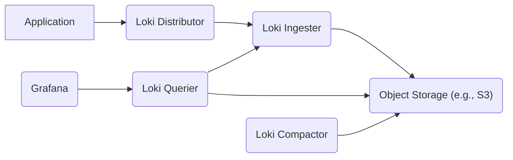

### High and Critical Threats Directly Involving Grafana Loki

This list details high and critical security threats that directly involve Grafana Loki components.

**Data Flow Diagram:**

**Threat List:**

*   **Threat:** Log Injection / Spoofing
    *   **Description:** An attacker crafts and sends malicious log entries to the Loki Distributor, potentially impersonating legitimate sources or injecting misleading information. This could involve manipulating log content, timestamps, or labels.
    *   **Impact:**  Compromised audit trails, misleading operational insights, potential for triggering false alerts or masking malicious activity. Attackers could inject commands or scripts that might be interpreted by downstream systems or analysts.
    *   **Affected Component:** "Loki Distributor" (specifically the ingestion endpoint).
    *   **Risk Severity:** High
    *   **Mitigation Strategies:**
        *   Implement strong authentication (e.g., API keys, mTLS) for applications sending logs to the Distributor.
        *   Validate log sources and labels at the Distributor level.
        *   Consider using a dedicated log forwarder with input validation capabilities before Loki.
        *   Implement rate limiting on log ingestion to prevent abuse.

*   **Threat:** Unauthorized Log Access via Querier
    *   **Description:** An attacker gains unauthorized access to the Loki Querier, potentially through compromised Grafana credentials, API keys, or vulnerabilities in the Querier itself. They can then execute arbitrary queries to access sensitive log data.
    *   **Impact:**  Exposure of confidential information, privacy violations, potential for further attacks based on revealed data.
    *   **Affected Component:** "Loki Querier" (the component responsible for handling log queries).
    *   **Risk Severity:** Critical
    *   **Mitigation Strategies:**
        *   Implement robust authentication and authorization for accessing the Querier (e.g., using Grafana's authentication mechanisms, API keys with granular permissions).
        *   Enforce the principle of least privilege for user access to log streams.
        *   Utilize Loki's tenant support to isolate log data between different applications or environments.
        *   Regularly review and audit query logs.

*   **Threat:** Querier Denial of Service (DoS)
    *   **Description:** An attacker sends a large number of complex or resource-intensive queries to the Loki Querier, overwhelming its resources and causing it to become unresponsive or crash.
    *   **Impact:**  Inability to access log data for monitoring, alerting, and incident response.
    *   **Affected Component:** "Loki Querier" (the component responsible for handling log queries).
    *   **Risk Severity:** High
    *   **Mitigation Strategies:**
        *   Implement rate limiting on incoming queries to the Querier.
        *   Set limits on query complexity and resource usage.
        *   Ensure sufficient resources are allocated to the Querier.
        *   Implement caching mechanisms to reduce the load on the Querier.

*   **Threat:** Distributor Overload
    *   **Description:** An attacker floods the Loki Distributor with a massive volume of log data, exceeding its capacity to handle incoming requests.
    *   **Impact:**  Dropped log entries, delayed ingestion, potential for impacting the availability of the logging pipeline.
    *   **Affected Component:** "Loki Distributor" (the entry point for log data).
    *   **Risk Severity:** High
    *   **Mitigation Strategies:**
        *   Implement rate limiting on incoming log traffic to the Distributor.
        *   Ensure sufficient resources are allocated to the Distributor.
        *   Utilize load balancing across multiple Distributor instances.

*   **Threat:** Log Data Exfiltration via Querier
    *   **Description:** An attacker with legitimate access to the Loki Querier (e.g., a compromised internal account) abuses their access to exfiltrate large volumes of sensitive log data.
    *   **Impact:**  Significant data breach, exposure of confidential information, potential legal and regulatory repercussions.
    *   **Affected Component:** "Loki Querier" (the component used to retrieve log data).
    *   **Risk Severity:** High
    *   **Mitigation Strategies:**
        *   Implement robust monitoring and alerting for unusual query patterns or large data retrievals.
        *   Regularly review and audit user access and query activity.
        *   Implement data retention policies to limit the amount of historical data accessible.