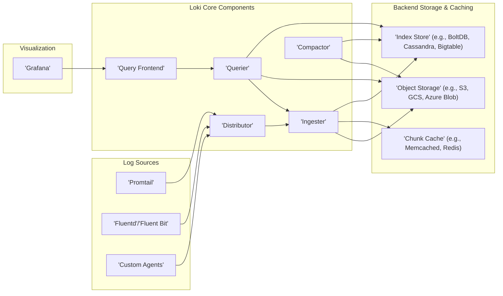

# Project Design Document: Grafana Loki

**Version:** 1.1
**Date:** October 26, 2023
**Author:** AI Software Architect

## 1. Introduction

This document provides an enhanced architectural design of Grafana Loki, a horizontally scalable, highly available, multi-tenant log aggregation system inspired by Prometheus. This detailed description of Loki's components, data flow, and underlying technologies is intended to serve as a robust foundation for subsequent threat modeling exercises. The focus is on providing the necessary context and understanding of the system's inner workings to facilitate effective identification of potential security vulnerabilities.

## 2. Goals

The core objectives of the Loki project are:

* **Cost-Effective Log Aggregation:** To offer a solution that minimizes resource utilization and associated infrastructure expenses compared to traditional indexing-heavy logging systems.
* **Horizontal Scalability:** To efficiently handle increasing volumes of log data and concurrent query loads by scaling out its components.
* **High Availability and Resilience:** To ensure continuous log ingestion and query availability, even in the event of individual component failures.
* **Native Multi-Tenancy:** To provide robust support for multiple independent tenants, ensuring data isolation, resource management, and secure access control.
* **Seamless Grafana Integration:** To work effortlessly with Grafana for intuitive log visualization, exploration, and alerting.
* **Leveraging Prometheus Ecosystem:** To adopt Prometheus's service discovery mechanisms and its widely adopted labeling conventions for streamlined integration and operation.

## 3. Architecture Overview

Loki employs a microservices-based architecture, where distinct components are responsible for specific tasks, enabling independent scaling and fault isolation. The fundamental principle is to index only metadata (labels), while compressing and storing the raw, unstructured log lines in cost-effective object storage.

## 4. Component Breakdown

This section provides a more in-depth look at the responsibilities and functionalities of each key component within the Loki architecture.

* **Promtail:**
    * A lightweight, resource-efficient agent deployed on machines where logs are generated.
    * **Log Target Discovery:** Dynamically identifies log sources based on configured targets (e.g., file paths, systemd journal).
    * **Log Entry Reading:** Reads log entries as they are written.
    * **Label Attachment:**  Applies relevant metadata labels to each log entry based on configuration rules, using information like hostname, application name, and other contextual details.
    * **Batching and Forwarding:** Groups log entries into batches for efficient transmission to the Distributor.
    * **Basic Log Processing:** Offers capabilities for basic log manipulation, such as filtering and renaming fields.

* **Fluentd/Fluent Bit & Custom Agents:**
    * Versatile log shipping agents offering more advanced log processing and routing capabilities than Promtail.
    * **Flexible Log Processing:**  Supports complex log parsing, transformation, and enrichment.
    * **Extensive Plugin Ecosystem:**  Provides a wide range of plugins for connecting to various log sources and destinations.
    * **Loki Push API Integration:**  Can be configured to send logs to the Distributor using Loki's dedicated push API.

* **Distributor:**
    * The initial point of contact for all incoming log streams from agents.
    * **Request Validation:** Ensures incoming requests are properly formatted and contain necessary information.
    * **Tenant Authentication:** Verifies the identity of the tenant sending the logs, ensuring multi-tenancy isolation.
    * **Ingester Selection:**  Utilizes a consistent hashing mechanism based on the log stream's labels to determine which Ingester instance(s) should handle the data. This ensures that logs for the same stream consistently go to the same Ingester.
    * **Buffering:** Temporarily stores incoming log entries in a buffer before forwarding them to the designated Ingesters, providing resilience against temporary network issues or Ingester unavailability.

* **Ingester:**
    * Responsible for the initial processing and storage of incoming log data.
    * **Stream Reception:** Receives log entries from the Distributor.
    * **In-Memory Chunk Building:**  Organizes incoming log entries into compressed, in-memory chunks, grouped by unique log streams (identified by their set of labels).
    * **Periodic Flushing:**  Regularly persists these in-memory chunks to object storage. The frequency of flushing is configurable.
    * **Index Updates:**  Writes entries to the index store, mapping the labels of each stream to the location (in object storage) of the chunks containing its log data.
    * **Write-Ahead Log (WAL):** Maintains a persistent WAL to ensure data durability in case of unexpected crashes or failures before chunks are flushed to object storage.
    * **Recent Query Serving:** Can serve queries for recently ingested data directly from its in-memory chunks, improving query latency for recent logs.

* **Compactor:**
    * Optimizes the storage and retrieval of log data over time.
    * **Chunk Compaction:** Periodically merges smaller, less efficient chunks in object storage into larger, more efficient chunks. This reduces the number of files to manage and improves query performance by reducing I/O operations.
    * **Index Compaction (Depending on Index Store):** May also perform compaction of the index store, depending on the specific index store implementation being used, to optimize its performance and size.

* **Querier:**
    * Handles incoming log queries and retrieves the requested data.
    * **Query Reception:** Receives query requests from the Query Frontend.
    * **Index Querying:** Queries the index store using the labels and time range specified in the query to identify the relevant chunks in object storage.
    * **Chunk Fetching:** Retrieves the necessary chunks from object storage and potentially from the chunk cache if the data is available there.
    * **Data Merging and Filtering:** Decompresses the retrieved chunks, filters the log lines based on the query expressions (LogQL), and merges the results from different chunks.
    * **Result Delivery:** Returns the matching log lines to the Query Frontend.

* **Query Frontend:**
    * An optional but highly recommended component that enhances query performance and reliability.
    * **Query Caching:** Caches the results of recent queries to reduce load on the Queriers and improve response times for repeated queries.
    * **Query Splitting:** Divides large, complex queries into smaller, more manageable sub-queries that can be processed in parallel by multiple Queriers, improving overall query execution time.
    * **Rate Limiting and Concurrency Control:** Enforces limits on the number of concurrent queries and the rate of incoming requests to protect the backend Queriers from being overloaded.

* **Object Storage (e.g., S3, GCS, Azure Blob):**
    * The primary, cost-effective storage backend for the compressed log data chunks.
    * **Scalability and Durability:** Provides highly scalable and durable storage for massive amounts of log data.
    * **Cost Optimization:** Offers significantly lower storage costs compared to traditional block storage solutions.

* **Chunk Cache (e.g., Memcached, Redis):**
    * An optional caching layer positioned between the Queriers and object storage.
    * **Reduced Latency:** Stores frequently accessed log chunks in memory, reducing the need to fetch them from object storage for subsequent queries, thereby lowering query latency.

* **Index Store (e.g., BoltDB, Cassandra, Bigtable):**
    * Stores the index, which maps log stream labels to the locations of the corresponding data chunks in object storage.
    * **Efficient Lookup:** Enables fast retrieval of the chunks relevant to a given query based on its label selectors.
    * **Scalability Considerations:** Different index store options offer varying levels of scalability, performance characteristics, and operational complexity, allowing users to choose the best fit for their needs.

## 5. Data Flow

The journey of log data through Loki involves two primary phases: **Ingestion** and **Querying**.

### 5.1. Ingestion Flow (Detailed)

1. **Log Generation and Collection:** Applications and systems generate log events. Agents like Promtail, Fluentd, or custom applications are responsible for collecting these logs.
2. **Label Enrichment:** The collection agents enrich the raw log entries by attaching metadata labels. This labeling is crucial for efficient querying and organization.
3. **Transmission to Distributor:** The agent sends the labeled log entries to the Distributor via gRPC or HTTP(S) using the Loki push API. The request includes the tenant ID for multi-tenancy.
4. **Authentication and Authorization:** The Distributor authenticates the request and authorizes the tenant to ingest logs.
5. **Stream Hashing and Ingester Selection:** The Distributor calculates a hash based on the labels of the log stream to determine the appropriate Ingester instance(s) to handle the data.
6. **Buffering and Forwarding:** The Distributor temporarily buffers the incoming log entries and then forwards them to the selected Ingester(s).
7. **Chunk Creation and Population:** The Ingester receives the log entries and appends them to in-memory chunks, grouping them by unique stream labels. Chunks are compressed to save memory.
8. **WAL Write:** Simultaneously, the Ingester writes the received log entries to its Write-Ahead Log (WAL) for durability.
9. **Index Update (In-Memory):** The Ingester updates its in-memory index with the location of the newly added log entries within the chunks.
10. **Chunk Flushing:** Periodically, or when a chunk reaches a certain size or age, the Ingester flushes the compressed in-memory chunk to object storage.
11. **Index Persistence:** The Ingester persists the index updates to the chosen index store, linking the stream labels to the location of the flushed chunk in object storage.

### 5.2. Query Flow (Detailed)

1. **Query Initiation:** A user formulates a log query using Grafana's Explore interface or directly via the Loki API (LogQL).
2. **Query Reception (Query Frontend):** The query request is received by the Query Frontend (if deployed).
3. **Caching Check:** The Query Frontend checks its cache for the results of the identical query. If found, the cached results are returned directly.
4. **Query Splitting (Optional):** For complex or long-running queries, the Query Frontend may split the query into smaller time-based sub-queries.
5. **Query Routing:** The Query Frontend routes the query (or sub-queries) to available Querier instances.
6. **Index Lookup:** The Querier receives the query and queries the index store using the label selectors and time range specified in the query.
7. **Chunk Identification:** The index store returns the locations (in object storage) of the chunks that potentially contain the matching log data.
8. **Chunk Retrieval:** The Querier retrieves the identified chunks from object storage. It may first check the chunk cache for faster access.
9. **Data Processing:** The Querier decompresses the retrieved chunks and filters the log lines based on the query's LogQL expressions.
10. **Result Merging:** If the query was split, the Querier merges the results from the sub-queries.
11. **Response Delivery:** The Querier (or Query Frontend, if caching is enabled) returns the matching log lines to the user or Grafana.

## 6. Key Technologies

Loki relies on the following core technologies:

* **Go Programming Language:** The primary language used for developing Loki's core components, chosen for its performance, concurrency features, and strong standard library.
* **gRPC:** A high-performance remote procedure call (RPC) framework used for efficient inter-service communication between Loki components.
* **Protocol Buffers:** A language-neutral, platform-neutral, extensible mechanism for serializing structured data, used for defining communication protocols between Loki components.
* **Object Storage (e.g., AWS S3, Google Cloud Storage, Azure Blob Storage):** Provides durable, scalable, and cost-effective storage for the bulk of log data.
* **Various Index Store Options (e.g., BoltDB, Cassandra, Bigtable):** Offers flexibility in choosing an index store based on scalability, performance, and operational requirements.
* **Caching Technologies (e.g., Memcached, Redis):** Used for caching log chunks and query results to improve query performance and reduce load on backend storage.
* **Prometheus Ecosystem:**  Loki leverages Prometheus's well-established service discovery mechanisms and its powerful and expressive query language, LogQL.

## 7. Deployment Considerations

Loki offers flexible deployment options to suit various scales and requirements:

* **Single Binary Mode:** For development, testing, or small-scale deployments, all Loki components can be run within a single process, simplifying setup and management.
* **Microservices Deployment:** In production environments, each Loki component is typically deployed as a separate, independently scalable service. This allows for resource optimization, fault isolation, and independent scaling of individual components based on their specific load.
* **Containerization (Docker):** Loki components are commonly packaged as Docker containers, facilitating consistent deployments across different environments.
* **Orchestration (Kubernetes):** Kubernetes is a popular platform for deploying and managing Loki in production. Helm charts are often used to simplify the deployment and management of Loki clusters on Kubernetes.

## 8. Security Considerations (For Threat Modeling)

This section outlines key security considerations that will be the focus of subsequent threat modeling activities.

* **Authentication and Authorization of API Requests:**
    * **Mechanisms:** Explore the usage of API keys, OAuth 2.0, and mutual TLS for authenticating requests to Loki components.
    * **Scope and Permissions:** Define the granularity of permissions and access control for different API endpoints and actions.
* **Multi-Tenancy Data Isolation:**
    * **Label-Based Isolation:** Analyze how labels are used to enforce data separation between tenants.
    * **Storage Separation:** Investigate the potential for using separate storage buckets or namespaces for different tenants.
    * **Query Isolation:** Understand how queries are restricted to a specific tenant's data.
* **Data Encryption at Rest and in Transit:**
    * **Object Storage Encryption:** Examine the mechanisms for encrypting log data stored in object storage (e.g., SSE-S3, KMS).
    * **Network Encryption (TLS):** Ensure that all communication between Loki components and with external clients is encrypted using TLS.
* **Input Validation and Sanitization:**
    * **Log Entry Validation:** Analyze how Loki validates incoming log entries to prevent injection attacks or malformed data.
    * **LogQL Injection:** Investigate potential vulnerabilities related to LogQL injection and how queries are sanitized.
* **Rate Limiting and Abuse Prevention:**
    * **API Rate Limiting:**  Understand how API request rates are limited to prevent denial-of-service attacks or abuse.
    * **Query Rate Limiting:** Explore mechanisms for limiting the rate of expensive or resource-intensive queries.
* **Access Control and Network Policies:**
    * **Component Access Control:** Define how access to individual Loki components is controlled (e.g., using network policies, firewalls).
    * **RBAC (Role-Based Access Control):** Investigate the potential for implementing RBAC to manage user permissions within Loki.
* **Secrets Management:**
    * **Secure Storage of Credentials:** Analyze how sensitive credentials (e.g., API keys, database passwords) are securely stored and managed within Loki and its components.
    * **Secrets Rotation:** Understand the mechanisms for rotating secrets.
* **Dependency Management and Vulnerability Scanning:**
    * **Dependency Tracking:** How are dependencies managed and tracked for potential vulnerabilities?
    * **Vulnerability Scanning Processes:** What processes are in place for scanning dependencies and the Loki codebase for security vulnerabilities?
* **Auditing and Logging of Security-Related Events:**
    * **Audit Logging:** Identify what security-related events are logged and how these logs can be accessed and analyzed.

## 9. Diagrams

The architecture and data flow diagrams presented earlier provide a visual representation of the system's structure and the movement of data through its components. These diagrams are integral to understanding the system's design for threat modeling purposes.

This revised document offers a more detailed and comprehensive understanding of Grafana Loki's architecture, components, and data flow. This enhanced information will be invaluable for conducting a thorough and effective threat model to identify potential security risks and design appropriate mitigation strategies.
