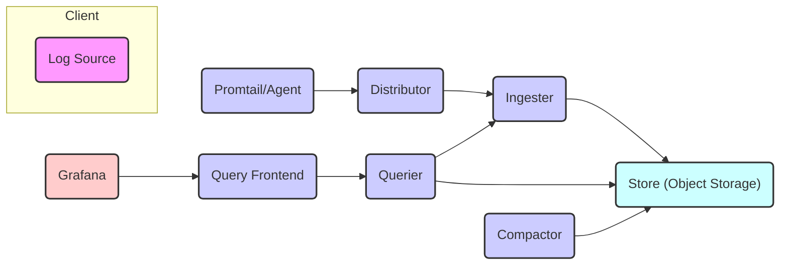
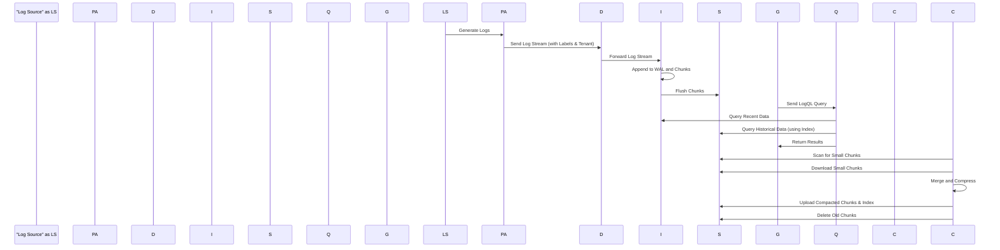

# Project Design Document: Grafana Loki

**Version:** 1.1
**Date:** October 26, 2023
**Author:** AI Software Architect

## 1. Introduction

This document provides a detailed architectural design of Grafana Loki, a horizontally scalable, highly available, multi-tenant log aggregation system inspired by Prometheus. This document aims to provide a comprehensive understanding of Loki's components, their interactions, and data flow, which will serve as the foundation for subsequent threat modeling activities. This revision includes clarifications and expands on certain aspects of the initial design.

## 2. Goals and Objectives

The primary goals of Grafana Loki are:

*   Cost-effective log aggregation: By indexing only metadata (labels) and compressing log content, Loki aims to be more resource-efficient than traditional full-text indexing solutions. This reduces storage costs and operational overhead.
*   Scalability and High Availability: Loki is designed to handle large volumes of log data and remain operational even in the face of component failures. This is achieved through horizontal scaling and replication.
*   Integration with Grafana: Seamless integration with Grafana for log exploration and visualization, leveraging familiar Prometheus concepts and LogQL.
*   Multi-tenancy: Support for isolating and managing logs from different sources or organizations, ensuring data privacy and access control.

## 3. High-Level Architecture

Loki's architecture is composed of several stateless microservices and a stateful storage layer. The core components are:

*   **Ingester:** Responsible for receiving, processing, and batching incoming log streams. It builds in-memory chunks and flushes them to the store.
*   **Distributor:** Receives streams from clients and determines which Ingester should handle them based on a consistent hashing of the log stream's labels, ensuring data locality.
*   **Querier:** Handles LogQL queries, fetching data from both the in-memory chunks in Ingesters and the long-term store, merging and deduplicating results.
*   **Query Frontend:** An optional, stateless service that can be used to improve query performance by caching query results, splitting large queries, and providing a single entrypoint for queries.
*   **Compactor:** Compacts and indexes smaller chunks in the long-term store into larger, more efficient ones, and creates index files for faster lookups.
*   **Store (Object Storage):** The durable, long-term storage for compressed log chunks and index files. This is typically an object storage service like AWS S3, Google Cloud Storage, Azure Blob Storage, or a local filesystem for development.

## 4. Detailed Component Design

### 4.1. Ingester

*   **Functionality:**
    *   Receives log streams from Distributors, identified by their unique set of labels.
    *   Builds in-memory chunks of log entries, grouped by tenant and label set.
    *   Compresses these chunks using configurable compression algorithms (e.g., gzip).
    *   Periodically flushes these compressed chunks to the long-term store based on size or time thresholds.
    *   Maintains a Write-Ahead Log (WAL) on local disk for durability, ensuring no data loss in case of crashes before flushing.
    *   Serves recent, unflushed data to Queriers.
*   **Key Responsibilities:**
    *   Ensuring data durability through the WAL before acknowledging ingestion to the Distributor.
    *   Efficiently managing in-memory chunks and optimizing memory usage.
    *   Compressing data to minimize storage costs and network bandwidth.
    *   Providing low-latency access to recently ingested logs for queries.
*   **Internal Processes:**
    *   Incoming log entries are first appended to the WAL.
    *   Log entries are then appended to the appropriate in-memory chunk based on their tenant ID and label set.
    *   When a chunk reaches a configured size or age, it is compressed and uploaded to the configured object storage.
    *   Upon successful upload, the corresponding entries in the WAL are marked as flushed and can be truncated.
*   **Configuration:**
    *   `chunk_idle_period`:  Maximum time a chunk can remain idle before being flushed.
    *   `chunk_block_size`: Target size of compressed chunks.
    *   `wal_path`: Directory for the Write-Ahead Log.
    *   Storage configuration details (backend type, bucket, credentials).

### 4.2. Distributor

*   **Functionality:**
    *   Acts as the entry point for incoming log streams from clients (typically via Promtail or other agents).
    *   Receives log streams along with their associated labels.
    *   Uses a consistent hashing algorithm (e.g., Rendezvous hashing) based on the log stream's tenant ID and labels to determine which Ingester(s) should handle the stream.
    *   Forwards the log stream to the selected Ingesters. It can replicate writes to multiple Ingesters for redundancy.
    *   Maintains a view of the active Ingesters in a "ring."
*   **Key Responsibilities:**
    *   Load balancing log ingestion across available Ingesters.
    *   Ensuring that logs with the same tenant ID and labels are consistently routed to the same set of Ingesters, maintaining data locality.
    *   Handling retries and failures when communicating with Ingesters.
    *   Providing a stable endpoint for log ingestion, abstracting away the dynamic nature of the Ingester pool.
*   **Internal Processes:**
    *   Incoming requests are inspected for tenant ID and labels.
    *   A hash of the tenant ID and labels is calculated.
    *   The hash is used to select one or more Ingesters from the ring of available Ingesters.
    *   The log stream is then forwarded to the selected Ingesters.
*   **Configuration:**
    *   `ingesters_url`:  Endpoint for discovering available Ingesters.
    *   `replication_factor`: Number of Ingesters to which each log stream should be replicated.
    *   Hashing algorithm configuration.

### 4.3. Querier

*   **Functionality:**
    *   Receives LogQL queries from the Query Frontend or directly from Grafana.
    *   Parses and plans the query execution.
    *   Identifies the Ingesters that might contain recent data for the queried label sets and time range.
    *   Queries these Ingesters for in-memory data.
    *   Identifies the relevant chunks in the object store based on the query's label selectors and time range, utilizing the index files.
    *   Fetches the necessary chunks from the object store.
    *   Merges and deduplicates results from Ingesters and the store.
    *   Executes the LogQL query against the retrieved data.
    *   Returns the final query results to the client.
*   **Key Responsibilities:**
    *   Efficiently executing LogQL queries across both recent and historical data.
    *   Retrieving data from both in-memory chunks in Ingesters and the long-term store.
    *   Ensuring data consistency and correctness by merging and deduplicating results.
    *   Optimizing query performance by leveraging indexes and parallel processing.
*   **Internal Processes:**
    *   Query parsing and validation using the LogQL parser.
    *   Determining the set of Ingesters to query based on the query's label selectors.
    *   Identifying the relevant chunks in the store by consulting the index.
    *   Parallel querying of Ingesters and the store to minimize latency.
    *   Merging and sorting the retrieved log entries.
    *   Applying any necessary LogQL functions and aggregations.
*   **Configuration:**
    *   Store configuration details (backend type, bucket, credentials).
    *   Ingester discovery configuration.
    *   Query timeouts and limits.

### 4.4. Query Frontend

*   **Functionality:**
    *   An optional, stateless service that sits in front of the Queriers.
    *   Provides query caching to improve performance for repeated queries with the same parameters.
    *   Can split large, long-running queries into smaller time-based sub-queries that can be executed in parallel by multiple Queriers, improving overall query latency.
    *   Provides a single, consistent entry point for queries, simplifying client configuration.
    *   Can enforce query limits and rate limiting.
*   **Key Responsibilities:**
    *   Improving query performance and reducing load on Queriers through caching and query splitting.
    *   Providing a more resilient query endpoint by distributing queries across multiple Queriers.
    *   Enforcing query governance policies.
*   **Internal Processes:**
    *   Receives incoming LogQL queries.
    *   Checks the cache for existing results based on the query and its parameters.
    *   If not cached, and the query is large, it may be split into smaller time-based sub-queries.
    *   Forwards the query (or sub-queries) to available Queriers.
    *   Caches the results of successful queries.
    *   Merges the results of split queries before returning them to the client.
*   **Configuration:**
    *   Cache configuration (backend type, size, time-to-live).
    *   Querier addresses for routing queries.
    *   Query splitting parameters (e.g., maximum query time range).

### 4.5. Compactor

*   **Functionality:**
    *   Periodically scans the object store for small, recently flushed chunks.
    *   Downloads these smaller chunks.
    *   Merges and compresses them into larger, more efficient chunks.
    *   Creates index files (both the "index" and "bloom filter" index) that map labels and time ranges to the locations of the compacted chunks in the store.
    *   Uploads the new, larger chunks and index files to the object store.
    *   Deletes the original smaller chunks.
*   **Key Responsibilities:**
    *   Reducing the number of small objects in the store, which improves query performance and reduces storage costs and API request overhead.
    *   Creating and maintaining the index for historical data, enabling efficient lookups by Queriers.
*   **Internal Processes:**
    *   Periodically scans the object storage based on a configured schedule.
    *   Identifies small chunks that meet the compaction criteria (age, size).
    *   Downloads the selected chunks.
    *   Merges and compresses the log entries from these chunks.
    *   Builds the index files, mapping labels and time ranges to the new compacted chunk locations.
    *   Uploads the compacted chunks and index files.
    *   Atomically replaces the old chunks with the new ones.
*   **Configuration:**
    *   Compaction schedule (frequency).
    *   Target size for compacted chunks.
    *   Retention policies for old chunks.
    *   Store configuration details.

### 4.6. Store (Object Storage)

*   **Functionality:**
    *   Provides durable, scalable, and cost-effective long-term storage for compressed log chunks and index files.
*   **Key Responsibilities:**
    *   Ensuring the availability and durability of log data and index files.
    *   Providing efficient read access for Queriers and the Compactor.
    *   Supporting efficient listing and deletion of objects.
*   **Implementation:**
    *   Typically implemented using cloud object storage services like AWS S3, Google Cloud Storage, or Azure Blob Storage, which offer high availability and scalability.
    *   Can also be a local filesystem for development or small-scale, non-production deployments, but this is generally not recommended for production environments due to limitations in scalability and durability.
*   **Configuration:**
    *   Backend type (S3, GCS, Azure, Filesystem).
    *   Credentials for accessing the storage backend.
    *   Bucket or container name.
    *   Region or endpoint configuration.
    *   Encryption settings (e.g., server-side encryption).

## 5. Data Flow

The typical data flow in Loki involves the following steps:

1. **Log Generation:** Applications or systems generate log entries.
2. **Agent Collection:** Agents like Promtail collect these logs, often adding metadata like source and job labels.
3. **Ingestion:**
    *   The agent sends the logs, along with their labels and tenant ID, to the Distributor.
    *   The Distributor uses consistent hashing to determine the appropriate Ingester(s) based on the tenant ID and labels.
    *   The Distributor forwards the logs to the selected Ingester(s).
    *   The Ingester appends the logs to its WAL and in-memory chunks, grouped by tenant and label set.
4. **Flushing to Store:**
    *   When chunks reach a configured size or age, the Ingester compresses them and flushes them to the object store.
5. **Querying:**
    *   Grafana (or another client) sends a LogQL query to the Query Frontend (optional) or directly to a Querier.
    *   The Querier identifies the relevant Ingesters that might hold recent data.
    *   The Querier queries these Ingesters for in-memory data.
    *   The Querier identifies the relevant chunks in the object store based on the query's label selectors and time range, using the index files.
    *   The Querier fetches the necessary chunks from the object store.
    *   The Querier merges and deduplicates the results from Ingesters and the store.
    *   The Querier executes the LogQL query against the combined data.
    *   The Querier returns the results to the client.
6. **Compaction:**
    *   The Compactor periodically scans the object store.
    *   It downloads small chunks, merges them into larger ones, and creates index files.
    *   The Compactor uploads the new, larger chunks and index files to the store, replacing the smaller ones.

## 6. Security Considerations

Several security aspects are crucial for a secure Loki deployment:

*   **Authentication and Authorization:**
    *   **Client Authentication:**  Authenticating clients (e.g., Promtail, other agents) sending logs to the Distributor. This can be achieved through various methods like basic authentication, bearer tokens (OAuth 2.0), or mutual TLS (mTLS).
    *   **Ingestion Authorization:** Controlling which tenants are authorized to write logs to Loki. This can be based on the authenticated client's identity.
    *   **Query Authentication and Authorization:**  Authenticating and authorizing users or applications querying logs. This ensures that only authorized entities can access specific tenants' logs. Mechanisms like Grafana's data source permissions can be used.
    *   **Inter-Component Communication Security:** Securing communication between Loki components using TLS encryption to protect sensitive data in transit.
*   **Data Encryption:**
    *   **Encryption in Transit:** Enforcing TLS encryption for all network communication between Loki components and with external clients.
    *   **Encryption at Rest:**  Encrypting log data and index files stored in the object store. This can be achieved using server-side encryption provided by the object storage service (e.g., SSE-S3, SSE-KMS) or client-side encryption.
*   **Input Validation:**
    *   **Log Data Validation:** Validating incoming log data to prevent injection attacks or malformed data that could cause issues.
    *   **LogQL Query Validation:** Validating LogQL queries to prevent malicious queries that could consume excessive resources or expose sensitive information.
*   **Rate Limiting:**
    *   **Ingestion Rate Limiting:** Implementing rate limiting on the Distributor to prevent abuse and resource exhaustion from excessive log ingestion.
    *   **Query Rate Limiting:** Implementing rate limiting on the Query Frontend or Queriers to prevent overload and ensure fair usage of resources.
*   **Auditing:**
    *   Logging API access, administrative actions, and significant events within Loki components for security monitoring and compliance.
*   **Network Security:**
    *   Implementing proper network segmentation and firewall rules to restrict access to Loki components and limit the attack surface.
*   **Secrets Management:**
    *   Securely storing and managing sensitive credentials, such as object storage access keys, API tokens, and TLS certificates, using dedicated secrets management solutions (e.g., HashiCorp Vault, Kubernetes Secrets).
*   **Multi-tenancy Security:**
    *   Ensuring strong isolation between tenants to prevent unauthorized access to logs from other tenants. This is primarily enforced by the Distributor's routing logic and the Querier's tenant-aware data retrieval.

## 7. Deployment Considerations

Loki can be deployed in various ways, each with its own trade-offs:

*   **Kubernetes:**  A common and recommended deployment method for production environments, leveraging Helm charts or Operators for simplified management, scaling, and high availability.
*   **Docker Compose:** Suitable for development, testing, and small-scale deployments. Easier to set up but lacks the advanced orchestration features of Kubernetes.
*   **Bare Metal:**  Possible but requires more manual configuration, management, and orchestration. Less common for production deployments due to the operational overhead.

Key deployment considerations include:

*   **Scalability:**  Planning for horizontal scaling of stateless components (Distributor, Querier, Query Frontend, Compactor) to handle increasing load. Scaling Ingesters requires careful consideration due to their stateful nature (WAL).
*   **High Availability:**  Deploying multiple replicas of each component for redundancy and fault tolerance. Utilizing load balancers to distribute traffic across replicas. Configuring replication for Ingesters.
*   **Resource Requirements:**  Carefully estimating CPU, memory, and storage needs for each component based on expected log volume and query load. Monitoring resource utilization and adjusting as needed.
*   **Monitoring and Alerting:**  Implementing comprehensive monitoring of Loki components using Prometheus and Grafana to track performance metrics, identify issues, and set up alerts for critical conditions.
*   **Storage Backend Choice:** Selecting an appropriate object storage backend based on cost, performance, durability, and availability requirements.
*   **Networking:**  Configuring networking appropriately to ensure secure and efficient communication between components and with external clients.

## 8. Future Considerations

Potential future enhancements and considerations include:

*   **Improved Query Performance:**  Further optimizations to the query engine, such as more advanced indexing techniques or query planning improvements.
*   **Enhanced Indexing:**  Exploring alternative indexing strategies to further optimize query performance and reduce storage costs.
*   **Tiered Storage:**  Implementing different storage tiers (e.g., hot, warm, cold) for cost optimization based on data access frequency.
*   **Integration with other Observability Tools:**  Expanding integrations with other observability tools and platforms beyond Grafana.
*   **Predictive Scaling:**  Implementing mechanisms for automatically scaling Loki components based on predicted load.

This document provides a comprehensive and improved overview of the Grafana Loki architecture. It serves as a solid foundation for understanding the system's components, interactions, and data flow, which is essential for effective threat modeling and security analysis.