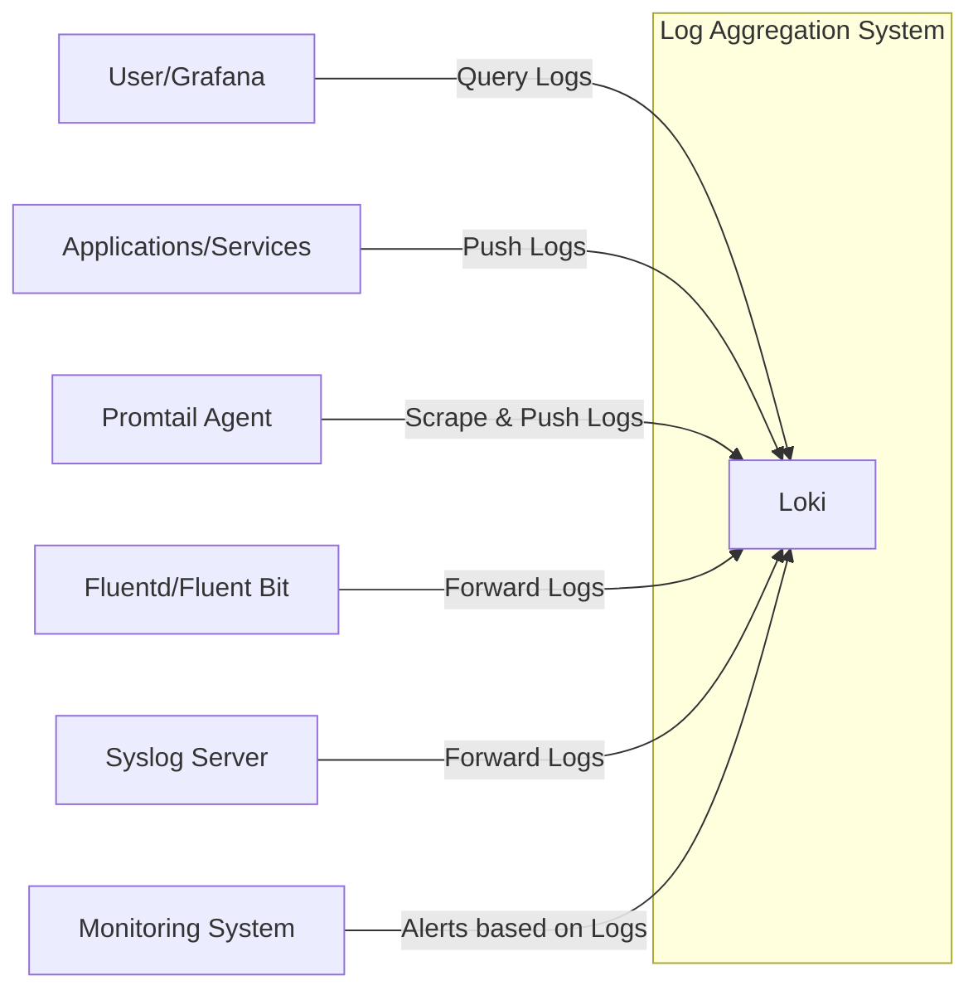
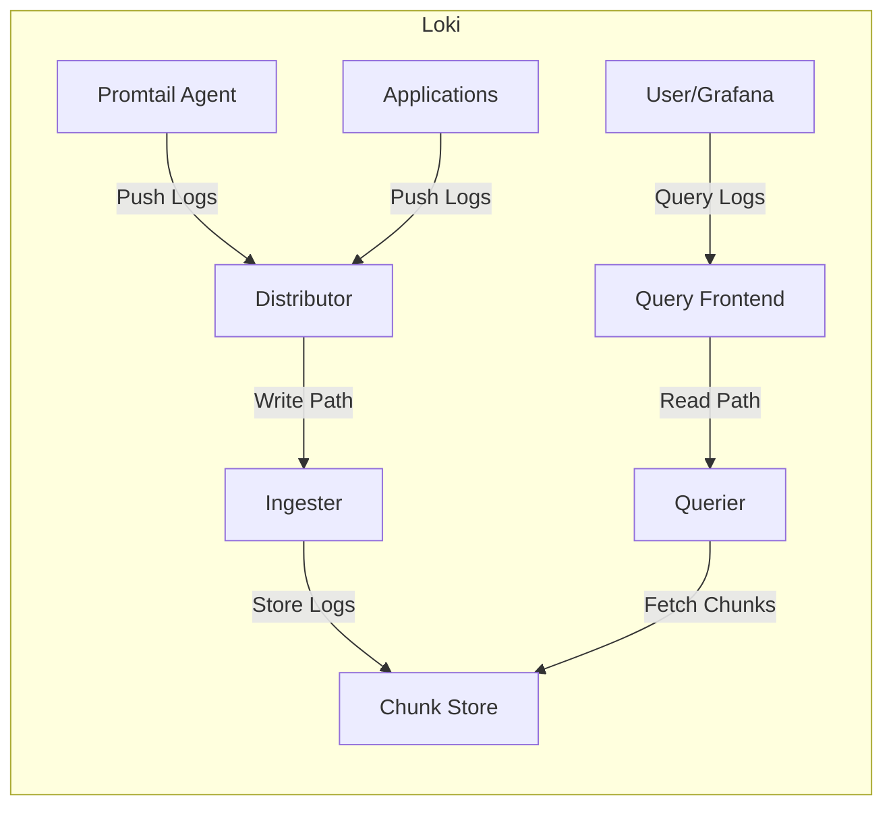
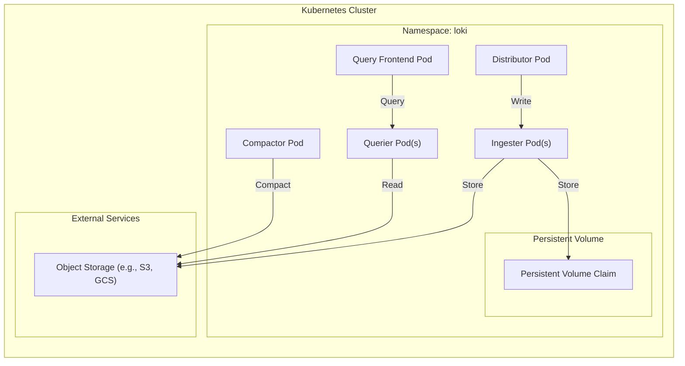
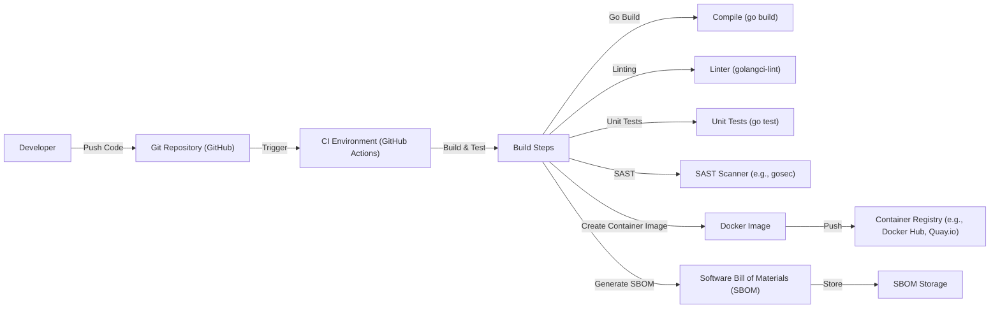

# Project Design Document: Grafana Loki

## BUSINESS POSTURE

Grafana Loki is a horizontally-scalable, highly-available, multi-tenant log aggregation system inspired by Prometheus. It is designed to be very cost-effective and easy to operate. It does not index the contents of the logs, but rather a set of labels for each log stream.

Business Priorities:

*   Provide a cost-effective log aggregation solution.
*   Ensure high availability and scalability to handle large volumes of logs.
*   Support multi-tenancy to isolate logs from different sources or teams.
*   Integrate seamlessly with Grafana for visualization and analysis.
*   Offer easy operation and maintenance.

Business Goals:

*   Enable efficient troubleshooting and debugging of applications and infrastructure.
*   Facilitate real-time monitoring and alerting based on log data.
*   Provide a centralized repository for logs from various sources.
*   Support compliance and auditing requirements.

Most Important Business Risks:

*   Data loss: Loss of log data due to system failures or misconfiguration.
*   Unauthorized access: Unauthorized access to sensitive log data.
*   Performance degradation: Slow query performance or system instability under heavy load.
*   Lack of scalability: Inability to handle increasing log volumes as the organization grows.
*   Operational complexity: Difficulty in managing and maintaining the Loki system.

## SECURITY POSTURE

Existing Security Controls:

*   security control: Authentication: Loki supports authentication via various methods, including basic auth, and integration with external identity providers (described in Loki documentation).
*   security control: Authorization: Loki supports role-based access control (RBAC) to restrict access to specific logs and operations (described in Loki documentation).
*   security control: Encryption in transit: Communication between Loki components and clients can be secured using TLS (described in Loki configuration).
*   security control: Multi-tenancy: Loki's multi-tenant architecture provides isolation between different tenants' logs (built-in feature).
*   security control: Rate limiting: Loki provides configuration options to limit the rate of log ingestion and querying to prevent abuse and ensure system stability (described in Loki configuration).

Accepted Risks:

*   accepted risk: Limited log content indexing: Loki does not index the full content of logs, which may limit the ability to perform complex searches.
*   accepted risk: Potential for log data loss in certain failure scenarios: While Loki is designed for high availability, data loss is possible in extreme scenarios (e.g., simultaneous failure of multiple nodes).

Recommended Security Controls:

*   security control: Implement network policies to restrict access to Loki components.
*   security control: Enable audit logging to track all actions performed within Loki.
*   security control: Regularly review and update access control policies.
*   security control: Configure and monitor resource quotas to prevent resource exhaustion.
*   security control: Implement intrusion detection and prevention systems (IDS/IPS) to monitor network traffic for malicious activity.

Security Requirements:

*   Authentication:
    *   All users and services accessing Loki must be authenticated.
    *   Support for strong authentication mechanisms (e.g., multi-factor authentication) should be considered.
    *   Integration with existing identity providers is preferred.
*   Authorization:
    *   Access to logs and operations should be controlled based on the principle of least privilege.
    *   RBAC should be implemented to manage user permissions.
    *   Regular review and auditing of access control policies are required.
*   Input Validation:
    *   All input to Loki (e.g., log data, queries) should be validated to prevent injection attacks.
    *   Sanitize input to remove or escape potentially harmful characters.
*   Cryptography:
    *   All communication between Loki components and clients must be encrypted using TLS.
    *   Sensitive data at rest (e.g., API keys, passwords) should be encrypted.
    *   Use strong, industry-standard cryptographic algorithms and key lengths.

## DESIGN

### C4 CONTEXT

Element Descriptions:

*   Element:
    *   Name: User/Grafana
    *   Type: User/External System
    *   Description: Represents users interacting with Loki, primarily through Grafana dashboards.
    *   Responsibilities: Querying logs, creating visualizations, setting up alerts.
    *   Security controls: Authentication, Authorization (via Grafana and potentially Loki directly).

*   Element:
    *   Name: Applications/Services
    *   Type: Internal System
    *   Description: Represents applications and services that generate logs.
    *   Responsibilities: Generating log data.
    *   Security controls: Application-level security controls (e.g., input validation, secure coding practices).

*   Element:
    *   Name: Promtail Agent
    *   Type: External System
    *   Description: An agent that scrapes logs from local files and pushes them to Loki.
    *   Responsibilities: Scraping logs, adding labels, pushing logs to Loki.
    *   Security controls: Authentication, Encryption in transit (TLS).

*   Element:
    *   Name: Fluentd/Fluent Bit
    *   Type: External System
    *   Description: Log forwarders that can collect logs from various sources and forward them to Loki.
    *   Responsibilities: Collecting logs, transforming logs, forwarding logs to Loki.
    *   Security controls: Authentication, Encryption in transit (TLS).

*   Element:
    *   Name: Syslog Server
    *   Type: External System
    *   Description: A server that receives syslog messages and can be configured to forward them to Loki.
    *   Responsibilities: Receiving syslog messages, forwarding logs to Loki.
    *   Security controls: Authentication (if supported), Encryption in transit (if supported).

*   Element:
    *   Name: Loki
    *   Type: Internal System
    *   Description: The core log aggregation system.
    *   Responsibilities: Receiving logs, storing logs, providing a query API.
    *   Security controls: Authentication, Authorization, Encryption in transit (TLS), Rate limiting, Multi-tenancy.

*   Element:
    *   Name: Monitoring System
    *   Type: External System
    *   Description: System that monitors Loki and triggers alerts based on log data.
    *   Responsibilities: Monitoring Loki's health and performance, triggering alerts.
    *   Security controls: Authentication, Authorization.

### C4 CONTAINER

Element Descriptions:

*   Element:
    *   Name: Distributor
    *   Type: Container
    *   Description: Handles incoming log streams from clients (e.g., Promtail, applications).
    *   Responsibilities: Validating log entries, assigning timestamps, distributing logs to ingesters.
    *   Security controls: Authentication, Input validation, Rate limiting.

*   Element:
    *   Name: Ingester
    *   Type: Container
    *   Description: Writes log data to long-term storage (Chunk Store).
    *   Responsibilities: Building chunks of log data, compressing chunks, writing chunks to storage.
    *   Security controls: Authentication, Encryption in transit (to Chunk Store).

*   Element:
    *   Name: Chunk Store
    *   Type: Container
    *   Description: Stores the compressed chunks of log data. This can be a variety of backends (e.g., AWS S3, Google Cloud Storage, Cassandra, local filesystem).
    *   Responsibilities: Storing and retrieving log chunks.
    *   Security controls: Encryption at rest (depending on the storage backend), Access controls (depending on the storage backend).

*   Element:
    *   Name: Query Frontend
    *   Type: Container
    *   Description: Provides the query API and handles query planning and execution.
    *   Responsibilities: Receiving queries, splitting queries, routing queries to queriers, aggregating results.
    *   Security controls: Authentication, Authorization, Input validation, Rate limiting.

*   Element:
    *   Name: Querier
    *   Type: Container
    *   Description: Executes queries against the Chunk Store.
    *   Responsibilities: Fetching relevant chunks from the Chunk Store, filtering and processing log data, returning results.
    *   Security controls: Authentication, Encryption in transit (to Chunk Store).

*   Element:
    *   Name: User/Grafana
    *   Type: External System
    *   Description: Represents users interacting with Loki, primarily through Grafana dashboards.
    *   Responsibilities: Querying logs, creating visualizations, setting up alerts.
    *   Security controls: Authentication, Authorization (via Grafana and potentially Loki directly).

*   Element:
    *   Name: Promtail Agent
    *   Type: External System
    *   Description: An agent that scrapes logs from local files and pushes them to Loki.
    *   Responsibilities: Scraping logs, adding labels, pushing logs to Loki.
    *   Security controls: Authentication, Encryption in transit (TLS).

*   Element:
    *   Name: Applications
    *   Type: External System
    *   Description: Represents applications and services that generate logs.
    *   Responsibilities: Generating log data.
    *   Security controls: Application-level security controls (e.g., input validation, secure coding practices).

### DEPLOYMENT

Deployment Solutions:

1.  Kubernetes: Using Helm charts or Kubernetes operators for deployment.
2.  Docker Compose: For simpler deployments, especially for testing or development.
3.  Bare Metal/Virtual Machines: Manual installation and configuration on servers.

Chosen Solution: Kubernetes (using Helm)

Element Descriptions:

*   Element:
    *   Name: Distributor Pod
    *   Type: Kubernetes Pod
    *   Description: Runs the Loki Distributor service.
    *   Responsibilities: Handles incoming log streams.
    *   Security controls: Network policies, Service Account with limited permissions.

*   Element:
    *   Name: Ingester Pod(s)
    *   Type: Kubernetes Pod
    *   Description: Runs the Loki Ingester service. Multiple pods for high availability.
    *   Responsibilities: Writes log data to storage.
    *   Security controls: Network policies, Service Account with limited permissions, Resource quotas.

*   Element:
    *   Name: Querier Pod(s)
    *   Type: Kubernetes Pod
    *   Description: Runs the Loki Querier service. Multiple pods for high availability.
    *   Responsibilities: Executes queries.
    *   Security controls: Network policies, Service Account with limited permissions, Resource quotas.

*   Element:
    *   Name: Query Frontend Pod
    *   Type: Kubernetes Pod
    *   Description: Runs the Loki Query Frontend service.
    *   Responsibilities: Provides the query API.
    *   Security controls: Network policies, Service Account with limited permissions, Resource quotas.

*   Element:
    *   Name: Compactor Pod
    *   Type: Kubernetes Pod
    *   Description: Runs the Loki Compactor service.
    *   Responsibilities: Optimizes chunk storage.
    *   Security controls: Network policies, Service Account with limited permissions.

*   Element:
    *   Name: Persistent Volume Claim (PVC)
    *   Type: Kubernetes Persistent Volume Claim
    *   Description: Requests storage for Ingesters to store index and temporary data.
    *   Responsibilities: Providing persistent storage.
    *   Security controls: Access controls on the underlying storage.

*   Element:
    *   Name: Object Storage (e.g., S3, GCS)
    *   Type: External Service
    *   Description: Provides long-term storage for log chunks.
    *   Responsibilities: Storing and retrieving log chunks.
    *   Security controls: Encryption at rest, Access controls (IAM roles/policies).

### BUILD

The build process for Grafana Loki involves several steps, from compiling the source code to creating container images and publishing them.  Security is integrated throughout the process.

Build Process Description:

1.  Developer pushes code changes to the Git repository (GitHub).
2.  The push triggers a workflow in the CI environment (GitHub Actions).
3.  Build Steps:
    *   Compile: The Go code is compiled using `go build`.
    *   Linter: A linter (e.g., `golangci-lint`) checks the code for style and potential errors.
    *   Unit Tests: Unit tests are run using `go test`.
    *   SAST Scanner: A Static Application Security Testing (SAST) scanner (e.g., `gosec`) analyzes the code for security vulnerabilities.
    *   Create Container Image: A Docker image is created using a Dockerfile.
    *   Generate SBOM: A Software Bill of Materials (SBOM) is generated, listing all dependencies and their versions.
4.  The Docker image is pushed to a container registry (e.g., Docker Hub, Quay.io).
5.  The SBOM is stored for later analysis and vulnerability management.

Security Controls:

*   security control: Code Review: All code changes are reviewed by other developers before being merged.
*   security control: Linting: `golangci-lint` enforces coding standards and helps prevent common errors.
*   security control: Unit Tests: `go test` ensures that individual components of the code function correctly.
*   security control: SAST: `gosec` identifies potential security vulnerabilities in the code.
*   security control: SBOM Generation: Provides transparency into the software supply chain and helps track vulnerabilities in dependencies.
*   security control: Container Image Scanning: Container images should be scanned for vulnerabilities before deployment (not explicitly shown in the build diagram, but a crucial step before deployment).

## RISK ASSESSMENT

Critical Business Processes:

*   Log ingestion: Ensuring that logs are reliably collected from all sources.
*   Log storage: Maintaining the integrity and availability of stored logs.
*   Log querying: Providing fast and efficient access to logs for analysis and troubleshooting.
*   Alerting: Triggering timely alerts based on log data.

Data Sensitivity:

*   Log data can contain sensitive information, including:
    *   Personally Identifiable Information (PII)
    *   Authentication credentials
    *   Financial data
    *   Internal system details
    *   Security-related events

Data Sensitivity Levels:

*   High: Logs containing PII, credentials, or financial data.
*   Medium: Logs containing internal system details or security-related events.
*   Low: General application logs with minimal sensitive information.

## QUESTIONS & ASSUMPTIONS

Questions:

*   What specific compliance requirements (e.g., GDPR, HIPAA) apply to the log data?
*   What are the expected log ingestion rates and query loads?
*   What are the retention policies for different types of log data?
*   What are the existing monitoring and alerting infrastructure and processes?
*   What are the specific requirements for integration with other systems (e.g., SIEM)?
*   What is acceptable downtime for the system?
*   What level of support will be provided for the system?
*   What is the budget for the project?

Assumptions:

*   BUSINESS POSTURE: The organization prioritizes cost-effectiveness, scalability, and ease of operation for its log aggregation solution.
*   SECURITY POSTURE: The organization has a moderate risk appetite and is willing to accept some limitations in log indexing for the sake of cost and performance.
*   DESIGN: The Kubernetes deployment model is suitable for the organization's infrastructure and operational capabilities. The use of object storage (e.g., S3, GCS) is acceptable for long-term log storage. The build process described is aligned with the organization's development practices.