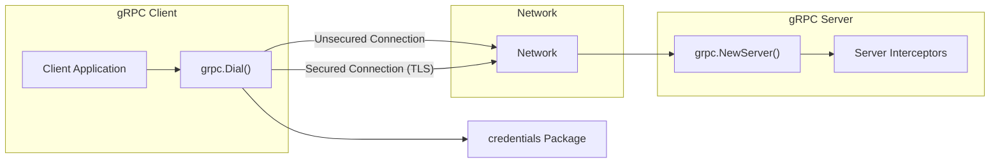

Here's an updated threat list focusing on high and critical threats directly involving the `grpc-go` library:

*   **Threat:** Unencrypted Communication (Eavesdropping)
    *   **Description:** An attacker intercepts network traffic because `grpc.Dial()` on the client or `grpc.NewServer()` on the server is not configured to use TLS, allowing eavesdropping on sensitive data transmitted in plaintext.
    *   **Impact:** Confidential data, such as user credentials, personal information, or business secrets, can be exposed to unauthorized parties.
    *   **Affected Component:** `grpc.Dial()` (when not configured with TLS), `grpc.NewServer()` (when not configured with TLS), `credentials` package.
    *   **Risk Severity:** Critical
    *   **Mitigation Strategies:**
        *   **Enforce TLS:** Always configure `grpc.Dial()` on the client and `grpc.NewServer()` on the server to use secure transport credentials (`credentials.NewTLS`).
        *   **Disable insecure connections:** Ensure no configuration allows for unencrypted connections.

*   **Threat:** Man-in-the-Middle (MITM) Attack
    *   **Description:** An attacker intercepts communication between the client (using `grpc.Dial()`) and server (using `grpc.NewServer()`), potentially eavesdropping or modifying messages. This can occur if TLS is not properly configured or if certificate validation is missing or flawed.
    *   **Impact:**  Data can be stolen, modified, or injected. The attacker can perform actions on behalf of the legitimate client or server.
    *   **Affected Component:** `grpc.Dial()`, `grpc.NewServer()`, `credentials` package (TLS configuration).
    *   **Risk Severity:** Critical
    *   **Mitigation Strategies:**
        *   **Mutual TLS (mTLS):** Implement mTLS where both the client and server authenticate each other using certificates configured via the `credentials` package.
        *   **Verify Server Certificate:** Ensure the client verifies the server's certificate against a trusted Certificate Authority (CA) when using `credentials.NewClientTLSFromCert`.
        *   **Secure Key Management:** Protect private keys used for TLS certificates.

*   **Threat:** Weak or Missing Client Authentication
    *   **Description:** The server, configured using `grpc.NewServer()` and potentially interceptors, does not properly verify the identity of the client making the gRPC request. This could be due to misconfiguration of authentication interceptors or reliance on insecure authentication methods.
    *   **Impact:** Unauthorized clients can access and manipulate data or services.
    *   **Affected Component:** Server Interceptors, `credentials` package (authentication configuration within interceptors or server options).
    *   **Risk Severity:** Critical
    *   **Mitigation Strategies:**
        *   **Implement Authentication Interceptors:** Use unary or stream interceptors to verify client credentials (e.g., API keys, JWTs, mTLS certificates) before processing requests.
        *   **Choose Strong Authentication Methods:** Select authentication methods appropriate for the application's security requirements and ensure they are correctly implemented within `grpc-go`.
        *   **Secure Credential Handling:** Ensure that any credentials passed through `grpc-go` are handled securely.

*   **Threat:** Denial of Service (DoS) via Large Messages
    *   **Description:** An attacker sends excessively large gRPC messages to the server, exploiting the default or misconfigured `grpc.MaxRecvMsgSize` option, consuming significant server resources (memory, CPU) and potentially causing it to crash or become unresponsive.
    *   **Impact:**  The server becomes unavailable to legitimate clients.
    *   **Affected Component:** `grpc.ServerOptions` (`MaxRecvMsgSize`), `grpc.DialOptions` (`MaxCallSendMsgSize`).
    *   **Risk Severity:** High
    *   **Mitigation Strategies:**
        *   **Set Message Size Limits:** Configure `grpc.MaxRecvMsgSize` on the server and `grpc.MaxCallSendMsgSize` on the client to limit the maximum allowed message size.
        *   **Implement Request Throttling/Rate Limiting:** Limit the number of requests a client can send within a specific time frame, potentially using interceptors.

*   **Threat:** Vulnerable Interceptors
    *   **Description:** Custom interceptors, registered with `grpc.NewServer()`, implemented for authentication, logging, or other purposes contain security vulnerabilities (e.g., injection flaws, insecure logging) that can be exploited by malicious clients.
    *   **Impact:**  Attackers can bypass security checks, gain unauthorized access, or inject malicious code that is executed within the server's context.
    *   **Affected Component:** Custom interceptor implementations registered with `grpc.Server`.
    *   **Risk Severity:** High
    *   **Mitigation Strategies:**
        *   **Secure Coding Practices:** Follow secure coding guidelines when developing interceptors.
        *   **Thorough Testing:**  Perform thorough security testing of all custom interceptors.
        *   **Code Review:** Conduct regular code reviews of interceptor implementations.

*   **Threat:** Dependency Vulnerabilities in `grpc-go`
    *   **Description:** Vulnerabilities exist within the `grpc-go` library itself or its direct dependencies.
    *   **Impact:**  The application becomes vulnerable to exploits targeting those dependencies, potentially leading to remote code execution, denial of service, or information disclosure.
    *   **Affected Component:** The `grpc-go` library and its direct dependencies as listed in `go.mod`.
    *   **Risk Severity:** Varies depending on the specific vulnerability, but can be critical.
    *   **Mitigation Strategies:**
        *   **Keep Dependencies Updated:** Regularly update the `grpc-go` library to the latest stable version to benefit from security patches.
        *   **Dependency Scanning:** Use tools to scan the project's dependencies for known security vulnerabilities.