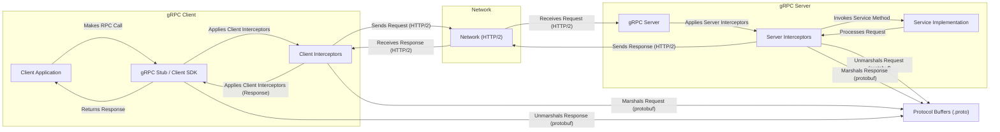
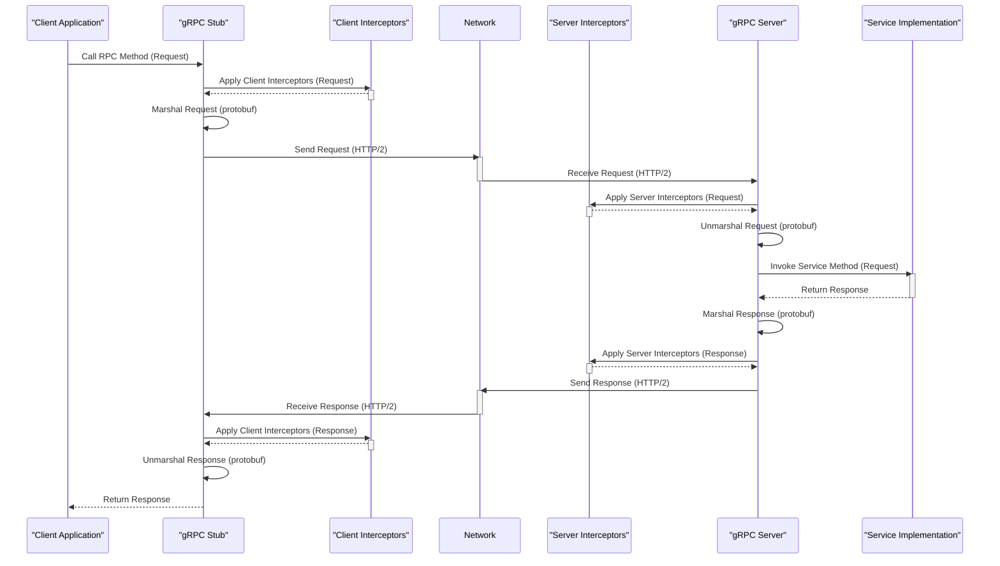

# Project Design Document: gRPC-Go (Improved)

**Version:** 1.1
**Date:** October 26, 2023
**Author:** AI Software Architect

## 1. Introduction

This document provides an enhanced architectural design overview of the gRPC-Go project, based on the codebase available at [https://github.com/grpc/grpc-go](https://github.com/grpc/grpc-go). This revised document aims for greater clarity and detail regarding the system's components, their interactions, and data flow, specifically tailored for subsequent threat modeling activities.

gRPC-Go is the Go implementation of the gRPC framework, a high-performance, open-source universal RPC framework. It provides the foundational infrastructure for building distributed applications and microservices by enabling efficient and type-safe communication between client and server applications.

## 2. Goals and Objectives

The primary goals of gRPC-Go are:

* **High Performance Communication:** Facilitate rapid and efficient communication between services, minimizing latency and maximizing throughput through the use of HTTP/2.
* **Strictly Typed Interfaces:** Enforce strong typing and contract-based development using Protocol Buffers (protobuf) for defining service contracts, ensuring type safety, and enabling automated code generation.
* **Extensibility and Customization:** Offer well-defined extension points, particularly through interceptors, allowing for the seamless integration of various functionalities like authentication, authorization, monitoring, logging, and custom error handling.
* **Interoperability:** Maintain seamless compatibility and integration with other gRPC implementations across diverse programming languages and platforms.
* **Simplified Development Experience:** Provide a developer-friendly and intuitive API for defining, implementing, and consuming gRPC services in Go.
* **Secure Communication Channels:** Offer robust mechanisms for establishing secure communication channels, primarily leveraging TLS for encryption and authentication.

## 3. System Architecture

The following diagram illustrates the high-level architecture of a gRPC-Go application, emphasizing the interaction between key components:

**Key Architectural Components:**

* **Client Application:** The initiating application that invokes remote procedure calls defined in the gRPC service.
* **gRPC Stub / Client SDK:**  Generated Go code from the `.proto` service definition. It provides type-safe methods for invoking server-side functions, handling request marshaling, response unmarshaling, and connection management.
* **Client Interceptors:**  Customizable functions that intercept outgoing RPC calls on the client-side. They can be used for cross-cutting concerns like logging, authentication token injection, metrics collection, and error handling.
* **Network (HTTP/2):** The underlying transport protocol for gRPC, providing features like multiplexing, header compression, and server push, crucial for performance.
* **gRPC Server:** The application that listens for and processes incoming RPC requests. It manages connection handling, request demultiplexing, and dispatching to the appropriate service implementation.
* **Server Interceptors:** Customizable functions that intercept incoming RPC calls on the server-side. They are used for tasks such as authentication, authorization, logging, request validation, and metrics collection.
* **Service Implementation:** The Go code that implements the business logic for the methods defined in the `.proto` service definition.
* **Protocol Buffers (.proto):** The core of gRPC's interface definition language (IDL). These files define the structure of messages exchanged between client and server and the service methods available.

## 4. Detailed Component Design

This section provides a more in-depth look at the key components within the gRPC-Go framework:

* **gRPC Core Functionality:**
    * **Transport Layer (HTTP/2 Implementation):**  gRPC-Go leverages the `net/http2` package for its HTTP/2 transport. This includes managing connections, streams, and frame processing.
    * **Connection Management:** Responsible for establishing, maintaining, and closing connections between clients and servers. This involves connection pooling, handling idle connections, and managing connection errors.
    * **Stream Management:**  Handles the lifecycle of individual RPC calls, which are mapped to HTTP/2 streams. This includes managing stream creation, data flow, and termination for unary, streaming, and bidirectional RPCs.
    * **Interceptors (Client and Server):**  Provide a powerful and flexible mechanism to intercept and augment the flow of RPC calls.
        * **Unary Interceptors:** Operate on single request-response cycles.
        * **Streaming Interceptors:** Operate on streams of messages.
        * Interceptors can modify requests and responses, handle errors, perform logging, and enforce security policies.
    * **Resolver:**  Responsible for translating service names into network addresses. gRPC-Go supports various resolvers, including DNS resolvers and custom implementations for service discovery systems.
    * **Balancer:**  Distributes client requests across multiple available server instances. gRPC-Go offers different load balancing policies (e.g., round-robin, pick-first) and allows for custom load balancers.
    * **Codec Framework:** Handles the serialization and deserialization of messages. Protocol Buffers is the default codec, but gRPC-Go supports pluggable codecs for other serialization formats.
    * **Error Handling and Status Codes:** Defines a standard set of error codes and mechanisms for propagating error information between client and server, providing rich error details.

* **Code Generation Tools (`protoc-gen-go-grpc`):**
    * The `protoc-gen-go-grpc` plugin for the Protocol Buffer compiler (`protoc`) is crucial for generating Go code from `.proto` files.
    * **Output includes:**
        * Go structs representing the message types defined in the `.proto` file.
        * Go interfaces defining the service contracts (both client and server sides).
        * Concrete stub implementations for clients to easily invoke RPC methods.
        * Server interface definitions that service implementations must satisfy.
        * Helper functions and constants for working with the generated code.

* **Security Infrastructure:**
    * **TLS (Transport Layer Security):**  gRPC-Go relies heavily on the standard Go `crypto/tls` package for implementing TLS.
        * Supports configuration of TLS credentials (certificates and private keys) for both clients and servers.
        * Enables encryption of all data in transit, protecting confidentiality.
        * Provides mechanisms for server and client authentication through certificate verification.
        * Supports mutual TLS (mTLS) for enhanced security, requiring both client and server to present valid certificates.
    * **Authentication Mechanisms (via Interceptors):** While TLS handles transport security, authentication verifies the identity of the client. This is typically implemented using interceptors:
        * **Token-based Authentication:**  Verifying bearer tokens (e.g., JWT) included in request metadata. Interceptors would validate the token signature and claims.
        * **Mutual TLS (mTLS) Authentication:** Leveraging the client certificate presented during the TLS handshake to authenticate the client. Server interceptors can extract and verify the client certificate.
        * **API Keys:**  Validating API keys passed in request metadata.
        * **Custom Authentication:**  Implementing custom authentication logic within interceptors based on specific application requirements.
    * **Authorization Mechanisms (via Interceptors):**  Authorization determines if an authenticated client has permission to perform a specific action. This is also typically handled by interceptors:
        * **Role-Based Access Control (RBAC):**  Checking if the client has the necessary roles to access the requested resource or method.
        * **Attribute-Based Access Control (ABAC):**  Evaluating a set of attributes related to the client, resource, and action to determine authorization.
        * Authorization logic often involves querying external policy engines or databases.

## 5. Data Flow (Detailed)

This section provides a more granular view of the data flow for a unary RPC call in gRPC-Go, including the role of interceptors:

1. **Client Initiates RPC Call:** The client application invokes a method on the generated gRPC stub, passing the request parameters.
2. **Client-Side Interceptor Chain:**
    * Before the request is sent, the configured client-side interceptors are executed in a defined order.
    * Interceptors can:
        * Inspect or modify the outgoing request message or metadata.
        * Perform authentication (e.g., add a bearer token to the metadata).
        * Log the request details.
        * Collect metrics about the call.
        * Potentially short-circuit the call or return an error.
3. **Request Marshaling:** The gRPC stub marshals the request message into a binary format using Protocol Buffers.
4. **Transmission over HTTP/2:** The marshaled request is sent over an established HTTP/2 connection to the server. This involves creating an HTTP/2 DATA frame containing the serialized protobuf message.
5. **Server Receives Request:** The gRPC server receives the incoming HTTP/2 request.
6. **Server-Side Interceptor Chain:**
    * Upon receiving the request, the configured server-side interceptors are executed.
    * Interceptors can:
        * Authenticate and authorize the client based on request metadata or connection information (e.g., mTLS certificate).
        * Log the incoming request.
        * Validate the request message.
        * Perform request routing or transformation.
        * Handle errors or security exceptions.
7. **Request Unmarshaling:** The gRPC server unmarshals the request message from its binary format using Protocol Buffers.
8. **Service Method Invocation:** The gRPC server dispatches the unmarshaled request to the appropriate method in the service implementation.
9. **Service Implementation Logic:** The service implementation processes the request and generates the response.
10. **Response Marshaling:** The gRPC server marshals the response message into a binary format using Protocol Buffers.
11. **Server-Side Interceptor Chain (Response):**
    * After the service method returns, server-side interceptors can process the outgoing response.
    * Interceptors can:
        * Inspect or modify the response message or metadata.
        * Log the response.
        * Add response headers.
        * Handle errors returned by the service implementation.
12. **Transmission over HTTP/2 (Response):** The marshaled response is sent back to the client over the HTTP/2 connection in an HTTP/2 DATA frame.
13. **Client Receives Response:** The client receives the HTTP/2 response.
14. **Client-Side Interceptor Chain (Response):**
    * Client-side interceptors can process the incoming response.
    * Interceptors can:
        * Inspect or modify the response message or metadata.
        * Log the response.
        * Handle errors returned by the server.
15. **Response Unmarshaling:** The gRPC stub unmarshals the response message from its binary format.
16. **Response Returned to Client Application:** The unmarshaled response is returned to the calling client application.

## 6. Security Considerations (Enhanced for Threat Modeling)

This section elaborates on security considerations, explicitly linking them to potential threats for effective threat modeling:

* **Transport Security (TLS):**
    * **Concern:** Lack of TLS or weak TLS configuration exposes data in transit to eavesdropping and tampering.
    * **Threats:** Man-in-the-middle (MITM) attacks, data interception, session hijacking.
    * **Mitigation:** Enforce TLS for all gRPC connections. Use strong cipher suites and ensure proper certificate management (rotation, revocation). Consider HTTP Strict Transport Security (HSTS).
* **Authentication:**
    * **Concern:** Inadequate or missing authentication allows unauthorized clients to access services.
    * **Threats:** Identity spoofing, unauthorized access to sensitive data and operations.
    * **Mitigation:** Implement robust authentication mechanisms using interceptors (e.g., JWT validation, mTLS). Securely manage and store authentication credentials.
* **Authorization:**
    * **Concern:** Insufficient authorization controls allow authenticated clients to perform actions they are not permitted to.
    * **Threats:** Privilege escalation, unauthorized data modification or deletion.
    * **Mitigation:** Implement fine-grained authorization policies using interceptors (RBAC, ABAC). Regularly review and update authorization rules.
* **Input Validation:**
    * **Concern:** Failure to validate input data can lead to various vulnerabilities.
    * **Threats:** Injection attacks (SQL injection, command injection), cross-site scripting (if responses are rendered in a web context), denial of service (by sending large or malformed requests).
    * **Mitigation:** Implement server-side input validation for all incoming messages. Validate data types, formats, and ranges. Sanitize input where necessary.
* **Dependency Management:**
    * **Concern:** Vulnerabilities in gRPC-Go dependencies can be exploited.
    * **Threats:** Exploitation of known vulnerabilities in third-party libraries.
    * **Mitigation:** Regularly update gRPC-Go and its dependencies to the latest versions. Use vulnerability scanning tools to identify and address known vulnerabilities.
* **Interceptor Security:**
    * **Concern:** Malicious or poorly implemented interceptors can introduce vulnerabilities.
    * **Threats:** Logging sensitive information, bypassing security checks, introducing new attack vectors.
    * **Mitigation:** Carefully review and test all custom interceptors. Ensure they follow secure coding practices and do not introduce new security risks. Avoid logging sensitive data in interceptors.
* **Denial of Service (DoS):**
    * **Concern:**  Services can be overwhelmed by malicious requests, leading to unavailability.
    * **Threats:** Service disruption, resource exhaustion.
    * **Mitigation:** Implement rate limiting, request size limits, and connection limits. Consider using a Web Application Firewall (WAF) or other protective measures.
* **Error Handling:**
    * **Concern:** Verbose error messages can leak sensitive information.
    * **Threats:** Information disclosure, aiding attackers in understanding the system's internals.
    * **Mitigation:** Avoid revealing sensitive details in error messages. Provide generic error messages to clients while logging detailed errors securely on the server-side.

## 7. Deployment Considerations

* **Infrastructure Choices:** gRPC-Go applications can be deployed across diverse infrastructure, including cloud platforms (AWS, Azure, GCP), containerized environments (Kubernetes, Docker), and traditional virtual machines or bare metal servers.
* **Load Balancing Strategies:** Employing load balancers is crucial for distributing traffic across multiple gRPC server instances, enhancing scalability, fault tolerance, and availability. Consider layer 4 (TCP) or layer 7 (application-aware) load balancing.
* **Service Discovery Integration:** Integrate with service discovery mechanisms (e.g., Consul, etcd, Kubernetes DNS) to enable clients to dynamically locate and connect to available server instances, especially in dynamic environments.
* **Monitoring and Observability:** Implement comprehensive monitoring and logging solutions to track the health, performance, and security of gRPC applications. Utilize metrics, tracing, and logging tools to gain insights into application behavior and identify potential issues.
* **Security Best Practices:** Adhere to general security best practices for application deployment, including secure configuration management, access control, and regular security audits.

## 8. Future Considerations

* **Performance Optimizations:** Continuously explore and implement performance enhancements within the gRPC-Go core, focusing on areas like connection pooling, stream management, and serialization efficiency.
* **Advanced Security Features:** Investigate and integrate advanced security features, such as fine-grained authorization frameworks, integration with hardware security modules (HSMs), and support for emerging security protocols.
* **Enhanced Observability Tools:** Develop and improve tooling for monitoring, tracing, and debugging gRPC applications, providing richer insights into request flow and performance bottlenecks.
* **Integration with Cloud-Native Ecosystem:** Deepen integration with cloud-native technologies and platforms, such as service meshes and serverless computing environments.

This improved design document offers a more detailed and comprehensive overview of the gRPC-Go project, with a strong emphasis on aspects relevant to threat modeling. By understanding the intricacies of the architecture, components, data flow, and security considerations, security professionals can more effectively identify potential vulnerabilities and formulate appropriate mitigation strategies.