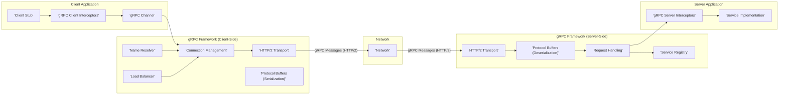
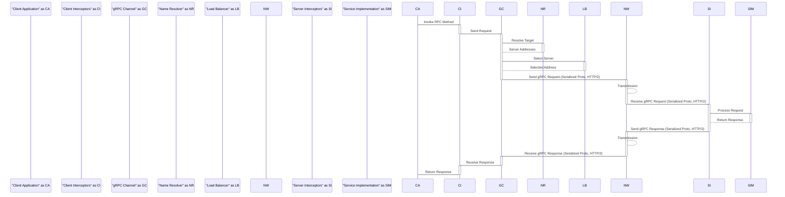

# Project Design Document: gRPC-Go

**Version:** 1.1
**Date:** October 26, 2023
**Author:** AI Software Architect

## 1. Introduction

This document provides an enhanced and more detailed design overview of the gRPC-Go project, as found in the GitHub repository [https://github.com/grpc/grpc-go](https://github.com/grpc/grpc-go). Building upon the previous version, this iteration further elaborates on the key architectural components, data flows, and functionalities of gRPC-Go, with a stronger emphasis on aspects relevant to threat modeling. It aims to provide a comprehensive and granular understanding of the library's internal workings and potential security considerations.

## 2. Goals and Objectives

The primary goal of gRPC-Go remains to provide a high-performance, open-source universal RPC framework in the Go programming language. Key objectives, with added nuance, include:

* **High Efficiency:** Enabling extremely fast and resource-efficient communication between services, minimizing latency and maximizing throughput.
* **Cross-Language Interoperability:** Seamlessly facilitating communication between services written in diverse programming languages through the standardized gRPC protocol.
* **Strict Contract Enforcement:** Leveraging Protocol Buffers for rigidly defining service contracts and data structures, ensuring type safety and preventing common integration errors.
* **Flexible Extensibility:** Providing robust and well-defined mechanisms for extending core functionality through interceptors, resolvers, and other extension points, allowing for customization and integration with various systems.
* **Robust Reliability:** Ensuring dependable and resilient communication, incorporating features like connection management, retry mechanisms, deadline propagation, and comprehensive error handling.

## 3. Architectural Overview

gRPC-Go meticulously implements the gRPC specification, offering a rich set of libraries and tools for constructing gRPC clients and servers within the Go ecosystem. Its foundation rests upon Protocol Buffers for defining service interfaces and message structures. The core architecture distinctly separates client-side and server-side components, which interact through the well-defined gRPC framework.

## 4. Detailed Component Design

This section provides a more granular breakdown of the key components within the gRPC-Go architecture, elaborating on their specific responsibilities.

### 4.1 Client-Side Components

* **Client Stub:** Auto-generated Go code derived from Protocol Buffer service definitions. It provides strongly-typed, language-idiomatic methods for invoking remote procedures on the server.
* **gRPC Client Interceptors:**  Middleware components that intercept and potentially modify outgoing client requests and incoming server responses. They offer a powerful mechanism for implementing cross-cutting concerns such as:
    * **Authentication:** Adding authentication tokens or credentials.
    * **Logging:** Recording request and response details.
    * **Metrics Collection:** Gathering performance data.
    * **Error Handling:** Implementing custom retry logic or error transformations.
    * **Unary Interceptors:** Operate on single request-response calls.
    * **Stream Interceptors:** Handle client-side, server-side, and bidirectional streaming calls.
* **gRPC Channel:** An abstraction representing the underlying connection(s) to the gRPC server. It manages:
    * **Connection Pooling:** Maintaining a pool of active connections for efficient reuse.
    * **Load Balancing:** Distributing requests across multiple server instances based on configured policies.
    * **Connection State Management:** Handling connection establishment, closure, and error recovery.
* **Connection Management:**  Specifically responsible for the lifecycle of connections to the server, including establishing new connections, handling connection failures, implementing retry strategies, and managing idle connections.
* **HTTP/2 Transport:** Implements the HTTP/2 protocol, the foundation for gRPC communication. Key responsibilities include:
    * **Framing:** Encapsulating gRPC messages into HTTP/2 frames.
    * **Flow Control:** Managing the rate of data transmission to prevent buffer overflows.
    * **Multiplexing:** Allowing multiple gRPC calls to share a single TCP connection.
    * **Header Compression (HPACK):** Efficiently compressing HTTP headers.
* **Protocol Buffers (Serialization):**  Handles the serialization of Go data structures into the compact, binary Protocol Buffer format before transmission over the network.
* **Name Resolver:**  Responsible for resolving the target address specified by the client into a list of server addresses. This can involve:
    * **DNS Lookups:** Querying DNS servers for A or AAAA records.
    * **Service Discovery Systems:** Integrating with systems like Consul, etcd, or Kubernetes DNS.
    * **Custom Resolvers:** Implementing custom logic for address resolution.
* **Load Balancer:**  Selects a specific server address from the list provided by the Name Resolver for each new RPC call. Different load balancing policies can be configured (e.g., round-robin, weighted round-robin, least connections).

### 4.2 Server-Side Components

* **gRPC Server Interceptors:** Middleware components that intercept incoming client requests and outgoing server responses. They provide similar functionality to client interceptors but operate on the server-side.
    * **Authentication:** Verifying client credentials.
    * **Authorization:** Determining if the client has permission to execute the requested method.
    * **Logging:** Recording request and response details.
    * **Metrics Collection:** Gathering performance data.
    * **Unary Interceptors:** Handle single request-response calls.
    * **Stream Interceptors:** Handle streaming calls.
* **Service Implementation:** The actual Go code that implements the business logic for the services defined in the Protocol Buffer service definitions. These implementations handle the incoming requests and generate the corresponding responses.
* **Request Handling:**  Receives incoming gRPC requests from the HTTP/2 transport, deserializes the message using Protocol Buffers, and dispatches the request to the appropriate method within the registered service implementation.
* **HTTP/2 Transport:** Implements the HTTP/2 protocol on the server-side, handling incoming client connections, managing request streams, and sending responses back to the client.
* **Protocol Buffers (Deserialization):**  Handles the deserialization of the binary Protocol Buffer messages received from the client back into Go data structures.
* **Service Registry:**  Maintains a mapping of service names to their corresponding implementations. When a request arrives, the Request Handling component uses the Service Registry to determine which service implementation should handle the request.

### 4.3 Core gRPC Functionality

* **Name Resolution:** (Described in Client-Side Components)
* **Load Balancing:** (Described in Client-Side Components)
* **Deadline Propagation:** Allows clients to set deadlines for RPC calls. This deadline is propagated to the server, allowing the server to stop processing the request if the deadline is exceeded, preventing resource wastage.
* **Error Handling:** Provides a standardized way to report errors during RPC calls, including specific status codes and detailed error messages that can be understood by both clients and servers.
* **Metadata Handling:** Enables clients and servers to exchange contextual information (key-value pairs) alongside RPC calls. This metadata can be used for authentication, tracing, or other purposes.

## 5. Data Flow

The following outlines a more detailed data flow for a unary gRPC call, highlighting the specific components involved at each stage:

1. **Client Invocation:** The client application calls a method on the generated **Client Stub**.
2. **Client Interceptor Chain:**  **gRPC Client Interceptors** are invoked sequentially. Each interceptor can inspect or modify the outgoing request.
3. **Message Serialization:** The request message is serialized into the Protocol Buffer binary format by the **Protocol Buffers (Serialization)** component.
4. **Channel Transmission:** The serialized message is handed to the **gRPC Channel**. The channel's **Load Balancer** selects a server address.
5. **Connection Management:** The **Connection Management** component ensures a connection exists to the selected server or establishes a new one.
6. **HTTP/2 Transport (Client):** The **HTTP/2 Transport** component frames the serialized message into HTTP/2 frames and sends them over the **Network**.
7. **Network Transmission:** The HTTP/2 frames are transmitted across the **Network**.
8. **HTTP/2 Transport (Server):** The server's **HTTP/2 Transport** component receives the HTTP/2 frames.
9. **Message Deserialization:** The received message is deserialized from the Protocol Buffer format by the **Protocol Buffers (Deserialization)** component.
10. **Server Interceptor Chain:** **gRPC Server Interceptors** are invoked sequentially. Each interceptor can inspect or modify the incoming request.
11. **Request Handling:** The **Request Handling** component uses the **Service Registry** to identify the appropriate **Service Implementation** method to invoke.
12. **Service Invocation:** The request is dispatched to the corresponding method in the **Service Implementation**.
13. **Service Processing:** The **Service Implementation** executes the business logic.
14. **Response Serialization:** The response message is serialized into the Protocol Buffer binary format by the **Protocol Buffers (Serialization)** component.
15. **Server Interceptor Chain (Response):** **gRPC Server Interceptors** are invoked for the outgoing response.
16. **HTTP/2 Transport (Server - Response):** The server's **HTTP/2 Transport** component frames the serialized response into HTTP/2 frames and sends them over the **Network**.
17. **Network Transmission (Response):** The HTTP/2 frames are transmitted across the **Network**.
18. **HTTP/2 Transport (Client):** The client's **HTTP/2 Transport** component receives the HTTP/2 frames.
19. **Message Deserialization (Response):** The response message is deserialized by the **Protocol Buffers (Deserialization)** component.
20. **Client Interceptor Chain (Response):** **gRPC Client Interceptors** are invoked for the incoming response.
21. **Client Callback:** The client application receives the deserialized response from the **Client Stub**.

## 6. Security Considerations

This section provides a more detailed examination of security aspects relevant to gRPC-Go, specifically focusing on potential threats and mitigation strategies.

* **Transport Security (TLS):** gRPC-Go strongly encourages and often defaults to using TLS (Transport Layer Security) for encrypting all communication between clients and servers. This is crucial for protecting against:
    * **Eavesdropping:** Preventing attackers from intercepting and reading sensitive data in transit.
    * **Man-in-the-Middle (MITM) Attacks:** Ensuring that communication is directly between the intended client and server, preventing attackers from intercepting and potentially manipulating messages.
    * **Configuration:** Proper configuration of TLS, including certificate management and cipher suite selection, is critical.
* **Authentication:** gRPC-Go supports various mechanisms for verifying the identity of clients:
    * **TLS Certificates (Mutual TLS - mTLS):** Both the client and server present certificates to verify each other's identities. This provides strong mutual authentication.
    * **Token-Based Authentication (e.g., JWT):** Clients include bearer tokens (often JSON Web Tokens) in the metadata of gRPC calls. Servers can then verify the authenticity and validity of these tokens.
    * **API Keys:** Simple keys passed in metadata for identifying clients. Less secure than other methods but can be suitable for certain use cases.
    * **Custom Authentication:** Interceptors can be used to implement custom authentication logic, integrating with existing authentication systems.
    * **Threats:** Lack of authentication allows unauthorized access to services. Weak authentication mechanisms can be compromised.
* **Authorization:** Once a client is authenticated, authorization determines what resources or methods the client is permitted to access.
    * **Role-Based Access Control (RBAC):** Assigning roles to users or clients and defining permissions for each role.
    * **Attribute-Based Access Control (ABAC):** Making access decisions based on attributes of the user, resource, and environment.
    * **Policy Enforcement Points:** Interceptors are commonly used as policy enforcement points to check authorization rules before allowing access to service methods.
    * **Threats:** Insufficient authorization can lead to clients accessing sensitive data or performing unauthorized actions.
* **Input Validation:**  Crucial for preventing various types of attacks:
    * **Injection Attacks (e.g., SQL Injection, Command Injection):**  Validating input data to prevent attackers from injecting malicious code.
    * **Buffer Overflows:** Ensuring that input data does not exceed expected limits, preventing memory corruption.
    * **Denial of Service (DoS):** Validating input to prevent the processing of excessively large or malformed requests that could overwhelm the server.
    * **Implementation:** Input validation should be performed within the **Service Implementation** logic.
* **Denial of Service (DoS) Protection:**  Strategies to mitigate DoS attacks:
    * **Request Limiting:** Limiting the number of requests a client can make within a specific time period.
    * **Connection Limiting:** Limiting the number of concurrent connections from a single client or IP address.
    * **Timeout Configuration:** Setting appropriate timeouts for RPC calls to prevent resources from being held indefinitely.
    * **Resource Quotas:** Limiting the amount of resources (e.g., memory, CPU) that can be consumed by individual requests or connections.
    * **gRPC-Go Features:**  gRPC-Go provides options for configuring maximum message sizes and other limits.
* **Dependency Management:**  Ensuring the security of third-party libraries used by gRPC-Go:
    * **Regular Updates:** Keeping dependencies up-to-date to patch known vulnerabilities.
    * **Vulnerability Scanning:** Using tools to scan dependencies for known security flaws.
    * **Supply Chain Security:** Being aware of the security practices of upstream dependencies.
* **Logging and Auditing:**  Essential for security monitoring and incident response:
    * **Detailed Logs:** Logging important events, such as authentication attempts, authorization decisions, and errors.
    * **Audit Trails:** Maintaining a record of actions performed by users or clients.
    * **Secure Storage:** Storing logs securely to prevent tampering.
* **Interceptor Security:**  Care must be taken when developing and deploying custom interceptors:
    * **Vulnerability Introduction:** Poorly written interceptors can introduce security vulnerabilities.
    * **Performance Impact:**  Inefficient interceptors can negatively impact performance.
    * **Security Reviews:**  Interceptors should undergo thorough security reviews.
* **Protocol Buffer Security:** While Protocol Buffers are generally secure, consider:
    * **Deserialization Vulnerabilities:**  Protecting against potential vulnerabilities in the deserialization process.
    * **Schema Validation:**  Ensuring that received messages conform to the expected schema.

## 7. Deployment Considerations

gRPC-Go applications can be deployed in various environments, each with its own security implications:

* **Cloud Environments (GCP, AWS, Azure):** Leverage cloud-provided security features like firewalls, network segmentation, and identity and access management (IAM).
* **Containerized Environments (Docker, Kubernetes):** Secure container images, implement network policies, and manage secrets securely.
* **On-Premise Data Centers:** Implement traditional network security measures, such as firewalls and intrusion detection systems.

Key deployment security considerations:

* **Secure Communication Channels:** Enforce TLS for all gRPC communication.
* **Authentication and Authorization Infrastructure:** Integrate with existing identity providers or implement robust authentication and authorization mechanisms.
* **Network Segmentation:** Isolate gRPC services within secure network segments.
* **Firewall Rules:** Configure firewalls to allow only necessary traffic to gRPC services.
* **Secrets Management:** Securely store and manage sensitive information like TLS certificates and API keys.
* **Monitoring and Alerting:** Implement monitoring and alerting for security-related events.

## 8. Future Considerations

Future security enhancements and considerations for gRPC-Go might include:

* **Standardized Authentication/Authorization Interceptors:** Providing more built-in and configurable interceptors for common security patterns.
* **Improved Integration with Security Tooling:**  Facilitating easier integration with security scanning and analysis tools.
* **Enhanced DoS Protection Mechanisms:**  Exploring more advanced techniques for mitigating DoS attacks.
* **Formal Security Audits:**  Conducting regular formal security audits of the gRPC-Go codebase.

This enhanced design document provides a more in-depth understanding of the gRPC-Go project, particularly focusing on aspects relevant to security and threat modeling. The detailed component descriptions, data flow diagrams, and comprehensive security considerations aim to equip security professionals with the necessary information to identify and mitigate potential vulnerabilities.