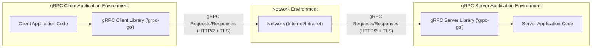

## gRPC-Go Project Design Document for Threat Modeling (Improved)

**Project:** gRPC-Go

**Project Link:** [https://github.com/grpc/grpc-go](https://github.com/grpc/grpc-go)

**Document Version:** 1.1

**Date:** 2023-10-27

**Author:** AI Expert (Based on User Request)

---

### 1. Project Overview

**1.1. Introduction**

gRPC is a high-performance, open-source universal RPC framework, originating from Google, designed for building distributed applications and microservices. It leverages Protocol Buffers for interface definition and message serialization, ensuring efficiency and language neutrality. `grpc-go` is the Go implementation of gRPC, providing the necessary libraries to develop both gRPC clients and servers in Go.

Key features of `grpc-go` include:

*   **Protocol Buffers (protobuf):**  Efficient serialization and a strongly-typed IDL for defining services and messages.
*   **HTTP/2 Transport:**  Enables multiplexing, header compression, and flow control for optimized communication.
*   **Streaming RPCs:** Supports bidirectional, server-side, and client-side streaming for real-time data exchange.
*   **Interceptors:**  Provides a powerful mechanism for middleware to handle cross-cutting concerns like authentication, logging, and monitoring.
*   **Transport Layer Security (TLS/SSL):**  Built-in support for securing communication with encryption and authentication.
*   **Authentication and Authorization:**  Extensible framework for implementing various authentication and authorization strategies.
*   **Load Balancing:**  Supports client-side and server-side load balancing for scalable deployments.
*   **Reflection:**  Allows runtime service discovery and introspection, primarily for development and debugging.

This document provides a detailed design overview of `grpc-go` specifically tailored for threat modeling exercises. It aims to clearly articulate the architecture, components, and data flow, highlighting security-relevant aspects to facilitate a comprehensive threat analysis.

**1.2. Goals**

*   To deliver a clear, concise, and detailed design document of `grpc-go` architecture.
*   To pinpoint key components and their interactions with a focus on security implications.
*   To identify potential security vulnerabilities and areas requiring in-depth threat modeling.
*   To serve as a practical resource for conducting threat modeling on systems built using `grpc-go`.

**1.3. Target Audience**

*   Security Architects and Engineers responsible for securing gRPC-based systems.
*   Software Developers utilizing `grpc-go` for building microservices and distributed applications.
*   Threat Modeling Specialists tasked with analyzing gRPC deployments.
*   Anyone seeking a deeper understanding of `grpc-go`'s security architecture.

---

### 2. System Architecture

**2.1. High-Level Architecture Diagram**

**2.2. Component Description**

*   **gRPC Client Library ('grpc-go'):**
    *   **Functionality:**  Provides Go APIs for client-side gRPC operations. Manages connection lifecycle, serializes requests using Protocol Buffers, transmits requests over HTTP/2, handles responses, and executes client-side interceptors.
    *   **Security Relevance:** Crucial for establishing secure TLS connections, managing client authentication credentials (e.g., certificates, tokens), and enforcing client-side security policies via interceptors. Vulnerabilities here can directly compromise client security and potentially impact server security if malicious clients are created.

*   **gRPC Server Library ('grpc-go'):**
    *   **Functionality:** Provides Go APIs for server-side gRPC operations. Listens for incoming HTTP/2 connections, manages connections, deserializes requests, dispatches requests to service handlers, serializes responses, and executes server-side interceptors.
    *   **Security Relevance:** Responsible for enforcing server-side security policies, handling authentication and authorization decisions, and protecting server resources from malicious or unintended access. Vulnerabilities in this component can lead to server compromise, data breaches, and service disruption.

*   **gRPC Client Application Code:**
    *   **Functionality:**  The application-specific Go code that uses the `grpc-go` client library to interact with gRPC services. Defines client-side business logic and utilizes generated gRPC client stubs.
    *   **Security Relevance:** Responsible for secure usage of the `grpc-go` library, proper handling of sensitive data within the application, and implementing application-level security measures. Application-level vulnerabilities can negate the security provided by the gRPC framework itself. *Example: Storing sensitive credentials insecurely in client application code.*

*   **gRPC Server Application Code:**
    *   **Functionality:** The application-specific Go code that implements the gRPC service logic. Registers service handlers with the `grpc-go` server, implementing the business logic for each RPC method defined in the protobuf service definition.
    *   **Security Relevance:**  Responsible for implementing secure service logic, including robust input validation, proper authorization checks, and secure handling of sensitive data within the service implementation. Service handler vulnerabilities are a primary target for attackers. *Example: SQL injection vulnerability in a service handler that interacts with a database.*

*   **Network (Internet/Intranet):**
    *   **Functionality:** The underlying network infrastructure facilitating gRPC communication. Can be a public network (Internet) or a private network (Intranet/VPC).
    *   **Security Relevance:** The network environment introduces inherent threats like eavesdropping and man-in-the-middle attacks. Secure network configurations, firewalls, and network segmentation are essential. gRPC relies on TLS to mitigate network-level threats to data in transit.

*   **Interceptors (Client & Server):**
    *   **Functionality:** Middleware components that intercept and process gRPC requests and responses. They provide a modular way to implement cross-cutting concerns without modifying core service or client logic. Interceptors can be chained and executed in a specific order.
    *   **Security Relevance:** Interceptors are powerful for implementing security features (authentication, authorization, logging, rate limiting, input validation). However, poorly designed or misconfigured interceptors can introduce vulnerabilities or bypass intended security controls. *Example: A poorly written logging interceptor that leaks sensitive data.*

*   **HTTP/2 Transport (with TLS):**
    *   **Functionality:** `grpc-go` uses HTTP/2 as its primary transport protocol, leveraging its performance benefits. TLS is typically used on top of HTTP/2 to provide secure communication.
    *   **Security Relevance:** HTTP/2 itself has security considerations, and proper TLS configuration is paramount. Vulnerabilities in the HTTP/2 implementation or TLS configuration can compromise confidentiality and integrity.  *Example: Using weak TLS cipher suites or outdated TLS versions.*

*   **Authentication and Authorization Mechanisms:**
    *   **Functionality:** `grpc-go` supports various authentication methods, including TLS client certificates (mTLS), OAuth 2.0, API keys, and custom authentication via interceptors. Authorization is typically implemented within server application code or through dedicated authorization interceptors.
    *   **Security Relevance:** Robust authentication and authorization are critical for securing gRPC services. Weak or misconfigured mechanisms can lead to unauthorized access and data breaches. *Example: Missing authorization checks in service handlers, allowing any authenticated user to access any resource.*

*   **Protocol Buffers (protobuf):**
    *   **Functionality:** Serves as the Interface Definition Language (IDL) and the message serialization format. Defines the structure of services and messages exchanged in gRPC.
    *   **Security Relevance:** Well-defined protobuf schemas contribute to preventing certain data parsing and injection vulnerabilities. However, vulnerabilities can still arise from improper schema design or insecure handling of protobuf messages in application code. *Example: Defining overly permissive message schemas that allow for large or deeply nested messages, leading to DoS vulnerabilities.*

*   **Reflection Service:**
    *   **Functionality:** A gRPC service that allows clients to discover service definitions and method signatures at runtime. Primarily intended for development, debugging, and tooling.
    *   **Security Relevance:** Exposing the reflection service in production environments can reveal sensitive information about internal APIs to potential attackers, aiding in reconnaissance. It should generally be disabled or strictly controlled in production deployments.

---

### 3. Data Flow Diagram

```mermaid
graph LR
    subgraph "gRPC Client"
        A["Client Application"] --> B["gRPC Client Library"];
        B --> C["Client Request Interceptor(s)"];
        C --> D["Request Encoder (protobuf)"];
        D --> E["HTTP/2 + TLS Transport"];
    end
    subgraph "Network"
        E --> F["Network"];
        F --> G["HTTP/2 + TLS Transport"];
    end
    subgraph "gRPC Server"
        G --> H["Request Decoder (protobuf)"];
        H --> I["Server Request Interceptor(s)"];
        I --> J["Service Handler"];
        J --> K["Response Encoder (protobuf)"];
        K --> L["Server Response Interceptor(s)"];
        L --> G;
    end
```

**Data Flow Description:**

1.  **Client Application initiates gRPC Call:** The client application invokes a gRPC method through the generated client stub, passing request parameters.
2.  **gRPC Client Library Processing:** The `grpc-go` client library receives the call.
3.  **Client Request Interceptor Chain:** Client-side interceptors are executed in a configured order. These can modify the request (e.g., add authentication headers), log requests, or perform other pre-processing tasks.
4.  **Request Encoding (protobuf):** The request message is serialized into a binary format using Protocol Buffers based on the service definition.
5.  **HTTP/2 + TLS Transport:** The encoded request is transmitted over an HTTP/2 connection, secured with TLS for encryption and integrity.
6.  **Network Transit:** The request travels across the network to the gRPC server.
7.  **HTTP/2 + TLS Transport (Server-side):** The gRPC server receives the request over HTTP/2. TLS decryption is performed if enabled.
8.  **Request Decoding (protobuf):** The received binary data is deserialized back into a structured message using Protocol Buffers.
9.  **Server Request Interceptor Chain:** Server-side interceptors are executed. These can perform authentication, authorization, logging, input validation, or other pre-processing tasks before the request reaches the service handler.
10. **Service Handler Execution:** The decoded request is dispatched to the appropriate service handler in the server application code. The service handler executes the core business logic and generates a response.
11. **Response Encoding (protobuf):** The response message from the service handler is serialized into a binary format using Protocol Buffers.
12. **Server Response Interceptor Chain:** Server-side response interceptors are executed. These can modify the response, log responses, or perform other post-processing tasks.
13. **HTTP/2 + TLS Transport (Response):** The encoded response is sent back to the client over the secure HTTP/2 connection.

---

### 4. Security Considerations

**4.1. Confidentiality**

*   **TLS Encryption (Mandatory):**  Enforce TLS for all gRPC communication to protect data in transit from eavesdropping.
    *   **Strong Cipher Suites:** Configure servers and clients to use strong and up-to-date cipher suites. *Example: Preferring AES-GCM based ciphers over CBC.*
    *   **TLS Certificate Management:** Implement robust certificate management practices, including secure generation, storage, rotation, and revocation of TLS certificates.
    *   **Minimum TLS Version:** Enforce a minimum TLS version of 1.2 or preferably 1.3 to mitigate vulnerabilities in older TLS versions.
*   **Data at Rest Security:** While `grpc-go` focuses on transit security, consider data at rest encryption and access control within client and server application environments, especially for sensitive data processed by gRPC services.

**4.2. Integrity**

*   **HTTP/2 Features:** HTTP/2 provides built-in mechanisms for data integrity during transmission.
*   **Protocol Buffers Serialization:** Protocol Buffers ensure data structure integrity during serialization and deserialization, preventing data corruption during processing.
*   **Message Signing (Application-Level - Optional but Recommended for High-Value Data):** For critical applications requiring end-to-end integrity beyond transport layer security, consider implementing application-level message signing using cryptographic signatures. This is not directly provided by `grpc-go` but can be added via interceptors and application logic.

**4.3. Availability**

*   **Denial of Service (DoS) & Distributed Denial of Service (DDoS) Mitigation:** gRPC servers are vulnerable to DoS/DDoS attacks. Implement robust mitigation strategies:
    *   **Rate Limiting:** Implement rate limiting at the server level (e.g., using interceptors or reverse proxies) to restrict the number of requests from a single client or source IP within a given time frame.
    *   **Request Size Limits:** Enforce limits on maximum request sizes to prevent resource exhaustion from excessively large requests.
    *   **Connection Limits:** Limit the maximum number of concurrent connections to prevent connection exhaustion attacks.
    *   **Resource Quotas:** Implement resource quotas (CPU, memory) at the operating system or container level to limit resource consumption by gRPC server processes.
    *   **Load Balancing & Scalability:** Deploy gRPC servers behind load balancers to distribute traffic and enhance resilience against DoS/DDoS attacks. Scale server instances horizontally to handle increased traffic.
*   **Resource Exhaustion Prevention:** Protect against resource exhaustion vulnerabilities within service handlers and interceptors:
    *   **Input Validation (Prevent Processing of Malicious Inputs):** Thorough input validation in service handlers and interceptors is crucial to prevent processing of malicious or malformed requests that could lead to resource exhaustion.
    *   **Efficient Algorithms & Data Structures:** Use efficient algorithms and data structures in service handlers to minimize resource consumption during request processing.
    *   **Circuit Breakers & Timeouts:** Implement circuit breakers and timeouts to prevent cascading failures and resource exhaustion in dependent services.

**4.4. Authentication and Authorization**

*   **Robust Authentication Mechanisms:** Select and implement appropriate authentication mechanisms based on security requirements:
    *   **Mutual TLS (mTLS) with Client Certificates:** Provides strong client authentication by verifying client certificates against a trusted Certificate Authority. Recommended for machine-to-machine communication within trusted environments.
    *   **OAuth 2.0/OpenID Connect:** Suitable for user authentication and authorization, especially in scenarios involving web or mobile clients. Integrate with identity providers for centralized user management.
    *   **API Keys:** Simpler authentication mechanism for less sensitive APIs or for scenarios where client identity is less critical. Securely manage and rotate API keys.
    *   **Custom Authentication (via Interceptors):** Allows for implementing custom authentication logic tailored to specific application needs. Requires careful design and implementation to avoid security vulnerabilities.
*   **Granular Authorization:** Implement fine-grained authorization controls to restrict access to specific gRPC services and methods based on authenticated identities and roles.
    *   **Role-Based Access Control (RBAC):** Implement RBAC to manage user permissions based on roles.
    *   **Attribute-Based Access Control (ABAC):** For more complex authorization requirements, consider ABAC, which allows for authorization decisions based on attributes of the user, resource, and environment.
    *   **Authorization Interceptors:** Utilize authorization interceptors to enforce authorization policies consistently across all gRPC methods.
*   **Secure Credential Management:** Implement secure practices for managing authentication credentials:
    *   **Secret Storage:** Store secrets (private keys, API keys, OAuth client secrets) securely using dedicated secret management solutions (e.g., HashiCorp Vault, AWS Secrets Manager, Azure Key Vault).
    *   **Credential Rotation:** Regularly rotate authentication credentials to limit the impact of compromised credentials.
    *   **Principle of Least Privilege:** Grant only the necessary permissions to service accounts and applications.

**4.5. Input Validation & Output Encoding**

*   **Comprehensive Input Validation:** Implement thorough input validation in all gRPC service handlers and relevant interceptors.
    *   **Data Type Validation:** Validate data types to ensure inputs conform to expected types (e.g., integers, strings, enums).
    *   **Range & Format Validation:** Validate input ranges, formats, and patterns to prevent unexpected or malicious inputs. *Example: Validating email addresses, phone numbers, dates, etc.*
    *   **Length Limits:** Enforce length limits on string inputs to prevent buffer overflows and DoS attacks.
    *   **Regular Expressions:** Use regular expressions for complex input validation patterns.
    *   **Canonicalization:** Canonicalize inputs to prevent bypasses of validation rules.
*   **Protocol Buffers Schema Validation:** Leverage protobuf schema validation to ensure incoming messages conform to the defined schema.
*   **Output Encoding (Context-Aware):**  While less critical in typical gRPC scenarios (primarily machine-to-machine communication), if gRPC responses are ever used in contexts where output encoding is relevant (e.g., web applications), ensure proper output encoding to prevent output-based vulnerabilities like Cross-Site Scripting (XSS).

**4.6. Dependency Management & Supply Chain Security**

*   **Dependency Auditing:** Regularly audit and scan `grpc-go` project dependencies (both direct and transitive) for known vulnerabilities.
*   **Dependency Updates:** Keep dependencies up-to-date with the latest security patches.
*   **Software Composition Analysis (SCA) Tools:** Utilize SCA tools to automate dependency vulnerability scanning and management.
*   **Secure Build Pipeline:** Implement a secure build pipeline to ensure the integrity and provenance of `grpc-go` and application code.

**4.7. Code Security & Secure Development Practices**

*   **Secure Coding Guidelines:** Adhere to secure coding guidelines during the development of gRPC clients, servers, service handlers, and interceptors.
*   **Code Reviews:** Conduct thorough code reviews, focusing on security aspects, to identify and address potential vulnerabilities.
*   **Static Application Security Testing (SAST):** Utilize SAST tools to automatically analyze code for security vulnerabilities.
*   **Dynamic Application Security Testing (DAST):** Perform DAST to test running gRPC applications for vulnerabilities.
*   **Penetration Testing:** Conduct regular penetration testing to simulate real-world attacks and identify security weaknesses.

**4.8. Reflection Service Security**

*   **Disable in Production:**  **Strongly recommend disabling the gRPC reflection service in production environments.**
*   **Restrict Access in Non-Production:** If reflection is necessary in non-production environments (development, testing), restrict access to authorized users and networks only.
*   **Security Interceptors (if Reflection Enabled):** If reflection cannot be disabled in certain environments, consider using interceptors to implement access control and logging for reflection requests.

**4.9. Interceptor Security**

*   **Interceptor Vulnerability Assessment:** Thoroughly review and assess the security of custom interceptor implementations. Vulnerabilities in interceptors can have a wide-ranging impact as they intercept all requests and responses.
*   **Interceptor Configuration Review:** Carefully review interceptor configurations to ensure they are correctly configured and do not introduce new security risks or bypass intended security controls.
*   **Principle of Least Privilege for Interceptors:** Grant interceptors only the necessary permissions and access to resources. Avoid overly permissive interceptors.

---

### 5. Threat Modeling Focus Areas & Actionable Questions

For effective threat modeling of systems using `grpc-go`, focus on the following areas and consider these actionable questions:

*   **Authentication and Authorization Flows:**
    *   **Questions:**
        *   What authentication mechanisms are used (mTLS, OAuth, API Keys, Custom)? Are they appropriate for the sensitivity of the data and operations?
        *   How are authentication credentials managed and stored? Are they protected from unauthorized access?
        *   Is authorization implemented at a granular level (service/method level)?
        *   What happens if authentication or authorization fails? Are error messages informative but not overly revealing?
        *   Are there any bypasses in the authentication or authorization logic?
        *   How are different roles and permissions defined and managed?
        *   Is there proper session management and protection against session hijacking?

*   **Input Validation in Service Handlers & Interceptors:**
    *   **Questions:**
        *   Is input validation performed for all request parameters in service handlers?
        *   What types of input validation are implemented (data type, range, format, length, etc.)?
        *   Are there any potential injection points (SQL injection, command injection, etc.) due to insufficient input validation?
        *   Are error messages from input validation handled securely and not overly verbose?
        *   Are interceptors used for input validation? If so, are they effective and secure?
        *   Are protobuf schema definitions used to enforce data structure and type constraints?

*   **Security of Interceptors (Custom Interceptors):**
    *   **Questions:**
        *   What custom interceptors are implemented? What is their purpose?
        *   Have interceptor implementations been reviewed for security vulnerabilities?
        *   Do interceptors handle sensitive data securely (logging, error handling)?
        *   Could interceptors introduce new vulnerabilities or bypass existing security controls?
        *   Are interceptors configured with appropriate permissions and access levels?
        *   Is the interceptor execution order clearly defined and secure?

*   **TLS Configuration and Implementation:**
    *   **Questions:**
        *   Is TLS enforced for all gRPC communication?
        *   What TLS version and cipher suites are configured? Are they strong and up-to-date?
        *   How are TLS certificates managed (generation, storage, rotation, revocation)?
        *   Is certificate validation performed correctly on both client and server sides?
        *   Are there any potential TLS configuration weaknesses (e.g., downgrade attacks, insecure renegotiation)?

*   **Denial of Service (DoS) Resilience:**
    *   **Questions:**
        *   Are there rate limiting mechanisms in place? Are they effective in preventing DoS attacks?
        *   Are request size limits enforced?
        *   Are there connection limits to prevent connection exhaustion?
        *   How does the system handle sudden spikes in traffic?
        *   Are there resource quotas in place to limit resource consumption by gRPC server processes?
        *   Is the system deployed behind a load balancer for scalability and DoS mitigation?

*   **Reflection Service Exposure (if enabled - Avoid in Production):**
    *   **Questions (If Reflection is Enabled):**
        *   Is the reflection service enabled in production? (Should be disabled)
        *   If enabled in non-production, is access restricted to authorized users/networks?
        *   Are there any security controls in place to protect the reflection service?

*   **Dependency Vulnerabilities:**
    *   **Questions:**
        *   Are `grpc-go` and its dependencies regularly scanned for vulnerabilities?
        *   Is there a process for updating dependencies to address security vulnerabilities?
        *   Are Software Composition Analysis (SCA) tools used?

By systematically addressing these questions during threat modeling, you can identify and mitigate potential security risks in your `grpc-go` based systems, leading to a more secure and resilient architecture. This document serves as a starting point and should be adapted and expanded based on the specific context and requirements of your gRPC application.