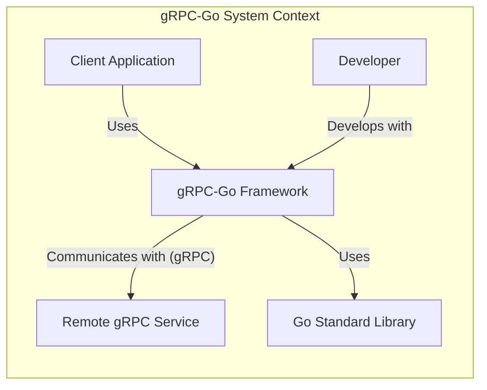
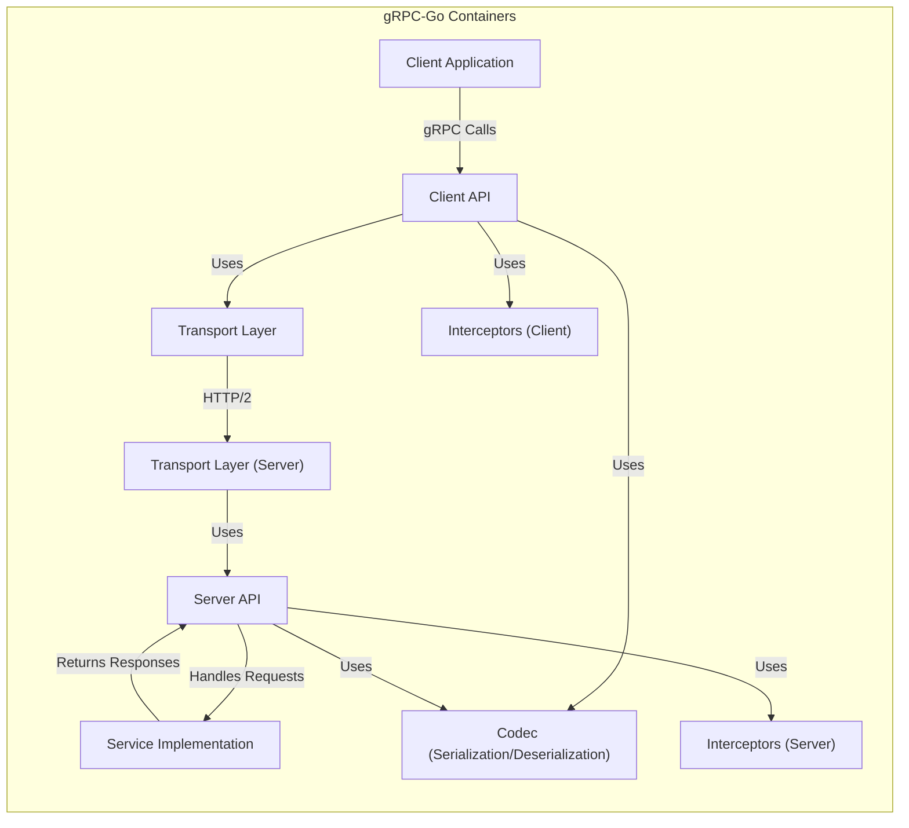
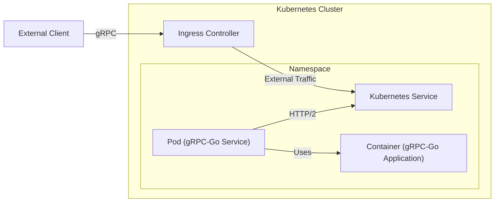
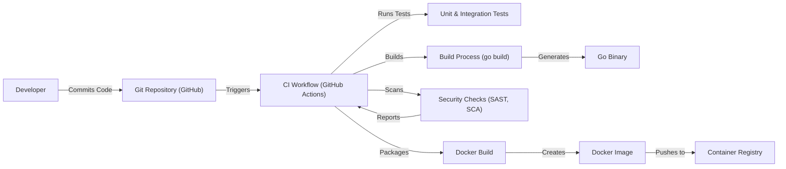

Okay, let's create a design document for the gRPC-Go project.

# BUSINESS POSTURE

gRPC-Go is Google's implementation of the gRPC framework in Go. gRPC is a high-performance, open-source universal RPC framework, that puts mobile and HTTP/2 first. gRPC is designed for building scalable and low-latency distributed systems. It's used for connecting services in and across data centers, and it also supports pluggable load balancing, tracing, health checking, and authentication.

Priorities:

- Provide a robust, efficient, and reliable RPC framework for Go developers.
- Maintain compatibility with the gRPC specification and other language implementations.
- Support a wide range of use cases, from microservices to mobile applications.
- Ensure high performance and low latency.
- Provide a secure and extensible platform.

Goals:

- Enable developers to easily build distributed systems using Go.
- Facilitate communication between services, regardless of their underlying infrastructure.
- Promote interoperability between different programming languages and platforms.

Business Risks:

- Incompatibility with other gRPC implementations could lead to fragmentation and limit adoption.
- Performance bottlenecks could hinder the use of gRPC-Go in high-throughput scenarios.
- Security vulnerabilities could expose user data and compromise system integrity.
- Lack of features or poor usability could drive developers to alternative solutions.
- Failure to keep up with evolving standards and technologies could lead to obsolescence.

# SECURITY POSTURE

Existing Security Controls:

- security control: TLS support for secure communication. Implemented in the transport layer.
- security control: Authentication mechanisms (e.g., OAuth2, JWT). Described in the authentication documentation and examples.
- security control: Interceptors for implementing custom security logic (e.g., authorization). Described in the interceptor documentation.
- security control: Regular security audits and vulnerability scanning. Part of the gRPC project's development process.
- security control: Fuzz testing. Part of continuous integration.
- security control: Support for ALTS (Application Layer Transport Security). Described in ALTS documentation.

Accepted Risks:

- accepted risk: The framework relies on the underlying operating system and network infrastructure for some security guarantees.
- accepted risk: Users are responsible for securely managing their credentials and keys.
- accepted risk: Users are responsible for implementing appropriate authorization logic for their applications.
- accepted risk: Complex configuration may lead to misconfigurations and security vulnerabilities if not carefully managed.

Recommended Security Controls:

- security control: Implement comprehensive input validation to prevent injection attacks.
- security control: Provide clear guidance and examples for securely configuring and deploying gRPC-Go applications.
- security control: Integrate with security linters and static analysis tools to identify potential vulnerabilities during development.
- security control: Consider adding support for additional authentication and authorization mechanisms.

Security Requirements:

- Authentication:
    - Support for mutual TLS authentication.
    - Integration with common identity providers (e.g., Google, AWS, Azure).
    - Support for token-based authentication (e.g., JWT, OAuth2).
    - Mechanisms for securely managing and rotating credentials.

- Authorization:
    - Support for role-based access control (RBAC).
    - Ability to define fine-grained access control policies.
    - Integration with external authorization services.

- Input Validation:
    - Strict validation of all incoming data based on Protobuf definitions.
    - Protection against common injection attacks (e.g., SQL injection, command injection).
    - Sanitization of user-provided input.

- Cryptography:
    - Use of strong, well-vetted cryptographic algorithms.
    - Secure key management practices.
    - Protection against replay attacks.
    - Support for data encryption at rest and in transit.

# DESIGN

## C4 CONTEXT

Element Descriptions:

- Client Application:
    - Name: Client Application
    - Type: External System
    - Description: An application that uses the gRPC-Go framework to communicate with a remote service.
    - Responsibilities: Initiates gRPC calls, handles responses, manages application-specific logic.
    - Security controls: Implements authentication and authorization logic, validates input, handles sensitive data securely.

- gRPC-Go Framework:
    - Name: gRPC-Go Framework
    - Type: System
    - Description: The core gRPC-Go library providing functionalities for building gRPC clients and servers.
    - Responsibilities: Handles serialization/deserialization, transport, connection management, and provides APIs for defining and implementing services.
    - Security controls: TLS support, authentication mechanisms, interceptors for custom security logic.

- Remote gRPC Service:
    - Name: Remote gRPC Service
    - Type: External System
    - Description: A service that implements a gRPC interface and can be accessed by gRPC-Go clients.
    - Responsibilities: Processes incoming requests, performs business logic, returns responses.
    - Security controls: Implements authentication and authorization logic, validates input, handles sensitive data securely.

- Developer:
    - Name: Developer
    - Type: User
    - Description: A software developer who uses the gRPC-Go framework to build applications.
    - Responsibilities: Writes code, defines service interfaces, configures the framework, implements security measures.
    - Security controls: Follows secure coding practices, uses secure development tools, manages credentials securely.

- Go Standard Library:
    - Name: Go Standard Library
    - Type: External Dependency
    - Description: The standard library of the Go programming language.
    - Responsibilities: Provides core functionalities like networking, I/O, and cryptography.
    - Security controls: Relies on the security of the Go runtime and underlying operating system.

## C4 CONTAINER

Element Descriptions:

- Client Application:
    - Name: Client Application
    - Type: External System
    - Description:  An application that uses the gRPC-Go framework.
    - Responsibilities: Initiates gRPC calls, handles responses.
    - Security controls: Application-level security, authentication, input validation.

- Client API:
    - Name: Client API
    - Type: Container
    - Description: The API used by client applications to interact with gRPC-Go.
    - Responsibilities: Provides functions for creating clients, making RPC calls, and managing connections.
    - Security controls:  Handles authentication credentials, enforces TLS configuration.

- Transport Layer (Client):
    - Name: Transport Layer
    - Type: Container
    - Description: Handles the underlying communication using HTTP/2.
    - Responsibilities: Manages connections, sends and receives data, implements flow control.
    - Security controls: TLS implementation, certificate validation.

- Transport Layer (Server):
    - Name: Transport Layer (Server)
    - Type: Container
    - Description: Handles the underlying communication using HTTP/2.
    - Responsibilities: Manages connections, sends and receives data, implements flow control.
    - Security controls: TLS implementation, certificate validation.

- Server API:
    - Name: Server API
    - Type: Container
    - Description: The API used by server applications to implement gRPC services.
    - Responsibilities: Provides functions for registering services, handling requests, and sending responses.
    - Security controls:  Handles authentication credentials, enforces TLS configuration.

- Service Implementation:
    - Name: Service Implementation
    - Type: Container
    - Description: The user-provided code that implements the business logic of the gRPC service.
    - Responsibilities: Processes requests, performs actions, generates responses.
    - Security controls:  Application-specific authorization, input validation, data sanitization.

- Codec (Serialization/Deserialization):
    - Name: Codec
    - Type: Container
    - Description: Handles the serialization and deserialization of messages using Protobuf.
    - Responsibilities: Converts data between Protobuf messages and byte streams.
    - Security controls:  Input validation based on Protobuf schema.

- Interceptors (Client):
    - Name: Interceptors (Client)
    - Type: Container
    - Description: Allows for intercepting and modifying gRPC calls on the client-side.
    - Responsibilities: Can be used for logging, authentication, authorization, tracing, etc.
    - Security controls: Can implement custom authentication and authorization logic.

- Interceptors (Server):
    - Name: Interceptors (Server)
    - Type: Container
    - Description: Allows for intercepting and modifying gRPC calls on the server-side.
    - Responsibilities: Can be used for logging, authentication, authorization, tracing, etc.
    - Security controls: Can implement custom authentication and authorization logic.

## DEPLOYMENT

Possible Deployment Solutions:

1.  Standalone binaries running directly on virtual machines or bare-metal servers.
2.  Containers (e.g., Docker) running on a container orchestration platform (e.g., Kubernetes, Nomad).
3.  Serverless functions (e.g., AWS Lambda, Google Cloud Functions) triggered by gRPC requests (requires a gateway or proxy).

Chosen Solution: Container Orchestration with Kubernetes

Element Descriptions:

- External Client:
    - Name: External Client
    - Type: External System
    - Description: A client application running outside the Kubernetes cluster.
    - Responsibilities: Initiates gRPC calls to the service.
    - Security controls:  Client-side security measures, potentially including TLS.

- Ingress Controller:
    - Name: Ingress Controller
    - Type: Infrastructure Node
    - Description: A component that manages external access to services in the cluster.
    - Responsibilities: Routes incoming traffic to the appropriate Kubernetes Service.
    - Security controls: TLS termination, potentially WAF (Web Application Firewall).

- Kubernetes Service:
    - Name: Kubernetes Service
    - Type: Logical Node
    - Description: An abstraction that defines a logical set of Pods and a policy by which to access them.
    - Responsibilities: Provides a stable endpoint for accessing the gRPC-Go service.
    - Security controls: Network policies can restrict access to the service.

- Pod (gRPC-Go Service):
    - Name: Pod (gRPC-Go Service)
    - Type: Logical Node
    - Description: A Kubernetes Pod running one or more containers.
    - Responsibilities: Hosts the gRPC-Go application container.
    - Security controls:  Limited resources, potentially restricted network access.

- Container (gRPC-Go Application):
    - Name: Container (gRPC-Go Application)
    - Type: Container
    - Description: A Docker container running the compiled gRPC-Go application.
    - Responsibilities: Executes the gRPC-Go service code.
    - Security controls:  Runs as a non-root user, minimal privileges, image vulnerability scanning.

- Namespace
    - Name: Namespace
    - Type: Logical Node
    - Description: Provides a scope for names. Use of multiple namespaces is optional.
    - Responsibilities: Namespaces are a way to divide cluster resources between multiple users.
    - Security controls: Resource quotas, network policies.

## BUILD

Build Process Description:

1.  Developer commits code to the Git repository (GitHub).
2.  The commit triggers a CI workflow (GitHub Actions).
3.  The CI workflow runs unit and integration tests.
4.  The CI workflow executes the build process using `go build`, generating a Go binary.
5.  Security checks (SAST - Static Application Security Testing, SCA - Software Composition Analysis) are performed on the code and its dependencies.  Tools like `gosec`, `snyk`, or GitHub's built-in dependency scanning could be used.
6.  The CI workflow builds a Docker image using a Dockerfile. The Dockerfile should follow best practices for security, such as using a minimal base image, running as a non-root user, and avoiding unnecessary dependencies.
7.  The Docker image is pushed to a container registry (e.g., Docker Hub, Google Container Registry, AWS ECR).

Security Controls in Build Process:

- security control: Code review: All code changes are reviewed by at least one other developer before being merged.
- security control: Automated testing: Unit and integration tests are run automatically on every commit.
- security control: SAST: Static analysis tools are used to identify potential security vulnerabilities in the code.
- security control: SCA: Software composition analysis tools are used to identify known vulnerabilities in third-party dependencies.
- security control: Docker image scanning: The Docker image is scanned for vulnerabilities before being pushed to the container registry.
- security control: Signed commits: Developers sign their commits to ensure authenticity.
- security control: Least privilege: Build processes run with minimal necessary privileges.

# RISK ASSESSMENT

Critical Business Processes:

- Reliable and efficient inter-service communication: gRPC-Go is fundamental for communication between services in distributed systems. Any disruption or performance degradation directly impacts the functionality of applications relying on it.
- Data integrity and confidentiality: gRPC-Go handles potentially sensitive data. Ensuring its integrity and confidentiality during transmission is crucial.

Data Sensitivity:

- The sensitivity of the data handled by gRPC-Go depends entirely on the specific applications using it.  It can range from non-sensitive metadata to highly confidential information like PII (Personally Identifiable Information), financial data, or healthcare records.  Therefore, the design and implementation of applications using gRPC-Go *must* consider the sensitivity of the data being transmitted and implement appropriate security controls.

# QUESTIONS & ASSUMPTIONS

Questions:

- What specific compliance requirements (e.g., PCI DSS, HIPAA, GDPR) must applications built with gRPC-Go adhere to? This will influence the necessary security controls.
- What are the expected performance requirements (throughput, latency) for typical use cases?
- What are the existing security policies and procedures of organizations that will be using gRPC-Go?
- What level of access do developers have to production environments?
- What are the specific threat models for the applications that will be using gRPC-Go?

Assumptions:

- BUSINESS POSTURE: It is assumed that maintaining compatibility with other gRPC implementations is a high priority.
- BUSINESS POSTURE: It is assumed that performance is a critical factor for most users.
- SECURITY POSTURE: It is assumed that users will be responsible for implementing appropriate authorization logic within their applications.
- SECURITY POSTURE: It is assumed that users will be responsible for securely managing their credentials and keys.
- DESIGN: It is assumed that Kubernetes will be a common deployment platform for gRPC-Go services.
- DESIGN: It is assumed that GitHub Actions will be a common CI/CD platform.
- DESIGN: It is assumed that developers are familiar with Go, Protobuf, and gRPC concepts.