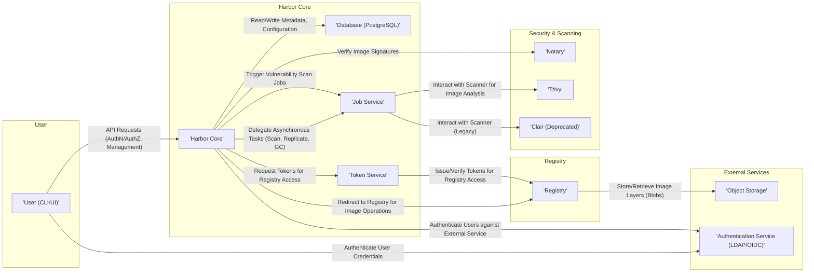

# Project Design Document: Harbor Container Registry

**Version:** 1.1
**Date:** October 26, 2023
**Author:** AI Software Architect

## 1. Introduction

This document provides a detailed architectural design of the Harbor container registry project. It outlines the key components, their interactions, data flows, and security considerations. This document serves as a foundation for subsequent threat modeling activities.

### 1.1. Purpose

The primary purpose of this document is to provide a comprehensive understanding of the Harbor architecture for security analysis and threat modeling. It aims to clearly articulate the system's structure, functionality, and potential vulnerabilities.

### 1.2. Scope

This document covers the core components and functionalities of the Harbor container registry as of the latest stable release. It includes details on user interactions, internal component communication, and external dependencies.

### 1.3. Target Audience

This document is intended for security engineers, architects, and developers involved in the threat modeling and security assessment of the Harbor project.

## 2. System Overview

Harbor is an open-source, trusted cloud-native registry project that stores, signs, and scans container images for vulnerabilities. It provides a secure way to manage and distribute container images within an organization.

### 2.1. Key Features

*   Centralized image storage and management for container images.
*   Role-based access control (RBAC) for managing user and group permissions at project and repository levels.
*   Integration with vulnerability scanners to identify security flaws in container images.
*   Image signing and verification using Docker Content Trust to ensure image integrity and provenance.
*   Replication capabilities to synchronize images across multiple Harbor instances for redundancy and regional access.
*   Image promotion workflows to manage the lifecycle of images through different stages (e.g., development, staging, production).
*   Automated garbage collection to remove unused images and layers, optimizing storage utilization.
*   Comprehensive auditing of user actions and system events for security monitoring and compliance.
*   Multi-tenancy support allowing for the creation of isolated projects with independent resources and access control.

## 3. Architectural Design

Harbor's architecture is composed of several interconnected components working together to provide its core functionalities.

### 3.1. Components

*   **Harbor Core:** The central application responsible for:
    *   User authentication and authorization.
    *   Project and repository management.
    *   Handling API requests and routing.
    *   Orchestrating interactions between other components.
*   **Registry:**  The core Docker Registry v2 implementation responsible for:
    *   Storing and serving container image layers (blobs).
    *   Managing image manifests and configurations.
    *   Handling push and pull requests for container images.
*   **Database (PostgreSQL):** Stores persistent data including:
    *   User accounts and roles.
    *   Project and repository metadata.
    *   Image metadata and tags.
    *   Vulnerability scan results.
    *   Configuration settings.
*   **Job Service:**  Executes asynchronous tasks such as:
    *   Triggering and managing vulnerability scans.
    *   Handling image replication tasks.
    *   Performing garbage collection of unused image layers.
    *   Managing image deletion requests.
*   **Notary:**  Implements the Docker Content Trust specification, providing functionality for:
    *   Generating and managing signing keys.
    *   Signing image manifests to ensure integrity.
    *   Verifying image signatures during pull operations.
*   **Trivy (or other vulnerability scanner):**  Analyzes container images for known vulnerabilities by:
    *   Inspecting image layers and metadata.
    *   Comparing image components against vulnerability databases.
    *   Generating reports detailing identified vulnerabilities.
*   **Clair (Deprecated, but potentially present in older deployments):** An older container vulnerability scanning service that may still be present in legacy installations.
*   **UI (User Interface):** Provides a web-based interface for users to:
    *   Manage projects and repositories.
    *   Browse and inspect container images.
    *   Configure settings and access controls.
    *   View vulnerability scan results and logs.
*   **Token Service:** Issues and manages authentication tokens for accessing the Registry, ensuring secure access to image layers.
*   **Log Collector:** Aggregates logs from various Harbor components, facilitating monitoring and troubleshooting.
*   **Exporter:**  Provides metrics in Prometheus format for monitoring Harbor's performance and health.

### 3.2. Component Interactions

### 3.3. Data Flow

#### 3.3.1. Image Push Workflow

1. A user, using the Docker CLI or UI, initiates an image push to a specific repository in Harbor.
2. The request is routed to the **'Harbor Core'**.
3. **'Harbor Core'** authenticates the user against the configured authentication service (**'Authentication Service (LDAP/OIDC)'** or internal database).
4. **'Harbor Core'** authorizes the user to push to the target repository based on configured RBAC policies.
5. **'Harbor Core'** requests an authentication token from the **'Token Service'**.
6. The **'Token Service'** issues a short-lived, scoped token for accessing the **'Registry'**.
7. **'Harbor Core'** provides the **'Registry'** endpoint and the token to the user's Docker client.
8. The Docker client pushes image layers (blobs) to the **'Registry'**, authenticating with the provided token.
9. The **'Registry'** stores the image layers in the configured **'Object Storage'**.
10. The Docker client pushes the image manifest to the **'Registry'**.
11. The **'Registry'** stores the image manifest and notifies the **'Harbor Core'** about the new image.
12. **'Harbor Core'** updates the **'Database (PostgreSQL)'** with the new image metadata.
13. If configured, **'Harbor Core'** creates a vulnerability scan job in the **'Job Service'**.
14. The **'Job Service'** picks up the scan job and instructs **'Trivy'** (or another configured scanner) to scan the newly pushed image.
15. **'Trivy'** pulls the image manifest and layers from the **'Registry'**.
16. **'Trivy'** analyzes the image for vulnerabilities.
17. **'Trivy'** reports the vulnerability scan results back to the **'Job Service'**.
18. The **'Job Service'** updates the **'Database (PostgreSQL)'** with the vulnerability scan results.
19. If Content Trust is enabled, the user can sign the image manifest using their Notary client, which interacts with the **'Notary'** service.

#### 3.3.2. Image Pull Workflow

1. A user initiates an image pull from Harbor using the Docker CLI or UI.
2. The request is routed to the **'Harbor Core'**.
3. **'Harbor Core'** authenticates and authorizes the user.
4. **'Harbor Core'** requests an authentication token from the **'Token Service'**.
5. The **'Token Service'** issues a token for accessing the **'Registry'**.
6. **'Harbor Core'** provides the **'Registry'** endpoint and token to the user's Docker client.
7. The Docker client pulls the image manifest from the **'Registry'**, authenticating with the token.
8. The **'Registry'** retrieves the manifest.
9. If Content Trust is enabled, the Docker client can verify the image signature by querying the **'Notary'** service.
10. The Docker client pulls the required image layers (blobs) from the **'Registry'**, authenticating with the token.
11. The **'Registry'** retrieves the layers from the **'Object Storage'**.

#### 3.3.3. User Authentication Workflow

1. A user attempts to log in to Harbor via the UI or CLI.
2. The authentication request is sent to the **'Harbor Core'**.
3. **'Harbor Core'** attempts to authenticate the user against the configured authentication backend (**'Authentication Service (LDAP/OIDC)'** or the internal database).
4. Upon successful authentication, **'Harbor Core'** creates a session or issues an API token for subsequent requests.

#### 3.3.4. Vulnerability Scan Workflow (Triggered by Image Push)

1. A new image is pushed to the **'Registry'**.
2. The **'Registry'** notifies the **'Harbor Core'**.
3. **'Harbor Core'** creates a vulnerability scan job in the **'Job Service'**.
4. The **'Job Service'** picks up the job.
5. The **'Job Service'** instructs the configured vulnerability scanner (e.g., **'Trivy'**) to scan the image.
6. The scanner pulls the image manifest and layers from the **'Registry'**.
7. The scanner analyzes the image for known vulnerabilities.
8. The scanner reports the vulnerability findings back to the **'Job Service'**.
9. The **'Job Service'** updates the **'Database (PostgreSQL)'** with the vulnerability scan results.
10. Users can view the scan results in the Harbor UI or via the API provided by **'Harbor Core'**.

## 4. Security Considerations

This section outlines potential security considerations based on the architectural design.

### 4.1. Authentication and Authorization

*   **Weak Password Policies:** If the internal user database is used, weak password policies can lead to account compromise through brute-force or credential stuffing attacks.
*   **Insecure Authentication Protocols:**  Using unencrypted protocols like plain LDAP for communication with external authentication services can expose credentials in transit.
*   **Authorization Bypass Vulnerabilities:** Flaws in the authorization logic within **'Harbor Core'** could allow unauthorized users to access or modify resources they should not have access to.
*   **Insecure Storage of API Tokens:** If API tokens are not stored securely (e.g., in plaintext), they can be stolen and used for unauthorized access.
*   **Session Management Issues:** Vulnerabilities in session management could allow session hijacking or fixation attacks.

### 4.2. Data Security

*   **Lack of Encryption at Rest:** Sensitive data in the **'Database (PostgreSQL)'** or the **'Object Storage'** (image layers) should be encrypted at rest to protect against data breaches.
*   **Lack of Encryption in Transit:** Communication between components (e.g., between **'Harbor Core'** and the **'Database'**) and with external services should be encrypted using TLS/HTTPS to prevent eavesdropping and man-in-the-middle attacks.
*   **Exposure of Vulnerability Data:**  Insufficient access controls on vulnerability scan results could allow unauthorized users to gain insights into application security weaknesses.

### 4.3. Vulnerability Scanning

*   **Outdated Vulnerability Database:**  If **'Trivy'** or other scanners use outdated vulnerability databases, they may fail to identify newly discovered vulnerabilities.
*   **Vulnerabilities in Scanning Engine:**  Security flaws in the vulnerability scanning engine itself could be exploited by malicious actors.
*   **Mechanisms to Bypass Scanning:**  Attackers might employ techniques to create container images that evade vulnerability scanning.

### 4.4. Content Trust

*   **Compromised Signing Keys:** If the signing keys used by **'Notary'** are compromised, attackers could sign malicious images, leading users to trust and pull compromised content.
*   **Lack of Key Rotation:**  Failure to regularly rotate signing keys increases the window of opportunity for attackers if a key is compromised.

### 4.5. Network Security

*   **Lack of Network Segmentation:**  Insufficient network segmentation could allow an attacker who compromises one component to easily pivot and attack other components.
*   **Exposure of Management Interfaces:**  Exposing management interfaces (e.g., database ports, SSH) to the public internet significantly increases the attack surface.
*   **Insecure Network Configurations:** Misconfigured firewalls or network policies could allow unauthorized access.

### 4.6. Supply Chain Security

*   **Vulnerabilities in Base Images:**  Container images built on vulnerable base images will inherit those vulnerabilities.
*   **Compromised Upstream Dependencies:**  Malicious code or vulnerabilities introduced through compromised upstream dependencies in container images.

### 4.7. Operational Security

*   **Insufficient Logging and Auditing:**  Lack of comprehensive logging makes it difficult to detect and respond to security incidents. Logs should be securely stored and monitored.
*   **Insecure Configuration Practices:**  Misconfigurations in Harbor components or the underlying infrastructure can introduce security vulnerabilities.
*   **Failure to Apply Security Updates:**  Not applying security patches to Harbor components, the operating system, and dependencies can leave the system vulnerable to known exploits.
*   **Lack of Secure Backup and Recovery:**  Insufficiently secured backups could be compromised, and the lack of a robust recovery plan can prolong downtime after an incident.

## 5. Deployment Considerations

The security posture of a Harbor deployment is significantly influenced by its deployment environment and configuration.

*   **Cloud vs. On-Premises Deployment:** Cloud deployments may leverage the cloud provider's security controls, while on-premises deployments require more direct management of infrastructure security.
*   **Network Segmentation and Firewalling:**  Properly segmenting the network to isolate Harbor components and implementing strict firewall rules are crucial for limiting the impact of a potential breach.
*   **High Availability and Disaster Recovery:**  Implementing measures for high availability and disaster recovery ensures the registry remains available and data is protected against failures.
*   **Secure Storage Configuration:**  Properly configuring the underlying object storage for security, including access controls and encryption.
*   **Regular Security Assessments:**  Conducting regular vulnerability scans and penetration tests of the Harbor deployment to identify and address security weaknesses.

## 6. Future Considerations

*   Integration with more advanced and specialized vulnerability scanning tools.
*   Enhanced image signing and verification mechanisms beyond Docker Content Trust, such as Sigstore.
*   Improved secrets management capabilities within Harbor to securely handle sensitive information used by container images.
*   More granular and flexible access control policies based on attributes and context.
*   Native support for Software Bill of Materials (SBOM) generation and management.
*   Integration with policy enforcement engines to automate security and compliance checks.

This document provides a foundational understanding of the Harbor architecture for threat modeling. Further analysis and exploration of specific components and functionalities will be necessary to identify and mitigate potential security risks effectively.
