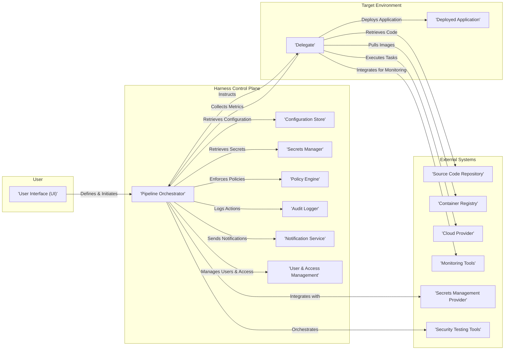

# Project Design Document: Harness Platform

**Version:** 1.1
**Date:** October 26, 2023
**Prepared By:** AI Software Architect

## 1. Introduction

This document provides an enhanced architectural design of the Harness platform, based on the codebase available at [https://github.com/harness/harness](https://github.com/harness/harness). This revised document aims to provide a more detailed and nuanced understanding of the platform's components, their interactions, and data flow, specifically tailored for threat modeling activities.

### 1.1. Purpose

The primary purpose of this document is to provide a comprehensive architectural overview of the Harness platform to facilitate thorough threat modeling. It aims to clearly identify key components, data flows, trust boundaries, and potential attack surfaces within the system.

### 1.2. Scope

This document covers the core architectural components of the Harness platform as inferred from the provided GitHub repository and common CI/CD platform architectures. It focuses on the logical architecture, key interactions between components, and security-relevant aspects. It does not delve into the implementation details of specific modules or services at a code level, but rather at a functional level.

### 1.3. Audience

This document is intended for:

* Security engineers and architects responsible for threat modeling the Harness platform.
* Development teams working on the Harness platform, requiring a security-focused architectural understanding.
* Operations teams responsible for deploying, maintaining, and securing the platform.

## 2. System Overview

Harness is a comprehensive Continuous Delivery-as-a-Service platform designed to automate and optimize the software release process. It offers a suite of features encompassing continuous integration, continuous delivery, feature flags management, cloud cost management, and security testing orchestration. The platform's core objective is to accelerate software delivery while maintaining security and efficiency.

## 3. Key Components

The Harness platform is composed of several interconnected components, each with specific responsibilities. Understanding these components is crucial for identifying potential threat vectors.

* **User Interface (UI):**
    * A web-based interface enabling user interaction with the platform.
    * Functionality includes configuring deployment pipelines, managing environments, viewing deployment dashboards, setting up connectors, and managing user roles and permissions.
    * Likely employs modern web technologies with client-side rendering and API interactions.

* **Control Plane:**
    * The central orchestration and management hub of the Harness platform.
    * Responsible for:
        * Pipeline execution management: Scheduling, coordinating, and monitoring deployment pipelines.
        * Workflow and stage management: Defining and managing the steps within deployment pipelines.
        * Resource management: Managing entities like applications, services, environments, and connectors.
        * Policy enforcement: Applying defined governance and compliance policies.
        * Audit logging: Recording all significant actions and events within the platform.
        * User and access management: Handling authentication and authorization of users.
    * Likely implemented as a collection of microservices for scalability and resilience.

* **Delegate:**
    * A lightweight, stateless agent deployed within target environments (e.g., Kubernetes clusters, virtual machine infrastructure, cloud provider accounts).
    * Acts as a bridge between the Control Plane and the target environment.
    * Responsibilities include:
        * Executing deployment tasks as instructed by the Control Plane.
        * Collecting deployment status and metrics from the target environment.
        * Establishing secure, outbound connections to the Control Plane.
        * Interacting with local resources and services within the target environment.
    * Designed to minimize its attack surface and require minimal inbound connectivity.

* **Connectors:**
    * Modules facilitating integration with external systems and services.
    * Each connector encapsulates the specific logic and credentials required to interact with a particular type of system.
    * Examples include connectors for:
        * Version Control Systems (VCS): GitHub, GitLab, Bitbucket for retrieving code.
        * Container Registries: Docker Hub, ECR, GCR for accessing container images.
        * Cloud Providers: AWS, Azure, GCP for deploying and managing resources.
        * Monitoring and Logging Tools: Prometheus, Datadog, Splunk for integrating observability data.
        * Notification Providers: Slack, PagerDuty, email for sending alerts and notifications.
        * Secrets Management Tools: HashiCorp Vault, AWS Secrets Manager, Azure Key Vault for secure secret retrieval.
        * Issue Tracking Systems: Jira, ServiceNow for integrating with development workflows.

* **Secrets Management:**
    * A critical component for securely storing, managing, and accessing sensitive information.
    * Likely supports integration with various external secrets management providers, allowing users to leverage existing infrastructure.
    * Responsible for:
        * Encrypting secrets at rest and in transit.
        * Enforcing access control policies for secrets.
        * Auditing secret access and modifications.

* **Audit Trails:**
    * A comprehensive record of all actions, events, and changes within the Harness platform.
    * Essential for security monitoring, compliance, and troubleshooting.
    * Includes details about who performed the action, what action was performed, and when it occurred.

* **Notification System:**
    * Responsible for delivering timely notifications to users regarding deployment status, errors, approvals, and other relevant events.
    * Supports various notification channels (e.g., email, Slack, webhooks).

* **Policy Engine:**
    * Enforces governance, compliance, and security policies across the software delivery lifecycle.
    * Allows administrators to define rules and constraints that are automatically evaluated during pipeline execution.
    * Can prevent deployments that violate defined policies.

* **Cloud Cost Management Module:**
    * Collects, analyzes, and visualizes cloud cost data from connected cloud providers.
    * Provides insights into spending patterns and recommendations for cost optimization.
    * Involves secure access to cloud provider billing and usage data.

* **Security Testing Orchestration (STO) Module:**
    * Orchestrates and manages security testing tools within the CI/CD pipeline.
    * Integrates with various security scanners (SAST, DAST, SCA, vulnerability scanners).
    * Manages the execution of security tests and the aggregation of results.
    * Requires secure handling of security scan configurations and results.

* **Feature Flags Module:**
    * Enables developers to decouple deployment from release by controlling feature availability in production.
    * Allows for gradual feature rollouts, A/B testing, and instant feature toggling.
    * Involves storing and managing feature flag configurations and targeting rules.

* **GitOps Module:**
    * Facilitates managing infrastructure and application configurations declaratively using Git repositories as the source of truth.
    * Automates the synchronization of desired state defined in Git with the actual state of the target environment.
    * Requires secure access to Git repositories and mechanisms for applying changes.

## 4. Data Flow

The following outlines a more detailed data flow within the Harness platform during a typical deployment scenario, highlighting security-relevant aspects:

* **User Defines Deployment:**
    * A user interacts with the UI to define a deployment pipeline, specifying artifacts, target environments, and deployment strategies.
    * This configuration data is securely transmitted to and stored within the Control Plane's configuration store.

* **Pipeline Execution Triggered:**
    * A pipeline execution is triggered manually or automatically based on predefined triggers (e.g., code commit, schedule).
    * The Control Plane authenticates the trigger source and authorizes the execution.

* **Control Plane Orchestrates:**
    * The Control Plane retrieves the pipeline configuration, including necessary secrets and connector details.
    * Secrets are retrieved securely from the Secrets Management component or integrated external provider.
    * The Policy Engine evaluates the pipeline execution against defined policies.

* **Delegate Task Assignment:**
    * The Control Plane identifies the appropriate Delegate in the target environment and securely transmits instructions for executing deployment tasks.
    * Communication between the Control Plane and Delegate is typically over an encrypted channel (e.g., TLS).

* **Delegate Executes Tasks:**
    * The Delegate uses configured Connectors to interact with external systems:
        * Authenticates to source code repositories using stored credentials to retrieve code.
        * Authenticates to container registries to pull container images.
        * Authenticates to cloud providers using stored credentials to provision or update resources.
        * May interact with monitoring tools to collect metrics.
        * May interact with security testing tools as part of the STO workflow.

* **Data Collection and Reporting:**
    * The Delegate collects deployment status, logs, and metrics from the target environment and securely transmits them back to the Control Plane.
    * This data is used for monitoring, reporting, and auditing.

* **Notifications and Audit Logging:**
    * The Notification System sends updates to users based on pipeline events.
    * All actions and events are logged in the Audit Trails, including details about data access and modifications.

## 5. Security Considerations

A thorough threat model will build upon these initial security considerations, analyzing potential vulnerabilities and attack vectors for each component and data flow.

* **Authentication and Authorization:**
    * **UI and API Access:** Ensuring strong authentication mechanisms (e.g., multi-factor authentication) for user logins and API access. Implementing granular role-based access control (RBAC) to restrict access to resources and actions based on user roles.
    * **Inter-Service Communication:** Securing communication between Control Plane microservices using mechanisms like mutual TLS (mTLS).
    * **Delegate Authentication:** Securely authenticating Delegates with the Control Plane, preventing unauthorized Delegates from connecting.

* **Delegate Security:**
    * **Secure Deployment:** Ensuring Delegates are deployed securely and follow security best practices.
    * **Minimal Permissions:** Granting Delegates only the necessary permissions to perform their tasks in the target environment (least privilege principle).
    * **Secure Communication:** Maintaining secure, encrypted communication channels between Delegates and the Control Plane.
    * **Regular Updates:** Ensuring Delegates are regularly updated with the latest security patches.

* **Secrets Management:**
    * **Secure Storage:** Utilizing robust encryption mechanisms for storing secrets at rest within the Harness platform or integrated secrets management providers.
    * **Access Control:** Implementing strict access control policies for accessing secrets, limiting access to authorized components and users.
    * **Auditing:** Maintaining a comprehensive audit log of secret access and modifications.
    * **Rotation:** Supporting automatic secret rotation to minimize the impact of compromised credentials.

* **Connector Security:**
    * **Credential Management:** Securely storing and managing credentials used by Connectors to access external systems, avoiding storing credentials in plain text.
    * **Secure Connections:** Ensuring Connectors establish secure, encrypted connections to external systems.
    * **Rate Limiting and Throttling:** Implementing mechanisms to prevent abuse of external system APIs through Connectors.

* **Data Encryption:**
    * **Data at Rest:** Encrypting sensitive data stored within the Harness platform's databases and storage systems.
    * **Data in Transit:** Encrypting all communication channels between components using protocols like TLS.

* **Network Security:**
    * **Network Segmentation:** Implementing network segmentation to isolate the Control Plane and other sensitive components.
    * **Firewall Rules:** Configuring firewalls to restrict network access to only necessary ports and protocols.
    * **Secure Communication Channels:** Enforcing the use of secure communication protocols (e.g., HTTPS, TLS) for all interactions.

* **Supply Chain Security:**
    * **Dependency Management:** Carefully managing dependencies of the Harness platform components to mitigate risks from vulnerable libraries.
    * **Secure Build Processes:** Implementing secure build processes for Harness components to prevent the introduction of malicious code.
    * **Vulnerability Scanning:** Regularly scanning Harness platform components for known vulnerabilities.

* **API Security:**
    * **Authentication and Authorization:** Enforcing strong authentication and authorization for all API endpoints.
    * **Input Validation:** Implementing robust input validation to prevent injection attacks.
    * **Rate Limiting:** Protecting against denial-of-service attacks by implementing API rate limiting.

* **Security Testing Orchestration:**
    * **Secure Integration:** Ensuring secure integration with security testing tools, including secure credential management.
    * **Secure Handling of Results:** Securely storing and managing security scan results, preventing unauthorized access.
    * **Toolchain Security:** Ensuring the security of the integrated security testing tools themselves.

## 6. Technologies Used (Likely)

This section outlines the likely technologies used in the Harness platform, which can inform potential security vulnerabilities and attack vectors.

* **Backend Services:** Primarily Java and Go are likely used for building the Control Plane microservices due to their performance and ecosystem.
* **Frontend (UI):** JavaScript frameworks like React or Angular are probable choices for building the interactive user interface.
* **Databases:**
    * Relational Databases (e.g., PostgreSQL, MySQL) are likely used for persistent storage of structured data like pipeline configurations and user information.
    * NoSQL Databases (e.g., MongoDB, Cassandra) might be used for specific use cases requiring high scalability and flexible schemas, such as storing time-series data or event logs.
* **Message Queues:** Apache Kafka or similar message brokers are likely used for asynchronous communication between microservices, ensuring resilience and scalability.
* **Containerization:** Docker is almost certainly used for packaging and deploying the various components of the Harness platform.
* **Orchestration:** Kubernetes is the most probable choice for orchestrating and managing the containerized microservices of the Control Plane.
* **Cloud Providers:** AWS, Azure, and GCP are used for hosting the SaaS offering and are also common target environments for deployments.
* **Secrets Management Integration:** Integration with popular secrets management solutions like HashiCorp Vault, AWS Secrets Manager, and Azure Key Vault is highly probable.

## 7. Deployment Model

The deployment model significantly impacts the security responsibilities and considerations.

* **SaaS (Software-as-a-Service):**
    * Harness manages the entire infrastructure and platform, including the Control Plane and underlying infrastructure.
    * Security responsibilities are shared, with Harness responsible for the security of the platform itself, and customers responsible for securing their own applications and configurations within the platform.
    * Customers rely on Harness's security controls and compliance certifications.

* **Self-Managed:**
    * Customers deploy and manage the Harness Control Plane within their own infrastructure (e.g., on-premises data center, private cloud).
    * Customers have greater control over the infrastructure and security configurations of the Control Plane.
    * Security responsibilities are shifted, with customers responsible for securing the underlying infrastructure, operating system, and network where the Control Plane is deployed, in addition to their application configurations.

## 8. Assumptions and Constraints

* This design document is based on publicly available information, the provided GitHub repository, and common architectural patterns for CI/CD platforms.
* Specific implementation details and technologies used may vary.
* The focus is on the logical architecture and key security considerations rather than a detailed physical deployment diagram.

## 9. Future Considerations

* More granular design documentation for individual modules and microservices within the Control Plane.
* Detailed security architecture for specific features like Cloud Cost Management, Feature Flags, and GitOps.
* Integration patterns and security considerations for third-party integrations.
* Scalability and high availability architecture and its impact on security.
* Disaster recovery and business continuity planning.

This enhanced document provides a more detailed and security-focused architectural overview of the Harness platform, serving as a stronger foundation for subsequent threat modeling activities. The expanded descriptions of components, refined data flow, and more concrete security considerations will enable a more comprehensive and effective threat analysis.
