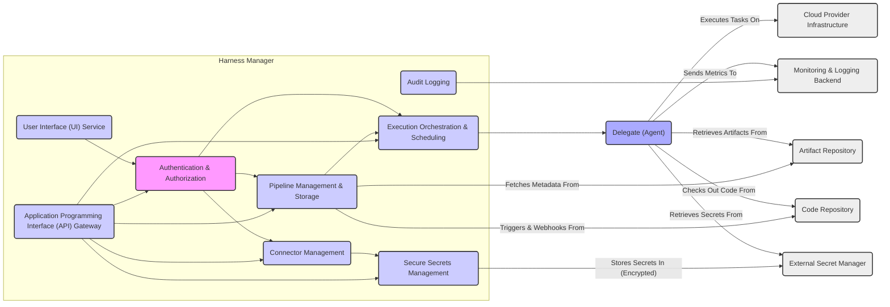

# Project Design Document: Harness CI/CD Platform

**Version:** 1.1
**Date:** October 26, 2023
**Author:** AI Software Architect

## 1. Introduction

This document provides an enhanced architectural design overview of the Harness CI/CD platform, based on the codebase available at [https://github.com/harness/harness](https://github.com/harness/harness). This revised document aims to provide a more detailed and nuanced understanding of the platform's components and interactions, specifically for use in subsequent threat modeling activities.

## 2. Goals and Objectives

The core goal of the Harness platform is to deliver a robust and efficient Continuous Integration and Continuous Delivery (CI/CD) solution. Key objectives include:

*   Orchestrating and automating the entire software delivery lifecycle.
*   Accelerating software release cycles while maintaining or improving quality.
*   Minimizing the risks and complexities associated with software deployments.
*   Providing comprehensive observability and control over all stages of the deployment process.
*   Offering flexibility and adaptability to support diverse deployment methodologies and environments.

## 3. Target Audience

This document is intended for a broader audience involved in the security and development lifecycle of the Harness platform:

*   Security architects and engineers responsible for identifying and mitigating potential threats.
*   Software development teams building features for or integrating their applications with Harness.
*   Platform engineering and operations teams responsible for the deployment, maintenance, and scaling of the Harness platform.
*   Technical leadership seeking a deeper understanding of the system's internal workings and security posture.

## 4. System Architecture

The Harness platform employs a microservices-based architecture, where distinct, independently deployable services collaborate to deliver the platform's functionality. Key components include:

*   **Harness Manager (Control Plane):** The central brain of the platform, responsible for:
    *   User authentication and authorization, managing user roles and permissions.
    *   Defining, storing, and managing CI/CD pipeline configurations.
    *   Scheduling and orchestrating pipeline executions across various environments.
    *   Managing connectors to external systems and services.
    *   Storing and managing secrets securely.
    *   Providing the user interface and API for interaction.
    *   Aggregating logs, metrics, and audit trails.
*   **Delegates (Execution Plane):** Lightweight, stateless agents deployed within target environments to execute pipeline tasks. They:
    *   Poll the Harness Manager for tasks assigned to them.
    *   Execute commands and scripts within the target environment.
    *   Interact with external systems based on pipeline configurations.
    *   Report execution status and logs back to the Harness Manager.
*   **Connectors (Integrations):**  Represent configured connections to external systems, enabling Harness to interact with them. Examples include:
    *   **Source Code Managers:** (e.g., "GitHub", "GitLab", "Bitbucket") for retrieving code.
    *   **Artifact Repositories:** (e.g., "Docker Registry", "Nexus", "Artifactory") for accessing build artifacts.
    *   **Cloud Providers:** (e.g., "AWS", "Azure", "GCP") for deploying and managing infrastructure.
    *   **Collaboration Tools:** (e.g., "Slack", "Jira") for notifications and issue tracking.
    *   **Secret Managers:** (e.g., "HashiCorp Vault", "AWS Secrets Manager", "Azure Key Vault") for secure secret retrieval.
    *   **Monitoring and Logging Systems:** (e.g., "Prometheus", "Datadog", "Splunk") for observability.
*   **Pipelines (Workflows):**  Define the automated steps for building, testing, and deploying applications. They consist of:
    *   **Stages:** Logical groupings of steps within a pipeline.
    *   **Steps:** Individual actions to be performed (e.g., build, test, deploy).
    *   **Configurations:** Parameters and settings for each step.
*   **Applications (Managed Entities):** Represent the software applications being managed and deployed through Harness.
*   **Environments (Deployment Targets):**  Represent the infrastructure where applications are deployed (e.g., "Development", "Staging", "Production").
*   **Secrets Management (Secure Storage):** A dedicated subsystem for securely storing and managing sensitive credentials and configuration data.
*   **User Interface (UI) (Presentation Layer):** A web-based interface providing users with a visual way to interact with the platform.
*   **Application Programming Interface (API) (Programmable Access):**  Provides a programmatic interface (typically RESTful) for interacting with Harness functionalities.

## 5. Data Flow

A typical CI/CD pipeline execution within Harness involves a detailed sequence of data flow:

*   **Initiation:** A pipeline execution starts via:
    *   Manual trigger through the UI or API.
    *   Automated trigger based on events in connected systems (e.g., code commit webhook from "Code Repository").
    *   Scheduled execution.
*   **Pipeline Retrieval:** The "Harness Manager" retrieves the pipeline definition and associated configurations from its persistent storage.
*   **Task Assignment and Distribution:** The "Harness Manager" identifies the tasks required for the current stage of the pipeline and assigns them to appropriate "Delegates" based on their capabilities and the target "Environment".
*   **Resource Acquisition:** "Delegates" may need to acquire resources:
    *   Fetching application artifacts (e.g., Docker images) from configured "Artifact Repositories".
    *   Checking out source code from connected "Code Repositories".
    *   Retrieving necessary secrets from configured "External Secret Managers" (using credentials managed by the "Harness Manager").
*   **Execution and Interaction:** "Delegates" execute the assigned tasks, which may involve:
    *   Interacting with "Cloud Provider Infrastructure" APIs to provision or manage resources.
    *   Running tests and quality checks.
    *   Deploying application components to target environments.
    *   Executing scripts and commands within the target environment.
*   **Status Reporting and Logging:** "Delegates" continuously report the status of their tasks and send execution logs back to the "Harness Manager".
*   **Monitoring and Observability Data:** "Delegates" may also send performance metrics and other telemetry data to configured "Monitoring & Logging Backend" systems.
*   **Deployment and Verification:**  Upon successful execution of deployment steps, the application is deployed to the target "Environment". Harness may perform verification steps to ensure successful deployment.
*   **Notification and Completion:** The "Harness Manager" updates the pipeline execution status and sends notifications to configured channels (e.g., email, "Collaboration Tools").

## 6. Key Security Considerations

A thorough threat model of the Harness platform should consider the following key security aspects:

*   **Authentication and Authorization:**
    *   Mechanisms for authenticating users accessing the "Harness Manager" (e.g., local accounts, SSO via protocols like SAML/OAuth 2.0, API keys).
    *   Role-Based Access Control (RBAC) for managing permissions and access to resources within the platform.
    *   Security of API keys used for programmatic access.
    *   Protection against brute-force attacks and credential stuffing.
*   **Delegate Security:**
    *   Secure registration and authentication of "Delegates" with the "Harness Manager".
    *   Confidentiality and integrity of communication between "Delegates" and the "Harness Manager" (e.g., TLS encryption).
    *   Minimizing the attack surface of "Delegates" deployed in potentially untrusted environments.
    *   Secure handling of credentials and secrets by "Delegates".
*   **Secrets Management:**
    *   Encryption of secrets at rest within the "Harness Manager" and in transit.
    *   Secure retrieval of secrets from external "Secret Managers".
    *   Auditing of secret access and modifications.
    *   Preventing unintended exposure of secrets in logs or configuration.
*   **Connector Security:**
    *   Secure storage and management of credentials used by "Connectors" to access external systems.
    *   Authentication and authorization mechanisms used for connecting to external systems.
    *   Impact of vulnerabilities in connected external systems on the Harness platform.
    *   Proper handling of API keys and tokens for external services.
*   **Pipeline Security:**
    *   Mechanisms to prevent unauthorized modification of pipeline definitions.
    *   Security scanning of pipeline configurations for potential vulnerabilities.
    *   Ensuring the integrity of code and artifacts used in pipeline executions.
    *   Secure execution environments for pipeline steps.
    *   Protection against injection attacks within pipeline scripts and commands.
*   **Data Security:**
    *   Encryption of sensitive data at rest within the "Harness Manager's" database.
    *   Encryption of data in transit between different components of the platform.
    *   Data retention policies and secure disposal of sensitive data.
*   **Supply Chain Security:**
    *   Security of the "Harness Manager" and "Delegate" software development and release processes.
    *   Management of third-party dependencies and vulnerability scanning.
    *   Secure distribution and verification of "Delegate" binaries.
*   **Infrastructure Security:**
    *   Security of the infrastructure hosting the "Harness Manager" (e.g., network security, access controls, vulnerability management).
    *   Security considerations specific to the chosen deployment model (SaaS vs. self-managed).
*   **Auditing and Logging:**
    *   Comprehensive logging of security-relevant events, including authentication attempts, authorization decisions, and data access.
    *   Secure storage and protection of audit logs against tampering.
    *   Mechanisms for analyzing and monitoring audit logs for suspicious activity.

## 7. Deployment Model

The security considerations can vary depending on the deployment model:

*   **SaaS (Software as a Service):** Harness is responsible for the security of the underlying infrastructure and the "Harness Manager" application. Users are responsible for securing their own integrations and "Delegate" deployments.
*   **Self-Managed:** The organization deploying Harness is responsible for the security of the entire platform, including the infrastructure, "Harness Manager", and "Delegates". This requires careful consideration of infrastructure security best practices.

## 8. Technologies Used

The Harness platform likely leverages the following technologies:

*   **Primary Programming Languages:** Java (for the "Harness Manager"), Go (potentially for "Delegates" and some microservices) - Understanding the security characteristics of these languages is important.
*   **Data Storage:**  A robust relational database (e.g., PostgreSQL, MySQL) for persistent storage of configuration, pipeline definitions, and audit logs - Database security best practices are crucial.
*   **Message Broker:**  A message queue system (e.g., Kafka, RabbitMQ) for asynchronous communication between services - Securing message queues is important for data integrity and confidentiality.
*   **Containerization:** Docker for packaging and deploying components - Secure container image management and runtime security are essential.
*   **Orchestration:** Kubernetes (especially for self-managed deployments) for managing containerized applications - Kubernetes security best practices must be followed.
*   **Cloud Platform Integrations:**  Extensive use of cloud provider services (AWS, Azure, GCP) - Understanding the security models of these cloud providers is critical.
*   **Frontend Development:**  A modern JavaScript framework (e.g., React, Angular) for the user interface -  Addressing common web application vulnerabilities is necessary.

## 9. Future Considerations

Potential future enhancements with security implications include:

*   Advanced policy enforcement and governance features for pipelines (Policy as Code).
*   Enhanced integration with security scanning tools throughout the CI/CD pipeline.
*   More granular control over "Delegate" permissions and resource access.
*   Improved secrets rotation and management capabilities.
*   Integration with threat intelligence feeds for proactive security measures.

This enhanced design document provides a more comprehensive foundation for threat modeling the Harness CI/CD platform. By understanding the detailed architecture, data flow, and security considerations, security professionals can more effectively identify and mitigate potential risks.