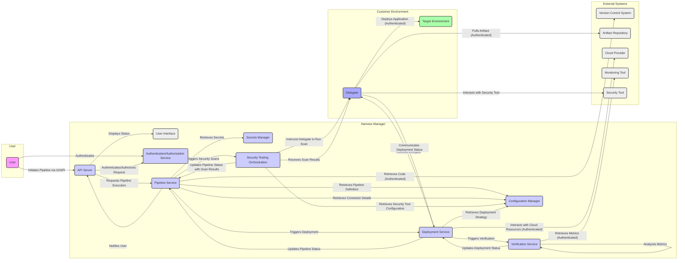

# Project Design Document: Harness CI/CD Platform

**Version:** 1.1
**Date:** October 26, 2023
**Author:** AI Software Architect

## 1. Introduction

This document provides a detailed architectural design of the Harness Continuous Integration and Continuous Delivery (CI/CD) platform. It outlines the key components, their interactions, data flows, and security considerations. This document serves as a foundation for subsequent threat modeling activities, enabling a comprehensive understanding of the system's attack surface and potential vulnerabilities.

## 2. Project Overview

Harness is a modern software delivery platform designed to automate and optimize the entire CI/CD lifecycle. It aims to accelerate software releases, improve developer productivity, and enhance application reliability and security. The platform offers a comprehensive suite of modules that integrate with a wide array of tools and technologies used in the software development process.

## 3. Architectural Design

The Harness platform is built upon a microservices architecture, promoting modularity, scalability, and resilience. Each component is designed to handle specific functionalities and communicate with other components through well-defined APIs.

### 3.1. Core Components

*   **Harness Manager:** The central nervous system of the platform, providing the user interface (UI), REST API endpoints, authentication and authorization services, and orchestrating the various underlying services. It manages the overall state of the platform and user interactions.
*   **Pipeline Service:**  Responsible for the definition, execution, and management of CI/CD pipelines. This includes workflow orchestration, stage management, and execution tracking. It interacts with connectors to access code repositories, artifact stores, and other external systems.
*   **Deployment Service:**  Manages the deployment of applications and services to various target environments. It handles deployment strategies (e.g., blue/green, canary), rollback mechanisms, and integration with infrastructure providers.
*   **Verification Service:** Automates the verification of deployments by leveraging machine learning to analyze application performance and identify anomalies. It integrates with monitoring tools to gather metrics and provides intelligent rollback capabilities.
*   **Cloud Cost Management (CCM) Service:** Provides visibility into cloud spending, identifies cost optimization opportunities, and helps manage cloud resource utilization. It collects and analyzes data from cloud providers.
*   **Security Testing Orchestration (STO) Service:**  Orchestrates and manages security scans within the CI/CD pipeline. It integrates with various Static Application Security Testing (SAST), Dynamic Application Security Testing (DAST), and Software Composition Analysis (SCA) tools.
*   **Feature Flags Service:** Enables the management and control of feature releases without requiring code deployments. It allows for targeted rollouts and A/B testing of new features.
*   **Chaos Engineering Service:** Facilitates the introduction of controlled failures into systems to test their resilience and identify potential weaknesses.
*   **Delegate:** A lightweight, stateless agent installed within the customer's environment (e.g., Kubernetes cluster, virtual machine, on-premise data center). It acts as a bridge between the Harness Manager and the target environment, executing tasks and relaying information securely.
*   **Connectors:** Securely store configuration details and credentials required for integrating with external systems. They abstract away the complexities of authentication and authorization for various platforms.
*   **Secrets Management:** A dedicated service for securely storing, managing, and accessing sensitive information such as API keys, passwords, certificates, and other credentials. It supports integration with external secrets management providers.

### 3.2. Data Stores

*   **Configuration Database:** Stores the persistent configuration of the Harness platform, including pipeline definitions, deployment configurations, connector details, user roles, and other platform settings.
*   **Execution Database:** Stores the historical data and logs of pipeline executions, deployment attempts, verification results, and other runtime information. This data is crucial for auditing and troubleshooting.
*   **Time Series Database:** Used by the Verification Service and CCM Service for storing and analyzing time-series data, such as application performance metrics, infrastructure metrics, and cloud cost data.
*   **Secret Store:**  The underlying storage mechanism for secrets managed by the Secrets Management service. This could be an internal encrypted store or an integration with external vaults like HashiCorp Vault, AWS Secrets Manager, Azure Key Vault, or Google Cloud Secret Manager.

### 3.3. External Integrations

Harness is designed to integrate seamlessly with a wide range of external systems and tools across the software development lifecycle:

*   **Version Control Systems (VCS):** (e.g., GitHub, GitLab, Bitbucket, Azure DevOps Repos) for source code management.
*   **Artifact Repositories:** (e.g., Docker Registry, JFrog Artifactory, Sonatype Nexus, AWS ECR, Google GCR, Azure ACR) for storing and managing build artifacts.
*   **Cloud Providers:** (e.g., AWS, Azure, GCP) for deploying and managing cloud resources.
*   **Kubernetes Clusters:** For deploying and managing containerized applications.
*   **Collaboration Tools:** (e.g., Slack, Microsoft Teams, Jira) for notifications and workflow integration.
*   **Monitoring Tools:** (e.g., Prometheus, Datadog, New Relic, Dynatrace) for collecting application and infrastructure metrics.
*   **Testing Tools:** (e.g., JUnit, Selenium, Cypress, JMeter) for executing automated tests within the pipeline.
*   **Security Scanning Tools:** (e.g., SonarQube, Snyk, Checkmarx, Veracode, Aqua Security) for performing static and dynamic analysis, and vulnerability scanning.
*   **Issue Tracking Systems:** (e.g., Jira, Azure DevOps Boards) for managing bugs and feature requests.

## 4. Data Flow

The following diagram illustrates a more detailed data flow for a typical deployment pipeline execution, highlighting security-relevant interactions:

**Detailed Data Flow Steps (with Security Emphasis):**

*   A user authenticates to the Harness Manager through the UI or API, with the Authentication/Authorization Service verifying their credentials.
*   The user initiates a pipeline execution via the UI or API. The API Server authenticates and authorizes the request against the user's permissions.
*   The API Server forwards the request to the Pipeline Service.
*   The Pipeline Service retrieves the pipeline definition and associated configurations from the Configuration Manager.
*   The Pipeline Service retrieves necessary connector details, including authentication credentials, from the Configuration Manager.
*   The Pipeline Service securely retrieves any required secrets from the Secrets Manager.
*   The Pipeline Service may trigger security scans by interacting with the Security Testing Orchestration (STO) service.
*   The STO service retrieves the configuration for the specified security tools from the Configuration Manager.
*   The STO service instructs the Delegate in the relevant environment to execute the security scan.
*   The Delegate interacts with the configured Security Tool, potentially using credentials managed by Harness.
*   The Delegate securely transmits the security scan results back to the STO service.
*   The STO service updates the pipeline status with the security scan results, potentially failing the pipeline based on policy.
*   The Pipeline Service triggers the Deployment Service to initiate the deployment phase.
*   The Deployment Service retrieves the deployment strategy and configuration from the Configuration Manager.
*   The Deployment Service instructs the appropriate Delegate to perform deployment tasks.
*   The Delegate securely pulls the required artifacts from the configured Artifact Repository, using credentials stored in Connectors.
*   The Delegate securely deploys the application to the Target Environment, interacting with infrastructure providers using configured credentials.
*   The Delegate communicates the deployment status back to the Deployment Service over a secure channel.
*   The Deployment Service may trigger the Verification Service to automatically verify the deployment.
*   The Verification Service securely retrieves metrics from configured Monitoring Tools, using API keys or tokens.
*   The Verification Service analyzes the metrics to detect anomalies and determine the success of the deployment.
*   The Verification Service updates the deployment status in the Deployment Service.
*   The Deployment Service updates the overall pipeline execution status in the Pipeline Service.
*   The Pipeline Service notifies the user about the completion status through the API Server.
*   The API Server updates the UI to reflect the pipeline execution status.
*   During CI stages, the Pipeline Service might interact with the Version Control System to retrieve code, using configured credentials.
*   During deployment, the Delegate might interact with the Cloud Provider to provision or manage resources, using securely stored credentials.

## 5. Security Considerations

Security is a core tenet of the Harness platform design. The following are key security considerations across different aspects of the system:

*   **Authentication and Authorization:**
    *   **User Authentication:** Secure mechanisms for verifying user identities, including username/password with strong password policies, multi-factor authentication (MFA), and integration with Single Sign-On (SSO) providers (e.g., SAML, OAuth 2.0).
    *   **Role-Based Access Control (RBAC):** Granular control over user and service account permissions, allowing administrators to define roles and assign specific privileges to access resources and perform actions within the platform.
    *   **API Authentication:** Secure authentication for API access using API keys, tokens (e.g., JWT), or OAuth 2.0 flows, ensuring only authorized clients can interact with the Harness API.
    *   **Service-to-Service Authentication:** Secure communication and authentication between internal Harness microservices, often using mutual TLS (mTLS) or internal authentication tokens.
*   **Secrets Management:**
    *   **Secure Storage:** Encryption of sensitive information at rest within the Harness platform's secret store or leveraging external, dedicated secrets management solutions.
    *   **Access Control:** Strict access control policies for accessing secrets, ensuring only authorized services and users can retrieve them.
    *   **Auditing:** Logging and monitoring of secret access and modifications for compliance and security monitoring.
    *   **Rotation:** Support for automatic or manual rotation of secrets to minimize the impact of compromised credentials.
    *   **Encryption in Transit:** Secure transmission of secrets over encrypted channels (TLS/HTTPS).
*   **Delegate Security:**
    *   **Secure Communication:** All communication between the Harness Manager and Delegates is encrypted using TLS.
    *   **Minimal Permissions:** Delegates operate with the least privileges necessary to perform their tasks, reducing the potential impact of a compromised Delegate.
    *   **Stateless Design:** Delegates are designed to be stateless, minimizing the amount of sensitive data stored on the Delegate itself.
    *   **Secure Credential Management:** Delegates securely retrieve and use credentials for interacting with target environments, without storing them persistently.
    *   **Regular Updates:**  Automatic or easy update mechanisms for Delegates to patch vulnerabilities and ensure they are running the latest secure version.
*   **Network Security:**
    *   **TLS Encryption:** Encryption of all communication between the Harness Manager and clients (browsers, APIs) using HTTPS.
    *   **Network Segmentation:**  Logical separation of network segments to isolate different components and environments.
    *   **Firewall Rules:**  Configuration of firewalls to restrict network access to only necessary ports and protocols.
    *   **Secure Inter-service Communication:**  Encryption and authentication for communication between internal Harness services.
*   **Data Encryption:**
    *   **Encryption at Rest:** Encryption of sensitive data stored in databases and other persistent storage mechanisms.
    *   **Encryption in Transit:** Encryption of data transmitted across networks.
*   **Audit Logging:**
    *   **Comprehensive Logging:** Detailed logging of user actions, system events, API calls, and security-related events.
    *   **Secure Storage:** Secure storage and access control for audit logs to prevent tampering.
    *   **Centralized Logging:**  Centralized logging infrastructure for easier analysis and monitoring.
*   **Input Validation:**
    *   **Strict Validation:**  Rigorous validation and sanitization of all user inputs to prevent injection attacks (e.g., SQL injection, cross-site scripting).
*   **Dependency Management:**
    *   **Vulnerability Scanning:** Regular scanning of third-party dependencies for known vulnerabilities.
    *   **Dependency Updates:**  Processes for promptly updating vulnerable dependencies.
*   **Security Testing:**
    *   **Integration with Security Tools:**  Seamless integration with SAST, DAST, and SCA tools to automate security testing within the CI/CD pipeline.
    *   **Policy Enforcement:**  Ability to define and enforce security policies that can fail pipelines based on security scan results.
*   **Compliance:**
    *   Adherence to relevant security and compliance standards (e.g., SOC 2, GDPR, HIPAA, FedRAMP depending on the deployment model and customer requirements).

## 6. Deployment Model

Harness offers flexible deployment options to meet various customer needs and security requirements:

*   **SaaS (Software as a Service):** Harness manages the entire infrastructure and platform. Customers access the platform through a web browser. Security responsibilities are shared, with Harness responsible for the security of the platform itself and customers responsible for securing their configurations and credentials.
*   **Self-Managed (On-Premise or Cloud):** Customers deploy and manage the Harness platform within their own infrastructure, either on-premise or in their cloud environment. This model provides greater control over the environment but also requires the customer to manage the security of the underlying infrastructure, including network security, server hardening, and access control.

The specific security controls and responsibilities will vary depending on the chosen deployment model.

## 7. Assumptions and Constraints

*   This design document provides a high-level overview of the Harness architecture. Specific implementation details may vary.
*   The threat model will be based on the information presented in this document.
*   It is assumed that external systems integrated with Harness have their own security measures in place, and Harness's integration points are designed to interact with them securely.
*   The focus is on the core CI/CD platform components. Other modules like CCM, STO, Feature Flags, and Chaos Engineering have their own specific security considerations that may be explored in separate documents.

## 8. Future Considerations

*   More detailed security architecture diagrams illustrating network segmentation and data flow with security controls.
*   Inclusion of specific security controls and mitigations for each identified threat.
*   Detailed analysis of the security implications of third-party dependencies and integrations.
*   Formal threat modeling exercises using frameworks like STRIDE or PASTA.
*   Regular review and updates to this document to reflect changes in the platform architecture and security landscape.