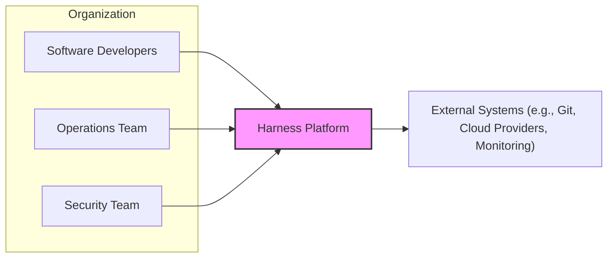
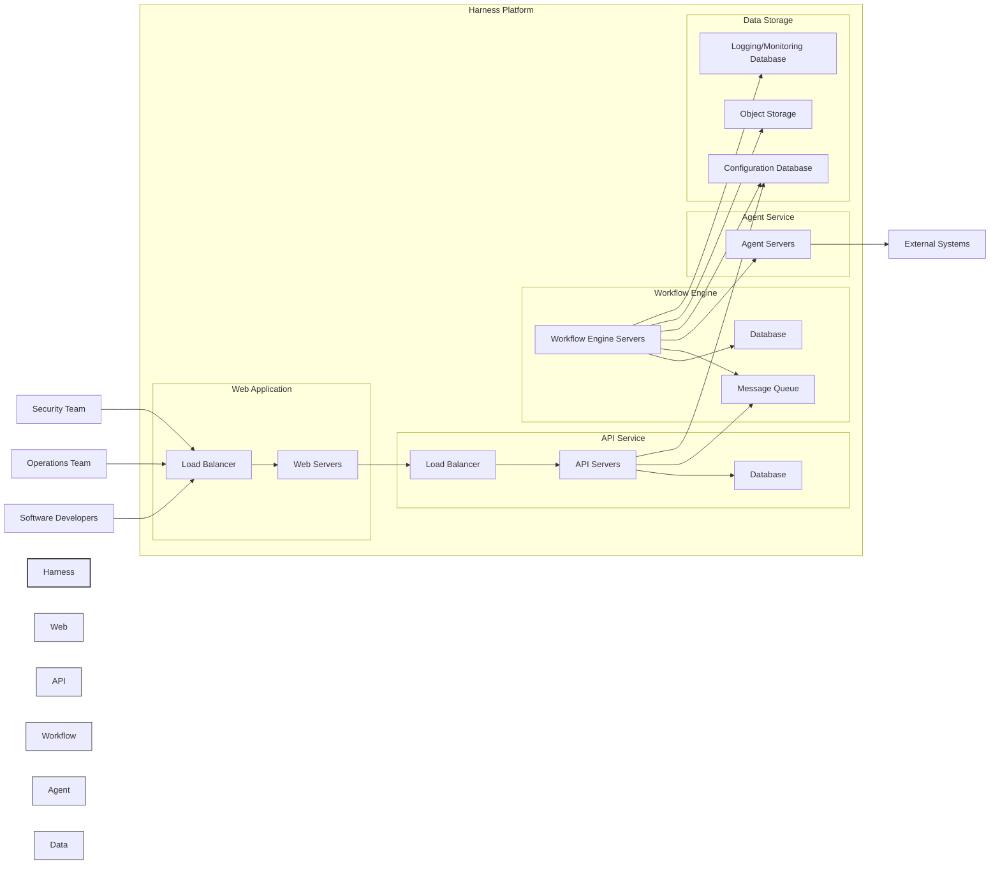
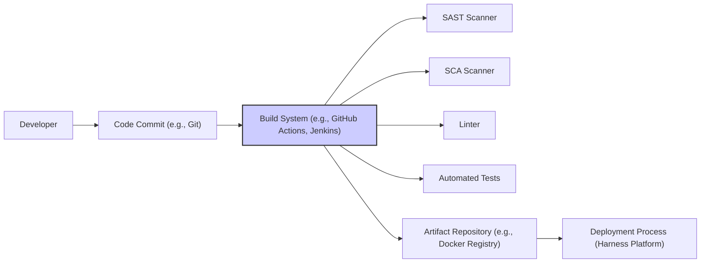

# BUSINESS POSTURE

This project, represented by the Harness GitHub repository, aims to provide a comprehensive Continuous Integration and Continuous Delivery (CI/CD) platform. The primary business goal is to enable organizations to accelerate their software delivery lifecycle, improve software quality, and reduce operational costs through automation and orchestration of the build, test, and deployment processes.

Business Priorities:
- Accelerate software delivery speed and frequency.
- Improve software quality and reliability.
- Reduce operational costs associated with software deployments.
- Enhance developer productivity and satisfaction.
- Provide a scalable and resilient platform for mission-critical applications.
- Support a wide range of deployment environments and technologies.
- Offer a secure and compliant platform for sensitive workloads.

Business Risks:
- Platform downtime impacting software delivery pipelines and business operations.
- Data breaches or leaks compromising sensitive application data or infrastructure credentials.
- Unauthorized access to the platform leading to malicious deployments or configuration changes.
- Supply chain attacks targeting build or deployment processes.
- Compliance violations due to insecure configurations or lack of audit trails.
- Performance bottlenecks hindering software delivery velocity.
- Lack of user adoption due to complexity or poor user experience.

# SECURITY POSTURE

Existing Security Controls:
- security control: Access control to the Harness platform via username/password and potentially API keys. (Location: Assumed based on typical CI/CD platform functionality)
- security control: Encryption of data at rest and in transit. (Location: Assumed based on typical cloud platform and security best practices)
- security control: Audit logging of user actions and system events. (Location: Assumed based on typical enterprise platform requirements)
- security control: Role-Based Access Control (RBAC) for managing user permissions. (Location: Assumed based on typical enterprise platform requirements)
- security control: Integration with external identity providers (e.g., SAML, OAuth). (Location: Assumed based on typical enterprise platform requirements)
- security control: Secure Software Development Lifecycle (SSDLC) practices are likely followed, including code reviews and security testing. (Location: Assumed best practice for software development)
- security control: Regular security vulnerability scanning of the platform and its dependencies. (Location: Assumed best practice for software development and operations)
- security control: Infrastructure security provided by the underlying cloud provider (e.g., AWS, Azure, GCP). (Location: Cloud provider documentation)

Accepted Risks:
- accepted risk: Complexity of managing a comprehensive CI/CD platform may lead to misconfigurations.
- accepted risk: Third-party integrations introduce potential security vulnerabilities.
- accepted risk: Reliance on underlying infrastructure security provided by cloud providers.
- accepted risk: Potential for insider threats with access to sensitive deployment pipelines.

Recommended Security Controls:
- security control: Implement multi-factor authentication (MFA) for all user accounts.
- security control: Integrate with secrets management solutions (e.g., HashiCorp Vault, AWS Secrets Manager) to securely manage credentials.
- security control: Implement static application security testing (SAST) and dynamic application security testing (DAST) in the CI/CD pipeline.
- security control: Implement software composition analysis (SCA) to manage open-source dependencies vulnerabilities.
- security control: Implement infrastructure as code (IaC) security scanning to identify misconfigurations in deployment infrastructure.
- security control: Implement runtime application self-protection (RASP) for deployed applications.
- security control: Implement network segmentation to isolate CI/CD platform components.
- security control: Conduct regular penetration testing and security audits of the platform.
- security control: Implement robust incident response plan for security incidents.
- security control: Implement data loss prevention (DLP) measures to protect sensitive data.

Security Requirements:

Authentication:
- requirement: The platform must support strong authentication mechanisms, including multi-factor authentication.
- requirement: Integration with enterprise identity providers (e.g., Active Directory, Okta) should be supported via SAML or OAuth.
- requirement: API access should be secured using API keys or tokens with appropriate scopes.

Authorization:
- requirement: Role-Based Access Control (RBAC) must be implemented to manage user permissions and access to resources.
- requirement: Granular permissions should be configurable to control access to specific projects, pipelines, and environments.
- requirement: Least privilege principle should be enforced for all user and service accounts.

Input Validation:
- requirement: All user inputs and API requests must be validated to prevent injection attacks (e.g., SQL injection, command injection, cross-site scripting).
- requirement: Input validation should be performed on both the client-side and server-side.
- requirement: Data sanitization and encoding should be applied to prevent cross-site scripting (XSS) vulnerabilities.

Cryptography:
- requirement: Sensitive data at rest (e.g., secrets, credentials, application data) must be encrypted using strong encryption algorithms.
- requirement: Data in transit must be encrypted using TLS/HTTPS for all communication channels.
- requirement: Cryptographic keys must be securely managed and stored.
- requirement: Hashing algorithms should be used for password storage.

# DESIGN

## C4 CONTEXT



### C4 Context Elements

- Name: Software Developers
  - Type: Person
  - Description: Users who create, commit, and manage application code. They use Harness to automate the build, test, and deployment of their applications.
  - Responsibilities: Developing and maintaining application code, defining CI/CD pipelines in Harness, monitoring application deployments.
  - Security controls: Authentication to Harness platform, authorization based on project roles, secure coding practices.

- Name: Operations Team
  - Type: Person
  - Description: Users responsible for managing the infrastructure and operations of applications deployed through Harness. They use Harness to configure deployment environments, monitor application performance, and troubleshoot issues.
  - Responsibilities: Managing deployment environments, configuring infrastructure, monitoring application performance and availability, managing platform configurations.
  - Security controls: Authentication to Harness platform, authorization based on environment and infrastructure roles, access control to production environments.

- Name: Security Team
  - Type: Person
  - Description: Users responsible for ensuring the security of the Harness platform and applications deployed through it. They use Harness to implement security controls in the CI/CD pipeline, monitor security events, and conduct security audits.
  - Responsibilities: Defining security policies for CI/CD pipelines, configuring security scanning tools, monitoring security events, conducting security audits and penetration testing.
  - Security controls: Authentication to Harness platform, authorization based on security roles, access to security dashboards and reports, configuration of security tools and policies.

- Name: Harness Platform
  - Type: System
  - Description: A comprehensive CI/CD platform that automates the software delivery lifecycle, from build to deployment and monitoring. It integrates with various tools and systems to orchestrate the entire process.
  - Responsibilities: Source code management, build automation, testing automation, artifact management, deployment orchestration, environment management, monitoring and observability, security scanning and enforcement.
  - Security controls: Authentication, authorization, input validation, cryptography, audit logging, vulnerability scanning, secure configuration management, infrastructure security, secrets management.

- Name: External Systems (e.g., Git, Cloud Providers, Monitoring)
  - Type: System
  - Description: External systems that Harness integrates with to perform CI/CD tasks. These include source code repositories (e.g., GitHub, GitLab), cloud providers (e.g., AWS, Azure, GCP), artifact repositories (e.g., Docker Registry, Artifactory), monitoring tools (e.g., Prometheus, Datadog), and notification systems.
  - Responsibilities: Storing source code, providing infrastructure resources, storing build artifacts, monitoring application performance, sending notifications.
  - Security controls: Authentication and authorization mechanisms provided by external systems, network security controls, API security, secure configuration of integrations.

## C4 CONTAINER



### C4 Container Elements

- Name: Web Application
  - Type: Container
  - Description: Provides the user interface for interacting with the Harness platform. It handles user authentication, authorization, and presentation logic.
  - Responsibilities: User interface, user authentication and authorization, request routing, presentation logic.
  - Security controls: HTTPS, session management, input validation, output encoding, authentication and authorization mechanisms, rate limiting, web application firewall (WAF).

- Name: API Service
  - Type: Container
  - Description: Provides the backend API for the Web Application and other services to interact with the Harness platform. It handles business logic, data validation, and data access.
  - Responsibilities: API endpoints, business logic, data validation, data access, authorization, request processing.
  - Security controls: API authentication and authorization (API keys, tokens), input validation, output encoding, rate limiting, API gateway, secure coding practices, database access controls.

- Name: Workflow Engine
  - Type: Container
  - Description: Orchestrates the CI/CD pipelines, manages workflows, and interacts with agents to execute tasks. It is the core engine of the Harness platform.
  - Responsibilities: Workflow execution, pipeline orchestration, task scheduling, agent management, state management, event processing.
  - Security controls: Secure communication with agents, input validation for workflow definitions, authorization for workflow execution, audit logging, secure state management, message queue security.

- Name: Agent Service
  - Type: Container
  - Description: Agents are lightweight components that are deployed in target environments and execute tasks defined by the Workflow Engine. They communicate with external systems and perform actions like deployments, tests, and infrastructure provisioning.
  - Responsibilities: Task execution, communication with external systems, environment interaction, artifact deployment, log collection.
  - Security controls: Mutual TLS for communication with Workflow Engine, agent authentication and authorization, secure task execution environment, input validation for task parameters, least privilege execution, secure credential management.

- Name: Data Storage
  - Type: Container
  - Description: Consists of databases and object storage used to store configuration data, workflow state, logs, and other platform data.
  - Responsibilities: Persistent data storage, data retrieval, data integrity, data backup and recovery.
  - Security controls: Database access controls, encryption at rest, data backup and recovery procedures, audit logging, secure database configuration, object storage access controls, data retention policies.

## DEPLOYMENT

Deployment Architecture: Cloud-based Deployment (e.g., AWS, Azure, GCP)

```mermaid
flowchart LR
    subgraph "Cloud Provider (e.g., AWS)"
        subgraph "Virtual Network"
            subgraph "Public Subnet"
                LB["Load Balancer (e.g., ALB)"]
            end
            subgraph "Private Subnet"
                ASG_WEB["Auto Scaling Group - Web Servers"]
                ASG_API["Auto Scaling Group - API Servers"]
                ASG_WE["Auto Scaling Group - Workflow Engine Servers"]
                ASG_AG["Auto Scaling Group - Agent Servers"]
                RDS_API["RDS - API Database"]
                RDS_WE["RDS - Workflow Engine Database"]
                RDS_LOG["RDS - Logging Database"]
                S3["S3 Object Storage"]
                MQ["Message Queue Service (e.g., SQS)"]
            end
        end
    end

    LB --> ASG_WEB
    LB --> ASG_API
    ASG_WEB --> ASG_API
    ASG_API --> RDS_API
    ASG_API --> MQ
    ASG_API --> RDS_LOG
    ASG_WE --> RDS_WE
    ASG_WE --> MQ
    ASG_WE --> ASG_AG
    ASG_WE --> RDS_LOG
    ASG_WE --> S3
    ASG_AG --> External

    style Cloud Provider (e.g., AWS) fill:#eef,stroke:#333,stroke-width:2px
    style Virtual Network fill:#eee,stroke:#333,stroke-width:1px
    style Public Subnet fill:#eee,stroke:#333,stroke-width:1px
    style Private Subnet fill:#eee,stroke:#333,stroke-width:1px
```

### Deployment Elements

- Name: Load Balancer (e.g., ALB)
  - Type: Infrastructure Component
  - Description: Distributes incoming traffic to Web and API servers, providing high availability and scalability.
  - Responsibilities: Traffic distribution, load balancing, SSL termination, health checks.
  - Security controls: HTTPS, SSL/TLS configuration, WAF integration, DDoS protection, access logs.

- Name: Auto Scaling Group - Web Servers
  - Type: Infrastructure Component
  - Description: Dynamically scales the number of Web server instances based on traffic demand, ensuring high availability and performance.
  - Responsibilities: Web application hosting, request processing, scalability, high availability.
  - Security controls: Security groups, instance hardening, regular patching, intrusion detection system (IDS), access logs.

- Name: Auto Scaling Group - API Servers
  - Type: Infrastructure Component
  - Description: Dynamically scales the number of API server instances based on traffic demand, ensuring high availability and performance.
  - Responsibilities: API service hosting, request processing, scalability, high availability.
  - Security controls: Security groups, instance hardening, regular patching, intrusion detection system (IDS), access logs, API gateway integration.

- Name: Auto Scaling Group - Workflow Engine Servers
  - Type: Infrastructure Component
  - Description: Dynamically scales the number of Workflow Engine server instances based on workload, ensuring high availability and performance of workflow orchestration.
  - Responsibilities: Workflow orchestration, task scheduling, agent management, scalability, high availability.
  - Security controls: Security groups, instance hardening, regular patching, intrusion detection system (IDS), access logs, secure communication channels.

- Name: Auto Scaling Group - Agent Servers
  - Type: Infrastructure Component
  - Description: Dynamically scales the number of Agent server instances based on workload, ensuring scalability and responsiveness of task execution.
  - Responsibilities: Task execution, environment interaction, scalability, agent management.
  - Security controls: Security groups, instance hardening, regular patching, intrusion detection system (IDS), access logs, secure communication channels, least privilege execution.

- Name: RDS - API Database
  - Type: Infrastructure Component
  - Description: Managed relational database service for storing API service data.
  - Responsibilities: Persistent data storage for API service, data management, high availability, backups.
  - Security controls: Database access controls, encryption at rest and in transit, database audit logging, regular backups, vulnerability scanning.

- Name: RDS - Workflow Engine Database
  - Type: Infrastructure Component
  - Description: Managed relational database service for storing Workflow Engine data and state.
  - Responsibilities: Persistent data storage for Workflow Engine, workflow state management, high availability, backups.
  - Security controls: Database access controls, encryption at rest and in transit, database audit logging, regular backups, vulnerability scanning.

- Name: RDS - Logging Database
  - Type: Infrastructure Component
  - Description: Managed relational database service for storing platform logs and monitoring data.
  - Responsibilities: Log aggregation, monitoring data storage, audit trails, data analysis.
  - Security controls: Database access controls, data retention policies, audit logging, secure configuration.

- Name: S3 Object Storage
  - Type: Infrastructure Component
  - Description: Scalable object storage service for storing build artifacts, backups, and other platform data.
  - Responsibilities: Object storage, artifact repository, backup storage, data archiving.
  - Security controls: Access control lists (ACLs), bucket policies, encryption at rest, versioning, audit logging.

- Name: Message Queue Service (e.g., SQS)
  - Type: Infrastructure Component
  - Description: Managed message queue service for asynchronous communication between platform components.
  - Responsibilities: Message queuing, asynchronous task processing, decoupling components.
  - Security controls: Access control policies, encryption in transit, message queue monitoring.

## BUILD



### Build Elements

- Name: Developer
  - Type: Person
  - Description: Software developers who write and commit code changes.
  - Responsibilities: Writing code, committing code changes, initiating build process.
  - Security controls: Secure coding practices, code reviews, access control to code repository.

- Name: Code Commit (e.g., Git)
  - Type: System
  - Description: Source code repository where developers store and manage code.
  - Responsibilities: Version control, code storage, change tracking, collaboration.
  - Security controls: Access control, branch protection, commit signing, audit logging, vulnerability scanning.

- Name: Build System (e.g., GitHub Actions, Jenkins)
  - Type: System
  - Description: Automated build system that compiles code, runs tests, and creates build artifacts.
  - Responsibilities: Build automation, compilation, testing, artifact creation, security scanning integration.
  - Security controls: Secure build environment, access control, build pipeline security, secrets management, audit logging, vulnerability scanning of build tools.

- Name: SAST Scanner
  - Type: Tool
  - Description: Static Application Security Testing tool that analyzes source code for security vulnerabilities.
  - Responsibilities: Static code analysis, vulnerability detection, security code review assistance.
  - Security controls: Secure configuration, vulnerability database updates, integration with build system.

- Name: SCA Scanner
  - Type: Tool
  - Description: Software Composition Analysis tool that identifies open-source components and their vulnerabilities.
  - Responsibilities: Dependency analysis, vulnerability detection in open-source components, license compliance checks.
  - Security controls: Secure configuration, vulnerability database updates, integration with build system.

- Name: Linter
  - Type: Tool
  - Description: Code linting tool that checks code for style and potential errors.
  - Responsibilities: Code style enforcement, error detection, code quality improvement.
  - Security controls: Secure configuration, rule updates, integration with build system.

- Name: Automated Tests
  - Type: Process
  - Description: Automated tests (unit, integration, end-to-end) that verify code functionality and quality.
  - Responsibilities: Code verification, quality assurance, bug detection, regression prevention.
  - Security controls: Secure test environment, test data management, test case security.

- Name: Artifact Repository (e.g., Docker Registry)
  - Type: System
  - Description: Repository for storing build artifacts (e.g., Docker images, JAR files).
  - Responsibilities: Artifact storage, versioning, distribution, access control.
  - Security controls: Access control, vulnerability scanning, image signing, audit logging, secure configuration.

- Name: Deployment Process (Harness Platform)
  - Type: System
  - Description: Harness platform orchestrates the deployment of build artifacts to target environments.
  - Responsibilities: Deployment automation, environment management, release management, rollback capabilities.
  - Security controls: Deployment pipeline security, environment access control, secrets management, audit logging, secure deployment configurations.

# RISK ASSESSMENT

Critical Business Processes:
- Software release management and deployment to production environments.
- Continuous delivery of software updates and new features.
- Automated rollback and disaster recovery processes.
- Management of infrastructure and application configurations.
- Security vulnerability remediation and patching process.

Data Sensitivity:
- Highly Sensitive:
  - Application source code (intellectual property).
  - Infrastructure credentials (API keys, passwords, certificates).
  - Application secrets (database passwords, API keys).
  - Audit logs (containing user actions and system events).
  - Configuration data for applications and infrastructure.
- Sensitive:
  - Build artifacts (Docker images, binaries).
  - Deployment pipelines and workflow definitions.
  - User account information.
  - Monitoring and logging data.
- Public:
  - Publicly available documentation and open-source components.

# QUESTIONS & ASSUMPTIONS

Questions:
- What specific cloud providers and services are primarily used for Harness deployment?
- What identity providers are commonly integrated with Harness for authentication?
- What secrets management solutions are recommended or integrated with Harness?
- What specific SAST, DAST, and SCA tools are integrated or recommended for use with Harness pipelines?
- What are the compliance requirements for organizations using Harness (e.g., SOC 2, GDPR, HIPAA)?
- What is the typical risk appetite of organizations using Harness? (Startup vs Fortune 500)

Assumptions:
- BUSINESS POSTURE: Harness is primarily used by organizations seeking to improve software delivery speed, quality, and efficiency. Security and compliance are important considerations, especially for larger enterprises.
- SECURITY POSTURE: Harness implements standard security controls for cloud-based platforms, including authentication, authorization, encryption, and audit logging. However, specific security features and configurations may vary depending on the deployment and organizational requirements.
- DESIGN: Harness follows a microservices-based architecture with distinct components for web UI, API, workflow engine, and agents. It is designed to be deployed on cloud infrastructure and integrate with various external systems. The build process incorporates security scanning tools and artifact repositories for secure software delivery.