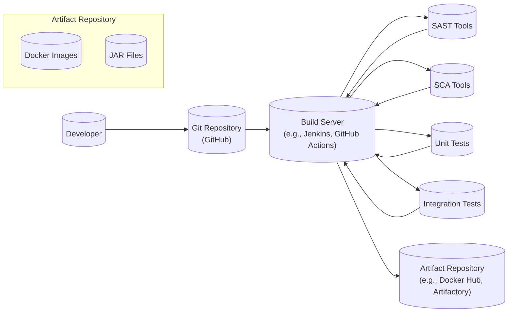

Okay, let's create a design document for the Harness platform based on the provided GitHub repository.  Since the repository is vast and encompasses the entire Harness platform, I will focus on the core concepts and architecture, making reasonable assumptions where necessary. I will prioritize providing a structure that's useful for threat modeling, as requested.

# BUSINESS POSTURE

Harness is a Continuous Delivery (CD) and Continuous Integration (CI) platform. Its primary business goal is to enable software development teams to release software faster, more reliably, and with less manual effort.  It aims to reduce the risk and complexity associated with software deployments.  The platform targets a wide range of customers, from startups to large enterprises. Given its nature, Harness likely operates with a moderate risk appetite, balancing innovation with the need for stability and security, as their customers rely on them for critical deployment processes.

Business Priorities:

*   Speed of Delivery: Enable customers to deploy software updates rapidly.
*   Reliability: Ensure deployments are successful and minimize downtime.
*   Scalability: Support a growing number of customers and increasingly complex deployments.
*   Security: Protect customer code, credentials, and deployment environments.
*   Compliance: Help customers meet regulatory and compliance requirements.
*   Ease of Use: Provide a user-friendly platform that simplifies complex tasks.
*   Extensibility: Allow integration with a wide range of tools and services.

Business Risks:

*   Unauthorized Access: Unauthorized users gaining access to the Harness platform or customer environments could lead to data breaches, code theft, or malicious deployments.
*   Service Disruption: Outages or performance issues in the Harness platform could disrupt customer deployments and cause significant business impact.
*   Data Loss: Loss of customer data (e.g., deployment configurations, secrets) could damage customer trust and lead to operational problems.
*   Supply Chain Attacks: Vulnerabilities in third-party dependencies used by Harness could be exploited to compromise the platform or customer environments.
*   Compliance Violations: Failure to meet relevant compliance standards (e.g., SOC 2, GDPR, PCI DSS) could result in legal and financial penalties.
*   Insider Threats: Malicious or negligent actions by Harness employees could compromise the platform or customer data.
*   Misconfiguration: Incorrectly configured Harness settings or customer deployments could lead to security vulnerabilities or deployment failures.

# SECURITY POSTURE

Based on the GitHub repository and general knowledge of CI/CD platforms, I can infer the following security controls and accepted risks.  It's important to note that this is an assessment based on a public repository, and a full security audit would reveal more detail.

Existing Security Controls:

*   security control: Role-Based Access Control (RBAC): Harness likely implements RBAC to restrict access to features and resources based on user roles (admin, developer, operator, etc.). Implemented within the Harness platform, likely in the manager and delegate components.
*   security control: Authentication: Harness likely supports various authentication methods, including username/password, multi-factor authentication (MFA), and single sign-on (SSO) integrations (e.g., SAML, OAuth). Implemented in the Harness manager component.
*   security control: Secrets Management: Harness likely provides a mechanism for securely storing and managing secrets (e.g., API keys, passwords, certificates) used in deployments. This might involve integration with external secrets managers (e.g., HashiCorp Vault, AWS Secrets Manager). Implemented in the Harness manager and delegate components, potentially leveraging external services.
*   security control: Audit Logging: Harness likely logs user actions and system events for auditing and security monitoring purposes. Implemented across various Harness components.
*   security control: Encryption: Data in transit is likely encrypted using TLS/SSL. Data at rest encryption may be implemented for sensitive data stored in databases or other storage systems. Implemented at various levels, including network communication and data storage.
*   security control: Network Security: Harness likely employs network security measures, such as firewalls, intrusion detection/prevention systems, and network segmentation, to protect its infrastructure. Implemented at the infrastructure level, likely within the cloud provider environment (e.g., AWS, GCP).
*   security control: Secure Software Development Lifecycle (SSDLC): Harness, as a company building a software product, likely follows secure coding practices, performs code reviews, and conducts security testing (SAST, DAST, penetration testing). Implemented throughout the development process.
*   security control: API Security: Harness likely implements API security best practices, such as input validation, rate limiting, and authentication/authorization for API access. Implemented in the Harness manager component, which exposes APIs.

Accepted Risks:

*   accepted risk: Complexity of Configuration: The flexibility and power of Harness can lead to complex configurations, which, if not managed carefully, could introduce security vulnerabilities.
*   accepted risk: Dependence on Third-Party Services: Harness integrates with various third-party services (e.g., cloud providers, source code repositories, artifact repositories). The security of these integrations depends on the security posture of the third-party services.
*   accepted risk: Rapid Pace of Development: The fast-paced development of new features and updates could potentially introduce new vulnerabilities if not thoroughly tested.

Recommended Security Controls:

*   Implement Software Composition Analysis (SCA) to identify and manage vulnerabilities in open-source dependencies.
*   Enhance secrets management by enforcing rotation policies and integrating with hardware security modules (HSMs) where appropriate.
*   Implement a robust vulnerability management program with regular penetration testing and vulnerability scanning.
*   Provide detailed security documentation and best practices guides for customers to help them configure Harness securely.
*   Offer security training and awareness programs for Harness employees.

Security Requirements:

*   Authentication:
    *   Support for multi-factor authentication (MFA) for all user accounts.
    *   Integration with enterprise identity providers (IdPs) via SAML, OAuth, or OpenID Connect.
    *   Strong password policies and enforcement.
    *   Session management with appropriate timeouts and secure cookie handling.

*   Authorization:
    *   Fine-grained role-based access control (RBAC) to restrict access to resources and actions.
    *   Principle of least privilege enforced throughout the platform.
    *   Ability to define custom roles and permissions.

*   Input Validation:
    *   All user inputs and API requests should be validated to prevent injection attacks (e.g., SQL injection, cross-site scripting).
    *   Data sanitization and encoding should be used where appropriate.

*   Cryptography:
    *   Use of strong, industry-standard cryptographic algorithms and protocols (e.g., TLS 1.2 or higher, AES-256).
    *   Secure key management practices, including key rotation and secure storage.
    *   Encryption of sensitive data at rest and in transit.

# DESIGN

## C4 CONTEXT

```mermaid
graph LR
    subgraph Users
        Developer[("Developer")]
        Operator[("Operator")]
        Administrator[("Administrator")]
    end

    HarnessPlatform[("Harness Platform")]

    subgraph External Systems
        SourceCodeRepo[("Source Code Repository\n(e.g., GitHub, GitLab)")]
        ArtifactRepo[("Artifact Repository\n(e.g., Docker Hub, Artifactory)")]
        CloudProvider[("Cloud Provider\n(e.g., AWS, GCP, Azure)")]
        MonitoringSystem[("Monitoring System\n(e.g., Prometheus, Datadog)")]
        NotificationSystem[("Notification System\n(e.g., Slack, Email)")]
        SecretsManager[("Secrets Manager\n(e.g., HashiCorp Vault)")]
    end
    
    Developer --> HarnessPlatform : Uses
    Operator --> HarnessPlatform : Uses
    Administrator --> HarnessPlatform : Uses
    HarnessPlatform --> SourceCodeRepo : Pulls code
    HarnessPlatform --> ArtifactRepo : Pulls/Pushes artifacts
    HarnessPlatform --> CloudProvider : Deploys to
    HarnessPlatform --> MonitoringSystem : Sends metrics
    HarnessPlatform --> NotificationSystem : Sends notifications
    HarnessPlatform --> SecretsManager : Retrieves secrets
```

C4 Context Element Descriptions:

*   Element:
    *   Name: Developer
    *   Type: User
    *   Description: A software developer who uses Harness to build and deploy applications.
    *   Responsibilities: Writes code, defines deployment pipelines, triggers deployments.
    *   Security controls: Authentication, RBAC, MFA.

*   Element:
    *   Name: Operator
    *   Type: User
    *   Description: An operations engineer who manages and monitors deployments.
    *   Responsibilities: Monitors deployments, troubleshoots issues, manages infrastructure.
    *   Security controls: Authentication, RBAC, MFA.

*   Element:
    *   Name: Administrator
    *   Type: User
    *   Description: A Harness platform administrator who manages users, permissions, and platform settings.
    *   Responsibilities: Configures the Harness platform, manages users and roles, sets up integrations.
    *   Security controls: Authentication, RBAC, MFA.

*   Element:
    *   Name: Harness Platform
    *   Type: System
    *   Description: The core Harness Continuous Delivery platform.
    *   Responsibilities: Orchestrates deployments, manages pipelines, integrates with external systems.
    *   Security controls: Authentication, RBAC, Secrets Management, Audit Logging, Encryption, API Security.

*   Element:
    *   Name: Source Code Repository
    *   Type: External System
    *   Description: A system for storing and managing source code (e.g., GitHub, GitLab).
    *   Responsibilities: Stores source code, manages versions, provides access control.
    *   Security controls: Authentication, Authorization, Access Control Lists (ACLs).

*   Element:
    *   Name: Artifact Repository
    *   Type: External System
    *   Description: A system for storing and managing build artifacts (e.g., Docker Hub, Artifactory).
    *   Responsibilities: Stores build artifacts, manages versions, provides access control.
    *   Security controls: Authentication, Authorization, Access Control Lists (ACLs).

*   Element:
    *   Name: Cloud Provider
    *   Type: External System
    *   Description: A cloud computing platform (e.g., AWS, GCP, Azure).
    *   Responsibilities: Provides infrastructure resources (e.g., VMs, containers, databases).
    *   Security controls: Provided by the cloud provider (e.g., IAM, VPCs, security groups).

*   Element:
    *   Name: Monitoring System
    *   Type: External System
    *   Description: A system for monitoring application and infrastructure performance (e.g., Prometheus, Datadog).
    *   Responsibilities: Collects metrics, provides dashboards and alerts.
    *   Security controls: Authentication, Authorization.

*   Element:
    *   Name: Notification System
    *   Type: External System
    *   Description: A system for sending notifications (e.g., Slack, Email).
    *   Responsibilities: Delivers notifications to users.
    *   Security controls: Authentication, Authorization.

*   Element:
    *   Name: Secrets Manager
    *   Type: External System
    *   Description: A system for securely storing and managing secrets (e.g., HashiCorp Vault).
    *   Responsibilities: Stores secrets, provides access control, manages secrets lifecycle.
    *   Security controls: Authentication, Authorization, Encryption, Audit Logging.

## C4 CONTAINER

```mermaid
graph LR
    subgraph Harness Platform
        Manager[("Harness Manager\n(API, UI)")]
        Delegate[("Harness Delegate\n(Agent)")]
        VerificationService[("Verification Service")]
        LogService[("Log Service")]
        Database[(("Database"))]
    end

    subgraph External Systems
        SourceCodeRepo[("Source Code Repository")]
        ArtifactRepo[("Artifact Repository")]
        CloudProvider[("Cloud Provider")]
        MonitoringSystem[("Monitoring System")]
        NotificationSystem[("Notification System")]
        SecretsManager[("Secrets Manager")]
    end

    Developer --> Manager : Uses UI/API
    Operator --> Manager : Uses UI/API
    Administrator --> Manager : Uses UI/API
    Manager --> Delegate : Communicates with
    Manager --> Database : Stores data
    Delegate --> SourceCodeRepo : Pulls code
    Delegate --> ArtifactRepo : Pulls/Pushes artifacts
    Delegate --> CloudProvider : Deploys to
    Delegate --> VerificationService : Sends data for verification
    Delegate --> LogService: Sends logs
    VerificationService --> MonitoringSystem: Retrieves metrics
    Manager --> NotificationSystem : Sends notifications
    Manager --> SecretsManager : Retrieves secrets
    Delegate --> SecretsManager : Retrieves secrets

```

C4 Container Element Descriptions:

*   Element:
    *   Name: Harness Manager
    *   Type: Container (Web Application)
    *   Description: The central control plane of the Harness platform, providing the API and UI.
    *   Responsibilities: Handles user authentication and authorization, manages pipelines and deployments, orchestrates delegate tasks, stores configuration data.
    *   Security controls: Authentication, RBAC, API Security, Secrets Management (client-side), Input Validation.

*   Element:
    *   Name: Harness Delegate
    *   Type: Container (Agent)
    *   Description: An agent that runs in the customer's environment and executes deployment tasks.
    *   Responsibilities: Executes deployment steps, interacts with cloud providers and other external systems, pulls code and artifacts, sends logs and verification data.
    *   Security controls: Authentication (to Manager), Secrets Management (client-side), Secure Communication (with Manager).

*   Element:
    *   Name: Verification Service
    *   Type: Container (Service)
    *   Description: A service that performs deployment verification using data from monitoring systems.
    *   Responsibilities: Analyzes metrics from monitoring systems, determines deployment success or failure.
    *   Security controls: Authentication (to Monitoring System), Secure Communication.

*   Element:
    *   Name: Log Service
    *   Type: Container (Service)
    *   Description: Centralized log collection and storage.
    *   Responsibilities: Collects and stores logs from delegates.
    *   Security controls: Secure Communication, Data at Rest Encryption.

*   Element:
    *   Name: Database
    *   Type: Container (Database)
    *   Description: Stores Harness platform data, such as user information, pipeline configurations, and deployment history.
    *   Responsibilities: Persists data, provides data access to the Manager.
    *   Security controls: Database Security (e.g., access controls, encryption), Network Security.

*   External Systems: (Same as in the Context diagram)

## DEPLOYMENT

Harness itself, as a platform, can be deployed in various ways.  Here are some possible deployment models:

1.  **SaaS (Software as a Service):** Harness manages the entire infrastructure and deployment. Customers access the platform through a web browser. This is the most common and likely the primary deployment model.
2.  **Self-Managed (On-Premises or Private Cloud):** Customers deploy and manage Harness within their own infrastructure (on-premises data center or private cloud). This provides more control but requires more operational overhead.
3.  **Hybrid:** A combination of SaaS and self-managed, where some components (e.g., the Manager) are hosted by Harness, and others (e.g., Delegates) are deployed in the customer's environment.

I will describe the **SaaS deployment model** in detail, as it's the most likely scenario for the majority of Harness users.

```mermaid
graph LR
    subgraph "Harness SaaS (AWS)"
        subgraph "VPC"
            subgraph "Public Subnet"
                LoadBalancer[("Load Balancer")]
            end
            subgraph "Private Subnet"
                ManagerInstances[("Manager Instances\n(Auto Scaling Group)")]
                DelegateInstances[("Delegate Instances\n(Auto Scaling Group)")]
                VerificationInstances[("Verification Service Instances\n(Auto Scaling Group)")]
                LogInstances[("Log Service Instances\n(Auto Scaling Group)")]
            end
            Database[(("RDS Database"))]
        end
    end

    Users --> LoadBalancer : HTTPS
    LoadBalancer --> ManagerInstances : HTTPS
    ManagerInstances --> DelegateInstances : gRPC (encrypted)
    ManagerInstances --> Database : Encrypted connection
    DelegateInstances --> CloudProvider[("Customer's Cloud Provider\n(AWS, GCP, Azure)")] : API Calls (encrypted)
    DelegateInstances --> VerificationInstances: gRPC (encrypted)
    DelegateInstances --> LogInstances: gRPC (encrypted)
    VerificationInstances --> MonitoringSystem[("Customer's Monitoring System")] : API Calls (encrypted)
    ManagerInstances --> NotificationSystem[("Notification System")] : API Calls (encrypted)
    ManagerInstances --> SecretsManager[("Secrets Manager")] : API Calls (encrypted)
    DelegateInstances --> SecretsManager : API Calls (encrypted)
```

Deployment Element Descriptions:

*   Element:
    *   Name: Users
    *   Type: External Entity
    *   Description: Developers, operators, and administrators accessing the Harness platform.
    *   Responsibilities: Interact with the Harness UI and API.
    *   Security controls: Browser security, network security.

*   Element:
    *   Name: Load Balancer
    *   Type: Infrastructure (AWS Application Load Balancer)
    *   Description: Distributes incoming traffic across multiple Manager instances.
    *   Responsibilities: Load balancing, SSL termination.
    *   Security controls: TLS/SSL termination, DDoS protection.

*   Element:
    *   Name: Manager Instances
    *   Type: Infrastructure (EC2 Instances in Auto Scaling Group)
    *   Description: Instances running the Harness Manager container.
    *   Responsibilities: Handling user requests, managing deployments, communicating with Delegates.
    *   Security controls: OS hardening, network security (security groups), IAM roles.

*   Element:
    *   Name: Delegate Instances
    *   Type: Infrastructure (EC2 Instances in Auto Scaling Group)
    *   Description: Instances running the Harness Delegate container.
    *   Responsibilities: Executing deployment tasks in customer environments.
    *   Security controls: OS hardening, network security (security groups), IAM roles.

*   Element:
    *   Name: Verification Service Instances
    *   Type: Infrastructure (EC2 Instances in Auto Scaling Group)
    *   Description: Instances running the Verification Service container.
    *   Responsibilities: Performing deployment verification.
    *   Security controls: OS hardening, network security (security groups), IAM roles.

*   Element:
    *   Name: Log Service Instances
    *   Type: Infrastructure (EC2 Instances in Auto Scaling Group)
    *   Description: Instances running the Log Service container.
    *   Responsibilities: Collecting and storing logs.
    *   Security controls: OS hardening, network security (security groups), IAM roles.

*   Element:
    *   Name: Database
    *   Type: Infrastructure (AWS RDS Database)
    *   Description: Managed database service (e.g., PostgreSQL) used by Harness.
    *   Responsibilities: Storing platform data.
    *   Security controls: Database security (access controls, encryption), network security (security groups), IAM roles.

*   Element:
    *   Name: Customer's Cloud Provider
    *   Type: External System
    *   Description: The customer's cloud environment (AWS, GCP, Azure) where applications are deployed.
    *   Responsibilities: Providing infrastructure resources.
    *   Security controls: Managed by the customer and the cloud provider.

*   Element:
    *   Name: Customer's Monitoring System
    *   Type: External System
    *   Description: The customer's monitoring system (e.g., Prometheus, Datadog).
    *   Responsibilities: Collecting and providing metrics.
    *   Security controls: Managed by the customer.

*   Element:
    *   Name: Notification System
    *   Type: External System
    *   Description: System for sending notifications (e.g., Slack, Email).
    *   Responsibilities: Delivering notifications.
    *   Security controls: Managed by the notification service provider.

*   Element:
    *   Name: Secrets Manager
    *   Type: External System
    *   Description: System for managing secrets (e.g., HashiCorp Vault, AWS Secrets Manager).
    *   Responsibilities: Storing and providing secrets.
    *   Security controls: Managed by the secrets management service provider.

## BUILD

The build process for Harness, being a complex platform, likely involves multiple stages and tools. I'll describe a generalized build process based on common CI/CD practices and what can be inferred from the repository.



Build Process Description:

1.  **Code Commit:** Developers commit code changes to the Git repository (GitHub).
2.  **Build Trigger:** A commit or pull request triggers a build on the build server (e.g., Jenkins, GitHub Actions).
3.  **Code Checkout:** The build server checks out the latest code from the repository.
4.  **Static Analysis:**
    *   **SAST (Static Application Security Testing):** SAST tools (e.g., SonarQube, Checkmarx) analyze the source code for security vulnerabilities.
    *   **SCA (Software Composition Analysis):** SCA tools (e.g., Snyk, Black Duck) identify and analyze open-source dependencies for known vulnerabilities.
5.  **Testing:**
    *   **Unit Tests:** Unit tests are executed to verify the functionality of individual code components.
    *   **Integration Tests:** Integration tests are executed to verify the interaction between different components.
6.  **Artifact Creation:** If all tests and analyses pass, build artifacts are created. This likely includes Docker images for containerized components and JAR files for Java-based components.
7.  **Artifact Storage:** The build artifacts are pushed to an artifact repository (e.g., Docker Hub, Artifactory).

Security Controls in the Build Process:

*   **Source Code Management:** Git provides version control and access control for the codebase.
*   **Build Automation:** The build server automates the build process, ensuring consistency and repeatability.
*   **SAST:** Identifies security vulnerabilities in the source code.
*   **SCA:** Identifies vulnerabilities in open-source dependencies.
*   **Automated Testing:** Unit and integration tests help ensure code quality and prevent regressions.
*   **Artifact Repository:** Provides a secure and controlled environment for storing build artifacts.
*   **Build Server Security:** The build server itself should be secured with appropriate access controls and security hardening.
*   **Supply Chain Security:** Measures should be in place to ensure the integrity of the build tools and dependencies. This might include using trusted sources, verifying digital signatures, and scanning for malicious code.

# RISK ASSESSMENT

*   **Critical Business Processes:**
    *   Software Deployment: The core process of deploying software to customer environments.
    *   Pipeline Management: Creating, managing, and executing deployment pipelines.
    *   User and Access Management: Managing user accounts and permissions within the Harness platform.
    *   Secrets Management: Securely storing and providing access to secrets used in deployments.
    *   Integration with External Systems: Connecting to and interacting with external systems (e.g., cloud providers, source code repositories).

*   **Data to Protect and Sensitivity:**
    *   Customer Code: Source code and build artifacts (High sensitivity - Confidentiality, Integrity).
    *   Customer Credentials: API keys, passwords, certificates used to access cloud providers and other services (High sensitivity - Confidentiality).
    *   Deployment Configurations: Pipeline definitions, environment settings, deployment strategies (Medium sensitivity - Confidentiality, Integrity).
    *   User Data: User account information, roles, permissions (Medium sensitivity - Confidentiality).
    *   Audit Logs: Records of user actions and system events (Medium sensitivity - Confidentiality, Integrity).
    *   Platform Configuration Data: Settings and configurations related to the Harness platform itself (Medium sensitivity - Confidentiality, Integrity).
    *   Metrics and Monitoring Data: Data collected from monitoring systems (Low to Medium sensitivity - Confidentiality, Integrity).

# QUESTIONS & ASSUMPTIONS

*   **Questions:**
    *   What specific compliance standards (e.g., SOC 2, ISO 27001) does Harness adhere to?
    *   What are the specific details of Harness's incident response plan?
    *   What are the SLAs (Service Level Agreements) offered to customers for uptime and support?
    *   What are the specific mechanisms used for data at rest encryption?
    *   How is key management handled for encryption keys?
    *   What are the details of Harness's vulnerability management program, including frequency of penetration testing and vulnerability scanning?
    *   What specific third-party security audits or certifications has Harness undergone?
    *   How does Harness handle data residency requirements for customers in different regions?
    *   What are the specific details of Harness's disaster recovery and business continuity plans?
    *   How does Harness ensure the security of its supply chain, including third-party dependencies and build tools?

*   **Assumptions:**
    *   BUSINESS POSTURE: Harness operates with a moderate risk appetite, balancing innovation with security and reliability.
    *   SECURITY POSTURE: Harness implements industry-standard security controls and follows secure development practices. The SaaS offering is the primary deployment model.
    *   DESIGN: The C4 diagrams and deployment model represent a simplified, high-level view of the Harness architecture. The actual implementation may be more complex. The build process follows common CI/CD best practices. The use of AWS services is assumed for the SaaS deployment, but other cloud providers could be used.