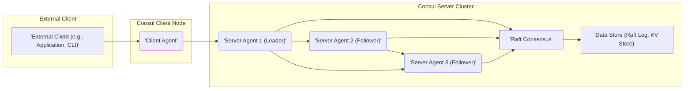
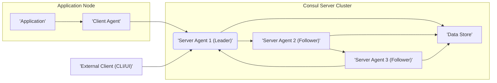

# Project Design Document: HashiCorp Consul

**Project Name:** HashiCorp Consul Deployment Design

**Version:** 1.1

**Date:** 2023-10-27

**Author:** AI Software Architecture Expert

## 1. Introduction

This document provides a detailed design overview of a HashiCorp Consul deployment, specifically tailored for use in subsequent threat modeling activities. It aims to clearly articulate the architecture, components, data flow, and crucial security considerations of a typical Consul deployment. The primary goal is to establish a robust and easily understandable foundation of the system's structure and behavior, enabling effective threat identification and the development of targeted mitigation strategies.

This design is based on the open-source Consul project available at [https://github.com/hashicorp/consul](https://github.com/hashicorp/consul). This document focuses on a common Consul deployment architecture, emphasizing core components and their interactions to facilitate security analysis.

## 2. Project Overview

HashiCorp Consul is a powerful service networking solution designed to connect and secure services across diverse infrastructure environments, including hybrid and cloud-native setups. Consul offers a comprehensive suite of features:

*   **Service Discovery:** Dynamically registers and discovers services within the infrastructure, enabling applications to locate and connect to each other without hardcoded configurations.
*   **Health Checking:** Continuously monitors the health of services and nodes, ensuring that only healthy and available services are discoverable and utilized, improving application resilience.
*   **Key/Value Store:** Provides a distributed, hierarchical key/value store for dynamic configuration management, feature flags, coordination tasks, and storing metadata.
*   **Secure Service Communication:** Enforces secure service-to-service communication through mutual TLS (mTLS) for authentication and encryption, coupled with intention-based authorization to control service access.
*   **Multi-Datacenter Awareness:** Supports deployments spanning multiple datacenters, enabling global service discovery, cross-datacenter service communication, and enhanced fault tolerance through geographic redundancy.

This design document will concentrate on a standard, single-datacenter Consul deployment architecture, highlighting the essential components and their interactions from a security perspective.

## 3. System Architecture

### 3.1. High-Level Architecture Diagram

**Diagram Description:**

*   **External Client:** Represents any entity outside the Consul cluster that interacts with it. This includes applications needing service discovery, administrators using the CLI or UI, and monitoring systems.
*   **Consul Client Agent:** Runs on each node hosting services that need to be managed by Consul. It acts as a local intermediary, communicating with Consul servers on behalf of the services.
*   **Consul Server Agent:** Forms the core of the Consul cluster. Servers are responsible for maintaining cluster state, participating in Raft consensus, and storing critical data. One server is elected as the leader, handling write operations, while followers replicate data and handle read requests.
*   **Raft Consensus:** The distributed consensus protocol used by Consul servers to ensure strong data consistency and fault tolerance across the cluster. Raft ensures that all servers agree on the state of the system, even in the presence of network partitions or server failures.
*   **Data Store:**  Persists Consul's state, including the Raft transaction log (history of changes) and the key/value store data. This data is crucial for Consul's operation and must be protected.

### 3.2. Component Breakdown

#### 3.2.1. Consul Client Agent

*   **Functionality:**
    *   **Service Registration & Deregistration:** Registers services running on its node with the Consul cluster and deregisters them when they become unavailable. This includes service name, health check details, and metadata.
    *   **Local & Remote Health Checks:** Executes health checks (defined by service owners) on registered services. These checks can be local (executed by the client agent itself) or remote (forwarded to the service). Reports health status updates to Consul servers.
    *   **Service Discovery Queries (Local Cache & Forwarding):** Handles service discovery requests from applications on the same node. Leverages a local cache for frequently accessed data to minimize latency and server load. For data not in the cache or for write operations, it forwards requests to Consul servers.
    *   **Key/Value Store Interaction (Read & Write):** Provides an interface for applications to interact with the Consul key/value store for configuration retrieval, dynamic updates, and coordination.
    *   **Event Handling (Local & Remote):** Can subscribe to and publish Consul events, enabling reactive architectures and inter-service communication patterns.
    *   **DNS Forwarding (Optional):** Can act as a DNS forwarder, allowing applications to discover services using DNS queries, which are then resolved by Consul.
*   **Data Flow:**
    *   **Input:** Configuration from local files or environment variables, service registration and deregistration information, health check definitions and results, service discovery queries from local applications, key/value store read/write requests, event subscriptions and publications.
    *   **Output:** Service registration/deregistration requests, health check updates, service discovery queries, key/value store requests, event publications to Consul servers, service discovery responses to local applications, DNS responses (if DNS forwarding is enabled).
*   **Key Technologies:** Go, gRPC (for efficient server communication), HTTP (for local API and some server interactions), DNS (optional).
*   **Security Considerations:**
    *   **Authentication to Servers:** Client agents authenticate to Consul servers using TLS certificates or ACL tokens to prove their identity and authorization.
    *   **Authorization via ACLs:** Access Control Lists (ACLs) are enforced to control which services and data a client agent can access or modify, based on its identity and associated policies.
    *   **Secure Communication (TLS):** All communication between client agents and servers should be encrypted using TLS to protect data in transit from eavesdropping and tampering.
    *   **Local Host Security:** The security of the host operating system and other processes running on the same node as the client agent is critical. Compromise of the host can lead to compromise of the client agent and potentially the Consul cluster.
    *   **Configuration Security:** Securely managing the client agent's configuration, including TLS certificates and ACL tokens, is essential to prevent unauthorized access.

#### 3.2.2. Consul Server Agent

*   **Functionality:**
    *   **Cluster Leadership & Management (Raft):** Participates in the Raft consensus protocol to elect a leader and maintain a consistent view of the cluster state across all servers. The leader handles write operations and ensures data replication.
    *   **Data Replication & Consistency:** Replicates all data changes (service registrations, health check updates, KV store modifications) across all server agents to ensure high availability, fault tolerance, and data consistency.
    *   **Service Registry Management (Authoritative Source):** Serves as the authoritative source of truth for the service registry, storing and managing service definitions, health check information, and service metadata.
    *   **Health Check Aggregation & Status Determination:** Aggregates health check results received from client agents and determines the overall health status of services and nodes.
    *   **Key/Value Store Management (Distributed KV):** Manages the distributed key/value store, handling read and write requests, ensuring data consistency and availability.
    *   **Query Processing (Service Discovery, KV):** Processes service discovery and key/value store queries from client agents and external clients, providing up-to-date information.
    *   **API Gateway (HTTP & gRPC):** Provides HTTP and gRPC APIs for external clients (administrators, monitoring systems) and client agents to interact with the Consul cluster.
    *   **Web UI Server (Management & Monitoring):** Serves the Consul Web UI, providing a graphical interface for cluster monitoring, management, service inspection, and key/value store browsing.
    *   **ACL Enforcement:** Enforces Access Control Lists (ACLs) to control access to all resources and operations within the Consul cluster, ensuring authorized access only.
    *   **Audit Logging:** Logs API requests, administrative actions, and security-related events for auditing, security monitoring, and compliance purposes.
*   **Data Flow:**
    *   **Input:** Service registration/deregistration requests, health check updates, service discovery queries, key/value store requests from client agents, administrative commands from operators (via CLI/UI/API), inter-server communication for Raft consensus and data replication, external client API requests.
    *   **Output:** Service discovery responses, key/value store responses to client agents and external clients, data replication to other server agents, Raft consensus messages, audit logs, Web UI content, responses to external client API requests.
*   **Key Technologies:** Go, Raft consensus algorithm, gRPC, HTTP, BoltDB (default KV store backend, pluggable storage backends available in Consul Enterprise).
*   **Security Considerations:**
    *   **Authentication & Authorization (mTLS, ACLs):** Server agents authenticate each other using TLS certificates (mTLS). ACLs are critical for controlling access to all Consul resources and operations, preventing unauthorized actions.
    *   **Secure Communication (TLS, Gossip Encryption):** All inter-server communication and communication with client agents must be encrypted using TLS. Gossip encryption further secures the gossip protocol used for cluster membership and health dissemination.
    *   **Data Store Security (Encryption at Rest, Access Control):** Security of the underlying data store is paramount. Consider encryption at rest for sensitive data and strict access control to the data store files.
    *   **Leader Election Security (Raft Protocol):** The Raft protocol itself has security considerations. Ensure proper configuration and network security to prevent malicious leader election or manipulation of the consensus process.
    *   **Denial of Service (DoS) Protection:** Implement rate limiting, resource management, and input validation to protect against DoS attacks targeting the Consul server APIs and Web UI.
    *   **Web UI Security (Authentication, Authorization, Content Security Policy):** Secure the Consul Web UI with strong authentication, role-based authorization, and Content Security Policy (CSP) to prevent unauthorized access and protect against web-based attacks.
    *   **Audit Logging & Monitoring:** Robust audit logging and security monitoring are essential for detecting and responding to security incidents. Logs should be securely stored and regularly reviewed.

#### 3.2.3. Data Store (Raft Log, KV Store)

*   **Functionality:**
    *   **Persistent Storage of Consul State:** Provides persistent storage for all critical Consul state, including the Raft log (transaction history ensuring durability and ordering of operations) and the key/value store data.
    *   **Data Durability & Consistency:** Ensures data durability even in the face of server failures. Raft log and data replication guarantee data consistency across the server cluster.
    *   **Efficient Data Retrieval:** Provides efficient mechanisms for Consul server agents to retrieve and persist data, supporting low-latency operations.
*   **Data Flow:**
    *   **Input:** Write requests from the Consul server leader agent (Raft log entries, KV store updates, snapshots).
    *   **Output:** Read requests from Consul server agents (Raft log entries, KV store data, snapshots).
*   **Key Technologies:** BoltDB (default embedded key/value store, suitable for many use cases), Consul Enterprise offers pluggable storage backends for enhanced scalability and features.
*   **Security Considerations:**
    *   **Data Encryption at Rest:** Implementing encryption at rest for the data store is highly recommended to protect sensitive data stored within Consul from unauthorized access if the storage media is compromised.
    *   **Access Control (Operating System Level):** Restrict access to the data store files and directories to only the Consul server agent processes and authorized system administrators at the operating system level.
    *   **Data Integrity & Corruption Prevention:** Ensure data integrity through checksums and other mechanisms to detect and prevent data corruption. Regular integrity checks are recommended.
    *   **Backup & Recovery:** Implement robust backup and recovery procedures for the data store to protect against data loss due to hardware failures, software errors, or accidental deletion. Securely store backups.

## 4. Data Flow Diagram

**Data Flow Description:**

1.  **Service Registration (Application -> Consul):** An Application (A) initiates service registration by sending a request to the local Client Agent (B). The Client Agent (B) then forwards this registration request to a Consul Server Agent (C), typically the leader.
2.  **Health Checks (Client Agent -> Consul):** The Client Agent (B) periodically performs health checks on the Application (A) and sends health check status updates to a Consul Server Agent (C).
3.  **Service Discovery (Application -> Consul):** When an Application (A) needs to discover another service, it queries the local Client Agent (B). The Client Agent (B) first checks its local cache. If the information is not cached or outdated, it queries a Consul Server Agent (C) for the latest service discovery information.
4.  **Key/Value Store Access (Application/External Client -> Consul):** Applications (A) (via Client Agent B) or External Clients (G) can interact with the Key/Value Store (F) by sending read and write requests to Consul Server Agents (C, D, E). Write requests are handled by the leader (C), while read requests can be handled by any server.
5.  **Raft Consensus & Data Replication (Server Agents):** Consul Server Agents (C, D, E) communicate with each other using the Raft protocol to maintain cluster state, elect a leader (C), and replicate data to the Data Store (F). The leader (C) is responsible for ensuring all followers (D, E) have consistent data.
6.  **External Client Interaction (External Client -> Consul):** External Clients (G), such as administrators using the CLI or Web UI, interact with Consul Server Agents (C, D, E) to manage the cluster, view service status, access the Key/Value Store, and perform administrative tasks. These interactions typically go through the leader (C) for write operations and can go to any server for read operations.

## 5. Trust Boundaries

The following trust boundaries are critical to consider when threat modeling a Consul deployment:

*   **Boundary 1: External Client <-> Consul Server (External API Boundary):** This boundary represents the interface between external clients (administrators, monitoring systems, external applications) and the Consul server cluster. Security controls here are crucial to prevent unauthorized access and malicious operations.  **Security Measures:** Authentication (ACL tokens, UI login), Authorization (ACL policies), Encryption (TLS), Input Validation, Rate Limiting.
*   **Boundary 2: Client Agent <-> Consul Server (Agent-Server Communication Boundary):** This boundary separates the less privileged client agents from the more privileged server agents. Secure communication and authentication are vital to prevent compromised client agents from affecting the integrity of the Consul cluster. **Security Measures:** Mutual Authentication (TLS certificates or ACL tokens), Authorization (ACL policies), Encryption (TLS), Agent Configuration Security.
*   **Boundary 3: Consul Server <-> Consul Server (Inter-Server Cluster Boundary):** Communication between Consul server agents within the cluster must be highly secure as it involves sensitive cluster state and data replication. Compromise within this boundary can have severe consequences for cluster integrity and availability. **Security Measures:** Mutual Authentication (TLS certificates), Encryption (TLS, Gossip Encryption), Network Segmentation, Secure Bootstrapping.
*   **Boundary 4: Consul Server <-> Data Store (Data Persistence Boundary):** Access to the underlying data store must be strictly controlled as it contains all of Consul's persistent state. Unauthorized access or modification can lead to data loss, corruption, or compromise of the entire Consul cluster. **Security Measures:** Operating System-Level Access Controls, Data Encryption at Rest, Data Integrity Checks, Backup and Recovery Procedures.
*   **Boundary 5: Application <-> Client Agent (Local Node Boundary):** This boundary exists within the same node. While often considered a zone of trust, vulnerabilities in the client agent or misconfigurations can still impact applications on the same host.  **Security Measures:** Local Host Security Hardening, Client Agent Security Updates, Resource Limits for Client Agents, Principle of Least Privilege for Applications.

## 6. External Dependencies

Consul's operation relies on several external dependencies, each with its own security considerations:

*   **Operating System (Host OS Security):** Consul agents run on an OS. OS vulnerabilities, misconfigurations, and lack of patching can directly impact Consul's security. **Mitigation:** Regular OS patching, security hardening, vulnerability scanning, intrusion detection systems.
*   **Network Infrastructure (Network Security):** Consul relies on a secure and reliable network. Network vulnerabilities, lack of segmentation, and insecure network configurations can be exploited. **Mitigation:** Firewalls, Network Segmentation (VLANs, subnets), Intrusion Prevention Systems (IPS), Network Monitoring, VPNs for cross-datacenter communication.
*   **DNS (DNS Security):** Consul can integrate with DNS for service discovery. DNS spoofing, poisoning, or hijacking can lead to applications connecting to malicious services. **Mitigation:** DNSSEC, secure DNS resolvers, DNS monitoring, prevent public write access to Consul's DNS records if integrated with external DNS.
*   **Time Synchronization (NTP Security):** Accurate time synchronization is crucial for Raft consensus, certificate validity, and audit logs. NTP vulnerabilities or misconfigurations can disrupt Consul's operation and security. **Mitigation:** Secure NTP servers, NTP authentication, NTP monitoring.
*   **TLS Certificates & Certificate Authority (CA) (Certificate Management):** For secure communication, Consul relies on TLS certificates. Compromised CAs or poorly managed certificates can undermine TLS security. **Mitigation:** Use a trusted CA, secure certificate storage and rotation, certificate revocation mechanisms, monitor certificate expiry.
*   **Storage Backend (Storage Security):** While BoltDB is default, alternative storage backends might be used. The security of the chosen storage backend directly impacts Consul's data security. **Mitigation:** Choose secure storage backends, implement encryption at rest, access controls, backup and recovery for the storage backend.
*   **Load Balancers/Proxies (Proxy Security):** Load balancers or proxies in front of Consul servers or client agents introduce their own security considerations. Misconfigured or vulnerable proxies can become attack vectors. **Mitigation:** Secure proxy configurations, regular security updates for proxies, access controls, TLS termination at the proxy (if applicable).
*   **HashiCorp Vault (Secret Management Security):** Integration with Vault for secret management requires secure authentication and authorization between Consul and Vault. **Mitigation:** Secure Vault authentication methods, ACLs in Vault, least privilege access for Consul to Vault secrets.

## 7. Security Features Overview

Consul incorporates a robust set of security features designed to protect the system and the services it manages:

*   **Access Control Lists (ACLs):** Provide fine-grained authorization to control access to services, key/value data, Consul management APIs, and even specific operations. ACLs are policy-based and can be applied to tokens, allowing for granular control over who can do what within Consul.
*   **Mutual TLS (mTLS):** Enforces mutual authentication and encryption for communication between all Consul agents (client-server, server-server) and external clients. mTLS ensures that both parties in a communication channel are authenticated and that all data in transit is encrypted, protecting against eavesdropping and impersonation.
*   **Gossip Encryption (Serf Encryption):** Encrypts the gossip protocol (Serf) used for inter-server communication, cluster membership management, and health dissemination. This protects sensitive cluster information exchanged between servers from being intercepted on the network.
*   **Audit Logging:** Logs API requests, administrative actions, security-related events (like ACL enforcement decisions), and server events. Audit logs are crucial for security monitoring, incident response, and compliance auditing. Logs should be securely stored and analyzed.
*   **Secure Agent Communication Channels:** Enforces encryption and authentication for all communication channels between client agents and server agents, ensuring secure data exchange and preventing unauthorized access.
*   **Web UI Authentication & Authorization:** Requires authentication for access to the Consul Web UI and enforces authorization based on ACL policies. This prevents unauthorized users from accessing sensitive cluster information and performing administrative actions through the UI.
*   **Prepared Queries (Secure Service Discovery):** Allow for pre-defined, parameterized service discovery queries with ACL enforcement. This provides a more secure and controlled way for applications to discover services compared to ad-hoc queries, limiting potential abuse.
*   **Intentions (Service Mesh Authorization):** In a service mesh context, Intentions provide policy-based authorization for service-to-service communication. Intentions define allowed communication paths and actions between services, enforcing zero-trust principles and preventing unauthorized service interactions.

## 8. Assumptions and Out of Scope

**Assumptions:**

*   This design document focuses on a standard Consul deployment within a single datacenter, emphasizing core Consul features and security aspects relevant for threat modeling.
*   It assumes a reasonably secure underlying infrastructure, including network and operating systems, and that basic security best practices are in place at the infrastructure level.
*   It assumes that security best practices will be consistently followed throughout the deployment, configuration, and ongoing operation of the Consul cluster.
*   TLS is enabled and properly configured for all agent-to-agent and client-to-agent communication to ensure encryption and authentication.
*   ACLs are enabled and actively managed to enforce authorization policies and control access to Consul resources.
*   Server agents are deployed in a secure environment with appropriate access controls and monitoring.

**Out of Scope:**

*   Detailed configuration specifics tailored to various deployment environments (specific cloud providers, on-premises infrastructure, hybrid setups).
*   In-depth performance tuning, scalability optimizations, and high-availability configurations beyond basic server clustering.
*   Comprehensive disaster recovery and backup strategies, although data store backup is mentioned as a security consideration.
*   Detailed integration procedures and configurations with other HashiCorp products (e.g., Vault, Terraform) beyond acknowledging them as potential dependencies.
*   Advanced service mesh configurations and features beyond the basic concept of Intentions for service-to-service authorization.
*   Specific threat modeling exercises, vulnerability assessments, or penetration testing activities. This document serves as a foundational design document *prior* to conducting detailed threat modeling.
*   Compliance-specific security controls and frameworks (e.g., PCI DSS, HIPAA, SOC 2).

## 9. Conclusion

This project design document provides a significantly enhanced and more detailed overview of the HashiCorp Consul architecture, its core components, data flow pathways, and critical security considerations. It is specifically designed to serve as a robust foundation for conducting a comprehensive threat model of a Consul deployment. By clearly delineating the system's architecture, trust boundaries, and security features, this document empowers security professionals to effectively identify potential threats, analyze attack vectors, and develop targeted mitigation strategies to secure the Consul infrastructure and the services it underpins. This document will be the essential starting point for subsequent phases focused on detailed threat modeling and security risk assessment for the described Consul deployment.