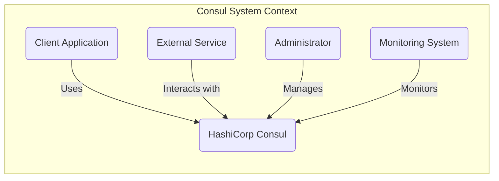
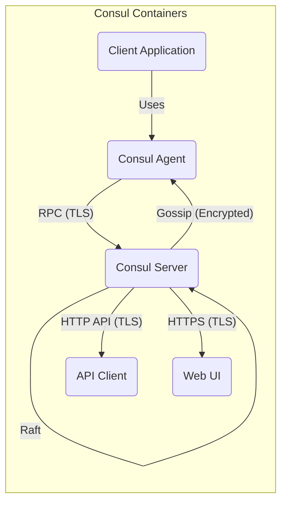
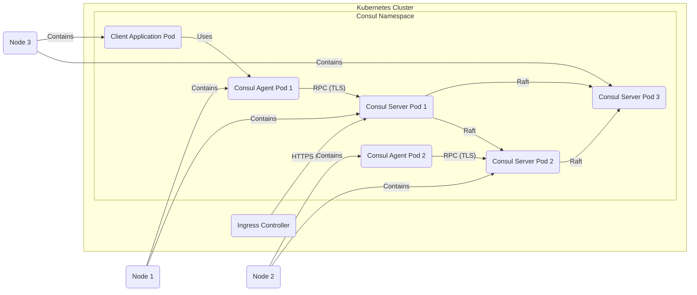
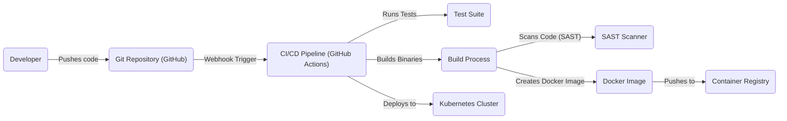

# BUSINESS POSTURE

HashiCorp Consul is a widely adopted service networking solution. Its primary business goals revolve around simplifying and securing service-to-service communication in dynamic, distributed environments. Given its nature and widespread use, the business posture can be characterized as follows:

Priorities and Goals:

*   Enable reliable and secure service discovery.
*   Facilitate secure service-to-service communication.
*   Provide a centralized configuration and key-value store.
*   Support multi-cloud and hybrid-cloud deployments.
*   Offer high availability and scalability.
*   Maintain a strong reputation for security and reliability (critical for infrastructure software).
*   Support a wide range of platforms and integrations.
*   Foster a large and active open-source community.

Most Important Business Risks:

*   Data breaches or unauthorized access to sensitive data transiting through Consul or stored within its key-value store.
*   Service disruptions due to misconfiguration, bugs, or attacks, leading to application downtime.
*   Compromise of Consul infrastructure, potentially allowing attackers to control service communication or inject malicious services.
*   Failure to meet compliance requirements (e.g., GDPR, HIPAA, PCI DSS) when handling sensitive data.
*   Reputational damage due to security vulnerabilities or major outages.
*   Loss of community trust and adoption due to perceived insecurity or instability.
*   Inability to scale to meet the demands of large, complex deployments.

# SECURITY POSTURE

Existing Security Controls:

*   security control: Access Control Lists (ACLs): Consul uses ACLs to control access to data and APIs. This is a fundamental security mechanism. Described in documentation and implemented throughout the codebase.
*   security control: Gossip Encryption: Communication between Consul agents is encrypted using a symmetric key (gossip protocol). Described in documentation and implemented in the gossip protocol handling.
*   security control: TLS Encryption: Consul supports TLS for securing RPC communication between clients and servers, and for HTTPS access to the UI and API. Described in documentation and implemented in the communication layers.
*   security control: Agent Token: Each agent has a token that is used to authenticate it to the Consul servers.
*   security control: Intention: Define which services are allowed to communicate with each other.
*   security control: Namespaces: Enterprise feature that allows to isolate environments.

Accepted Risks:

*   accepted risk: Complexity of Configuration: Consul's configuration can be complex, increasing the risk of misconfiguration that could lead to security vulnerabilities or service disruptions. This is mitigated by extensive documentation and community support, but the risk remains.
*   accepted risk: Reliance on External Systems: Consul often relies on external systems (e.g., for storage, networking). Vulnerabilities or misconfigurations in these systems can impact Consul's security.
*   accepted risk: Insider Threat: While ACLs and other controls mitigate this, a malicious or compromised administrator with sufficient privileges could still compromise the system.

Recommended Security Controls:

*   Regular Security Audits: Conduct regular security audits and penetration testing of Consul deployments.
*   Principle of Least Privilege: Strictly enforce the principle of least privilege for all users and services interacting with Consul.
*   Network Segmentation: Implement network segmentation to isolate Consul servers and agents from other parts of the infrastructure.
*   Monitoring and Alerting: Implement comprehensive monitoring and alerting for Consul, including security-relevant events.
*   Automated Configuration Management: Use automated configuration management tools to ensure consistent and secure configurations across all Consul deployments.

Security Requirements:

*   Authentication:
    *   All access to Consul's API and UI must be authenticated.
    *   Support for strong authentication mechanisms (e.g., multi-factor authentication) should be considered.
    *   Agent-to-server and server-to-server authentication must be robust and use strong cryptographic methods.

*   Authorization:
    *   Fine-grained authorization controls (ACLs) must be used to restrict access to data and operations based on the principle of least privilege.
    *   Regularly review and update ACL policies to ensure they remain appropriate.

*   Input Validation:
    *   All input to Consul's API and configuration files must be strictly validated to prevent injection attacks and other vulnerabilities.
    *   Sanitize data appropriately before storing or processing it.

*   Cryptography:
    *   Use strong, industry-standard cryptographic algorithms and protocols for all encryption (gossip, TLS).
    *   Regularly review and update cryptographic configurations to address emerging threats and vulnerabilities.
    *   Properly manage cryptographic keys, ensuring their confidentiality and integrity.
    *   Use hardware security modules (HSMs) where appropriate for enhanced key protection.

# DESIGN

## C4 CONTEXT

Element Descriptions:

*   1.  Name: Client Application
    *   Type: Software System
    *   Description: An application that uses Consul for service discovery, configuration, or other features.
    *   Responsibilities:
        *   Register itself with Consul.
        *   Discover other services through Consul.
        *   Retrieve configuration data from Consul.
        *   Communicate with other services securely via Consul.
    *   Security controls:
        *   Uses TLS to communicate with Consul.
        *   Authenticates with Consul using a valid token.
        *   Implements appropriate authorization checks based on data retrieved from Consul.

*   2.  Name: Consul
    *   Type: Software System
    *   Description: The HashiCorp Consul system itself, including servers and agents.
    *   Responsibilities:
        *   Maintain a registry of services.
        *   Provide service discovery capabilities.
        *   Store and distribute configuration data.
        *   Enable secure service-to-service communication.
        *   Provide a health checking mechanism.
    *   Security controls:
        *   ACLs to control access to data and APIs.
        *   Gossip encryption for agent communication.
        *   TLS for client-server and server-server communication.
        *   Agent tokens for authentication.

*   3.  Name: External Service
    *   Type: Software System
    *   Description: A service that interacts with Consul but is not directly managed by it (e.g., a legacy system).
    *   Responsibilities:
        *   May register itself with Consul (if supported).
        *   May discover services through Consul.
    *   Security controls:
        *   Should use TLS to communicate with Consul if possible.
        *   May require specific configuration to interact securely with Consul.

*   4.  Name: Administrator
    *   Type: Person
    *   Description: A user responsible for managing and configuring Consul.
    *   Responsibilities:
        *   Configure Consul servers and agents.
        *   Manage ACL policies.
        *   Monitor Consul's health and performance.
        *   Respond to security incidents.
    *   Security controls:
        *   Strong authentication (e.g., multi-factor authentication).
        *   Restricted access based on the principle of least privilege.
        *   Regular security training.

*   5.  Name: Monitoring System
    *   Type: Software System
    *   Description: A system used to monitor the health, performance, and security of Consul.
    *   Responsibilities:
        *   Collect metrics and logs from Consul.
        *   Generate alerts for critical events.
        *   Provide dashboards for visualizing Consul's status.
    *   Security controls:
        *   Secure communication with Consul (e.g., TLS).
        *   Access control to prevent unauthorized access to monitoring data.

## C4 CONTAINER

Element Descriptions:

*   1.  Name: Client Application
    *   Type: Software System
    *   Description: An application that uses Consul for service discovery, configuration, or other features.
    *   Responsibilities:
        *   Register itself with Consul.
        *   Discover other services through Consul.
        *   Retrieve configuration data from Consul.
        *   Communicate with other services securely via Consul.
    *   Security controls:
        *   Uses TLS to communicate with Consul Agent.
        *   Authenticates with Consul using a valid token.
        *   Implements appropriate authorization checks based on data retrieved from Consul.

*   2.  Name: Consul Agent
    *   Type: Container
    *   Description: A long-running daemon that runs on every member of a Consul cluster.  Agents can run in client or server mode.
    *   Responsibilities:
        *   Run health checks.
        *   Forward queries to servers.
        *   Maintain membership information.
    *   Security controls:
        *   Gossip encryption.
        *   TLS for RPC communication.
        *   Agent token authentication.

*   3.  Name: Consul Server
    *   Type: Container
    *   Description: A Consul agent running in server mode.  Servers participate in the Raft consensus algorithm and store the cluster state.
    *   Responsibilities:
        *   Maintain the service catalog.
        *   Handle queries.
        *   Replicate data using Raft.
        *   Elect a leader.
    *   Security controls:
        *   ACLs.
        *   Gossip encryption.
        *   TLS for RPC and HTTP API communication.
        *   Agent token authentication.

*   4.  Name: API Client
    *   Type: Software System/Library
    *   Description: A client library or application that interacts with Consul's HTTP API.
    *   Responsibilities:
        *   Send requests to the Consul API.
        *   Process responses from the Consul API.
    *   Security controls:
        *   TLS for communication with the Consul API.
        *   Authentication using API tokens.

*   5.  Name: Web UI
    *   Type: Web Application
    *   Description: Consul's web-based user interface.
    *   Responsibilities:
        *   Provide a graphical interface for interacting with Consul.
        *   Display service information, health checks, and configuration data.
    *   Security controls:
        *   TLS for HTTPS communication.
        *   Authentication using Consul's ACL system.

## DEPLOYMENT

Possible Deployment Solutions:

1.  Virtual Machines (VMs): Deploy Consul agents and servers on VMs in a cloud environment (AWS, Azure, GCP) or on-premises.
2.  Containers (Docker): Deploy Consul agents and servers as Docker containers, orchestrated by a system like Kubernetes, Nomad, or Docker Swarm.
3.  Bare Metal: Deploy Consul directly on physical servers.
4.  Hybrid: A combination of the above, with some components on VMs, some in containers, and some on bare metal.

Chosen Solution (for detailed description): Containers (Kubernetes)

Element Descriptions:

*   1.  Name: Kubernetes Cluster
    *   Type: Infrastructure
    *   Description: The Kubernetes cluster where Consul is deployed.
    *   Responsibilities:
        *   Orchestrate and manage the Consul containers.
        *   Provide networking and resource management.
    *   Security controls:
        *   Kubernetes RBAC (Role-Based Access Control).
        *   Network policies to restrict pod-to-pod communication.
        *   Secrets management for storing sensitive data (e.g., Consul tokens).

*   2.  Name: Consul Namespace
    *   Type: Logical Isolation
    *   Description: A Kubernetes namespace dedicated to Consul, providing logical isolation from other applications.
    *   Responsibilities:
        *   Isolate Consul resources.
    *   Security controls:
        *   Kubernetes namespace-level access controls.

*   3.  Name: Consul Server Pod 1/2/3
    *   Type: Pod (Container)
    *   Description: A Kubernetes pod running a Consul server container. Multiple server pods form a quorum.
    *   Responsibilities:
        *   Maintain the service catalog.
        *   Handle queries.
        *   Replicate data using Raft.
    *   Security controls:
        *   Consul ACLs.
        *   Gossip encryption.
        *   TLS for RPC communication.
        *   Kubernetes network policies.

*   4.  Name: Consul Agent Pod 1/2
    *   Type: Pod (Container)
    *   Description: A Kubernetes pod running a Consul agent container.
    *   Responsibilities:
        *   Run health checks.
        *   Forward queries to servers.
    *   Security controls:
        *   Gossip encryption.
        *   TLS for RPC communication.
        *   Kubernetes network policies.

*   5.  Name: Client Application Pod
    *   Type: Pod (Container)
    *   Description: A Kubernetes pod running a client application that uses Consul.
    *   Responsibilities:
        *   Register with Consul.
        *   Discover services through Consul.
    *   Security controls:
        *   TLS for communication with Consul.
        *   Consul token authentication.
        *   Kubernetes network policies.

*   6.  Name: Ingress Controller
    *   Type: Kubernetes Resource
    *   Description: An Ingress controller that exposes Consul's UI and API externally.
    *   Responsibilities:
        *   Route external traffic to Consul services.
    *   Security controls:
        *   TLS termination.
        *   Authentication and authorization (if configured).

*   7.  Name: Node 1/2/3
    *   Type: Infrastructure
    *   Description: Kubernetes worker nodes where the pods are scheduled.
    *   Responsibilities:
        *   Run the container runtime.
        *   Provide resources for the pods.
    *   Security controls:
        *   Node-level security hardening.
        *   Regular security updates.

## BUILD

Build Process Description:

1.  Developer pushes code changes to the GitHub repository.
2.  A webhook triggers the CI/CD pipeline (GitHub Actions in this case).
3.  The CI/CD pipeline checks out the code.
4.  The CI/CD pipeline runs the test suite (unit tests, integration tests, etc.).
5.  The build process compiles the Consul source code into binaries.
6.  A SAST (Static Application Security Testing) scanner analyzes the code for potential security vulnerabilities.
7.  The build process creates a Docker image containing the Consul binaries.
8.  The Docker image is pushed to a container registry (e.g., Docker Hub, GitHub Container Registry).
9.  The CI/CD pipeline deploys the new Docker image to the Kubernetes cluster (or other target environment).

Security Controls in Build Process:

*   Code Review: All code changes are reviewed by at least one other developer before being merged.
*   SAST Scanning: Static analysis is performed to identify potential security vulnerabilities in the code.
*   Dependency Scanning: Dependencies are scanned for known vulnerabilities.
*   Signed Commits: Developers sign their commits to ensure the integrity and authenticity of the code.
*   Limited Build Permissions: The CI/CD pipeline has limited permissions, only those necessary to build and deploy the application.
*   Artifact Signing: Build artifacts (e.g., Docker images) are signed to ensure their integrity.
*   Reproducible Builds: The build process is designed to be reproducible, ensuring that the same code always produces the same artifacts.

# RISK ASSESSMENT

Critical Business Processes to Protect:

*   Service Discovery: Ensuring that applications can reliably discover and connect to the services they depend on.
*   Service-to-Service Communication: Protecting the confidentiality, integrity, and availability of communication between services.
*   Configuration Management: Ensuring the secure and reliable distribution of configuration data to applications.
*   Health Checking: Maintaining the health and availability of services.

Data to Protect and Sensitivity:

*   Service Catalog: Contains information about all registered services, including their names, addresses, and health status. Sensitivity: Medium (disruption of service).
*   Configuration Data (Key-Value Store): May contain sensitive information such as API keys, database credentials, and other secrets. Sensitivity: High (potential for data breaches).
*   ACL Tokens: Used to authenticate and authorize access to Consul. Sensitivity: High (compromise could lead to unauthorized access).
*   Communication Data: Data transmitted between services using Consul. Sensitivity: Varies depending on the application (can range from low to high).
*   Audit Logs: Contain information about actions performed within Consul. Sensitivity: Medium (can be used for security investigations).

# QUESTIONS & ASSUMPTIONS

Questions:

*   What specific compliance requirements (if any) must Consul deployments adhere to (e.g., GDPR, HIPAA, PCI DSS)?
*   What is the expected scale of Consul deployments (number of services, nodes, etc.)?
*   What are the existing monitoring and alerting systems in place?
*   What is the process for managing cryptographic keys (key rotation, storage, etc.)?
*   Are there any specific security concerns or requirements related to the use of Consul in multi-cloud or hybrid-cloud environments?
*   What level of network segmentation is currently in place?
*   What is the process for handling security incidents?

Assumptions:

*   BUSINESS POSTURE: The organization prioritizes the security and reliability of its service infrastructure.
*   BUSINESS POSTURE: The organization has a dedicated security team or personnel responsible for security.
*   SECURITY POSTURE: Basic security hygiene practices (e.g., regular patching, vulnerability scanning) are followed.
*   SECURITY POSTURE: There is some level of existing security monitoring and alerting.
*   DESIGN: Consul will be deployed in a containerized environment (Kubernetes).
*   DESIGN: The organization uses a CI/CD pipeline for building and deploying applications.
*   DESIGN: The organization has a container registry for storing Docker images.
*   DESIGN: The organization uses GitHub for source code management.