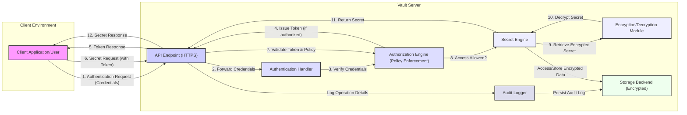

## Project Design Document: HashiCorp Vault (Improved)

**1. Introduction**

This document provides an enhanced architectural overview of HashiCorp Vault, a widely adopted open-source secrets management tool. This detailed design is specifically crafted to serve as a robust foundation for subsequent threat modeling exercises. It meticulously outlines the core components, critical data flows, and significant security considerations inherent in Vault's architecture, ensuring a comprehensive understanding of the system's internal workings and potential vulnerabilities.

**2. Goals and Objectives**

* To furnish a precise and easily understandable description of the HashiCorp Vault architecture, suitable for security analysis.
* To clearly identify and describe the key architectural components of Vault and their interdependencies.
* To meticulously map the flow of sensitive data within the system, highlighting trust boundaries.
* To explicitly emphasize the security-relevant aspects of Vault's design, drawing attention to potential attack vectors.
* To serve as a definitive reference point for security engineers and architects during threat modeling sessions, facilitating the identification of potential threats and vulnerabilities.

**3. Target Audience**

This document is primarily intended for:

* Security engineers and architects tasked with performing threat modeling and security assessments of Vault deployments.
* Development teams responsible for integrating their applications and services with Vault.
* Operations teams involved in the deployment, configuration, and ongoing management of Vault instances.
* Auditors seeking to understand the security controls implemented within Vault.

**4. System Overview**

HashiCorp Vault is a powerful tool designed for securely managing access to secrets. A "secret" in this context encompasses any sensitive data requiring strict access control, such as API keys, database credentials, cryptographic keys, and certificates. Vault offers a unified interface for managing diverse secrets, enforcing stringent access control policies, and maintaining a comprehensive, immutable audit log of all operations.

Key functionalities of Vault include:

* **Secure and Centralized Secret Storage:** Vault encrypts secrets both at rest within its storage backend and in transit across the network.
* **Dynamic Secret Generation:** Vault can dynamically generate secrets on-demand for supported backend systems (e.g., databases, cloud providers), reducing the risk of long-lived, static credentials.
* **Data Encryption as a Service:** Vault can be leveraged as a general-purpose encryption service, allowing applications to encrypt and decrypt data without managing encryption keys directly.
* **Secret Leasing and Automatic Renewal:** Secrets can be issued with a defined lease duration, requiring clients to renew their access periodically, limiting the impact of compromised credentials.
* **Immediate Secret Revocation:** Vault enables the immediate revocation of secrets, invalidating access instantly.
* **Comprehensive Audit Logging:** Every operation performed within Vault is meticulously recorded in an auditable log, providing a detailed history of access and modifications.

**5. Architectural Components**

Vault's architecture comprises the following essential components:

* **Vault Server (Core):** The central, stateless application responsible for processing all API requests. It handles authentication, authorization, secret management logic, encryption/decryption operations, and audit logging. The Vault server relies entirely on the storage backend for persistence.
* **Storage Backend:**  A persistent storage layer responsible for securely storing Vault's data, including encrypted secrets, configuration settings, audit logs, and internal state. The choice of storage backend impacts performance, consistency, and operational complexity. Supported options include:
    * Raft (Integrated Storage): Provides high availability and strong consistency through a distributed consensus protocol.
    * Consul: A distributed service mesh solution that can be used as a highly available key-value store.
    * Etcd: A distributed key-value store often used for configuration management and service discovery.
    * DynamoDB: A fully managed NoSQL database service offered by AWS.
    * Google Cloud Storage: Google's scalable object storage service.
    * Azure Blob Storage: Microsoft Azure's object storage solution.
    * File System: Suitable for development or testing but not recommended for production due to limitations in scalability and resilience.
* **Authentication Methods (Auth Methods):**  Modules that verify the identity of clients attempting to access Vault. Successful authentication results in the issuance of a Vault token. Examples include:
    * Username/Password: Traditional username and password-based authentication.
    * Tokens (Vault Tokens, Kubernetes Service Account Tokens, JWT): Leveraging existing token-based authentication mechanisms.
    * Cloud Provider IAM (AWS IAM, GCP IAM, Azure AD): Integrating with cloud provider identity and access management systems.
    * LDAP (Lightweight Directory Access Protocol): Integration with existing directory services.
    * OIDC (OpenID Connect):  Federated identity authentication protocol.
    * Certificate: Authentication based on client-side TLS certificates.
* **Secret Engines:** Pluggable modules responsible for managing the lifecycle of different types of secrets. They define how secrets are stored, generated, accessed, and rotated. Examples include:
    * Key/Value (KV) Secret Engine (versions 1 and 2):  Stores arbitrary key-value pairs, with versioning in v2.
    * Database Secret Engines (e.g., MySQL, PostgreSQL, MSSQL): Dynamically generates database credentials.
    * Cloud Provider Secret Engines (e.g., AWS, GCP, Azure): Creates and manages cloud provider resources and credentials.
    * PKI (Public Key Infrastructure) Secret Engine: Issues and manages X.509 certificates.
    * SSH (Secure Shell) Secret Engine: Provides dynamic SSH credentials or manages SSH key pairs.
* **Audit Log:** A system for recording a detailed, immutable history of all operations performed within Vault. Audit logs are crucial for security monitoring, compliance, and incident response. Audit logs can be directed to various backends:
    * File: Writing audit logs to local files.
    * Syslog: Sending audit logs to a syslog server.
    * Socket: Streaming audit logs over a network socket.
* **Plugins (Auth and Secret Engines):** Vault's extensibility is provided through plugins. These allow developers to create custom authentication methods or secret engines to meet specific requirements.
* **Command Line Interface (CLI):** The `vault` command-line tool provides a direct interface for interacting with the Vault server, enabling administrative tasks and client operations.
* **Application Programming Interface (API):** Vault exposes a comprehensive RESTful API, allowing programmatic interaction from applications and services. This is the primary interface for most integrations.
* **Web UI:** A graphical user interface providing a user-friendly way to manage Vault, particularly useful for initial setup and basic administration.

**6. Data Flow Diagram**

**Data Flow Description:**

* **Authentication Flow:**
    1. A client application or user (A) sends an authentication request containing credentials to the Vault Server's HTTPS API endpoint (B). This communication should always occur over TLS.
    2. The API endpoint forwards the provided credentials to the appropriate Authentication Handler (C) based on the requested authentication method.
    3. The Authentication Handler attempts to verify the provided credentials against its configured backend (e.g., LDAP server, IAM provider).
    4. Upon successful verification, the Authentication Handler informs the Authorization Engine (D). The Authorization Engine evaluates configured policies to determine if the authenticated client is authorized to receive a token.
    5. If authorized, the Authorization Engine instructs the API Endpoint (B) to issue a Vault token.
    6. The Vault token is returned to the client (A). This token acts as a bearer credential for subsequent requests.

* **Secret Access Flow:**
    7. An authenticated client (A) sends a request for a specific secret to the Vault Server's HTTPS API endpoint (B), including the previously obtained Vault token in the request header.
    8. The API endpoint validates the provided token with the Authorization Engine (D). The Authorization Engine also evaluates the policies associated with the token to determine if the client is authorized to access the requested secret.
    9. The Authorization Engine informs the relevant Secret Engine (E) if the access is permitted.
    10. The Secret Engine retrieves the encrypted secret from the Storage Backend (H).
    11. The Secret Engine passes the encrypted secret to the Encryption/Decryption Module (F) for decryption using the Vault's master key (or a derived key).
    12. The decrypted secret is returned to the API endpoint (B).
    13. The API endpoint sends the decrypted secret back to the client (A).

* **Audit Logging Flow:**
    * Throughout both authentication and secret access flows, the API Endpoint (B) sends details of each operation to the Audit Logger (G).
    * The Audit Logger (G) persists these audit logs to the configured Storage Backend (H) or other designated audit backends.

* **Data at Rest:** All data stored in the Storage Backend (H), including secrets and audit logs, is encrypted.

**7. Security Considerations**

* **Authentication and Authorization:** Vault's security hinges on robust authentication mechanisms and granular authorization policies. Weak authentication or overly permissive policies can lead to unauthorized access.
* **Encryption at Rest and in Transit:** Secrets are encrypted using a configured encryption cipher before being written to the storage backend. Communication between clients and the Vault server *must* occur over TLS to protect data in transit.
* **Secret Revocation:** The ability to quickly and effectively revoke secrets is a critical security feature. Properly implemented revocation workflows are essential.
* **Lease Management and Renewal:**  Utilizing short-lived leases for secrets minimizes the window of opportunity for compromised credentials to be exploited. Clients must be designed to handle lease renewals.
* **Comprehensive Audit Logging:**  Detailed audit logs are vital for security monitoring, anomaly detection, and post-incident analysis. Secure storage and regular review of audit logs are crucial.
* **Sealing and Unsealing:** The sealing process encrypts the Vault's master key, rendering the secrets inaccessible until the Vault is unsealed using a quorum of unseal keys. Secure management and distribution of unseal keys are paramount.
* **Plugin Security:**  Custom authentication methods and secret engines introduce potential security risks if not developed and reviewed carefully. Vault provides mechanisms for plugin verification but vigilance is required.
* **Storage Backend Security:** The security of the chosen storage backend is paramount, as it holds the encrypted secrets. Proper access controls, encryption, and operational security for the storage backend are essential.
* **Network Security:** Network segmentation and firewall rules should restrict access to the Vault server to only authorized clients and networks.
* **Token Management:**  Vault tokens are bearer tokens and must be handled securely by clients. Token storage, transmission, and revocation processes must be robust.
* **High Availability (HA) Security:** In HA deployments, the security of the leader election process and inter-node communication is critical.

**8. Deployment Model**

Vault can be deployed in various configurations, each with its own security implications:

* **Single Server (Development/Testing):**  A single Vault instance is the simplest deployment model but offers no redundancy or high availability. This is generally suitable only for development or testing environments. A compromise of this single server exposes all secrets.
* **High Availability (HA) Cluster (Production):** A cluster of multiple Vault servers provides redundancy and fault tolerance. This is the recommended deployment model for production environments. Security considerations include secure inter-node communication (typically using TLS) and secure leader election (e.g., using Raft with mutual TLS).
* **Multi-Datacenter Replication (Disaster Recovery):** Vault supports replication across multiple datacenters for disaster recovery and increased resilience. Security considerations include secure communication between replication partners and managing the potential for data consistency issues in the event of network partitions.

**9. Technology Stack**

* **Core Programming Language:** Go
* **Storage Backend Options:** Raft (embedded), Consul, Etcd, AWS DynamoDB, Google Cloud Storage, Azure Blob Storage, File System.
* **Networking:** TCP/IP, TLS (required for secure communication).
* **API Interface:** RESTful API (HTTP/HTTPS).
* **Command Line Interface:** `vault` (Go-based).

**10. Future Considerations**

* **Strengthened Plugin Security Framework:** Further enhancements to the plugin verification and security auditing processes.
* **Improved Kubernetes Integration:** Deeper and more seamless integration with Kubernetes for secret management and authentication.
* **Advanced Policy Management Capabilities:** More expressive and flexible policy language and management tools.
* **Enhanced Monitoring and Observability Tools:** Improved metrics, dashboards, and alerting capabilities for monitoring Vault's health and security.

**11. Glossary**

* **Secret:** Sensitive data requiring controlled access.
* **Token:** A credential used to authenticate and authorize with Vault.
* **Authentication:** Verifying the identity of a client.
* **Authorization:** Determining the permissions of an authenticated client.
* **Secret Engine:** A plugin for managing specific types of secrets.
* **Audit Log:** An immutable record of Vault operations.
* **Seal/Unseal:** A mechanism for encrypting and decrypting the master key.
* **Mount Path:** A logical namespace for enabling secret engines.
* **Namespace:** Isolated environments within a Vault instance.
* **Policy:** Rules defining access control for Vault resources.

This improved design document provides a more detailed and security-focused overview of HashiCorp Vault's architecture. It is intended to be a valuable resource for security professionals conducting threat modeling and security assessments, enabling a deeper understanding of the system's inner workings and potential vulnerabilities.