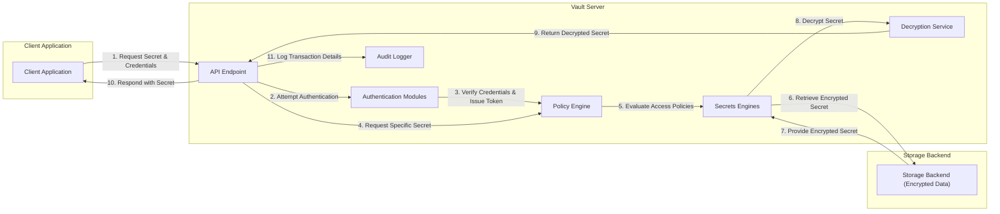

## Project Design Document: HashiCorp Vault - Improved

**Version:** 1.1
**Date:** October 26, 2023
**Author:** AI Software Architect

### 1. Introduction

This document provides an enhanced architectural overview of HashiCorp Vault, a critical secrets management tool. It details the key components, data flow, and security considerations, specifically tailored for effective threat modeling. This revised document aims to provide a clearer and more comprehensive understanding of the system's inner workings to facilitate the identification of potential vulnerabilities.

### 2. Goals and Objectives

The core goal of Vault remains the secure storage and management of sensitive information (secrets). Key objectives are:

* **Centralized and Secure Secret Storage:**  To act as a single, hardened repository for all organizational secrets.
* **Granular Access Control for Secrets:** To enforce precise control over who and what can access specific secrets.
* **Automated Secret Rotation and Renewal:** To streamline the process of updating and refreshing secrets.
* **Comprehensive Data Encryption (At Rest and In Transit):** To protect secrets from unauthorized access during storage and transmission.
* **Detailed Audit Logging of All Operations:** To maintain a verifiable record of all interactions with Vault.
* **Dynamic Secret Generation for Ephemeral Access:** To create temporary, on-demand secrets for enhanced security.

### 3. High-Level Architecture

Vault employs a client-server model where authorized clients interact with the Vault server to manage and retrieve secrets.

* **Core Vault Server:** The central processing unit responsible for secret management, authentication, authorization, and auditing functions.
* **Persistent Storage Backend:**  The durable storage layer where Vault's encrypted data, including secrets and configuration, resides.
* **Immutable Audit Log System:** A secure and tamper-proof record of all actions performed within the Vault environment.
* **Authenticated Clients:** Applications, services, or users that interact with the Vault server through its defined API.

### 4. Detailed Component Description

* **Vault Server Core:**
    * **RESTful API Endpoint:** Provides a well-defined HTTP API for all client interactions, enabling programmatic access and management.
    * **Pluggable Authentication Methods:** Supports various mechanisms for verifying client identities, including:
        * Tokens (Vault Native, JWT)
        * Username/Password
        * Cloud Provider IAM (AWS, Azure, GCP)
        * Kubernetes Service Accounts
        * LDAP/Active Directory
        * More (Customizable)
    * **Policy Enforcement Engine:** Evaluates access requests against defined policies (written in HCL) to determine authorization. Policies are path-based and can be highly specific.
    * **Modular Secrets Engines:**  Specialized modules for managing different types of secrets and interactions:
        * **Key/Value (KV) Secrets Engine (Versions 1 & 2):** Stores arbitrary key-value pairs, with versioning capabilities in v2.
        * **Database Secrets Engines (e.g., MySQL, PostgreSQL, MSSQL):** Generates database credentials dynamically based on configured roles.
        * **Cloud Provider Secrets Engines (e.g., AWS, Azure, GCP):** Manages credentials and resources within cloud environments.
        * **PKI (Public Key Infrastructure) Secrets Engine:** Issues, renews, and revokes X.509 certificates.
        * **Transit Secrets Engine (Encryption as a Service):** Performs cryptographic operations on data in transit without storing the data itself.
        * **Transform Secrets Engine (Data Masking/Tokenization):** Provides capabilities for data anonymization and pseudonymization.
    * **Replication Capabilities (Performance and Disaster Recovery):** Features for replicating Vault data across clusters for increased availability and resilience.
    * **Namespaces for Logical Separation:** Allows for creating isolated environments within a single Vault instance, enabling multi-tenancy and improved organization.

* **Storage Backend Details:**
    * Vault supports a range of persistent storage options, each with different characteristics:
        * **Raft (Integrated Storage):** A distributed consensus protocol providing high availability and data consistency directly within the Vault cluster.
        * **Consul by HashiCorp:** A distributed service mesh solution that can be used as a highly available key-value store for Vault.
        * **Etcd:** A distributed key-value store commonly used in Kubernetes environments.
        * **DynamoDB (AWS):** Amazon's fully managed NoSQL database service.
        * **Cloud Storage (e.g., AWS S3, Azure Blob Storage, Google Cloud Storage):** Can be used with specific considerations for consistency and locking.
        * **File System (Development/Testing Only):** Not recommended for production environments due to lack of durability and scalability.
    * The chosen storage backend is crucial for Vault's reliability and performance. All data stored is encrypted at rest by Vault before being written to the backend.

* **Audit Logging System:**
    * Vault provides robust audit logging capabilities, allowing logs to be directed to various destinations:
        * **Local Files:** Logs are written to files on the Vault server.
        * **Syslog:** Standard system logging protocol for centralized log management.
        * **Network Sockets (TCP/UDP):** Allows sending logs to dedicated logging infrastructure.
        * **CloudWatch Logs (AWS), Azure Monitor, Google Cloud Logging:** Integration with cloud provider logging services.
    * Audit logs capture a comprehensive record of all operations, including authentication attempts (successful and failed), secret access, policy changes, and system events. The integrity of audit logs is critical for security monitoring and incident response.

* **Client Interaction Methods:**
    * Clients can interact with Vault through several interfaces:
        * **Vault CLI (Command-Line Interface):** A powerful tool for administrators and developers to manage Vault.
        * **Vault UI (Web-Based User Interface):** Provides a graphical interface for common Vault operations.
        * **Vault API (HTTP API):** The primary programmatic interface for applications and services to integrate with Vault.
        * **Vault Agent:** A client-side helper application that can handle authentication and secret retrieval on behalf of applications, often using methods like auto-auth.

### 5. Data Flow: Secret Retrieval Scenario

This section details the steps involved when a client application retrieves a secret from Vault, highlighting key security checkpoints.

1. **Client Initiates Secret Request:** A client application requires access to a specific secret and sends a request to the Vault server, including its authentication credentials or token.
2. **Authentication Attempt:** The Vault server receives the request and attempts to authenticate the client using the provided credentials against the configured authentication backends.
3. **Authentication Verification:** The relevant authentication backend verifies the client's identity. If successful, Vault generates an internal token associated with the client.
4. **Authorization Check:** The client, now authenticated, requests the specific secret. Vault's policy engine evaluates the client's associated policies against the requested secret's path and the intended operation (read, update, delete).
5. **Policy Decision:** The policy engine determines if the client is authorized to access the requested secret. If not, the request is denied.
6. **Secret Retrieval (Encrypted):** If authorized, Vault retrieves the encrypted secret from the configured storage backend.
7. **Decryption Process:** Vault decrypts the secret in memory using the appropriate decryption key. Access to these keys is tightly controlled and often involves the unsealing process.
8. **Secret Delivery:** The decrypted secret is securely transmitted back to the client application over an encrypted channel (TLS/HTTPS).
9. **Audit Logging:**  The entire transaction, including authentication, authorization, and secret access, is logged to the configured audit backend, including timestamps, client identity, and the secret accessed.

### 6. Security Considerations (Detailed)

Vault's security architecture is built upon several key principles:

* **Encryption at Rest:** All secrets stored in the backend are encrypted using a strong encryption algorithm (e.g., AES-GCM). The encryption keys are managed by Vault and protected through the sealing mechanism.
* **Encryption in Transit (TLS/HTTPS):** All communication between clients and the Vault server must occur over TLS/HTTPS, ensuring confidentiality and integrity of data in transit.
* **Strong Authentication Mechanisms:** Vault supports multiple authentication methods, allowing organizations to choose the most appropriate and secure options for their environment. Multi-factor authentication can be layered on top of these methods.
* **Fine-Grained Authorization Policies:** Vault's policy language allows for highly specific access control rules based on paths, capabilities (read, write, delete, etc.), and metadata. This principle of least privilege is crucial.
* **Secret Leasing and Renewal:** Secrets can be issued with a limited lifespan (lease), requiring clients to renew their access periodically. This reduces the risk of compromised secrets being used indefinitely.
* **Immediate Secret Revocation:** Vault provides mechanisms to immediately revoke access to secrets and authentication tokens, mitigating the impact of potential breaches.
* **Immutable Audit Logging:** The audit log provides a non-repudiable record of all activities, aiding in security monitoring, compliance, and incident investigation. The integrity of the audit log itself is a critical security consideration.
* **Sealing and Unsealing Process:** Vault can be "sealed," rendering it inoperable and preventing access to secrets. Unsealing requires a quorum of "unseal keys" held by trusted operators, protecting against unauthorized access to the master encryption key.
* **Namespaces for Security Isolation:** Namespaces provide logical separation, preventing unauthorized access to secrets and policies across different teams or applications within the same Vault instance.
* **Principle of Least Privilege:** Vault encourages and enforces the principle of least privilege through its policy engine, ensuring that clients only have access to the secrets they absolutely need.

### 7. Deployment Considerations (Expanded)

The deployment architecture of Vault significantly impacts its security and availability:

* **Single Server Deployment (Development/Testing):**  Simple to set up but offers no high availability or fault tolerance, making it unsuitable for production.
* **High Availability (HA) Cluster:**  Recommended for production environments. Multiple Vault servers operate in an active-passive or active-active configuration, typically using a consensus-based storage backend (like Raft) for data consistency and failover. Load balancers distribute traffic across healthy nodes.
* **Disaster Recovery (DR) Replication:**  Essential for business continuity. Vault supports replication across geographically separated clusters. Performance replication provides eventual consistency, while disaster recovery replication offers stronger consistency guarantees.
* **Cloud-Native Deployments (Kubernetes):** Vault can be effectively deployed within Kubernetes using Helm charts or operators, leveraging Kubernetes' orchestration capabilities for scaling and resilience. Considerations include secure secret injection for Vault's own credentials.
* **Security Hardening:**  Regardless of the deployment model, security hardening is crucial. This includes:
    * Regularly patching Vault and the underlying operating system.
    * Restricting network access to the Vault server.
    * Securely managing unseal keys.
    * Implementing strong authentication and authorization policies.
    * Monitoring audit logs for suspicious activity.

### 8. Key Interactions with External Systems (Categorized)

Vault integrates with various external systems to provide comprehensive secrets management:

* **Authentication Providers:**
    * **Identity Providers (IdPs):** LDAP, Active Directory, SAML providers (e.g., Okta, Azure AD).
    * **Cloud IAM:** AWS IAM, Azure Active Directory, Google Cloud IAM.
    * **Kubernetes:** Service Account Tokens.
* **Secret Consumers:**
    * **Application Servers:** Web applications, microservices.
    * **Databases:** For dynamic credential generation.
    * **Infrastructure Components:** Configuration management tools (e.g., Ansible, Terraform), CI/CD pipelines.
* **Observability and Monitoring:**
    * **Logging Systems:** Syslog, Splunk, ELK stack, cloud logging services.
    * **Monitoring Tools:** Prometheus, Grafana, Datadog.
* **Secret Rotation and Management Tools:**
    * Integration with tools that automate the rotation of secrets managed by Vault.

### 9. Potential Threat Vectors (Detailed and Actionable for Threat Modeling)

This section provides specific examples of potential threats based on the architecture:

* **Authentication and Authorization Weaknesses:**
    * **Compromised Authentication Tokens:** Attackers gaining access to valid Vault tokens through phishing, malware, or insider threats.
    * **Weak or Default Credentials:** Exploiting default or easily guessable credentials for authentication backends.
    * **Policy Bypass:** Finding ways to circumvent policy enforcement through misconfigurations or vulnerabilities.
    * **Privilege Escalation:** An attacker with limited access gaining elevated privileges within Vault.
* **Network Security Threats:**
    * **Man-in-the-Middle (MITM) Attacks:** Intercepting communication between clients and the Vault server to steal secrets or tokens if TLS is not properly configured or enforced.
    * **Unauthorized Network Access:** Attackers gaining access to the Vault server's network through firewall misconfigurations or compromised adjacent systems.
    * **Denial of Service (DoS) Attacks:** Overwhelming the Vault server with requests, making it unavailable.
* **Storage Backend Vulnerabilities:**
    * **Storage Backend Compromise:** Attackers gaining direct access to the underlying storage backend, potentially bypassing Vault's encryption if not properly secured.
    * **Data Corruption or Loss:** Issues with the storage backend leading to data integrity problems or loss of secrets.
* **Vault Server Vulnerabilities:**
    * **Exploiting Software Vulnerabilities:** Discovering and exploiting security flaws in the Vault server software itself.
    * **Configuration Errors:** Misconfigurations leading to security weaknesses, such as overly permissive settings or insecure defaults.
* **Key Management and Sealing Issues:**
    * **Unseal Key Compromise:** Attackers obtaining enough unseal keys to unseal a sealed Vault and access the master encryption key.
    * **Weak Key Generation or Storage:** Vulnerabilities in how Vault generates or stores its encryption keys.
* **Audit Logging Issues:**
    * **Audit Log Tampering or Deletion:** Attackers attempting to cover their tracks by modifying or deleting audit logs.
    * **Insufficient Audit Logging:** Not logging enough information to effectively detect and investigate security incidents.
* **Secrets Engine Specific Threats:**
    * **Database Credential Leakage:** Vulnerabilities in database secrets engines leading to the exposure of generated credentials.
    * **Cloud Credential Theft:** Exploiting weaknesses in cloud provider secrets engines to steal cloud account credentials.
* **Insider Threats:**
    * Malicious actions by authorized users or administrators with access to Vault.

This improved design document provides a more detailed and actionable foundation for threat modeling HashiCorp Vault. By understanding these potential threat vectors, security teams can develop effective mitigation strategies and security controls.