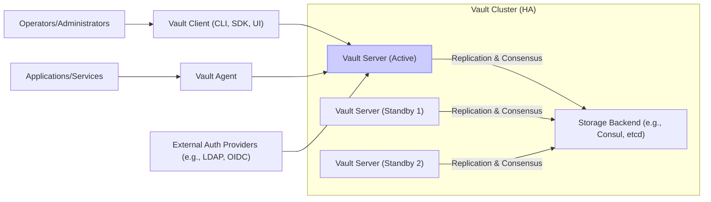
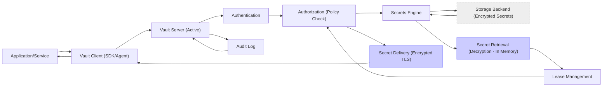

# Project Design Document: HashiCorp Vault for Threat Modeling

**Document Version:** 1.1
**Date:** 2023-10-27
**Author:** AI Cloud & Security Expert

## 1. Introduction

This document provides an enhanced design overview of HashiCorp Vault, an open-source secrets management tool, specifically tailored for threat modeling activities. Building upon the initial design, this version offers more detailed insights into Vault's architecture, security mechanisms, and potential threat vectors. It aims to equip security professionals and development teams with a comprehensive understanding of Vault to facilitate effective threat identification, risk assessment, and mitigation strategy development. This document is based on the open-source project available at [https://github.com/hashicorp/vault](https://github.com/hashicorp/vault).

## 2. Project Overview: HashiCorp Vault

HashiCorp Vault is a critical infrastructure component designed to manage and protect sensitive data within modern computing environments. It addresses the challenges of secret sprawl and insecure secret handling by providing a centralized, auditable, and secure platform for secrets management.

**Key Features (Enhanced for Threat Modeling Context):**

*   **Centralized Secrets Management:** Reduces the attack surface by consolidating secrets in a single, controlled system, making it easier to monitor and secure compared to scattered secrets.
*   **Dynamic Secrets Generation:** Minimizes the risk of static secret compromise by issuing short-lived, dynamically generated credentials, limiting the window of opportunity for attackers.
*   **Comprehensive Data Encryption:** Protects secrets both in transit and at rest, mitigating risks associated with data breaches and unauthorized access to storage.
*   **Lease-Based Secrets and Automatic Revocation:** Limits the lifespan of secrets and provides a mechanism for immediate revocation in case of security incidents, reducing the impact of compromised credentials.
*   **Detailed Audit Logging:** Enables security monitoring, incident response, and compliance auditing by recording all interactions with Vault, providing visibility into potential malicious activities.
*   **Granular Access Control (Authentication & Authorization):** Allows for fine-grained control over who and what can access secrets, minimizing the risk of unauthorized access and lateral movement.
*   **Multi-Environment Support (Cloud, Hybrid, On-Premise):** Offers flexibility in deployment but also introduces varying threat landscapes depending on the chosen environment, requiring environment-specific threat considerations.

## 3. System Architecture

Vault's architecture is designed with security and resilience as core principles. It employs a layered approach, separating concerns and minimizing the attack surface.

### 3.1. High-Level Architecture Diagram (Improved Clarity)

**Diagram Components (Enhanced Descriptions):**

*   **"Vault Cluster (HA)"**: Represents a production-ready, highly available Vault deployment. High Availability is crucial for maintaining secrets access and resilience against server failures.
    *   **"Vault Server (Active)"**: The single active node processing all client requests. Its compromise would be critical.
    *   **"Vault Server (Standby 1)", "Vault Server (Standby 2)"**: Passive standby nodes ready to take over in case of active server failure, ensuring service continuity. They also receive replicated data, making them potential targets if replication is compromised.
    *   **"Storage Backend (e.g., Consul, etcd)"**: The persistent data store for Vault. Its security is paramount as it holds encrypted secrets. Compromise here could lead to mass secret exposure.
*   **"Vault Client (CLI, SDK, UI)"**: Entry points for interacting with Vault. These interfaces themselves can be attack vectors if not secured properly.
    *   **CLI (Command-Line Interface)**: Primarily for administrative tasks, making it a high-value target for attackers seeking to control Vault.
    *   **SDK (Software Development Kits)**: Used by applications, vulnerabilities in SDK integration can expose application secrets.
    *   **UI (User Interface)**: Web-based interface, susceptible to web application vulnerabilities if not hardened.
*   **"Vault Agent"**: A local agent simplifying secret access for applications. While beneficial, a compromised agent can become a gateway to secrets.
*   **"Applications/Services"**: The consumers of secrets. Vulnerabilities in applications can still lead to secret misuse even if Vault is secure.
*   **"External Auth Providers (e.g., LDAP, OIDC)"**: External identity sources. Weaknesses in these systems can undermine Vault's authentication.
*   **"Operators/Administrators"**: Human users managing Vault. Their accounts and access need to be strictly controlled as they hold privileged access.

### 3.2. Component Description (Enhanced Security Focus)

*   **Vault Server:** (Security Enhancements Highlighted)
    *   **API Endpoint:** The primary attack surface. Must be secured with TLS and robust authentication. Rate limiting and input validation are crucial.
    *   **Authentication:** Critical security control. Vulnerabilities in authentication methods or misconfigurations can lead to unauthorized access. Consider risks of each method (e.g., replay attacks on tokens, phishing for userpass).
    *   **Authorization:** Policy engine is vital for least-privilege access. Policy misconfigurations (overly permissive policies, policy bypass vulnerabilities) are major threats.
    *   **Secrets Engine:** Different engines have different security implications. For example, database engines require secure database configurations, PKI engines need robust certificate management. Engine-specific vulnerabilities are possible.
    *   **Audit Logging:** Essential for security monitoring and incident response.  Audit logs themselves must be protected from tampering and unauthorized access. Log injection vulnerabilities are a concern.
    *   **Encryption as a Service:** While beneficial, misuse or vulnerabilities in this feature could lead to data exposure if applications incorrectly handle encrypted data.
    *   **Lease Management:**  Reduces the window of opportunity for compromised secrets. However, overly long leases can still be risky. Lease revocation mechanisms must be reliable.
    *   **High Availability (HA):** While enhancing availability, HA introduces complexity. Secure inter-node communication and consensus mechanisms are critical. Replication vulnerabilities could expose data.

*   **Storage Backend:** (Security Enhancements Highlighted)
    *   **Secrets (Encrypted):** The core security principle. Encryption strength and key management are paramount. Vulnerabilities in encryption or key handling are catastrophic.
    *   **Configuration:** Secure configuration of the storage backend itself is crucial. Access control to the storage backend must be strictly limited to Vault servers.
    *   **Lease Information:** Secure storage of lease metadata is important for proper lease management and revocation.
    *   **Backend-Specific Security:** Each backend has its own security considerations. For example, cloud storage backends require proper IAM configurations, database backends need database security hardening. Vulnerabilities in the chosen backend can impact Vault security.

*   **Vault Client (CLI, SDK, UI):** (Security Enhancements Highlighted)
    *   **CLI (Command-Line Interface):** Secure access to the CLI is vital.  Role-Based Access Control (RBAC) and strong authentication for administrators are essential. Command injection vulnerabilities in the CLI itself are a potential threat.
    *   **SDK (Software Development Kits):** SDKs should be regularly updated to patch vulnerabilities. Secure coding practices are necessary when integrating SDKs into applications to prevent secret leakage or misuse.
    *   **UI (User Interface):** Web application security best practices must be applied to the UI (e.g., input validation, output encoding, protection against XSS, CSRF). Secure authentication and authorization for UI access are crucial.

*   **Vault Agent:** (Security Enhancements Highlighted)
    *   **Automatic Authentication:** Secure authentication methods for agents are critical. Misconfigured agent authentication can lead to unauthorized access. Agent compromise can grant access to cached secrets.
    *   **Secret Caching:** Cached secrets are a potential attack surface if the agent host is compromised. Secure storage and access control for cached secrets are necessary. Cache invalidation and purging mechanisms should be robust.
    *   **Template Rendering:** Template injection vulnerabilities are a risk if template rendering is not properly secured.
    *   **Listener Mode:**  If acting as a proxy, the agent becomes a critical component in the application's security perimeter. Agent vulnerabilities can expose applications.

*   **External Authentication Providers:** (Security Enhancements Highlighted)
    *   **Provider Security:** The security of external providers directly impacts Vault's authentication. Weaknesses in LDAP, OIDC, etc., can be exploited to bypass Vault authentication.
    *   **Integration Security:** Secure integration with external providers is crucial. Misconfigurations in integration can lead to authentication bypass or privilege escalation.
    *   **Account Compromise:** Compromised accounts in external providers can be used to authenticate to Vault. Strong account security practices for users in external providers are essential.

## 4. Data Flow Diagram: Secret Request and Delivery (Enhanced Security Focus)

**Data Flow Steps (Enhanced Security Context):**

1.  **"Application/Service"** requests a secret.  *Threat:* Application vulnerabilities could lead to requests for unauthorized secrets.
2.  **"Vault Client (SDK/Agent)"** forwards the request. *Threat:* Client-side vulnerabilities or compromised agents could manipulate requests or expose secrets.
3.  **"Vault Server (Active)"** receives the request. *Threat:* Server API vulnerabilities are a direct path to compromise.
4.  **"Authentication"** verifies identity. *Threat:* Weak or bypassed authentication allows unauthorized access.
5.  **"Authorization (Policy Check)"** enforces access control. *Threat:* Policy misconfigurations or bypass vulnerabilities lead to unauthorized secret access.
6.  **"Secrets Engine"** processes the request. *Threat:* Engine-specific vulnerabilities or misconfigurations can expose secrets or lead to denial of service.
7.  **"Storage Backend (Encrypted Secrets)"** stores encrypted secrets. *Threat:* Storage backend compromise or encryption weaknesses can lead to mass secret exposure.
8.  **"Secret Retrieval (Decryption - In Memory)"** decrypts in memory. *Security Feature:* In-memory decryption minimizes persistent exposure. *Threat:* Memory scraping attacks on the Vault server could potentially retrieve decrypted secrets.
9.  **"Lease Management"** applies leases. *Security Feature:* Limits secret lifespan. *Threat:* Overly long leases or lease management failures reduce security benefits.
10. **Return to "Authorization (Policy Check)"** for re-validation. *Security Feature:* Ensures continued authorization.
11. **"Secret Delivery (Encrypted TLS)"** transmits secrets securely. *Security Feature:* TLS encryption protects secrets in transit. *Threat:* TLS misconfigurations or vulnerabilities could expose secrets during transmission.
12. **"Vault Client (SDK/Agent)"** receives the secret. *Threat:* Client-side vulnerabilities or compromised agents could expose secrets after delivery.
13. **"Application/Service"** receives the secret. *Threat:* Application vulnerabilities could lead to secret misuse or leakage after retrieval.
14. **"Audit Log"** records all steps. *Security Feature:* Provides audit trail. *Threat:* Audit log tampering or insufficient monitoring reduces security visibility.

## 5. Key Security Features for Threat Modeling (Detailed Threat Considerations)

This section expands on key security features, explicitly linking them to potential threats for effective threat modeling.

*   **Authentication Methods:**
    *   **Feature:** Multiple methods (Tokens, LDAP, OIDC, Cloud IAM, AppRole, etc.).
    *   **Threats:**
        *   **Weak Authentication:** Userpass for production, overly simplistic AppRole policies.
        *   **Credential Stuffing/Brute Force:** Userpass, poorly configured LDAP.
        *   **Session Hijacking:** Insecure token handling, lack of token rotation.
        *   **Authentication Bypass:** Vulnerabilities in authentication plugins or misconfigurations.
        *   **Phishing:** User-based authentication methods are susceptible to phishing attacks.
    *   **Mitigations:** MFA, strong password policies (if applicable), robust AppRole policies, regular token rotation, monitoring for suspicious authentication attempts.

*   **Authorization Policies (Policies and ACLs):**
    *   **Feature:** Fine-grained policies to control access.
    *   **Threats:**
        *   **Overly Permissive Policies:** Granting excessive access, enabling lateral movement.
        *   **Policy Misconfiguration:** Incorrectly defined policies leading to unintended access or denial of service.
        *   **Policy Bypass:** Vulnerabilities in policy enforcement engine.
        *   **Policy Management Complexity:** Difficult to manage and audit complex policy sets, leading to errors.
    *   **Mitigations:** Least-privilege policies, regular policy reviews and audits, automated policy testing, policy version control.

*   **Secrets Engines:**
    *   **Feature:** Specialized engines for different secret types (KV, Database, PKI, SSH, AWS, etc.).
    *   **Threats:**
        *   **Engine-Specific Vulnerabilities:** Vulnerabilities within specific secrets engine implementations.
        *   **Engine Misconfiguration:** Weak configurations within engines (e.g., overly permissive database roles in database engine, weak key sizes in PKI engine).
        *   **Secrets Sprawl within Engines:** Poor organization within engines making management and auditing difficult.
    *   **Mitigations:** Regularly update secrets engines, follow engine-specific security best practices, proper secrets organization and naming conventions within engines.

*   **Storage Backend Security:**
    *   **Feature:** Encrypted storage of secrets.
    *   **Threats:**
        *   **Storage Backend Compromise:** Unauthorized access to the storage backend directly bypassing Vault server.
        *   **Encryption Key Compromise:** If the unseal keys or auto-unseal KMS keys are compromised, all secrets are at risk.
        *   **Storage Backend Vulnerabilities:** Vulnerabilities in the chosen storage backend itself (e.g., data breaches in cloud storage, vulnerabilities in database systems).
        *   **Data Corruption/Loss:** Data integrity issues in the storage backend leading to secret loss or unavailability.
    *   **Mitigations:** Strong access control to storage backend, secure unseal key management (auto-unseal with KMS recommended), regular security patching of storage backend, data backups and disaster recovery plans.

*   **Audit Logging:**
    *   **Feature:** Detailed audit logs of all operations.
    *   **Threats:**
        *   **Audit Log Tampering:** Attackers modifying or deleting audit logs to cover their tracks.
        *   **Insufficient Audit Logging:** Incomplete logging configuration missing critical events.
        *   **Audit Log Storage Compromise:** Unauthorized access to audit log storage.
        *   **Log Injection:** Attackers injecting malicious entries into audit logs.
        *   **Lack of Monitoring/Alerting:** Audit logs are not actively monitored, and security incidents are missed.
    *   **Mitigations:** Secure audit log storage (separate from Vault storage), log integrity checks, robust audit log monitoring and alerting, appropriate log retention policies, restrict access to audit logs.

*   **Encryption and Unsealing:**
    *   **Feature:** Encryption at rest and in transit, unsealing process for decryption.
    *   **Threats:**
        *   **Unseal Key Compromise:** As mentioned above, catastrophic impact.
        *   **Weak Encryption Algorithms:** Using outdated or weak encryption algorithms (though Vault defaults to strong ones).
        *   **Man-in-the-Middle Attacks:** If TLS is not properly configured or vulnerable, secrets in transit could be intercepted.
        *   **Memory Scraping:** Attackers gaining access to Vault server memory to extract decrypted secrets.
    *   **Mitigations:** Secure unseal key management (auto-unseal with KMS), enforce strong TLS configurations, regular security patching of Vault server, memory protection mechanisms (OS-level security hardening).

*   **High Availability (HA) Configuration:**
    *   **Feature:** Redundancy and fault tolerance.
    *   **Threats:**
        *   **Split-Brain Scenarios:** Inconsistent state between cluster nodes leading to data corruption or security issues.
        *   **Replication Vulnerabilities:** Vulnerabilities in replication mechanisms potentially exposing data during replication.
        *   **Increased Complexity:** HA configurations are more complex to manage and secure, increasing the risk of misconfiguration.
        *   **Denial of Service:** Attacks targeting the HA cluster consensus mechanism to disrupt service availability.
    *   **Mitigations:** Properly configured and tested HA setup, secure inter-node communication, robust consensus algorithm implementation, regular monitoring of cluster health, well-defined failover procedures.

*   **Vault Agent Security:**
    *   **Feature:** Client-side agent for simplified secret access.
    *   **Threats:**
        *   **Agent Compromise:** Compromised agent host leading to access to cached secrets.
        *   **Agent Authentication Weakness:** Weak authentication between agent and Vault server.
        *   **Secret Caching Risks:** Cached secrets persisting longer than intended or being accessible to unauthorized processes on the agent host.
        *   **Agent Misconfiguration:** Misconfigured agents potentially exposing secrets or creating security vulnerabilities.
    *   **Mitigations:** Secure agent host operating system, strong agent authentication methods, secure secret caching mechanisms, regular agent updates, least-privilege agent configurations.

*   **Network Security:**
    *   **Feature:** Network segmentation, TLS encryption.
    *   **Threats:**
        *   **Network Sniffing:** If TLS is not enforced or misconfigured, network traffic could be intercepted to steal secrets.
        *   **Unauthorized Network Access:** Lack of network segmentation allowing attackers to access Vault servers or storage backends from untrusted networks.
        *   **Firewall Misconfiguration:** Overly permissive firewall rules exposing Vault services to unnecessary network traffic.
        *   **DDoS Attacks:** Attacks targeting Vault server network interfaces to cause denial of service.
    *   **Mitigations:** Enforce TLS for all communication, network segmentation to isolate Vault components, strict firewall rules, DDoS protection mechanisms, regular network security audits.

## 6. Deployment Scenarios (Security Implications)

*   **Single Node (Development/Testing):**
    *   **Security Implications:** Not recommended for production. Single point of failure. No HA. Data loss risk. Limited scalability. Security features may be less rigorously configured in dev/test environments.
*   **High Availability (HA) Cluster (Production):**
    *   **Security Implications:** Recommended for production. Increased resilience and availability. Requires careful configuration of HA components and secure inter-node communication. Complexity increases the risk of misconfiguration.
*   **Multi-Datacenter/Multi-Region:**
    *   **Security Implications:** Enhanced disaster recovery and geographic distribution. Replication across datacenters introduces new attack vectors and latency considerations. Secure replication mechanisms are critical. Network security across datacenters becomes more complex.
*   **Cloud-Based Deployments:**
    *   **Security Implications:** Leverage cloud provider security features (IAM, KMS, network security groups). Cloud-specific authentication methods can be used. Vendor lock-in considerations. Security responsibilities are shared with the cloud provider. Misconfigurations in cloud IAM or security groups are common threats.
*   **Hybrid Cloud Deployments:**
    *   **Security Implications:** Combines complexities of on-premises and cloud deployments. Requires consistent security policies and practices across environments. Network connectivity and security between on-premises and cloud are critical. Authentication and authorization across hybrid environments need careful planning.

## 7. Technology Stack (Security Relevance)

*   **Programming Language:** Go
    *   **Security Relevance:** Go is generally considered a memory-safe language, reducing certain types of vulnerabilities. However, vulnerabilities can still exist in Go code.
*   **Storage Backends (Examples):** Consul, etcd, Raft (Integrated), AWS S3, Azure Blob Storage, Google Cloud Storage, MySQL, PostgreSQL
    *   **Security Relevance:** Each backend has its own security profile and potential vulnerabilities. Choice of backend impacts performance, scalability, and security posture. Security hardening of the chosen backend is crucial.
*   **Communication Protocol:** HTTPS (TLS encrypted)
    *   **Security Relevance:** TLS encryption is essential for protecting secrets in transit. Proper TLS configuration is paramount. Vulnerabilities in TLS implementations or misconfigurations can weaken security.
*   **Authentication Protocols (Examples):** LDAP, OIDC, SAML, Kubernetes Service Account, AWS IAM, Azure AD, Google Cloud IAM, AppRole, Userpass
    *   **Security Relevance:** Strength and security of authentication protocols directly impact Vault's overall security. Weak protocols or misconfigurations can lead to authentication bypass.
*   **Encryption Libraries:** Go standard crypto library, potentially others depending on specific features.
    *   **Security Relevance:** Reliance on well-vetted and secure crypto libraries is essential for strong encryption. Vulnerabilities in crypto libraries can have catastrophic consequences.

## 8. Assumptions and Constraints (Security Impact)

*   **Assumptions:**
    *   The underlying infrastructure (network, servers, storage) is reasonably secure. *Security Impact:* If infrastructure is compromised, Vault's security is undermined. Infrastructure security is a prerequisite for Vault security.
    *   Best practices for operating systems and network security are followed. *Security Impact:* Failure to follow best practices introduces vulnerabilities that attackers can exploit.
    *   Personnel managing Vault are trained and follow security best practices. *Security Impact:* Human error and lack of training are significant security risks. Insider threats and accidental misconfigurations are possible.
*   **Constraints:**
    *   Performance and scalability requirements may influence the choice of storage backend and deployment architecture. *Security Impact:* Performance optimizations should not compromise security. Security should be prioritized even under performance constraints.
    *   Compliance requirements (e.g., PCI DSS, HIPAA) may dictate specific security configurations and operational procedures. *Security Impact:* Compliance requirements are security drivers. Failure to meet compliance can lead to legal and financial repercussions, as well as security weaknesses.
    *   Organizational policies and existing infrastructure may impose constraints on deployment options and integration methods. *Security Impact:* Organizational constraints should not override security requirements. Security exceptions should be carefully evaluated and documented.

## 9. Conclusion

This enhanced design document provides a more in-depth and threat-modeling-focused overview of HashiCorp Vault. By detailing the architecture, data flow, security features, and potential threats, it aims to be a valuable resource for security professionals and development teams.  This document encourages a proactive security approach, emphasizing the importance of understanding Vault's security mechanisms and potential vulnerabilities to build and operate secure secrets management solutions.  It is crucial to use this document in conjunction with ongoing security assessments, penetration testing, and continuous monitoring to maintain a robust security posture for HashiCorp Vault deployments.