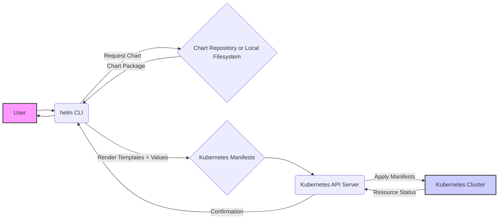

## Project Design Document: Helm

**Project Link:** https://github.com/helm/helm

**Document Version:** 1.1
**Date:** October 26, 2023
**Author:** AI Software Architect

### 1. Project Overview

Helm is a package manager for Kubernetes, streamlining the deployment and management of applications. It packages Kubernetes resources into reusable units called "charts," simplifying complex deployments and enabling version control and rollbacks. Helm operates as a client-side tool that interacts directly with the Kubernetes API server.

### 2. Goals

* Simplify the deployment of applications onto Kubernetes clusters.
* Package collections of Kubernetes resource definitions into manageable charts.
* Facilitate the entire lifecycle management of Kubernetes applications, including installation, upgrades, and rollbacks.
* Promote the sharing and reuse of application configurations through standardized charts.
* Provide version control for application deployments within Kubernetes.

### 3. Non-Goals

* Management of the underlying Kubernetes cluster infrastructure.
* Building container images for applications.
* Provisioning the infrastructure required for a Kubernetes cluster to operate.
* Providing direct application monitoring capabilities (though it can deploy monitoring solutions).

### 4. Architecture Overview

Helm employs a client-only architecture where the `helm` command-line interface interacts directly with the Kubernetes API server. Key components in this architecture are:

* The **Helm Client (`helm` CLI)**, which handles user interactions and communicates with the Kubernetes API.
* The **Kubernetes API Server**, the central control point for managing Kubernetes resources.
* **Chart Repositories**, serving as storage and distribution points for Helm charts.
* The **Local Filesystem**, used for storing downloaded charts and user configurations.
* **OCI Registries (Optional)**, offering an alternative for storing and retrieving charts as OCI artifacts.

### 5. Component Details

#### 5.1. Helm Client (`helm` CLI)

* **Responsibilities:**
    * Accepts user commands and arguments for managing Helm charts and releases.
    * Manages local chart repositories, including adding, updating, and listing.
    * Renders Kubernetes resource manifests by combining chart templates with provided configuration values.
    * Communicates with the Kubernetes API server to perform actions like creating, updating, and deleting resources.
    * Manages the lifecycle of releases, which are instances of a chart running within a Kubernetes cluster.
    * Fetches charts from configured repositories or directly from the local filesystem.
    * Provides utilities for creating, packaging, and validating Helm charts.

* **Key Functionalities:**
    * `helm install`: Deploys a chart into a Kubernetes cluster, creating a new release.
    * `helm upgrade`: Updates an existing release to a newer version of the chart or with modified configuration.
    * `helm rollback`: Reverts a release to a previous deployment state.
    * `helm uninstall`: Removes all resources associated with a specific release from the Kubernetes cluster.
    * `helm list`: Displays a list of currently deployed releases within the cluster.
    * `helm create`: Generates a basic chart directory structure and starter files.
    * `helm package`: Bundles a chart directory into a distributable `.tgz` archive.
    * `helm lint`: Performs static analysis on a chart to identify potential issues and adherence to best practices.
    * `helm repo add/update/list`: Manages the configured chart repositories.
    * `helm pull`: Downloads a chart archive from a repository to the local filesystem.
    * `helm push`: Uploads a packaged chart to an OCI registry.

#### 5.2. Kubernetes API Server

* **Responsibilities:**
    * Authenticates and authorizes requests originating from the Helm client.
    * Maintains the desired state of all Kubernetes resources within the cluster.
    * Provides a programmatic interface (API) for interacting with Kubernetes objects.
    * Enforces admission controllers and other policies defined within the Kubernetes cluster.

* **Interaction with Helm:**
    * The Helm client sends authenticated requests to the API server to create, modify, or delete Kubernetes resources as defined by the rendered chart manifests.
    * The API server validates these requests against configured policies and updates the cluster state accordingly.
    * Helm relies on the API server to retrieve information about the current state of deployed resources and the overall cluster.

#### 5.3. Chart Repositories

* **Responsibilities:**
    * Serve as a central location for storing and distributing Helm charts.
    * Provide an index of available charts, including their names, versions, and descriptions.
    * Implement an API that allows the Helm client to search for and retrieve chart packages.

* **Types of Repositories:**
    * **Public Repositories:** Accessible to anyone without authentication (e.g., Artifact Hub).
    * **Private Repositories:** Require authentication and authorization to access, often hosted on platforms like cloud storage or dedicated artifact management tools.

#### 5.4. Local Filesystem

* **Responsibilities:**
    * Provides temporary storage for downloaded chart archives.
    * Stores user-created chart directories and files during development.
    * Holds Helm client configuration files, such as repository definitions and plugin configurations.

* **Usage by Helm:**
    * The Helm client reads chart files from the local filesystem when packaging or installing local charts.
    * Downloaded charts are cached locally to avoid redundant downloads.

#### 5.5. OCI Registries

* **Responsibilities:**
    * Store and serve Helm charts as OCI (Open Container Initiative) artifacts, alongside container images.
    * Provide authentication and authorization mechanisms for accessing chart artifacts.

* **Interaction with Helm:**
    * Helm can directly pull charts from OCI registries using the `oci://` protocol.
    * Helm can push packaged charts to OCI registries, making them available for distribution.

### 6. Data Flow

The process of installing a Helm chart typically follows these steps:

**Detailed Steps:**

1. **User Initiates Action:** The user executes a Helm command, such as `helm install my-app my-repo/nginx`.
2. **Helm CLI Processes Request:** The Helm CLI parses the command and identifies the target chart and repository.
3. **Chart Retrieval:** The Helm CLI fetches the specified chart package from the configured chart repository or uses a local chart.
4. **Template Rendering:** The Helm CLI combines the chart's templates with the provided or default values, generating standard Kubernetes resource manifests (YAML files).
5. **API Server Communication:** The Helm CLI sends authenticated requests containing the generated Kubernetes manifests to the Kubernetes API server.
6. **Kubernetes Applies Configuration:** The Kubernetes API server validates the requests and instructs the Kubernetes control plane to create or update the resources defined in the manifests within the cluster.
7. **Resource Status Update:** The Kubernetes cluster updates the API server with the status of the created or updated resources.
8. **Confirmation to Helm CLI:** The Kubernetes API server sends confirmation of the operations back to the Helm CLI.
9. **User Feedback:** The Helm CLI provides feedback to the user about the success or failure of the deployment.

### 7. Key Interactions

* **User <-> Helm CLI:**  Direct interaction via command-line input and output.
* **Helm CLI <-> Chart Repository:**  Communication for fetching chart packages and repository index data.
* **Helm CLI <-> Kubernetes API Server:**  Secure communication for managing Kubernetes resources through API calls.
* **Kubernetes API Server <-> Kubernetes Cluster:**  Internal communication within the Kubernetes control plane to manage resource states.
* **Helm CLI <-> Local Filesystem:**  Accessing local chart files and storing configuration data.
* **Helm CLI <-> OCI Registry:**  Communication for pulling and pushing charts as OCI artifacts.

### 8. Security Considerations (Initial)

This section highlights initial security considerations relevant to Helm. These points will be further explored during a dedicated threat modeling exercise.

* **Chart Authenticity and Integrity:**
    * Verifying the source and integrity of downloaded charts to prevent the deployment of malicious or compromised software.
    * Implementing mechanisms for chart signing and verification.
    * The risk of supply chain attacks through compromised chart repositories.
* **Access Control and Authorization:**
    * Controlling which users and service accounts have the authority to deploy, upgrade, and manage Helm releases within the Kubernetes cluster.
    * Leveraging Kubernetes Role-Based Access Control (RBAC) to enforce granular permissions for Helm operations.
    * Securely managing credentials for accessing private chart repositories and OCI registries.
* **Secrets Management within Charts:**
    * Securely handling sensitive information like passwords, API keys, and certificates within Helm charts.
    * Avoiding hardcoding secrets in chart templates and utilizing Kubernetes Secrets or external secret management solutions.
* **Template Injection Risks:**
    * Potential vulnerabilities arising from insecure templating practices that could allow attackers to inject malicious code or manipulate resource configurations.
    * The importance of input validation and secure templating functions.
* **Network Security:**
    * Ensuring secure communication channels (HTTPS) between the Helm client and the Kubernetes API server.
    * Implementing network policies within the Kubernetes cluster to restrict network access for deployed applications.
* **Supply Chain Security of Helm Itself:**
    * Ensuring the security of the Helm client binary and its dependencies to prevent the introduction of vulnerabilities.
* **Auditing and Logging of Helm Operations:**
    * Maintaining comprehensive audit logs of Helm actions for security monitoring, incident response, and compliance.
    * Utilizing Kubernetes audit logs to track changes made through Helm.
* **Permissions Required by Helm:**
    * Understanding the necessary Kubernetes API permissions required by the Helm client to perform its functions and adhering to the principle of least privilege.
* **Storage of Chart Data:**
    * Securely storing chart packages and related data within repositories and OCI registries, considering access controls and encryption.

This design document provides a comprehensive overview of the Helm project's architecture and components, laying the groundwork for a detailed threat model. The identified security considerations serve as a starting point for proactively addressing potential vulnerabilities.
