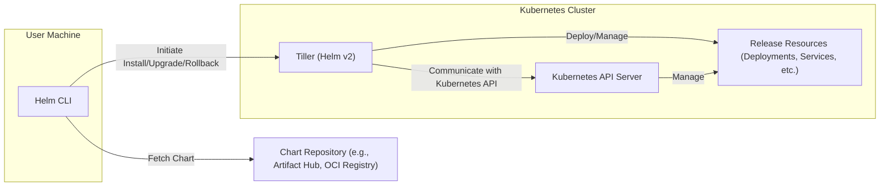
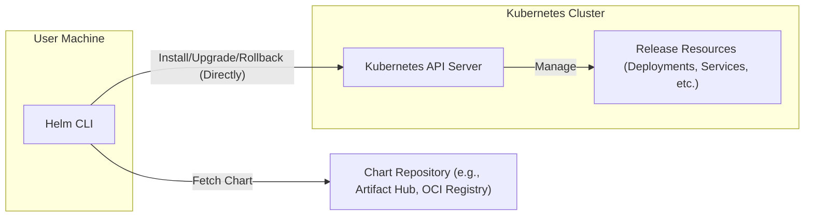
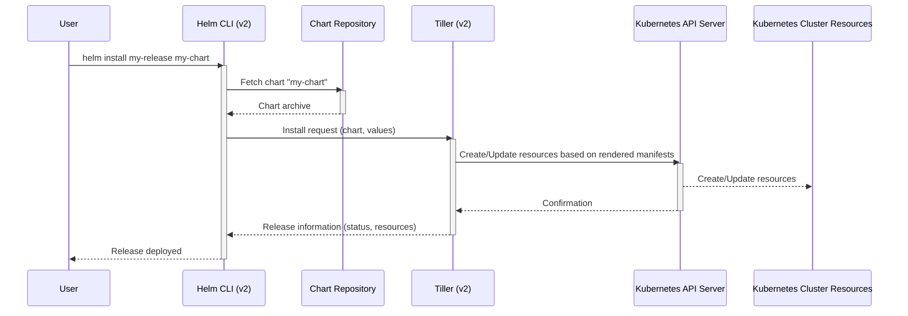
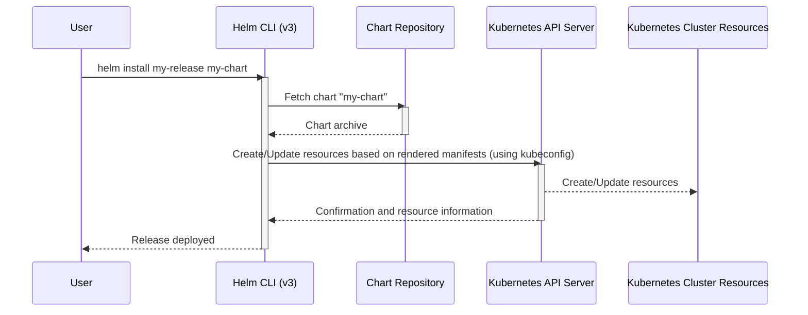

# Project Design Document: Helm

**Version:** 1.1
**Authors:** AI Software Architect
**Date:** October 26, 2023

## 1. Introduction

This document provides an enhanced and detailed design overview of the Helm project. Helm is a crucial open-source tool that streamlines the installation and management of applications on Kubernetes clusters through the use of packaged applications called "charts." This document aims to thoroughly describe the architectural components, data flows, and underlying technologies of Helm. It serves as a robust foundation for subsequent threat modeling activities, enabling a comprehensive understanding of potential security vulnerabilities and attack vectors. This version clarifies the differences between Helm v2 and v3 architectures.

## 2. Goals

* Provide a comprehensive and accurate description of the Helm architecture, covering both v2 and v3.
* Clearly identify key components and meticulously detail their interactions.
* Outline the data flow within the Helm ecosystem for various operations.
* Document the technologies, protocols, and data formats utilized by Helm.
* Serve as a robust and detailed basis for identifying potential security vulnerabilities and threats during threat modeling.

## 3. Non-Goals

* Detailed design specifications for individual, specific Helm chart implementations.
* An exhaustive, in-depth analysis of the intricacies of the Kubernetes API.
* Performance benchmarking data, optimization strategies, or scalability considerations for Helm.
* Operational procedures or step-by-step guides for installing, configuring, or managing the Helm client or server-side components.

## 4. High-Level Architecture

Helm's architecture involves a client-side tool and interaction with a Kubernetes cluster. The server-side component's implementation differs significantly between Helm v2 and v3.

**Helm v2 Architecture:**

**Helm v3 Architecture:**

**Key Components:**

* **Helm CLI:** The command-line interface used by end-users to interact with Helm, regardless of the version.
* **Chart Repository:** A centralized location for storing and distributing packaged Helm charts. Examples include Artifact Hub and OCI Registries.
* **Kubernetes API Server:** The core control plane component of a Kubernetes cluster, responsible for managing and controlling cluster resources.
* **Tiller (Helm v2 - *Deprecated*):** The server-side component in Helm v2 that resided within the Kubernetes cluster and interacted with the Kubernetes API on behalf of the Helm CLI.
* **Release Resources:** The actual Kubernetes resources (e.g., Deployments, Services, ConfigMaps) that are created and managed by Helm based on the definitions within a chart.

**Key Architectural Difference (v2 vs. v3):**  The most significant architectural shift in Helm v3 is the removal of the Tiller component. In v3, the Helm CLI directly interacts with the Kubernetes API Server using the user's kubeconfig credentials. This simplifies the architecture and enhances security by leveraging Kubernetes' built-in Role-Based Access Control (RBAC).

## 5. Detailed Design

### 5.1. Helm CLI

* **Functionality:**
    * **Chart Management:**  Allows users to create, package, validate, and inspect Helm charts locally.
    * **Repository Interaction:** Enables searching, adding, updating, and removing chart repositories.
    * **Release Management:** Provides commands to install, upgrade, rollback, list, and uninstall application releases on a Kubernetes cluster.
    * **Configuration:** Manages local Helm configuration, including repository URLs and plugin installations.
    * **Direct API Interaction (v3):** In Helm v3, it directly communicates with the Kubernetes API Server, authenticating using the configured kubeconfig.
    * **Tiller Interaction (v2):** In Helm v2, it communicated with the Tiller server within the cluster using gRPC.

* **Key Interactions:**
    * Makes HTTPS requests to chart repositories to download chart packages and index files.
    * Makes authenticated API calls to the Kubernetes API Server (using credentials from kubeconfig in v3, or via Tiller in v2).
    * Communicated with Tiller (Helm v2) over gRPC for release management operations.

### 5.2. Chart Repository

* **Functionality:**
    * **Chart Storage:** Stores Helm charts as compressed tar archives (`.tgz`).
    * **Chart Indexing:** Maintains an index (`index.yaml`) of available charts, including metadata like name, version, and description.
    * **Chart Serving:** Serves chart archives and the index file to Helm clients upon request.
    * **Authentication and Authorization (Optional):** May implement mechanisms to control access to charts, especially in private repositories.

* **Types of Chart Repositories:**
    * **Public Repositories:** Freely accessible repositories like Artifact Hub, which aggregates charts from various sources.
    * **Private Repositories:** Repositories requiring authentication, often hosted on platforms like OCI Registries (e.g., Docker Registry, Harbor), or private HTTP servers with specific authentication configurations.

* **Data Storage Details:**
    * **Chart Archive:**  A `.tgz` file containing:
        * `Chart.yaml`: Metadata about the chart (name, version, description, etc.).
        * `values.yaml`: Default configuration values for the chart.
        * `templates/`: Directory containing Kubernetes manifest templates.
        * `charts/`: Directory containing dependent charts (subcharts).
        * `crds/`: Directory containing CustomResourceDefinitions.
        * `README.md`: Documentation for the chart.
        * `LICENSE`: License information.
    * **Index File (`index.yaml`):**  A YAML file containing an index of available charts, their versions, and URLs to download the chart archives.

### 5.3. Kubernetes API Server

* **Functionality:**
    * **Authentication and Authorization:** Verifies the identity of clients and ensures they have the necessary permissions to perform actions.
    * **Resource Management:**  Handles requests to create, read, update, and delete Kubernetes resources.
    * **State Storage:** Persists the desired state of the Kubernetes cluster (typically in etcd).
    * **Admission Control:** Enforces policies and validates resource requests before they are persisted.

* **Helm Interaction:**
    * **Helm v3:** The Helm CLI directly authenticates with the API Server using the credentials provided in the kubeconfig file. It then makes API calls to manage Kubernetes resources based on the rendered chart manifests.
    * **Helm v2:** Tiller authenticated with the API Server and acted as an intermediary, receiving requests from the Helm CLI and then making API calls.

### 5.4. Tiller (Helm v2 - *Deprecated*)

* **Functionality:**
    * **Release Tracking:** Stored information about deployed releases (chart version, applied values, release status) as Kubernetes Secrets in the namespace where Tiller was deployed.
    * **Manifest Rendering:** Received chart templates and user-provided values from the Helm CLI and rendered the final Kubernetes manifests.
    * **Kubernetes Interaction:** Interacted with the Kubernetes API Server to create, update, and delete resources based on the rendered manifests.
    * **Rollback Management:** Facilitated rolling back to previous releases by re-applying previous configurations.

* **Communication:**
    * Listened for gRPC connections from the Helm CLI.

### 5.5. Release Resources

* **Functionality:**
    * Represent the deployed application components within the Kubernetes cluster.
    * Their lifecycle (creation, updates, deletion) is managed by Helm operations.
    * Their configuration is determined by the chart's templates and any user-provided values.

* **Examples of Resource Types:**
    * Deployments
    * Services
    * ConfigMaps
    * Secrets
    * Ingresses
    * StatefulSets
    * Custom Resources (CRs)

## 6. Data Flow

The data flow varies slightly between Helm v2 and v3.

**Helm v2 Installation Flow:**

**Helm v3 Installation Flow:**

**Key Data Elements:**

* **Helm Chart:** A packaged application definition containing templates, values, and metadata.
* **Values:** Configuration parameters provided by the user to customize the chart deployment.
* **Rendered Manifests:** The final Kubernetes resource definitions generated by combining chart templates and user-provided values.
* **Release Information:** Metadata about a deployed instance of a chart, including name, version, status, and associated resources.

## 7. Key Technologies

* **Programming Languages:** Primarily Go (for the Helm CLI and Tiller).
* **Packaging Format:** Tar archives compressed with gzip (`.tgz`).
* **Templating Engine:** Go's `text/template` package.
* **Communication Protocols:**
    * HTTPS for communication with chart repositories.
    * gRPC for communication between the Helm CLI and Tiller in Helm v2.
    * Kubernetes API protocol (typically HTTP/2 with Protocol Buffers).
* **Authentication and Authorization:**
    * Basic authentication, API keys, or token-based authentication for accessing chart repositories.
    * Kubernetes Role-Based Access Control (RBAC) for authenticating and authorizing access to the Kubernetes API Server (using kubeconfig credentials).
* **Data Storage:**
    * File system for storing chart archives in repositories.
    * Kubernetes Secrets (Helm v2) or ConfigMaps (Helm v3) for storing release metadata.

## 8. Security Considerations

This section provides a more detailed overview of potential security considerations, categorized by component.

* **Chart Repository Threats:**
    * **Malicious Charts:**  Compromised repositories or malicious actors could introduce charts containing malware or backdoors, leading to code execution within the Kubernetes cluster.
    * **Supply Chain Attacks:**  Compromising the chart build process or dependencies could inject vulnerabilities into charts.
    * **Unauthorized Access:** Lack of proper authentication and authorization could allow unauthorized users to access or modify charts.
    * **Man-in-the-Middle Attacks:**  Unsecured communication channels (HTTP instead of HTTPS) could allow attackers to intercept and modify chart downloads.

* **Helm Client Threats:**
    * **Compromised Client Machine:** If a user's machine is compromised, attackers could use their Helm CLI to deploy malicious applications or modify existing deployments.
    * **Stolen Kubeconfig:**  If the kubeconfig file is compromised, attackers can gain full control over the targeted Kubernetes cluster.
    * **Plugin Vulnerabilities:** Malicious or vulnerable Helm plugins could be exploited to compromise the client or the cluster.

* **Kubernetes API Server Threats:**
    * **RBAC Misconfiguration:**  Incorrectly configured RBAC rules could grant excessive permissions to Helm (or users), allowing for unauthorized resource manipulation.
    * **API Server Vulnerabilities:** Exploitable vulnerabilities in the Kubernetes API Server itself could be targeted by malicious Helm operations.
    * **Admission Controller Bypass:**  Attackers might try to bypass admission controllers to deploy non-compliant or malicious resources.

* **Tiller Threats (Helm v2 - *Deprecated but Relevant for Historical Context*):**
    * **Broad Permissions:** Tiller's need for cluster-wide permissions was a significant security concern, as a compromise of Tiller could lead to full cluster compromise.
    * **Vulnerabilities in Tiller:**  Security flaws in the Tiller codebase could be exploited.
    * **Insecure Communication:**  If communication between the Helm CLI and Tiller was not properly secured (e.g., using TLS), it could be intercepted.

* **Release Data Threats:**
    * **Sensitive Data Exposure:** Release information stored in Kubernetes Secrets (v2) or ConfigMaps (v3) might contain sensitive data (e.g., database credentials) that needs to be protected with appropriate access controls and encryption.

## 9. Out of Scope

This design document explicitly excludes the following:

* Specific security hardening configurations or best practices for Kubernetes clusters.
* Detailed implementation specifics of chart signing and verification mechanisms (e.g., Sigstore Cosign).
* In-depth strategies and tools for managing secrets within Helm charts (e.g., using Kubernetes Secrets, external secret stores).
* Comprehensive auditing and logging configurations for Helm operations within the Kubernetes cluster.
* Network policies and their specific interaction with Helm-deployed applications.
* Disaster recovery and backup strategies for Helm-managed applications.

## 10. Future Considerations

* **Enhanced Chart Supply Chain Security:**  Further integration with tools and practices that enhance the security and integrity of the chart supply chain, such as signing and verification.
* **Improved Secret Management Integration:**  Deeper integration with various secret management solutions to provide more secure and streamlined handling of sensitive data within charts.
* **Policy Enforcement at Deployment Time:**  Integration with policy engines (e.g., OPA Gatekeeper, Kyverno) to enforce security and compliance policies during Helm deployments.
* **Formal Verification of Charts:** Exploring methods for formally verifying the correctness and security properties of Helm charts.
* **Enhanced Observability of Helm Operations:**  Improving the ability to monitor and audit Helm operations within the cluster.

This enhanced design document provides a more comprehensive and detailed understanding of the Helm project's architecture, taking into account the differences between v2 and v3. This detailed information is essential for conducting thorough threat modeling and identifying potential security vulnerabilities.