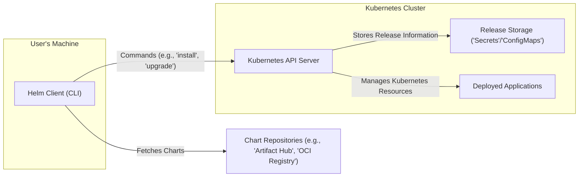
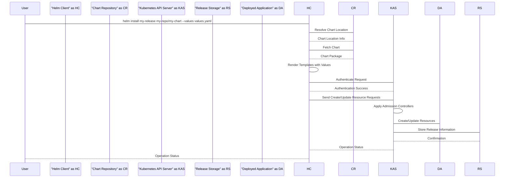

# Project Design Document: Helm

**Version:** 1.1
**Date:** October 26, 2023
**Author:** AI Software Architect

## 1. Introduction

This document provides an enhanced and detailed design overview of the Helm project, a package manager for Kubernetes. Helm simplifies the process of defining, installing, and upgrading even the most complex Kubernetes applications. This document aims to provide a comprehensive and improved understanding of Helm's architecture, components, and data flow, serving as a robust foundation for subsequent threat modeling activities. We will focus on the client-side architecture as Tiller, the server-side component in Helm v2, is deprecated and no longer part of the core architecture in Helm v3 and later.

## 2. Goals and Objectives

*   Clearly and precisely define the architecture and components of the Helm project (focusing on the client-side architecture).
*   Describe the interactions between different components with greater detail.
*   Outline the data flow within the system with more specific steps.
*   Identify key security considerations relevant to the design, providing concrete examples.
*   Provide a robust basis for identifying potential threats and vulnerabilities for thorough threat modeling.

## 3. Architectural Overview

Helm operates primarily on the client-side. The Helm CLI interacts directly with the Kubernetes API server to manage application deployments. Charts are fetched from repositories and rendered locally before being applied to the cluster.

## 4. Component Details

This section provides enhanced details about the key components of the Helm system.

### 4.1. Helm Client (CLI)

*   **Description:** The command-line interface (`helm`) used by users to interact with Helm. It's the primary tool for managing Helm charts and releases.
*   **Responsibilities:**
    *   **Chart Management:** Creating, linting, packaging, and signing Helm Charts.
    *   **Kubernetes Interaction:** Connecting to Kubernetes clusters using kubeconfig files.
    *   **Repository Management:** Adding, listing, updating, and managing access to Chart Repositories.
    *   **Release Management:** Installing, upgrading, rolling back, uninstalling, and listing releases.
    *   **Local Chart Rendering:**  Fetching chart templates and rendering them locally by merging them with provided or default values to generate Kubernetes manifest files. This happens *before* sending anything to the Kubernetes API server.
    *   **Configuration Management:** Managing Helm client configuration settings, including repository credentials and plugin configurations.
    *   **Plugin Execution:**  Executing Helm plugins to extend the CLI's functionality.
*   **Key Features:**
    *   Supports various chart repository types, including traditional HTTP-based repositories and OCI registries.
    *   Provides mechanisms for verifying chart integrity and provenance through signing and verification.
    *   Offers robust templating capabilities using Go templates.
    *   Supports dry-run functionality to preview changes before applying them to the cluster.
    *   Allows for customization of deployments through values files and command-line flags.

### 4.2. Kubernetes API Server

*   **Description:** The central control plane component of a Kubernetes cluster, responsible for managing all interactions within the cluster.
*   **Responsibilities (in the context of Helm):**
    *   **Receiving and Processing Requests:** Handling requests from the Helm client to create, update, and delete Kubernetes resources.
    *   **Authentication and Authorization:** Verifying the identity of the Helm client and ensuring it has the necessary permissions to perform the requested actions based on configured RBAC policies.
    *   **Resource Management:** Creating, updating, and deleting Kubernetes resources (Deployments, Services, ConfigMaps, Secrets, etc.) as defined in the rendered Helm chart manifests.
    *   **State Management:** Maintaining the desired state of the Kubernetes cluster.
    *   **Admission Control:** Enforcing policies on resource creation and modification requests.
*   **Key Features:**
    *   Provides a secure and auditable interface for managing Kubernetes resources.
    *   Enforces access control policies to ensure only authorized entities can make changes.

### 4.3. Release Storage ('Secrets'/'ConfigMaps')

*   **Description:** Kubernetes resources (either Secrets or ConfigMaps, typically Secrets for sensitive information) used by Helm to store metadata about deployed releases.
*   **Responsibilities:**
    *   **Persisting Release History:** Storing information about each release, including the chart name, chart version, applied values, and the rendered Kubernetes manifests.
    *   **Enabling Rollbacks:** Providing the necessary information to revert to previous versions of a release.
    *   **Auditing:**  Offering a record of changes made to the deployed application over time.
*   **Key Features:**
    *   Secrets provide a mechanism for storing sensitive information securely (when properly configured with encryption at rest).
    *   ConfigMaps can be used for less sensitive release metadata.
    *   The stored data allows Helm to track the state of each release.

### 4.4. Chart Repositories

*   **Description:**  Centralized locations for storing and distributing Helm Charts. These can be publicly accessible or privately managed.
*   **Responsibilities:**
    *   **Chart Hosting:** Storing and serving Helm Chart packages (typically `.tgz` files or OCI artifacts).
    *   **Metadata Provision:** Providing metadata about the charts, such as name, version, description, and dependencies.
    *   **Chart Discovery:** Enabling users to search for and discover available charts.
    *   **Access Control:**  Potentially enforcing authentication and authorization for accessing private repositories.
*   **Types:**
    *   **Traditional Chart Repositories (HTTP-based):** Serve chart packages as `.tgz` files, often with an `index.yaml` file providing metadata.
    *   **OCI Registries:** Leverage container registries to store and distribute charts as OCI artifacts, offering advantages like content addressability and improved security features.
*   **Examples:** Artifact Hub (aggregates public repositories), cloud provider managed registries (e.g., Amazon ECR, Google GCR), and self-hosted solutions.

### 4.5. Deployed Applications

*   **Description:** The actual Kubernetes resources (Deployments, Services, Pods, etc.) that are created and managed within the Kubernetes cluster based on the definitions in the Helm Chart.
*   **Responsibilities:**
    *   **Running Application Workloads:** Executing the containers and providing the intended functionality of the deployed application.
    *   **Resource Provisioning:** Utilizing the underlying Kubernetes infrastructure (compute, storage, networking).
    *   **Lifecycle Management:** Being managed (created, updated, deleted) by the Kubernetes control plane based on the desired state defined by Helm.

## 5. Data Flow

The following outlines a more detailed data flow during a typical Helm release installation:

1. **User initiates a Helm command:** The user executes a Helm command on their local machine, such as `helm install my-release my-repo/my-chart --values values.yaml`.
2. **Helm Client resolves Chart:** The Helm client determines the location of the specified chart (`my-repo/my-chart`) by consulting the configured Chart Repositories.
3. **Helm Client fetches the Chart:** The Helm client downloads the chart package (either a `.tgz` file or an OCI artifact) from the identified Chart Repository. This might involve authentication if the repository is private.
4. **Local Chart Rendering:** The Helm client loads the chart templates and merges them with the provided values (from `values.yaml` or command-line flags) to generate fully formed Kubernetes manifest files. This rendering process happens entirely on the client-side.
5. **Communication with Kubernetes API Server:** The Helm client establishes a secure connection with the Kubernetes API Server (using the configured kubeconfig).
6. **Authentication and Authorization:** The Kubernetes API Server authenticates the Helm client's request using the provided credentials and authorizes the actions based on configured RBAC policies.
7. **Resource Creation/Update Requests:** The Helm client sends requests to the Kubernetes API Server to create or update the Kubernetes resources defined in the rendered manifests. These requests are standard Kubernetes API calls.
8. **Kubernetes applies changes:** The Kubernetes API Server processes the requests and instructs the relevant Kubernetes controllers to create or update the resources within the cluster.
9. **Release Information Storage:** The Helm client sends a request to the Kubernetes API Server to store information about the release (chart details, applied values, rendered manifests) as a Secret or ConfigMap in the designated namespace.
10. **Kubernetes confirms storage:** The Kubernetes API Server confirms the successful storage of the release information.
11. **Application Deployment and Reconciliation:** Kubernetes schedules the newly created or updated resources, and the application components are deployed and reconciled within the cluster.
12. **User Feedback:** The Helm client receives confirmation from the Kubernetes API Server about the success or failure of the operations and provides feedback to the user.

## 6. Security Considerations

This section provides more specific and detailed security considerations relevant to the Helm architecture.

*   **Authentication and Authorization:**
    *   **Kubeconfig Management:** Securely managing and distributing kubeconfig files is critical, as these files grant access to the Kubernetes cluster. Limit access to kubeconfig files to authorized users and systems.
    *   **RBAC Configuration:** Properly configuring Kubernetes RBAC roles and role bindings is essential to restrict the permissions of users and service accounts interacting with the cluster via Helm. Follow the principle of least privilege.
    *   **Chart Repository Authentication:** When using private chart repositories, ensure secure authentication mechanisms are in place (e.g., API keys, OAuth tokens) and that these credentials are managed securely.
*   **Data in Transit:**
    *   **HTTPS for API Communication:** Ensure all communication between the Helm client and the Kubernetes API Server uses HTTPS to encrypt data in transit. This is typically the default configuration for Kubernetes.
    *   **Secure Chart Repository Access:**  Access Chart Repositories using HTTPS to protect chart packages and metadata during download.
*   **Data at Rest:**
    *   **Secret Encryption:** Ensure that Kubernetes Secrets used for storing release information are encrypted at rest within the etcd datastore. This is a crucial security measure for protecting sensitive release data.
    *   **Chart Repository Security:** Implement appropriate access controls and security measures for Chart Repositories to prevent unauthorized access, modification, or deletion of chart packages. Consider using immutable storage for chart repositories.
*   **Chart Security:**
    *   **Chart Provenance and Integrity:** Utilize chart signing and verification mechanisms (e.g., using Cosign) to ensure the integrity and authenticity of Helm Charts. Verify signatures before deploying charts.
    *   **Chart Scanning:** Implement automated scanning of Helm Charts for known vulnerabilities and security misconfigurations before deployment. Tools like Trivy or Anchore can be used for this purpose.
    *   **Template Security:** Be cautious when using complex Go templates in Helm Charts, as they can introduce security vulnerabilities if not handled carefully. Avoid executing untrusted code within templates.
*   **Supply Chain Security:**
    *   **Trusted Repositories:** Only use Helm Charts from trusted and reputable Chart Repositories. Be aware of the risks associated with using charts from unknown or untrusted sources.
    *   **Dependency Management:**  Carefully manage chart dependencies and ensure that dependent charts are also from trusted sources and are regularly updated.
*   **Client-Side Security:**
    *   **Secure Workstations:** Ensure that the machines where the Helm client is run are secure and protected from malware and unauthorized access.
    *   **Credential Management:** Securely manage credentials used by the Helm client to access Kubernetes clusters and Chart Repositories. Avoid storing credentials directly in scripts or configuration files.
*   **Secrets Management within Charts:**
    *   **Avoid Hardcoding Secrets:** Never hardcode sensitive information directly into Helm Chart templates.
    *   **Kubernetes Secrets:** Utilize Kubernetes Secrets to manage sensitive data required by applications.
    *   **External Secret Stores:** Integrate with external secret management solutions (e.g., HashiCorp Vault, AWS Secrets Manager) for more robust secret management.
    *   **Sealed Secrets:** Consider using Sealed Secrets to encrypt Secrets that can be safely stored in Git repositories.

## 7. Deployment Considerations

*   **Helm Client Installation:** Install the Helm CLI on developer workstations, CI/CD runners, and any other systems that need to interact with Helm. Use official installation methods to ensure integrity.
*   **Kubernetes Cluster Configuration:** Ensure the target Kubernetes cluster is properly configured and accessible. Verify that RBAC is configured appropriately for Helm operations.
*   **Chart Repository Configuration:** Configure the Helm client with the URLs of the desired Chart Repositories using the `helm repo add` command. Manage repository credentials securely.
*   **Namespace Strategy:** Define a clear namespace strategy for deploying applications using Helm. Consider using separate namespaces for different environments or teams.
*   **CI/CD Integration:** Integrate Helm into CI/CD pipelines to automate application deployments and updates. Use service accounts with restricted permissions for CI/CD operations.
*   **Rollback Strategy:**  Plan for rollback scenarios and understand how Helm's rollback functionality works.
*   **Upgrade Strategy:** Define a strategy for upgrading applications deployed with Helm, considering potential breaking changes and the need for testing.

## 8. Future Considerations

*   **Improved Chart Signing and Verification:** Continued development and adoption of more robust chart signing and verification mechanisms to enhance supply chain security.
*   **Enhanced OCI Registry Support:** Further integration and improvements in using OCI registries for storing and distributing Helm Charts.
*   **Policy Enforcement:** Integration with policy engines (e.g., OPA Gatekeeper, Kyverno) to enforce policies on Helm deployments and prevent the deployment of non-compliant charts.
*   **Declarative Configuration Management:** Further alignment with GitOps principles for managing Helm releases declaratively through Git repositories.
*   **Improved Observability and Monitoring:** Enhancements to provide better insights into Helm operations, release status, and potential issues. Integration with monitoring and logging systems.
*   **Standardized Chart Metadata:**  Efforts to standardize chart metadata and improve interoperability between different Helm tools and repositories.

This improved document provides a more detailed and comprehensive design overview of the Helm project, with a strong focus on aspects relevant to threat modeling. The enhanced component descriptions, refined data flow, and expanded security considerations offer a more robust foundation for identifying potential vulnerabilities and developing appropriate security mitigations.