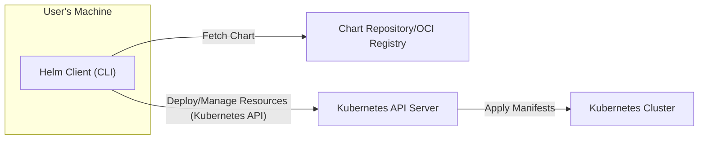
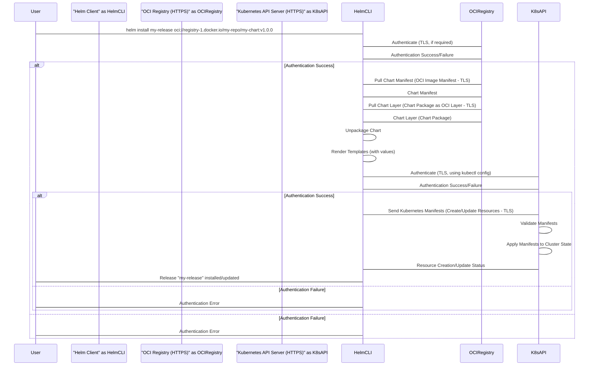

# Project Design Document: Helm - The Kubernetes Package Manager

**Version:** 1.1
**Date:** 2023-10-27
**Author:** AI Expert

## 1. Introduction

This document provides a detailed design overview of Helm, the package manager for Kubernetes. It is designed to be used as a foundation for threat modeling and security analysis of the Helm project. This document focuses on the architecture of Helm v3, the currently supported version, which features a client-only design significantly different from Helm v2 (Tiller-based). While Helm v2 and Tiller are mentioned for historical context, the primary focus is on the client-only architecture of Helm v3.

Helm streamlines the definition, installation, and upgrade processes for even the most complex Kubernetes applications. It utilizes packages called "charts" to bundle application resources and configurations. This document outlines the key components, data flow, and security considerations of Helm to facilitate a comprehensive threat modeling exercise.

**Project Link:** [https://github.com/helm/helm](https://github.com/helm/helm)

## 2. Project Overview

Helm simplifies Kubernetes application lifecycle management by addressing the complexities of managing numerous Kubernetes manifests. It achieves this through:

*   **Packaging (Charting):**  Bundling Kubernetes manifests and related configurations into reusable, versioned packages called charts.
*   **Templating (Go Templating):**  Employing Go templates within manifests to enable parameterization and customization of deployments based on specific environments or configurations.
*   **Dependency Management (Chart Dependencies):**  Defining and managing dependencies between charts, allowing for complex application deployments composed of multiple interconnected services.
*   **Release Management (Releases and Rollbacks):** Tracking deployments as "releases," enabling versioning, upgrades, and easy rollbacks to previous application states.
*   **Sharing and Distribution (Chart Repositories and OCI Registries):** Providing mechanisms to share and distribute charts through centralized chart repositories and standard OCI registries, fostering reusability and collaboration.

Helm v3's client-only architecture is a significant departure from Helm v2. By removing the server-side Tiller component, Helm v3 simplifies operations, enhances security by eliminating a central point of failure, and aligns with Kubernetes' security best practices.

## 3. Architectural Design

### 3.1. High-Level Architecture

The core components of the Helm v3 architecture are:

*   **Helm Client (CLI):** The command-line interface (`helm`) is the primary tool for users to interact with Helm. It handles all client-side operations, including chart management, template rendering, communication with chart repositories/registries, and interaction with the Kubernetes API server.
*   **Chart Repositories:** HTTP-based servers that host and serve Helm charts. These repositories are typically used for organizing and distributing charts within communities or organizations. They serve an `index.yaml` file listing available charts and their versions.
*   **OCI Registries:** Container registries, conforming to the Open Container Initiative (OCI) Distribution Specification, are used to store and serve Helm charts as OCI artifacts (container images). This is the recommended and increasingly prevalent method for chart distribution in Helm v3, leveraging existing container registry infrastructure.
*   **Kubernetes API Server:** The central control plane component of a Kubernetes cluster. The Helm CLI directly communicates with the Kubernetes API server to authenticate, authorize, and perform actions to deploy and manage resources within the cluster.
*   **Kubernetes Cluster:** The underlying Kubernetes cluster provides the runtime environment where applications packaged and deployed by Helm are executed.

### 3.2. Component Details

#### 3.2.1. Helm Client (CLI)

*   **Functionality:**
    *   **Chart Lifecycle Management:**  Commands for creating, packaging (`helm package`), validating (`helm lint`), and inspecting (`helm show`) Helm charts.
    *   **Repository/Registry Management:**  Commands to add, list, update, and remove chart repositories (`helm repo`) and interact with OCI registries (`helm pull oci://...`, `helm push oci://...`).
    *   **Release Management:** Core commands for installing (`helm install`), upgrading (`helm upgrade`), rolling back (`helm rollback`), uninstalling (`helm uninstall`), and listing releases (`helm list`) of charts within Kubernetes clusters.
    *   **Template Rendering (Local and Dry-Run):**  Capabilities to render Helm chart templates locally for inspection and debugging (`helm template`) or perform dry-run installations to preview changes without applying them to the cluster (`helm install --dry-run`).
    *   **Kubernetes API Interaction:**  Handles authentication, authorization, and communication with the Kubernetes API server using the user's configured Kubernetes context (typically from `kubectl config`).
    *   **Configuration Management:** Manages Helm client configuration settings, including repository URLs, registry configurations, plugin paths, and more (`helm env`, `helm settings`).
    *   **Plugin Support:**  Extends Helm's base functionality through a plugin system, allowing users to add custom commands and features (`helm plugin`).

*   **Data Flow:**
    *   Receives commands from the user via the command-line interface.
    *   Based on the command, it may:
        *   Fetch chart information and packages from configured chart repositories or OCI registries (over HTTPS).
        *   Render chart templates locally using provided values and built-in functions.
        *   Construct Kubernetes resource manifests from the rendered templates.
        *   Authenticate to the Kubernetes API server using credentials from the `kubectl config` file.
        *   Send Kubernetes manifest data to the API server to create, update, or delete resources within the cluster.
        *   Receive responses from the API server, indicating the success or failure of operations.
        *   Present feedback and status information to the user in the command-line interface.

*   **Security Considerations:**
    *   **Local Machine Security:** The security of the user's local machine is paramount. A compromised local machine can lead to the compromise of Kubernetes deployments if Helm client credentials or chart data are accessed.
    *   **Kubernetes Credential Management:** Helm relies on the Kubernetes configuration file (`kubectl config`) for authentication. Secure storage, access control, and rotation of these credentials are critical.  Misconfigured or exposed `kubectl config` files are a significant security risk.
    *   **Plugin Security Risks:** Helm plugins, while extending functionality, can introduce security vulnerabilities if they are not from trusted sources or are poorly written. Malicious plugins could potentially compromise the Helm client's functionality or access sensitive data.
    *   **Client-Side Chart Validation Limitations:** While Helm performs client-side validation of charts (e.g., `helm lint`), this is not a comprehensive security measure. It primarily focuses on syntax and structural correctness, not on detecting malicious content or vulnerabilities within the chart itself.
    *   **Data Exposure in Local Operations:** Operations like `helm template` or `--dry-run` might expose sensitive data (secrets, configuration values) in the user's terminal or logs if not handled carefully.

#### 3.2.2. Chart Repositories

*   **Functionality:**
    *   **Chart Index Hosting:** Serve as HTTP servers hosting `index.yaml` files. These files are generated by `helm repo index` and contain metadata about available charts in the repository, including chart names, versions, descriptions, and download URLs.
    *   **Chart Package Storage and Delivery:** Store packaged Helm charts (`.tgz` files) and provide HTTP access for Helm clients to download these packages.
    *   **Metadata Provisioning:**  Provide metadata about charts via the `index.yaml`, enabling Helm clients to search, discover, and retrieve information about available charts.

*   **Data Flow:**
    *   Helm client sends HTTP requests (typically GET requests) to the chart repository URL to:
        *   Fetch the `index.yaml` file to update the local chart repository cache (`helm repo update`).
        *   Download chart packages (`.tgz` files) when installing or upgrading a release (`helm install`, `helm upgrade`).
    *   The chart repository responds with:
        *   The `index.yaml` file containing chart metadata.
        *   Chart package files (`.tgz`) upon request.

*   **Security Considerations:**
    *   **Availability and Reliability:**  Downtime or performance issues with chart repositories can disrupt Helm operations, preventing users from installing or upgrading applications.
    *   **Chart Integrity Risks:**  Compromised chart repositories can serve malicious or tampered charts. If an attacker gains control of a repository, they could replace legitimate charts with malicious versions, leading to compromised Kubernetes deployments. Using HTTPS for repository access is essential to ensure data integrity in transit.
    *   **Access Control and Confidentiality:**  Chart repositories can be public or private. Private repositories require authentication and authorization mechanisms to control access to charts, ensuring that sensitive or proprietary charts are only accessible to authorized users or groups.
    *   **Index.yaml Poisoning:**  If an attacker can modify the `index.yaml` file, they could redirect download URLs to malicious chart packages or manipulate chart metadata to mislead users.
    *   **Lack of Built-in Security Features:** Basic chart repositories often lack advanced security features like built-in authentication, authorization, or audit logging. These features need to be implemented at the infrastructure level (e.g., using reverse proxies with authentication).

#### 3.2.3. OCI Registries

*   **Functionality:**
    *   **OCI Artifact Storage:** Store Helm charts as OCI artifacts, leveraging the standard OCI image format and distribution specifications. This allows Helm charts to be treated like container images within registries.
    *   **Versioning and Tagging:** Support versioning and tagging of Helm charts using OCI image tags, enabling clear version management and release tracking.
    *   **Content Addressable Storage:** OCI registries often use content-addressable storage, where artifacts are identified by their content hash (digest). This provides inherent integrity verification.
    *   **Distribution via OCI APIs:**  Provide access to Helm charts through standard OCI registry APIs (e.g., Docker Registry API), allowing Helm clients to pull and push charts using familiar registry commands.

*   **Data Flow:**
    *   Helm client interacts with OCI registries using OCI registry APIs over HTTPS to:
        *   Authenticate to the registry (if required for private registries).
        *   Push Helm charts to the registry (`helm push oci://...`).
        *   Pull Helm charts from the registry (`helm pull oci://...`, `helm install oci://...`).
        *   Fetch chart manifests (OCI image manifests) and chart layers (chart packages as OCI layers).

*   **Security Considerations:**
    *   **Registry Platform Security:**  Security relies heavily on the underlying OCI registry platform. Vulnerabilities in the registry software or infrastructure can directly impact the security of Helm charts stored within.
    *   **Robust Access Control:** OCI registries offer comprehensive access control mechanisms (authentication and authorization) to manage access to charts. This allows for fine-grained control over who can pull, push, or manage charts.
    *   **Image Security Scanning Integration:** Many OCI registries integrate with image security scanning tools. While primarily designed for container images, these scanners can potentially be used to scan Helm chart layers for vulnerabilities (though less directly applicable to the chart itself and more to any embedded container images within the chart).
    *   **Provenance and Signing Capabilities:** OCI registries support image signing and verification using technologies like Cosign and Notation. This enables strong provenance tracking and integrity verification of Helm charts, ensuring that charts originate from trusted sources and have not been tampered with.
    *   **Content Trust and Immutability:** Content-addressable storage in OCI registries ensures that once a chart version is pushed with a specific digest, it becomes immutable. This enhances trust and prevents accidental or malicious modifications.
    *   **Network Security (HTTPS Enforcement):**  Communication with OCI registries should always be over HTTPS to protect chart data and credentials in transit.

#### 3.2.4. Kubernetes API Server

*   **Functionality:**
    *   **Central Control Plane Interface:**  Serves as the primary interface to the Kubernetes control plane, exposing APIs for managing all Kubernetes resources.
    *   **Authentication and Authorization Enforcement:**  Authenticates and authorizes all requests from clients, including the Helm CLI, based on configured authentication mechanisms and RBAC policies.
    *   **Resource Management:** Processes requests to create, update, delete, and retrieve Kubernetes resources (deployments, services, pods, etc.).
    *   **Cluster State Management:**  Maintains the desired state of the Kubernetes cluster and orchestrates actions to achieve and maintain this state.
    *   **Admission Control:** Enforces admission controllers to validate and mutate resource requests before they are persisted, providing an additional layer of security and policy enforcement.
    *   **Audit Logging:**  Generates audit logs of API server activity, providing a record of who did what and when, crucial for security monitoring and incident response.

*   **Data Flow:**
    *   Receives authenticated and authorized requests from the Helm CLI (over HTTPS).
    *   Validates the incoming requests against defined Kubernetes resource schemas and admission control policies.
    *   Processes valid requests by interacting with other Kubernetes control plane components (e.g., etcd for persistent storage, kube-scheduler for pod scheduling, kube-controller-manager for resource reconciliation).
    *   Returns responses to the Helm CLI, indicating the outcome of the requested operations.

*   **Security Considerations:**
    *   **Authentication and Authorization (RBAC):**  Kubernetes Role-Based Access Control (RBAC) is critical for securing the API server. Properly configured RBAC policies are essential to limit the actions Helm (and users using Helm) can perform within the cluster, adhering to the principle of least privilege. Misconfigured RBAC can lead to privilege escalation and unauthorized access.
    *   **API Server Security Hardening:**  Securing the Kubernetes API server itself is paramount. This includes:
        *   Enforcing strong authentication mechanisms (e.g., TLS client certificates, OIDC).
        *   Implementing robust authorization policies (RBAC).
        *   Enabling HTTPS for all API communication.
        *   Regularly patching and updating the API server to address security vulnerabilities.
        *   Limiting network access to the API server to authorized networks and clients.
    *   **Admission Controller Security:**  Admission controllers can be used to enforce security policies at the API server level. Properly configured admission controllers (e.g., Pod Security Admission, OPA Gatekeeper) can prevent the deployment of insecure or non-compliant resources.
    *   **Audit Logging for Security Monitoring:**  Enabling and properly configuring Kubernetes audit logging is crucial for security monitoring, incident detection, and forensic analysis. Audit logs provide a detailed record of API server activity, which can be used to identify suspicious or malicious actions.
    *   **Rate Limiting and DoS Protection:**  Implementing rate limiting and other DoS protection mechanisms on the API server is important to prevent denial-of-service attacks that could disrupt cluster operations.

#### 3.2.5. Kubernetes Cluster (Worker Nodes and Runtime Environment)

*   **Functionality:**
    *   **Container Runtime Environment:** Provides the runtime environment (container runtime like containerd or Docker) for executing containerized applications deployed by Helm.
    *   **Resource Provisioning:** Provides compute, memory, storage, and network resources to applications running within the cluster.
    *   **Application Execution and Orchestration:**  Runs and manages containerized applications based on resource definitions provided by the API server, ensuring application availability, scalability, and health.
    *   **Networking and Service Discovery:** Provides networking capabilities within the cluster, enabling communication between pods and services.
    *   **Storage Management:**  Provides persistent and ephemeral storage options for applications.

*   **Data Flow:**
    *   Receives resource deployment instructions from the Kubernetes API server.
    *   Schedules pods onto worker nodes based on resource requirements and scheduling policies.
    *   Downloads container images from container registries.
    *   Starts and manages containers using the configured container runtime.
    *   Provides network connectivity and storage volumes to pods.
    *   Reports pod status and events back to the API server.

*   **Security Considerations:**
    *   **Node Security Hardening:** Securing worker nodes is critical. This includes:
        *   Operating System Hardening: Applying security best practices to the node operating system (e.g., minimal installations, disabling unnecessary services, regular patching).
        *   Container Runtime Security:  Securing the container runtime environment (e.g., using secure container runtime configurations, vulnerability scanning of container runtime components).
        *   Network Security:  Implementing network segmentation and firewalls to restrict access to worker nodes.
        *   Regular Security Audits and Vulnerability Scanning of nodes.
    *   **Network Policies for Micro-segmentation:** Kubernetes Network Policies are essential for implementing micro-segmentation within the cluster. They allow administrators to define rules that control network traffic between pods and namespaces, limiting the blast radius of potential security breaches and enforcing least privilege network access.
    *   **Pod Security Policies/Pod Security Admission (PSP/PSA):**  Pod Security Policies (deprecated, replaced by Pod Security Admission) enforce security constraints on pods at the namespace level. They can be used to restrict capabilities, prevent privileged containers, control volume mounts, and enforce other security best practices for pod deployments. Using Pod Security Admission is crucial for preventing common container security misconfigurations.
    *   **Secrets Management within the Cluster:** Kubernetes Secrets are used to store sensitive information (API keys, passwords, certificates). Secure storage and access control for Secrets are essential. Consider using external secret management solutions (e.g., HashiCorp Vault, external KMS providers) for enhanced secret security. Avoid storing secrets directly in chart configurations or container images.
    *   **Resource Quotas and Limits:**  Implementing resource quotas and limits can help prevent resource exhaustion attacks and ensure fair resource allocation within the cluster.
    *   **Security Contexts for Pods and Containers:**  Security contexts allow fine-grained control over the security settings of pods and containers, including user and group IDs, capabilities, SELinux labels, and more. Properly configuring security contexts is essential for implementing least privilege and defense-in-depth.

## 4. Data Flow Diagram (Detailed)

This diagram illustrates a more detailed data flow for installing a Helm chart from an OCI registry, including TLS communication and security considerations:

## 5. Security Considerations, Potential Threats, and Mitigations

This section details security considerations, potential threats, and recommended mitigations for Helm deployments.

| Threat Category          | Potential Threat                                      | Description                                                                                                                                                                                                                                                                                                                                                                                                                                                                                                                                                                                                                                                                                                                                                                                                                                                                                                                                                                                                                                                                                                                                                                                                                                                                                                                                                                                                                                                                                                                                                                                                                                                                                                                                                                                                                                                                                                                                                                                                                                                                                                                                                                                                                                                                                                                                                                                                                                                                                                                                                                                                                                                                                                                                                                                                                                                                                                                                                                                                                                                                                                                                                                                                                                                                                                                                                                                                                                                                                                                                                                                                                                                                                                                                                                                                                                                                                                                                                                                                                                                                                                                                                                                                                                                                                                                                                                                                                                                                                                                                                                                                                                                                                                                                                                                                                                                                                                                                                                                                                                                                                                                                                                                                                                                                                                                                                                                                                                                                                                                                                                                                                                                                                                                                                                                                                                                                                                                                                                                                                                                                                                                                                                                                                                                                                                                                                                                                                                                                                                                                                                                                                                                                                                                                                                                                                                                                                                                                                                                                                                                                                                                                                                                                                                                                                                                                                                                                                                                                                                                                                                                                                                                                                                                                                                                                                                                                                                                                                                                                                                                                                                                                                                                                                                                                                                                                                                                                                                                                                                                                                                                                                                                                                                                                                                                                                                                                                                                                                                                                                                                                                                                                                                                                                                                                                                                                                                                                                                                                                                                                                                                                                                                                                                                                                                                                                                                                                                                                                                                                                                                                                                                                                                                                                                                                                                                                                                                                                                                                                                                                                                                                                                                                                                                                                                                                                                                                                                                                                                                                                                                                                                                                                                                                                                                                                                                                                                                                                                                                                                                                                                                                                                                                                                                                                                                                                                                                                                                                                                                                                                                                                                                                                                                                                                                                                                                                                                                                                                                                                                                                                                                                                                                                                                                                                                                                                                                                                                                                                                                                                                                                                                                                                                                                                                                                                                                                                                                                                                                                                                                                                                                                                                                                                                                                                                                                                                                                                                                                                                                                                                                                                                                                                                                                                                                                                                                                                                                                                                                                                                                                                                                                                                                                                                                                                                                                                                                                                                                                                                                                                                                                                                                                                                                                                                                                                                                                                                                                                                                                                                                                                                                                                                                                                                                                                                                                                                                                                                                                                                                                                                                                                                                                                                                                                                                                                                                                                                                                                                                                                                                                                                                                                                                                                                                                                                                                                                                                                                                                                                                                                                                                                                                                                                                                                                                                                                                                                                                                                                                                                                                                                                                                                                                                                                                                                                                                                                                                                                                                                                                                                                                                                                                                                                                                                                                                                                                                                                                                                                                                                                                                                                                                                                                                                                                                                                                                                                                                                                                                                                                                                                                                                                                                                                                                                                                                                                                                                                                                                                                                                                                                                                                                                                                                                                                                                                                                                                                                                                                                                                                                                                                                                                                                                                                                                                                                                                                                                                                                                                                                                                                                                                                                                                                                                                                                                                                                                                                                                                                                                                                                                                                                                                                                                                                                                                                                                                                                                                                                                                                                                                                                                                                                                                                                                                                                                                                                                                                                                                                                                                                                                                                                                                                                                                                                                                                                                                                                                                                                                                                                                                                                                                                                                                                                                                                                                                                                                                                                                                                                                                                                                                                                                                                                                                                                                                                                                                                                                                                                                                                                                                                                                                                                                                                                                                                                                                                                                                                                                                                                                                                                                                                                                                                                                                                                                                                                                                                                                                                                                                                                                                                                                                                                                                                                                                                                                                                                                                                                                                                                                                                                                                                                                                                                                                                                                                                                                                                                                                                                                                                                                                                                                                                                                                                                                                                                                                                                                                                                                                                                                                                                                                                                                                                                                                                                                                                                                                                                                                                                                                                                                                                                                                                                                                                                                                                                                                                                                                                                                                                                                                                                                                                                                                                                                                                                                                                                                                                                                                                                                                                                                                                                                                                                                                                                                                                                                                                                                                                                                                                                                                                                                                                                                                                                                                                                                                                                                                                                                                                                                                                                                                                                                                                                                                                                                                                                                                                                                                                                                                                                                                                                                                                                                                                                                                                                                                                                                                                                                                                                                                                                                                                                                                                                                                                                                                                                                                                                                                                                                                                                                                                                                                                                                                                                                                                                                                                                                                                                                                                                                                                                                                                                                                                                                                                                                                                                                                                                                                                                                                                                                                                                                                                                                                                                                                                                                                                                                                                                                                                                                                                                                                                                                                                                                                                                                                                                                                                                                                                                                                                                                                                                                                                                                                                                                                                                                                                                                                                                                                                                                                                                                                                                                                                                                                                                                                                                                                                                                                                                                                                                                                                                                                                                                                                                                                                                                                                                                                                                                                                                                                                                                                                                                                                                                                                                                                                                                                                                                                                                                                                                                                                                                                                                                                                                                                                                                                                                                                                                                                                                                                                                                                                                                                                                                                                                                                                                                                                                                                                                                                                                                                                                                                                                                                                                                                                                                                                                                                                                                                                                                                                                                                                                                                                                                                                                                                                                                                                                                                                                                                                                                                                                                                                                                                                                                                                                                                                                                                                                                                                                                                                                                                                                                                                                                                                                                                                                                                                                                                                                                                                                                                                                                                                                                                                                                                                                                                                                                                                                                                                                                                                                                                                                                                                                                                                                                                                                                                                                                                                                                                                                                                                                                                                                                                                                                                                                                                                                                                                                                                                                                                                                                                                                                                                                                                                                                                                                                                                                                                                                                                                                                                                                                                                                                                                                                                                                                                                                                                                                                                                                                                                                                                                                                                                                                                                                                                                                                                                                                                                                                                                                                                                                                                                                                                                                                                                                                                                                                                                                                                                                                                                                                                                                                                                                                                                                                                                                                                                                                                                                                                                                                                                                                                                                                                                                                                                                                                                                                                                                                                                                                                                                                                                                                                                                                                                                                                                                                                                                                                                                                                                                                                                                                                                                                                                                                                                                                                                                                                                                                                                                                                                                                                                                                                                                                                                                                                                                                                                                                                                                                                                                                                                                                                                                                                                                                                                                                                                                                                                                                                                                                                                                                                                                                                                                                                                                                                                                                                                                                                                                                                                                                                                                                                                                                                                                                                                                                                                                                                                                                                                                                                                                                                                                                                                                                                                                                                                                                                                                                                                                                                                                                                                                                                                                                                                                                                                                                                                                                                                                                                                                                                                                                                                                                                                                                                                                                                                                                                                                                                                                                                                                                                                                                                                                                                                                                                                                                                                                                                                                                                                                                                                                                                                                                                                                                                                                                                                                                                                                                                                                                                                                                                                                                                                                                                                                                                                                                                                                                                                                                                                                                                                                                                                                                                                                                                                                                                                                                                                                                                                                                                                                                                                                                                                                                                                                                                                                                                                                                                                                                                                                                                                                                                                                                                                                                                                                                                                                                                                                                                                                                                                                                                                                                                                                                                                                                                                                                                                                                                                                                                                                                                                                                                                                                                                                                                                                                                                                                                                                                                                                                                                                                                                                                                                                                                                                                                                                                                                                                                                                                                                                                                                                                                                                                                                                                                                                                                                                                                                                                                                                                                                                                                                                                                                                                                                                                                                                                                                                                                                                                                                                                                                                                                                                                                                                                                                                                                - Chart Integrity and Provenance | Malicious or compromised charts from untrusted sources. | Downloading and using charts from untrusted or unverified sources poses a significant risk. Attackers could inject malicious code or configurations into charts, leading to compromised application deployments, data breaches, or cluster takeover.