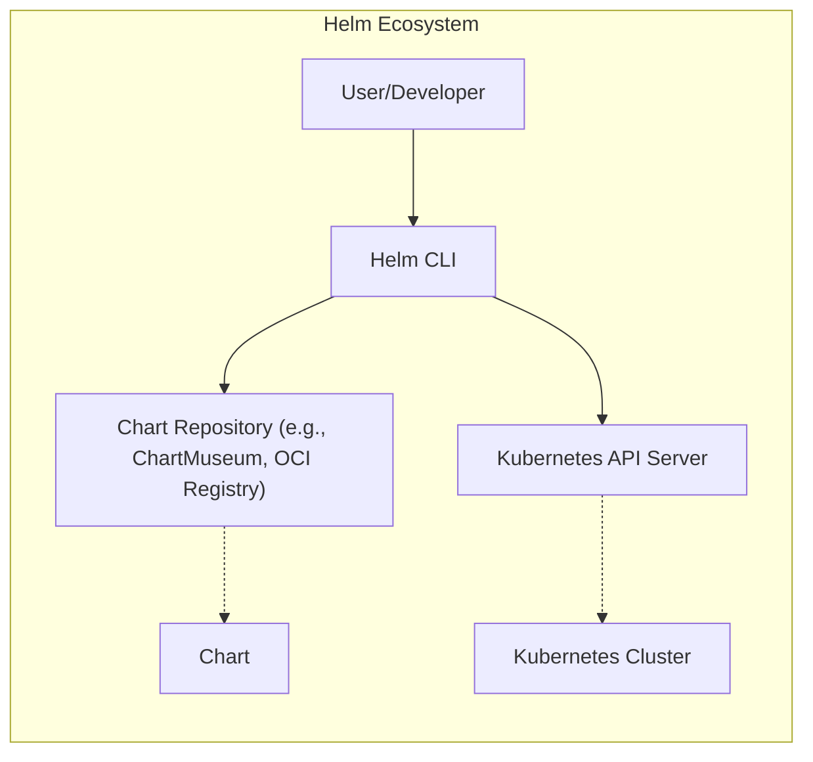
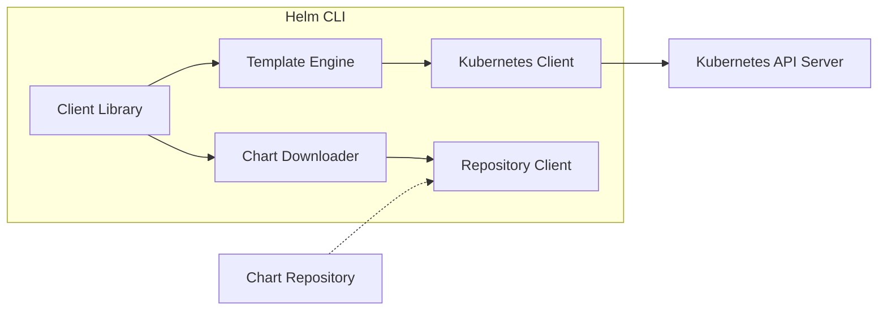
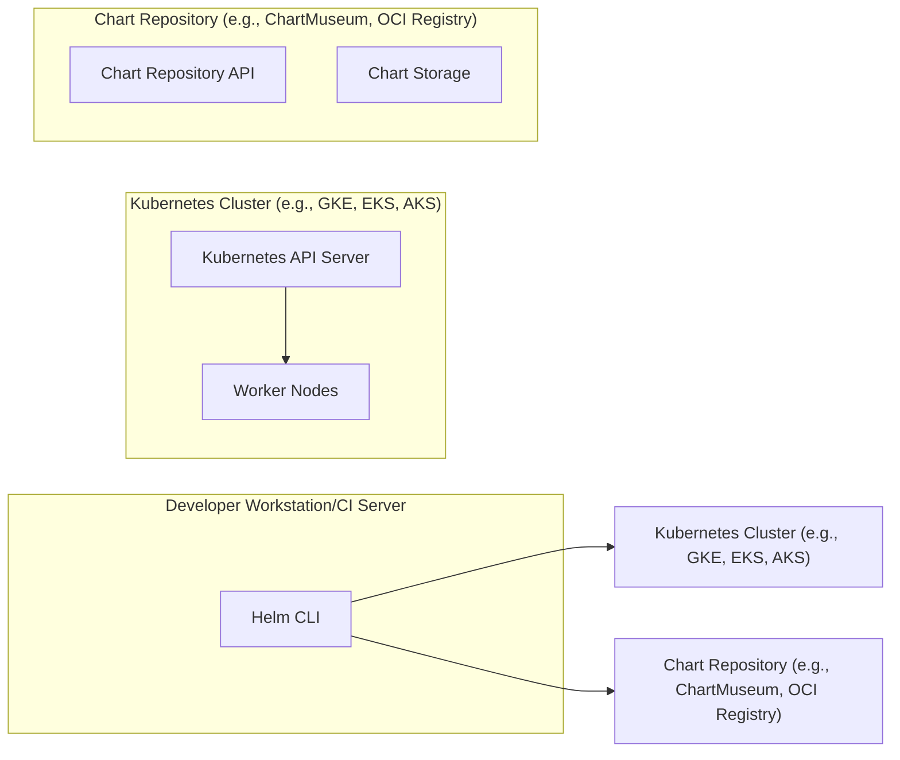
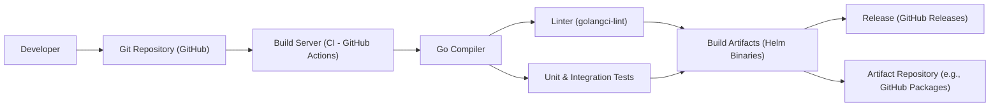

Okay, let's create a design document for the Helm project, focusing on aspects relevant for threat modeling.

# BUSINESS POSTURE

Helm is a package manager for Kubernetes, simplifying the deployment and management of applications on Kubernetes clusters.  It's widely adopted and critical for many organizations using Kubernetes.

Priorities and Goals:

*   Simplify application deployment on Kubernetes.
*   Provide a consistent and repeatable way to manage application releases.
*   Enable versioning and rollback of deployments.
*   Facilitate sharing and reuse of Kubernetes application definitions (Charts).
*   Improve developer productivity and reduce operational overhead.

Business Risks:

*   Compromise of Helm Charts: Malicious or vulnerable charts could lead to the deployment of compromised applications on Kubernetes clusters, potentially impacting confidentiality, integrity, and availability of services.
*   Supply Chain Attacks:  Vulnerabilities in Helm's dependencies or build process could be exploited to inject malicious code, affecting all users.
*   Unauthorized Access to Chart Repositories:  If attackers gain access to private chart repositories, they could steal sensitive configuration or intellectual property, or modify charts to introduce vulnerabilities.
*   Denial of Service:  Attacks targeting Helm clients or chart repositories could disrupt the ability to deploy or manage applications.
*   Incorrect Configuration:  Misconfigured Helm releases or charts could lead to application misbehavior, security vulnerabilities, or resource exhaustion.
*   Lack of Provenance and Integrity Verification: Without robust mechanisms to verify the origin and integrity of charts, users may unknowingly deploy tampered or malicious charts.

# SECURITY POSTURE

Existing Security Controls:

*   security control: Chart Provenance and Integrity: Helm uses cryptographic signatures (PGP) and provenance files to verify the origin and integrity of charts. This helps prevent the installation of tampered charts. (Implemented in Helm CLI and chart repository protocols).
*   security control: Chart Repositories: Helm supports both public and private chart repositories, allowing organizations to control access to their charts. (Described in Helm documentation and repository implementations like ChartMuseum).
*   security control: Role-Based Access Control (RBAC) Integration: Helm interacts with Kubernetes RBAC, allowing administrators to control who can deploy and manage applications using Helm. (Described in Kubernetes and Helm documentation).
*   security control: TLS Encryption: Helm supports TLS encryption for communication with chart repositories and the Kubernetes API server, protecting data in transit. (Described in Helm documentation and Kubernetes configuration).
*   security control: Input Validation: Helm performs validation of chart values and structure to prevent some common errors and potential vulnerabilities. (Implemented in Helm CLI).
*   security control: Dependency Management: Helm manages chart dependencies, allowing for controlled updates and reducing the risk of using outdated or vulnerable components. (Implemented in Helm CLI).

Accepted Risks:

*   accepted risk: Reliance on Chart Authors: Helm relies on chart authors to create secure and well-maintained charts. There's an inherent risk in trusting third-party chart providers.
*   accepted risk: Complexity of Kubernetes Security: Helm operates within the complex security model of Kubernetes. Misconfigurations in Kubernetes itself can impact the security of applications deployed with Helm.
*   accepted risk: Limited Sandboxing: Helm charts can execute arbitrary Kubernetes commands, which means a malicious chart could potentially perform actions beyond its intended scope.

Recommended Security Controls:

*   security control: Chart Scanning: Integrate automated chart scanning tools to identify vulnerabilities and misconfigurations in charts before deployment.
*   security control: Supply Chain Security Measures: Implement stricter controls over the Helm build process and dependencies, such as software bill of materials (SBOM) generation and vulnerability scanning.
*   security control: Policy Enforcement: Integrate with policy engines like OPA (Open Policy Agent) to enforce security policies on Helm deployments, such as restricting the use of certain images or configurations.

Security Requirements:

*   Authentication:
    *   Helm CLI must authenticate with the Kubernetes API server using valid credentials.
    *   Helm CLI must authenticate with chart repositories using appropriate credentials (e.g., username/password, API keys, TLS certificates).
*   Authorization:
    *   Helm operations must be authorized by Kubernetes RBAC.
    *   Access to chart repositories should be controlled based on user roles and permissions.
*   Input Validation:
    *   Helm CLI must validate chart values and structure to prevent common errors and potential injection vulnerabilities.
    *   Chart repositories should validate uploaded charts to ensure they meet certain criteria (e.g., valid YAML, presence of required files).
*   Cryptography:
    *   Helm must use strong cryptographic algorithms for signing and verifying charts.
    *   TLS encryption must be used for all communication with chart repositories and the Kubernetes API server.
    *   Secrets management should be integrated, leveraging Kubernetes Secrets or external secret stores.

# DESIGN

## C4 CONTEXT

Element Descriptions:

*   Element:
    *   Name: User/Developer
    *   Type: Person
    *   Description: A person who uses Helm to deploy and manage applications on Kubernetes.
    *   Responsibilities: Interacts with the Helm CLI, defines chart values, manages releases.
    *   Security controls: Uses secure credentials to access Kubernetes and chart repositories.
*   Element:
    *   Name: Helm CLI
    *   Type: Software System
    *   Description: The command-line interface for Helm.
    *   Responsibilities: Manages charts, interacts with the Kubernetes API server and chart repositories, renders templates, performs deployments.
    *   Security controls: Authenticates with Kubernetes and chart repositories, validates chart input, verifies chart provenance.
*   Element:
    *   Name: Kubernetes API Server
    *   Type: Software System
    *   Description: The central control plane component of Kubernetes.
    *   Responsibilities: Manages the Kubernetes cluster, schedules workloads, enforces policies.
    *   Security controls: Kubernetes RBAC, TLS encryption, authentication mechanisms.
*   Element:
    *   Name: Chart Repository
    *   Type: Software System
    *   Description: A repository that stores Helm charts.
    *   Responsibilities: Stores charts, provides an API for searching and retrieving charts, manages chart versions.
    *   Security controls: Access control, authentication, TLS encryption, chart signing verification.
*   Element:
    *   Name: Chart
    *   Type: Data
    *   Description: A package containing all the resource definitions necessary to deploy an application on Kubernetes.
    *   Responsibilities: Defines the application's resources, configuration, and dependencies.
    *   Security controls: Provenance information, digital signatures.
*   Element:
    *   Name: Kubernetes Cluster
    *   Type: Software System
    *   Description: Set of nodes that run containerized applications.
    *   Responsibilities: Run and manage containers, provide networking and storage.
    *   Security controls: Network policies, pod security policies, node security configurations.

## C4 CONTAINER

Element Descriptions:

*   Element:
    *   Name: Client Library
    *   Type: Component
    *   Description: Provides a high-level interface for interacting with Helm functionality.
    *   Responsibilities: Handles user input, manages releases, interacts with other components.
    *   Security controls: Input validation.
*   Element:
    *   Name: Template Engine
    *   Type: Component
    *   Description: Renders Helm charts into Kubernetes manifests.
    *   Responsibilities: Processes chart templates, substitutes values, generates YAML output.
    *   Security controls: Input sanitization (to mitigate template injection vulnerabilities).
*   Element:
    *   Name: Kubernetes Client
    *   Type: Component
    *   Description: Interacts with the Kubernetes API server.
    *   Responsibilities: Sends requests to the API server, manages Kubernetes resources.
    *   Security controls: Uses Kubernetes authentication and authorization mechanisms.
*   Element:
    *   Name: Chart Downloader
    *   Type: Component
    *   Description: Downloads charts from chart repositories.
    *   Responsibilities: Fetches charts, verifies chart integrity.
    *   Security controls: Verifies chart signatures and provenance.
*   Element:
    *   Name: Repository Client
    *   Type: Component
    *   Description: Communicates with chart repositories.
    *   Responsibilities: Retrieves chart metadata, downloads chart packages.
    *   Security controls: Uses secure communication protocols (e.g., HTTPS), authenticates with repositories.
*   Element:
    *   Name: Chart Repository
    *   Type: Software System
    *   Description: External system, described in C4 Context.
    *   Responsibilities: Stores charts, provides an API for searching and retrieving charts, manages chart versions.
    *   Security controls: Access control, authentication, TLS encryption, chart signing verification.
*   Element:
    *   Name: Kubernetes API Server
    *   Type: Software System
    *   Description: External system, described in C4 Context.
    *   Responsibilities: Manages the Kubernetes cluster, schedules workloads, enforces policies.
    *   Security controls: Kubernetes RBAC, TLS encryption, authentication mechanisms.

## DEPLOYMENT

Helm CLI is a client-side tool, so it doesn't have a traditional deployment in the sense of a server application. However, its interaction with the deployed Kubernetes cluster and chart repositories is crucial.

Possible Deployment Solutions:

1.  **Local Workstation:** The most common scenario is running Helm CLI on a developer's local workstation or a CI/CD server.
2.  **Jump Host/Bastion Host:** In a more secure environment, Helm CLI might be run from a dedicated jump host or bastion host that has controlled access to the Kubernetes cluster.
3.  **Containerized Helm CLI:** Helm CLI could be run within a container, potentially as part of a CI/CD pipeline.

Chosen Solution (Local Workstation/CI Server):

Element Descriptions:

*   Element:
    *   Name: Developer Workstation/CI Server
    *   Type: Infrastructure Node
    *   Description: The machine where the Helm CLI is executed.
    *   Responsibilities: Runs the Helm CLI, provides a user interface or automation environment.
    *   Security controls: User authentication, access controls, network security.
*   Element:
    *   Name: Helm CLI
    *   Type: Software
    *   Description: Described in C4 Container.
    *   Responsibilities: Manages charts, interacts with the Kubernetes API server and chart repositories, renders templates, performs deployments.
    *   Security controls: Authenticates with Kubernetes and chart repositories, validates chart input, verifies chart provenance.
*   Element:
    *   Name: Kubernetes Cluster (e.g., GKE, EKS, AKS)
    *   Type: Infrastructure Node
    *   Description: The Kubernetes cluster where applications are deployed.
    *   Responsibilities: Runs containerized applications, manages resources.
    *   Security controls: Kubernetes security features (RBAC, network policies, etc.).
*   Element:
    *   Name: Kubernetes API Server
    *   Type: Software
    *   Description: Described in C4 Context.
    *   Responsibilities: Manages the Kubernetes cluster, schedules workloads, enforces policies.
    *   Security controls: Kubernetes RBAC, TLS encryption, authentication mechanisms.
*   Element:
    *   Name: Worker Nodes
    *   Type: Infrastructure Node
    *   Description: The nodes in the Kubernetes cluster that run the application workloads.
    *   Responsibilities: Execute containers, provide resources.
    *   Security controls: Node-level security configurations, container runtime security.
*   Element:
    *   Name: Chart Repository (e.g., ChartMuseum, OCI Registry)
    *   Type: Infrastructure Node
    *   Description: The server hosting the Helm chart repository.
    *   Responsibilities: Stores and serves Helm charts.
    *   Security controls: Access control, authentication, TLS encryption.
*   Element:
    *   Name: ChartRepoAPI
    *   Type: Software
    *   Description: API of chart repository.
    *   Responsibilities: Provides access to charts metadata and content.
    *   Security controls: Authentication, authorization, input validation.
*   Element:
    *   Name: Chart Storage
    *   Type: Data
    *   Description: Storage of chart repository.
    *   Responsibilities: Store charts data.
    *   Security controls: Access control, encryption at rest.

## BUILD

Helm's build process involves compiling the Go source code into executable binaries for various platforms.  It also includes packaging and distribution of these binaries.

Security Controls in Build Process:

*   security control: Version Control (Git): The source code is managed in a Git repository (GitHub), providing a history of changes and enabling collaboration.
*   security control: CI/CD (GitHub Actions):  Helm uses GitHub Actions for automated builds, testing, and releases. This ensures consistency and reduces the risk of manual errors.
*   security control: Code Review:  Pull requests on GitHub require code review before merging, allowing for peer review and identification of potential security issues.
*   security control: Static Analysis (Linters):  The build process includes linters (e.g., golangci-lint) to identify potential code quality and security issues.
*   security control: Automated Testing:  Unit and integration tests are run automatically during the build process to verify the functionality and security of the code.
*   security control: Signed Releases: Helm releases are signed with a PGP key, allowing users to verify the authenticity and integrity of the downloaded binaries.
*   security control: Dependency Management: Go modules are used to manage dependencies, ensuring that specific versions of libraries are used and reducing the risk of using vulnerable dependencies.  Dependency updates are tracked and reviewed.

# RISK ASSESSMENT

Critical Business Processes:

*   Application Deployment and Management: Helm is critical for deploying and managing applications on Kubernetes, which is a core business process for many organizations.
*   Software Delivery Pipeline: Helm is often integrated into CI/CD pipelines, making it a key component of the software delivery process.

Data to Protect:

*   Chart Data (Low to High Sensitivity): Charts themselves can contain sensitive information, such as configuration secrets, API keys, or database credentials, if not managed properly. The sensitivity depends on the specific chart and its contents.
*   Kubernetes Credentials (High Sensitivity): Helm interacts with the Kubernetes API server, requiring credentials that have significant privileges. Protecting these credentials is of utmost importance.
*   Chart Repository Credentials (Medium to High Sensitivity): Access to private chart repositories often requires credentials, which should be protected to prevent unauthorized access or modification of charts.
*   Source Code (Medium Sensitivity): While the Helm source code is publicly available, unauthorized modifications could introduce vulnerabilities.

# QUESTIONS & ASSUMPTIONS

Questions:

*   What specific threat actors are we most concerned about (e.g., script kiddies, organized crime, nation-states)? This helps prioritize threat modeling efforts.
*   What are the specific compliance requirements (e.g., PCI DSS, HIPAA, GDPR) that apply to systems using Helm?
*   Are there any existing security incident response plans that should be considered?
*   What is the organization's risk tolerance level?
*   What level of detail is required for the threat model (e.g., high-level overview or detailed analysis of specific components)?
*   What are the specific Kubernetes distributions and versions in use?
*   What are the specific chart repositories used (public, private, self-hosted)?
*   Are there any existing security tools or processes in place (e.g., vulnerability scanners, intrusion detection systems)?

Assumptions:

*   BUSINESS POSTURE: The organization using Helm has a moderate to high risk aversion, given the criticality of Kubernetes deployments.
*   SECURITY POSTURE: Kubernetes RBAC is properly configured and enforced. TLS encryption is used for all relevant communication. Chart provenance is used and verified.
*   DESIGN: The Helm CLI is used in a relatively standard way, interacting with a Kubernetes cluster and chart repositories. The build process follows best practices for Go development.