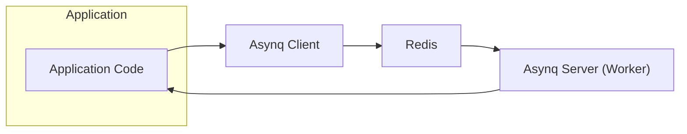

## High and Critical Asynq Threats

This document outlines high and critical threats that directly involve the `asynq` library.

### Architectural Overview (Mermaid)

### High and Critical Threats Directly Involving Asynq

*   **Threat:** Malicious Task Enqueueing
    *   **Description:** An attacker gains unauthorized access to the application's task enqueueing mechanism (directly interacting with the `Asynq Client` or exploiting a vulnerability that allows them to trigger enqueueing). They then enqueue tasks with malicious payloads or parameters, directly leveraging Asynq's functionality to introduce harmful tasks.
    *   **Impact:**  Can lead to resource exhaustion on workers, execution of malicious code within the application's context via task handlers, data corruption triggered by malicious task processing, or denial of service by overloading the system with harmful tasks.
    *   **Affected Asynq Component:** `Asynq Client` (specifically the enqueueing functions).
    *   **Risk Severity:** High
    *   **Mitigation Strategies:**
        *   Implement strong authentication and authorization for task enqueueing mechanisms, ensuring only legitimate parts of the application can enqueue tasks.
        *   Thoroughly validate and sanitize all input parameters before enqueuing tasks using the `Asynq Client`.
        *   Use allow-lists for allowed task types and parameters enforced at the enqueueing stage.
        *   Implement rate limiting on task enqueueing via the `Asynq Client` to prevent abuse.
        *   Monitor task enqueueing activity for suspicious patterns originating from or targeting the `Asynq Client`.

*   **Threat:** Task Data Manipulation in Redis (Impacting Asynq Processing)
    *   **Description:** An attacker gains unauthorized access to the Redis instance and modifies the data of enqueued tasks. While the access to Redis is the initial vulnerability, the impact is directly on how `Asynq Server (Worker)` processes these tampered tasks.
    *   **Impact:** Can lead to the execution of tasks with unintended and potentially harmful consequences by the `Asynq Server (Worker)`, data corruption within the application as a result of processing manipulated data, or the exploitation of vulnerabilities in task handlers due to altered input processed by the `Asynq Server (Worker)`.
    *   **Affected Asynq Component:** `Redis` (where task data is stored), `Asynq Server (Worker)` (processing the manipulated data).
    *   **Risk Severity:** Critical
    *   **Mitigation Strategies:**
        *   Implement strong authentication and authorization for Redis access (e.g., using `requirepass`), directly protecting the data `Asynq` relies on.
        *   Restrict network access to the Redis instance to only authorized hosts, preventing external manipulation of `Asynq`'s data store.
        *   Consider using TLS encryption for communication between `Asynq` components and Redis to protect data in transit.
        *   Implement integrity checks or signatures for task data to detect tampering before `Asynq Server (Worker)` processes them.

*   **Threat:** Poisoned Pill Tasks
    *   **Description:** An attacker enqueues a specially crafted task that, when processed by an `Asynq Server (Worker)`, causes the worker to crash, hang, or consume excessive resources. This directly targets the `Asynq` processing logic.
    *   **Impact:** Can lead to denial of service by crashing `Asynq Server (Worker)` processes, performance degradation of the task processing pipeline, and potentially impacting the processing of other legitimate tasks managed by `Asynq`.
    *   **Affected Asynq Component:** `Asynq Server (Worker)` (specifically the task handler functions).
    *   **Risk Severity:** High
    *   **Mitigation Strategies:**
        *   Implement robust error handling and input validation within task handlers to prevent crashes when processing potentially malicious tasks.
        *   Set resource limits (e.g., memory, CPU time) for `Asynq Server (Worker)` processes to contain the impact of resource-intensive tasks.
        *   Implement circuit breaker patterns within the `Asynq Server (Worker)` to prevent cascading failures due to problematic tasks.
        *   Use separate queues for tasks with varying levels of trust or complexity, isolating potentially risky tasks.
        *   Monitor `Asynq Server (Worker)` process health and resource consumption to detect and respond to poisoned pill attacks.

*   **Threat:** Exposure of Sensitive Data in Task Payloads
    *   **Description:** Task payloads processed by `Asynq Server (Worker)` contain sensitive information that is not properly encrypted or protected. An attacker gaining access to Redis or worker logs (related to `Asynq Server (Worker)` activity) can then read this sensitive data.
    *   **Impact:**  Leads to the disclosure of confidential information handled by the `Asynq` task processing system, potentially violating privacy regulations and causing reputational damage.
    *   **Affected Asynq Component:** `Redis` (where task payloads are stored), `Asynq Server (Worker)` (during processing and potentially in logs).
    *   **Risk Severity:** Critical
    *   **Mitigation Strategies:**
        *   Avoid storing sensitive data directly in task payloads processed by `Asynq` if possible.
        *   Encrypt sensitive data within task payloads before enqueueing using the `Asynq Client` and decrypt it within the `Asynq Server (Worker`.
        *   Secure access to Redis and logs generated by `Asynq Server (Worker` processes.
        *   Implement data masking or redaction in logs generated by `Asynq Server (Worker)`.

*   **Threat:** Queue Flooding (Denial of Service Targeting Asynq)
    *   **Description:** An attacker enqueues a massive number of tasks, legitimate or malicious, overwhelming the `Asynq Server (Worker)` processes and potentially the Redis instance used by `Asynq`. This directly targets the `Asynq` task processing capacity.
    *   **Impact:**  Leads to denial of service of the `Asynq` task processing system, making the application functionalities relying on asynchronous tasks unavailable.
    *   **Affected Asynq Component:** `Asynq Client` (used for enqueueing), `Asynq Server (Worker)` (overwhelmed by tasks), `Redis` (potential resource exhaustion impacting `Asynq`).
    *   **Risk Severity:** High
    *   **Mitigation Strategies:**
        *   Implement rate limiting on task enqueueing via the `Asynq Client`.
        *   Implement queue size limits and backpressure mechanisms within the `Asynq` configuration.
        *   Monitor queue lengths and `Asynq Server (Worker)` performance.
        *   Use priority queues within `Asynq` to ensure critical tasks are processed even under load.
        *   Implement authentication and authorization to prevent unauthorized enqueueing via the `Asynq Client`.

*   **Threat:** Exploiting Task Handler Vulnerabilities
    *   **Description:** Task handlers executed by `Asynq Server (Worker)` contain vulnerabilities (e.g., command injection, path traversal, insecure deserialization) that can be exploited by an attacker who can control the task payload or parameters processed by `Asynq`.
    *   **Impact:** Can lead to arbitrary code execution with the privileges of the `Asynq Server (Worker)` process, data breaches by accessing resources the worker has access to, or system compromise.
    *   **Affected Asynq Component:** `Asynq Server (Worker)` (specifically the task handler functions).
    *   **Risk Severity:** Critical
    *   **Mitigation Strategies:**
        *   Follow secure coding practices when developing task handlers executed by `Asynq Server (Worker)`.
        *   Thoroughly validate and sanitize all input received by task handlers within the `Asynq Server (Worker)`.
        *   Avoid using insecure deserialization techniques in task handlers.
        *   Regularly update dependencies used by the `Asynq Server (Worker` to patch known vulnerabilities.
        *   Conduct security code reviews and penetration testing of task handlers.
