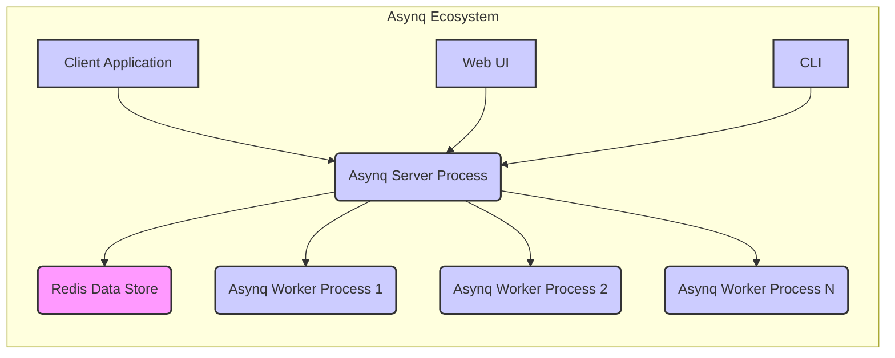
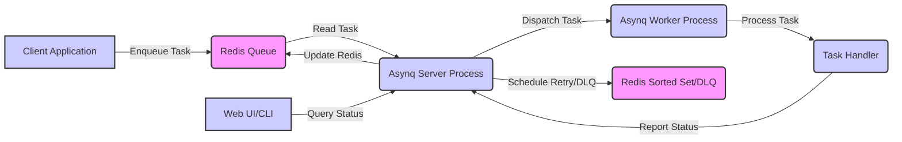

# Project Design Document: Asynq - Simple, Reliable, and Efficient Distributed Task Queue

**Version:** 1.1
**Date:** October 26, 2023
**Author:** AI Software Architect

## 1. Introduction

This document provides an enhanced architectural design for the Asynq project, a Go library for asynchronous task processing with Redis. This detailed document aims to provide a comprehensive understanding of the system's components, their interactions, and the flow of data, specifically tailored for effective threat modeling.

Asynq empowers developers to offload the execution of tasks, enabling background processing and deferred execution. Its key features include guaranteed task delivery, support for scheduled tasks, rate limiting capabilities, and a user-friendly web-based UI for monitoring and management.

## 2. Goals

The core design objectives of Asynq are:

* **Robust Reliability:** Guarantee that tasks are executed at least once, even in the presence of system failures or network issues.
* **High Efficiency:** Process tasks with minimal resource consumption and low latency to ensure responsiveness.
* **Developer Simplicity:** Offer an intuitive and easy-to-use API for defining, enqueuing, and processing asynchronous tasks.
* **Comprehensive Observability:** Provide robust tools and interfaces for monitoring the health, performance, and status of the task queue system.
* **Horizontal Scalability:**  Enable the system to handle increasing workloads by adding more workers and scaling the underlying Redis infrastructure.

## 3. High-Level Architecture

The Asynq system is architected around the following fundamental components:

* **Client Application:** The application code responsible for creating and submitting tasks to the Asynq system.
* **Asynq Server Process:** The central component that orchestrates the task queue, manages task distribution, and handles error scenarios.
* **Asynq Worker Process:**  Processes that consume and execute tasks dequeued from the server. Multiple workers can operate concurrently to increase throughput.
* **Redis Data Store:** The underlying in-memory data store used for persistent storage of tasks, queue management, and inter-process communication.
* **Optional Web UI:** A web-based graphical interface providing real-time monitoring and management capabilities for the Asynq system.
* **Optional Command Line Interface (CLI):** A command-line tool for interacting with the Asynq server for administrative tasks and monitoring.

## 4. Detailed Design

### 4.1. Client Application

* **Responsibilities:**
    * Defines the specific types of tasks that can be processed by the system, including the data payload associated with each task type.
    * Utilizes the Asynq client library to enqueue new tasks into the system.
    * Allows specifying various task options, such as the target queue, priority level, and desired execution time (for scheduled tasks).
* **Key Interactions:**
    * Transmits task definitions (type, payload, and options) to the Asynq Server Process, typically via communication with the Redis Data Store.
* **Security Considerations:**
    * **Payload Validation:**  Crucially, ensure rigorous validation of task payloads to prevent injection vulnerabilities or the processing of malformed data.
    * **Secure Redis Connection:** Establish and maintain a secure connection to the Redis Data Store, employing authentication and potentially encryption.

### 4.2. Asynq Server Process

* **Responsibilities:**
    * Continuously monitors Redis queues for newly enqueued tasks.
    * Manages multiple distinct task queues (e.g., "default", "critical", "low-priority").
    * Implements a task distribution mechanism to assign tasks to available worker processes based on queue and priority.
    * Handles task retry attempts in case of processing failures, adhering to configured retry policies.
    * Manages a Dead-Letter Queue (DLQ) for tasks that have exceeded their maximum retry attempts.
    * Schedules tasks for future execution based on specified delays or cron-like schedules.
    * Enforces rate limiting policies to control the processing rate of specific task types or queues.
    * Provides an API endpoint for the Web UI and CLI to retrieve system status and manage tasks.
* **Key Components:**
    * **Task Router:** Determines the appropriate queue for an incoming task based on its type and configuration.
    * **Scheduler:**  Manages the execution of tasks scheduled for a future time, leveraging Redis' sorted sets.
    * **Dispatcher:**  Selects and delivers tasks from the appropriate queues to idle worker processes.
    * **Retryer:**  Implements the logic for retrying failed tasks, including backoff strategies and maximum retry limits.
    * **Dead-Letter Queue (DLQ) Manager:**  Handles tasks that have failed permanently, potentially allowing for manual inspection or reprocessing.
    * **Rate Limiter:**  Controls the rate at which tasks are dequeued and processed, preventing overload.
    * **Metrics Collector:**  Gathers and exposes key performance indicators (KPIs) for monitoring the system's health and performance.
    * **API Server:** Provides a secure interface (e.g., HTTP) for the Web UI and CLI to interact with the server.
* **Key Interactions:**
    * Listens for new tasks added to Redis queues by client applications.
    * Writes and updates task metadata (e.g., retry counts, status) in the Redis Data Store.
    * Communicates with worker processes to deliver tasks for processing.
    * Serves data and accepts commands from the Web UI and CLI via its API.
* **Security Considerations:**
    * **API Authentication and Authorization:** Implement robust authentication and authorization mechanisms for the API server to restrict access to sensitive operations and data.
    * **Secure Redis Communication:** Ensure secure communication with the Redis Data Store, using authentication and potentially encryption (TLS).
    * **Resource Exhaustion Prevention:** Implement safeguards against resource exhaustion attacks, such as limiting the number of concurrent tasks or the size of task payloads.
    * **API Input Validation:**  Thoroughly validate all input received through the API to prevent injection attacks or unexpected behavior.

### 4.3. Asynq Worker Process

* **Responsibilities:**
    * Establishes a connection to the Asynq Server Process.
    * Receives tasks from the server that are ready for processing.
    * Executes the specific logic associated with the received task, as defined by the registered task handler.
    * Reports the outcome of task execution (success or failure) back to the Asynq Server Process.
* **Key Components:**
    * **Task Handler Registry:**  A mapping of task types to the corresponding functions or methods that will execute the task logic.
    * **Connection Manager:**  Manages the persistent connection to the Asynq Server Process.
* **Key Interactions:**
    * Receives task data and metadata from the Asynq Server Process.
    * Sends task completion status and any relevant output back to the Asynq Server Process.
* **Security Considerations:**
    * **Payload Handling Security:**  Handle task payloads securely, avoiding the execution of potentially malicious code embedded within the payload.
    * **Preventing Malicious Code Execution:** Implement safeguards to prevent the execution of untrusted or malicious code within the task handlers.
    * **Error Handling and Information Leaks:** Implement robust error handling to prevent the leakage of sensitive information in error messages or logs.

### 4.4. Redis Data Store

* **Responsibilities:**
    * Provides persistent storage for all tasks awaiting processing, including their associated data and metadata.
    * Acts as a message broker, facilitating communication between client applications, the server process, and worker processes.
    * Stores information about scheduled tasks, enabling the server to trigger them at the appropriate time.
    * Maintains data related to task retries, including retry counts and backoff information.
    * Stores data used for rate limiting, allowing the server to enforce processing limits.
* **Key Data Structures:**
    * **Queues (Redis Lists):** Store tasks that are ready to be processed, typically organized by priority or type.
    * **Sorted Sets:** Used for managing scheduled tasks, with the score representing the scheduled execution time. Also used for implementing delayed retries.
    * **Hashes:** Store metadata associated with individual tasks, such as retry counts, creation timestamps, and status.
    * **Sets:** Used for tracking active worker processes or other system-level information.
* **Key Interactions:**
    * Client applications write new tasks to Redis queues.
    * The Asynq Server Process reads tasks from Redis queues and updates task metadata.
    * The Asynq Server Process uses sorted sets for managing scheduled and retry tasks.
* **Security Considerations:**
    * **Access Control and Authentication:** Implement strong access control and authentication mechanisms for the Redis instance to prevent unauthorized access.
    * **Data Encryption:**  Consider encrypting data both in transit (using TLS) and at rest to protect sensitive task information.
    * **Denial-of-Service Protection:** Implement measures to protect the Redis instance from denial-of-service attacks that could disrupt the entire Asynq system.

### 4.5. Web UI

* **Responsibilities:**
    * Offers a visual interface for monitoring the state of task queues, including queue lengths and processing rates.
    * Displays information about active and completed worker processes.
    * Provides insights into server status and performance metrics.
    * May offer basic management capabilities, such as viewing task details or triggering manual retries.
* **Key Interactions:**
    * Communicates with the Asynq Server Process's API to retrieve data for display.
* **Security Considerations:**
    * **Authentication and Authorization:** Implement a robust authentication system to verify user identities and an authorization system to control access to specific features and data.
    * **Protection Against Web Vulnerabilities:**  Employ security best practices to protect against common web vulnerabilities such as Cross-Site Scripting (XSS) and Cross-Site Request Forgery (CSRF).
    * **Secure Communication (HTTPS):**  Enforce the use of HTTPS to encrypt communication between the user's browser and the Web UI.

### 4.6. CLI

* **Responsibilities:**
    * Provides command-line tools for interacting with the Asynq Server Process for administrative and monitoring purposes.
    * Allows for managing tasks (e.g., inspecting, retrying, deleting).
    * Enables the management of queues and server configuration.
* **Key Interactions:**
    * Communicates with the Asynq Server Process's API to execute commands and retrieve information.
* **Security Considerations:**
    * **Authentication and Authorization:**  Require authentication to use the CLI and implement authorization to restrict access to sensitive commands.
    * **Secure Credential Handling:**  Ensure that any credentials used by the CLI to authenticate with the server are handled securely and not exposed.

## 5. Data Flow

The typical lifecycle of a task within the Asynq system involves the following steps:

1. **Task Enqueueing:** The Client Application creates a new task with a specific type, payload, and optional parameters and sends it to the Asynq Server Process. This typically involves writing the task information to a designated Redis queue.
2. **Optional Task Scheduling:** If the task is scheduled for future execution, the Asynq Server Process stores it in a Redis sorted set, indexed by its scheduled execution time.
3. **Task Dispatching:** The Asynq Server Process continuously monitors the Redis queues. When a worker process is available and a task is ready for processing (either immediately or at its scheduled time), the server retrieves the task from the queue.
4. **Task Delivery:** The Asynq Server Process delivers the task details to an available Asynq Worker Process.
5. **Task Processing:** The Asynq Worker Process executes the task handler function associated with the task type, utilizing the provided payload.
6. **Task Completion Reporting:** Once the task processing is complete (either successfully or with an error), the Asynq Worker Process reports the outcome back to the Asynq Server Process.
7. **Retry or Dead-Letter Queue Handling:** If the task processing fails and retries are configured, the Asynq Server Process schedules a retry attempt by adding the task back to a Redis data structure (potentially a sorted set for delayed retries). If the maximum number of retry attempts is exceeded, the task is moved to the Dead-Letter Queue.
8. **Monitoring and Management:** The Web UI and CLI can query the Asynq Server Process (via its API) and directly access Redis to display the current status of tasks, queues, and worker processes.

## 6. Security Considerations (for Threat Modeling)

This section expands on the security considerations, providing more specific areas for threat modeling:

* **Authentication and Authorization:**
    * **Client Authentication:** How does the Asynq Server verify the identity of clients enqueueing tasks? Is it solely reliant on the security of the Redis connection?
    * **Web UI/CLI Authentication:** What authentication methods are used for the Web UI and CLI (e.g., API keys, username/password, OAuth)? How are user accounts managed?
    * **Role-Based Access Control (RBAC):** Are there different roles and permissions for users interacting with the Web UI and CLI? How is authorization enforced?
* **Data Security:**
    * **Payload Encryption:** Is task payload data encrypted in transit and at rest in Redis? What encryption mechanisms are used? How are encryption keys managed?
    * **Redis Security Configuration:** Is Redis configured with authentication (requirepass)? Are access controls (ACLs) used to restrict access to specific keys or commands?
    * **Data Sanitization:** Are there mechanisms to sanitize task data before processing or displaying it in the Web UI to prevent injection attacks?
* **Input Validation:**
    * **Task Payload Validation:**  Are task payloads validated on both the client and server sides? What validation rules are enforced? How are invalid payloads handled?
    * **API Input Validation:**  Is input to the Asynq Server API (from the Web UI and CLI) validated to prevent injection attacks and other vulnerabilities?
* **Communication Security:**
    * **TLS Encryption:** Is communication between clients, the server, workers, and Redis encrypted using TLS? How are TLS certificates managed?
* **Denial of Service (DoS):**
    * **Queue Overflow Protection:** How does the system prevent malicious actors from overwhelming the task queues with a large number of tasks? Are there queue size limits or backpressure mechanisms?
    * **Rate Limiting Configuration:** How is rate limiting configured and enforced? Can it be bypassed?
    * **Resource Limits:** Are there resource limits in place for the server and worker processes to prevent resource exhaustion?
* **Code Injection:**
    * **Task Handler Sandboxing:** Are there any sandboxing or isolation mechanisms in place for task handlers to prevent them from accessing sensitive resources or executing arbitrary code?
    * **Dependency Management:** How are dependencies of task handlers managed to prevent the introduction of vulnerable libraries?
* **Secrets Management:**
    * **Credential Storage:** How are sensitive credentials (e.g., Redis passwords, API keys, database credentials used within task handlers) stored and managed securely? Are secrets stored in environment variables, dedicated secret management systems, or other methods?
* **Web UI Security:**
    * **XSS and CSRF Protection:** What measures are in place to prevent Cross-Site Scripting (XSS) and Cross-Site Request Forgery (CSRF) attacks in the Web UI?
    * **Content Security Policy (CSP):** Is a Content Security Policy implemented to mitigate XSS attacks?
    * **Regular Security Audits:** Are regular security audits or penetration testing performed on the Web UI?
* **CLI Security:**
    * **Command Injection Prevention:** Are there safeguards in place to prevent command injection vulnerabilities in the CLI?
    * **Secure Output Handling:** Is sensitive information handled securely when displayed in the CLI output?

## 7. Deployment Considerations

* **Deployment Environment:** Asynq requires a running Redis instance. The server and worker processes can be deployed on various infrastructure options, including virtual machines, containerized environments (e.g., Docker, Kubernetes), or serverless platforms.
* **Scalability Strategies:** Horizontal scaling can be achieved by increasing the number of worker processes. Redis can also be scaled through techniques like clustering or replication.
* **Monitoring and Logging:** Integration with monitoring tools (e.g., Prometheus, Grafana, Datadog) is essential for real-time visibility into system health and performance. Comprehensive logging is crucial for troubleshooting and security analysis.
* **Configuration Management:** Secure and reliable configuration management is important for managing Redis connection details, concurrency limits, retry policies, and other sensitive parameters. Consider using environment variables or dedicated configuration management tools.

## 8. Future Considerations

* **Enhanced Monitoring and Observability:** Implementing distributed tracing to track tasks across different components, providing more granular performance metrics, and adding alerting capabilities.
* **Advanced Queue Prioritization:** Implementing more sophisticated mechanisms for prioritizing tasks within queues, potentially based on dynamic factors or custom logic.
* **Workflow Orchestration:** Adding support for defining and managing complex, multi-step task workflows with dependencies and conditional execution.
* **Integration with External Systems:** Providing easier integration with other messaging systems (e.g., Kafka, RabbitMQ) or databases.
* **Pluggable Authentication/Authorization:**  Allowing developers to integrate custom authentication and authorization providers for the Web UI and CLI.

This enhanced design document provides a more detailed and comprehensive understanding of the Asynq project's architecture, specifically tailored for thorough threat modeling and future development planning. By carefully considering the components, interactions, data flow, and security considerations outlined here, developers and security professionals can better assess and mitigate potential risks.