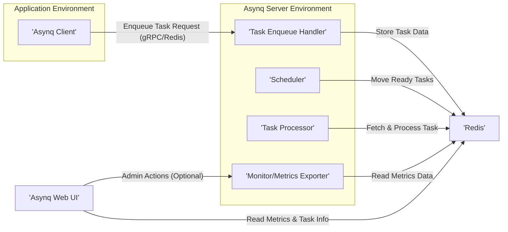
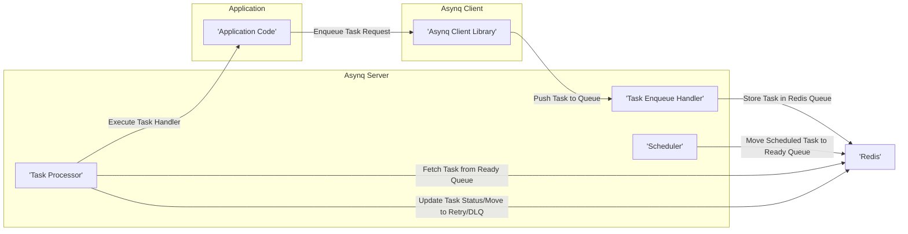

# Project Design Document: Asynq Distributed Task Queue

**Version:** 1.1
**Date:** October 26, 2023
**Author:** AI Software Architect

## 1. Introduction

This document provides a detailed design overview of the Asynq distributed task queue project (https://github.com/hibiken/asynq). This document serves as a foundation for subsequent threat modeling activities. It outlines the system's architecture, components, data flow, and deployment considerations.

### 1.1. Purpose

The primary purpose of this document is to provide a comprehensive understanding of the Asynq system's design to facilitate effective threat modeling. It aims to clearly articulate the system's boundaries, components, and interactions, enabling security professionals to identify potential vulnerabilities and attack vectors.

### 1.2. Scope

This document covers the core architecture and functionality of the Asynq task queue system. It focuses on the key components involved in task enqueueing, processing, and monitoring. It includes:

*   The Asynq client library and its interaction patterns.
*   The Asynq server, detailing its internal modules and responsibilities.
*   The underlying Redis data store and its specific usage within Asynq.
*   The optional Asynq Web UI and its interaction with the system.

This document does not cover:

*   Specific implementation details within the Go codebase beyond architectural relevance.
*   Detailed configuration options beyond the core architectural elements and their security implications.
*   Third-party integrations beyond the core Redis dependency, unless they are integral to the documented architecture.

### 1.3. Goals of Asynq

Asynq aims to provide a reliable and efficient way to execute tasks asynchronously. Key goals include:

*   **Reliable Task Delivery:** Ensuring tasks are processed even in the face of component failures or network issues.
*   **At-Least-Once Delivery Guarantee:** Guaranteeing that each task is processed at least once, acknowledging the possibility of duplicate processing in rare scenarios.
*   **Scalability and Performance:**  Ability to handle a large volume of tasks with low latency.
*   **Observability and Monitoring:** Providing comprehensive insights into the state of the task queue, including metrics and task status.
*   **Developer Simplicity and Ease of Use:** Offering a straightforward and intuitive API for developers to integrate asynchronous task processing into their applications.

## 2. System Overview

Asynq is a robust distributed task queue built in Go and backed by Redis. It enables applications to enqueue tasks that will be processed asynchronously by worker processes, decoupling task creation from execution.

### 2.1. High-Level Architecture

### 2.2. Key Components

*   **Asynq Client:** A library integrated into applications to enqueue tasks. It handles serialization and communication with the Asynq server (typically via Redis).
*   **Asynq Server:** The core processing engine responsible for managing the task lifecycle. It comprises several key modules:
    *   **Task Enqueue Handler:** Receives task enqueue requests from clients, validates them, and persists tasks to Redis.
    *   **Task Processor:**  Fetches tasks from Redis queues, deserializes them, and executes the corresponding task handlers.
    *   **Scheduler:**  Manages tasks scheduled for future execution, moving them to the ready queue at the designated time.
    *   **Monitor/Metrics Exporter:** Collects and exposes metrics about the task queue's performance and health, often making them available through Redis or an internal API.
*   **Redis:**  The central message broker and persistent data store for Asynq. It utilizes various data structures to manage queues, scheduled tasks, and metadata.
*   **Asynq Web UI (Optional):** A web-based interface providing a visual representation of the task queue's state, allowing for monitoring and potentially administrative actions.

## 3. Component Details

### 3.1. Asynq Client

*   **Responsibilities:**
    *   Creating and configuring task objects, including specifying the task type, payload, and execution options.
    *   Serializing task payloads into a byte stream (often using a format like Protocol Buffers or JSON).
    *   Establishing a connection to Redis (or potentially directly to the Asynq server in some configurations).
    *   Sending task enqueue requests to the Asynq server, typically by pushing data onto specific Redis lists or using Redis commands.
*   **Key Functionalities:**
    *   `Enqueue`:  Adds a task to the default queue for immediate processing.
    *   `EnqueueIn`: Adds a task to the default queue with a specified delay before it becomes eligible for processing.
    *   `EnqueueAt`: Adds a task to the default queue to be processed at a specific future timestamp.
    *   Support for setting task priorities, influencing the order in which tasks are processed.
    *   Configuration options for retry behavior, deadlines, and timeouts.
*   **Data Handled:**
    *   **Task Payload:** The application-specific data associated with the task, which needs to be serialized and deserialized.
    *   **Task Type:** A string identifier that maps the task to a specific handler function within the Asynq server.
    *   **Queue Name:**  Specifies the queue to which the task should be added (allowing for task categorization).
    *   **Task Options:** Configuration parameters like retry limits, execution deadlines, and queue-specific settings.

### 3.2. Asynq Server

*   **Responsibilities:**
    *   Receiving and validating incoming task enqueue requests from clients.
    *   Persistently storing task data and metadata in Redis.
    *   Fetching tasks from Redis queues based on availability and priority.
    *   Deserializing task payloads.
    *   Executing the appropriate task handler function based on the task type.
    *   Managing task retries, including implementing backoff strategies and moving failed tasks to retry queues.
    *   Handling task deadlines and timeouts.
    *   Moving tasks that exceed retry limits to a dead-letter queue for manual inspection or handling.
    *   Collecting and exposing metrics related to queue health, processing rates, and error counts.
*   **Key Functionalities:**
    *   Listening for new tasks on designated Redis queues using blocking pop operations (e.g., `BRPOP`).
    *   Polling Redis sorted sets for tasks scheduled for future execution.
    *   Invoking registered task handler functions based on the `task type` associated with each task.
    *   Managing concurrent task processing using worker pools or similar mechanisms.
    *   Implementing retry logic based on task-specific configurations.
    *   Providing an interface (often through Redis or an internal HTTP endpoint) for monitoring and potentially administrative actions.
*   **Sub-components:**
    *   **Task Enqueue Handler:**
        *   Receives task enqueue requests, potentially over a network protocol or directly via Redis commands.
        *   Performs basic validation of the task data (e.g., ensuring required fields are present).
        *   Serializes the task payload into a byte format suitable for storage in Redis.
        *   Pushes the serialized task data and metadata onto the appropriate Redis list representing the task queue.
    *   **Task Processor:**
        *   Continuously monitors Redis queues for available tasks using blocking pop operations.
        *   Retrieves tasks from the queue when they become available.
        *   Deserializes the task payload back into its original data structure.
        *   Looks up the registered task handler function based on the task's `type`.
        *   Executes the task handler function, passing the deserialized payload as an argument.
        *   Handles potential errors during task execution, triggering retry mechanisms or moving the task to the dead-letter queue.
    *   **Scheduler:**
        *   Monitors a Redis sorted set that stores tasks scheduled for future execution, using timestamps as the score.
        *   Periodically checks the sorted set for tasks whose scheduled time has arrived.
        *   Moves these ready tasks from the scheduled set to the appropriate ready queue in Redis.
    *   **Monitor/Metrics Exporter:**
        *   Collects real-time metrics from Redis, such as queue lengths, processing rates, error counts, and latency.
        *   Aggregates and potentially transforms these metrics.
        *   Exposes these metrics through various channels, such as storing them in Redis for the Web UI to consume or providing an HTTP endpoint for monitoring systems.
*   **Data Handled:**
    *   Raw task data received from clients.
    *   Serialized task payloads in various formats.
    *   Task metadata, including status, retry counts, error messages, timestamps, and queue assignments.
    *   Metrics data related to queue performance and health.

### 3.3. Redis

*   **Responsibilities:**
    *   Serving as the primary persistent storage for all task-related data.
    *   Acting as the message broker, facilitating communication between the Asynq client and server.
    *   Providing the necessary data structures for efficient queue management, scheduling, and tracking.
*   **Key Functionalities:**
    *   Storing enqueued tasks in Redis lists, with each list representing a specific queue.
    *   Storing scheduled tasks in Redis sorted sets, using the scheduled execution time as the score for ordering.
    *   Potentially using separate Redis lists or sets to track tasks currently being processed.
    *   Storing tasks that have exceeded their retry limits in a dedicated dead-letter queue (often a Redis list).
    *   Providing atomic operations (e.g., `LPUSH`, `BRPOP`, `ZADD`, `ZREM`) crucial for reliable queue management.
    *   Potentially used for storing metrics data collected by the Asynq server.
*   **Data Stored:**
    *   Serialized task payloads.
    *   Task metadata, such as retry counts, error details, and timestamps.
    *   Queue names and potentially queue-specific configurations.
    *   Data for the dead-letter queue.
    *   Potentially metrics data related to queue performance.

### 3.4. Asynq Web UI

*   **Responsibilities:**
    *   Providing a user-friendly web interface for monitoring the status and health of the Asynq task queue.
    *   Displaying real-time statistics about queue lengths, processing rates, and error trends.
    *   Allowing users to inspect individual tasks, view their payloads, status, and any associated error messages.
    *   Potentially offering administrative capabilities, such as retrying failed tasks or moving tasks between queues.
*   **Key Functionalities:**
    *   Connecting to Redis to retrieve task metadata and queue statistics.
    *   Potentially interacting with the Asynq server's monitoring API (if one exists) to fetch metrics.
    *   Presenting data in a clear and organized manner through dashboards and tables.
    *   Implementing user authentication and authorization to control access to sensitive information and administrative functions.
*   **Data Handled:**
    *   Task metadata retrieved from Redis (e.g., status, payload snippets, error details).
    *   Aggregated queue statistics fetched from Redis or the Asynq server.
    *   User credentials for authentication and authorization purposes.

## 4. Data Flow

The typical data flow for processing a task within Asynq involves several key stages:

1. **Task Enqueue:**
    *   The application code utilizes the Asynq client library to create and enqueue a new task, specifying its type and payload.
    *   The Asynq client serializes the task payload and sends an enqueue request to the Asynq server. This communication often happens by pushing data onto a specific Redis list or using Redis commands.
    *   The Asynq server's Task Enqueue Handler receives the enqueue request.
    *   The handler validates the request and stores the serialized task data and associated metadata in the appropriate Redis queue (a list).

2. **Task Scheduling (if applicable):**
    *   If the task is scheduled for future execution (using `EnqueueIn` or `EnqueueAt`), the Task Enqueue Handler stores it in a Redis sorted set. The score in the sorted set is the timestamp at which the task should become available for processing.
    *   The Asynq Server's Scheduler periodically checks the Redis sorted set for tasks whose scheduled time has arrived.
    *   When a task's scheduled time is reached, the Scheduler moves the task from the sorted set to the appropriate ready queue (a Redis list).

3. **Task Processing:**
    *   The Asynq Server's Task Processor continuously monitors the ready queues in Redis using blocking pop operations (e.g., `BRPOP`).
    *   When a task is available in a queue, the processor retrieves it from Redis.
    *   The processor deserializes the task payload back into its original data structure.
    *   The processor uses the task's `type` to identify the corresponding task handler function that has been registered with the server.
    *   The processor executes the identified task handler function, passing the deserialized payload as an argument.

4. **Task Completion/Failure and Retries:**
    *   If the task handler executes successfully, the processor acknowledges the task's completion, and the task is effectively removed from the in-progress state (this might involve removing it from a temporary processing list in Redis or simply not retrying it).
    *   If the task handler encounters an error during execution, the processor checks the task's retry configuration.
    *   If retries are allowed, the task might be moved to a retry queue in Redis (potentially with a delay implemented using a sorted set). The retry attempt count is typically incremented.
    *   If the task exceeds its maximum retry attempts, it is moved to a dead-letter queue in Redis for manual inspection and potential resolution.

5. **Monitoring and Observability:**
    *   The Asynq Server's Monitor component periodically collects metrics from Redis, such as the lengths of various queues, processing rates, and error counts.
    *   The Asynq Web UI (or other monitoring tools) can connect to Redis or the Asynq server's metrics endpoint to retrieve and display these metrics, providing insights into the system's health and performance.

## 5. Deployment Architecture

A typical deployment of Asynq involves several key components working together:

*   **Application Instances:**  One or more instances of the application that enqueue tasks using the Asynq client library. These instances are responsible for defining and triggering asynchronous work.
*   **Asynq Server Instances (Workers):** One or more instances of the Asynq server process. These are the worker processes that consume and process tasks from the Redis queues. Horizontal scaling can be achieved by adding more server instances.
*   **Redis Instance or Cluster:** A dedicated Redis instance or a Redis cluster is essential for Asynq. Redis acts as the message broker and persistent storage for tasks. For production environments, a resilient and highly available Redis setup is crucial.
*   **Asynq Web UI Instance (Optional):** An instance of the Asynq Web UI, which provides a visual interface for monitoring the task queue. This component connects to Redis to retrieve and display information.

Common deployment scenarios include:

*   **Single Server Deployment:** All components (application, Asynq server, Redis) running on a single server. This is suitable for development or very low-traffic environments.
*   **Containerized Deployment (Docker, Kubernetes):** Each component is packaged as a Docker container and orchestrated using Kubernetes or a similar container orchestration platform. This allows for easy scaling, management, and deployment across different environments.
*   **Cloud-Based Deployment (AWS, Azure, GCP):** Leveraging cloud services such as managed Redis offerings (e.g., AWS ElastiCache, Azure Cache for Redis, Google Cloud Memorystore), container services (e.g., AWS ECS/EKS, Azure Container Instances/AKS, Google Kubernetes Engine), and virtual machines to deploy and manage the Asynq infrastructure.

## 6. Security Considerations (For Threat Modeling)

This section outlines key security considerations relevant for threat modeling the Asynq system.

*   **Communication Security:**
    *   **Redis Connection Security:** Is the connection between Asynq clients, servers, and the Web UI to Redis secured using TLS/SSL to prevent eavesdropping and man-in-the-middle attacks?
    *   **Web UI Communication:** If the Asynq Web UI communicates with the Asynq server (e.g., for administrative actions), is this communication secured (e.g., HTTPS)?
*   **Authentication and Authorization:**
    *   **Redis Authentication:** Is Redis protected with a strong password or authentication mechanism to prevent unauthorized access to task data and queue management?
    *   **Asynq Server Authentication (Enqueue):** Does the Asynq server implement any authentication or authorization mechanisms to verify the identity of clients enqueueing tasks and control which clients can enqueue which types of tasks?
    *   **Web UI Authentication and Authorization:** Does the Asynq Web UI require user authentication? Are there different roles and permissions to control access to monitoring data and administrative functions?
*   **Data Security:**
    *   **Task Payload Encryption:** Is sensitive data within task payloads encrypted at rest in Redis to protect confidentiality in case of unauthorized access to the Redis database?
    *   **Data Integrity:** Are there mechanisms to ensure the integrity of task data stored in Redis, preventing tampering or corruption?
*   **Input Validation and Sanitization:**
    *   **Task Payload Validation:** Does the Asynq server validate task payloads to prevent injection attacks (e.g., SQL injection if payloads are used in database queries) or other forms of malicious input?
    *   **Web UI Input Sanitization:** Does the Asynq Web UI sanitize user inputs to prevent cross-site scripting (XSS) attacks?
*   **Denial of Service (DoS) and Resource Exhaustion:**
    *   **Queue Limits and Rate Limiting:** Are there mechanisms in place to limit the size of queues or the rate at which tasks can be enqueued to prevent malicious actors from overwhelming the system?
    *   **Task Resource Limits:** Are there safeguards to prevent the execution of excessively large or computationally intensive tasks that could consume excessive resources and impact other tasks?
*   **Dependency Security:**
    *   **Vulnerability Management:** Are the dependencies used by Asynq and its components regularly scanned for known vulnerabilities, and are updates applied promptly?
*   **Web UI Security Best Practices:**
    *   **Common Web Vulnerabilities:** Is the Asynq Web UI protected against common web application vulnerabilities such as CSRF, injection flaws, and insecure authentication/authorization?

## 7. Future Considerations

Potential future enhancements to Asynq that could impact its architecture and security posture include:

*   **Support for Multiple Message Brokers:** Expanding beyond Redis to support other message queue systems like RabbitMQ or Kafka, which might introduce new security considerations specific to those technologies.
*   **Enhanced Monitoring and Observability:** Implementing more detailed metrics, distributed tracing capabilities, and integration with monitoring platforms, potentially exposing new endpoints or data sources that need to be secured.
*   **More Granular Task Routing and Prioritization:** Introducing more complex mechanisms for routing tasks to specific workers or queues based on attributes, which might require more sophisticated authorization controls.
*   **Built-in Support for Distributed Tracing:** Integrating with distributed tracing systems like Jaeger or OpenTelemetry to provide better insights into task execution flow, which could involve transmitting sensitive data that needs to be protected.
*   **Improved Security Features:**  Directly incorporating features like payload encryption or more robust authentication mechanisms within the Asynq server itself.

This improved design document provides a more detailed and comprehensive overview of the Asynq project, making it even more suitable for effective threat modeling. The enhanced diagrams, expanded component descriptions, and more specific security considerations offer a clearer understanding of the system's architecture and potential attack surfaces.