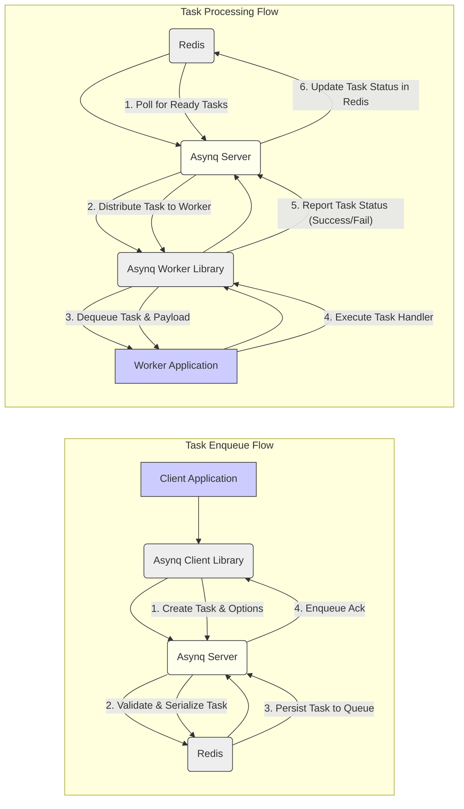

Okay, I will improve the design document for Asynq based on your feedback and focusing on clarity, completeness, and security aspects.

Here is the improved version:

```markdown
## Project Design Document: Asynq - Distributed Task Queue (Improved)

**Project Name:** Asynq

**Project Repository:** [https://github.com/hibiken/asynq](https://github.com/hibiken/asynq)

**Version:** 1.1 (Improved Design Document - October 26, 2023)

**Document Version:** 1.1

**Author:** Gemini (AI Assistant)

**Date:** October 26, 2023

**1. Introduction**

Asynq is a robust and efficient distributed task queue system written in Go. It simplifies the process of offloading background tasks and asynchronous operations from your main application, enhancing responsiveness and scalability. Leveraging Redis as its message broker and persistent storage, Asynq guarantees at-least-once task delivery and provides a rich set of features for task management, scheduling, prioritization, and monitoring. This document provides a detailed design overview of Asynq, intended to serve as a foundation for threat modeling and security assessments.

**2. System Overview**

Asynq is designed as a distributed system with four primary components working in concert:

*   **Client:** Applications use the client library to enqueue tasks into Asynq.
*   **Server:** The core component responsible for managing task queues, scheduling, and dispatching tasks to workers.
*   **Worker:**  Executes the application-defined task handlers, processing tasks dequeued from the server.
*   **Redis:**  The persistent data store and message broker, crucial for queue management, task persistence, and inter-component communication.

**3. System Architecture**

The following diagram illustrates the refined architecture of Asynq, highlighting the interactions between components:

```mermaid
graph LR
    subgraph "Application Environment"
        "Client Application" -->|"Enqueue Task Request"| "Asynq Client Library"
        "Worker Application" -->|"Task Processing Logic"| "Asynq Worker Library"
    end
    "Asynq Client Library" -->|"Enqueue Task"| "Asynq Server"
    "Asynq Worker Library" -->|"Dequeue Task & Report Status"| "Asynq Server"
    "Asynq Server" -->|"Queue Operations & Persistence"| "Redis"

    style "Application Environment" fill:#f9f,stroke:#333,stroke-width:2px
```

**3.1. Component Description (Detailed)**

*   **3.1.1. Client Application & Asynq Client Library**
    *   **Functionality:**  The Client Application initiates background tasks by interacting with the Asynq Client Library. The library provides an API to create and enqueue tasks.
    *   **Responsibilities:**
        *   **Task Definition:** Defining task types and associated payloads (data for processing).
        *   **Task Options:** Configuring task properties such as priority, delays, deadlines, retry strategies, and queue names.
        *   **Enqueueing Tasks:** Using the client library to send task enqueue requests to the Asynq Server.
        *   **Error Handling (Enqueue):** Managing potential errors during task enqueue operations (e.g., network issues, server unavailability).
    *   **Technology:** Go programming language (Asynq client library), Application-specific code.

*   **3.1.2. Asynq Server (Core Orchestrator)**
    *   **Functionality:** The central processing unit of Asynq. It manages task queues, schedules tasks, distributes them to workers, and monitors system health.
    *   **Responsibilities:**
        *   **Task Reception:** Receiving task enqueue requests from clients.
        *   **Queue Management:** Maintaining various Redis queues (e.g., pending, active, scheduled, retry, dead-letter).
        *   **Task Scheduling:** Scheduling tasks for delayed execution or recurring execution based on cron expressions.
        *   **Task Distribution:** Dispatching tasks to available and appropriate workers based on task type and worker capabilities.
        *   **Task Lifecycle Management:** Tracking task status (pending, processing, completed, failed, retrying, dead-lettered).
        *   **Retry Mechanism:** Implementing task retry policies based on configured parameters.
        *   **Dead-Letter Queue (DLQ):**  Moving tasks to the DLQ after exceeding retry limits for investigation and potential manual intervention.
        *   **Worker Heartbeat Monitoring:**  Monitoring worker health and availability through heartbeat signals.
        *   **Metrics and Monitoring:** Exposing metrics for queue lengths, task processing rates, and error rates for system observability.
    *   **Technology:** Go programming language (Asynq server application), Redis.

*   **3.1.3. Worker Application & Asynq Worker Library**
    *   **Functionality:** The Worker Application contains the business logic for processing tasks. It utilizes the Asynq Worker Library to connect to the server, receive tasks, and execute task handlers.
    *   **Responsibilities:**
        *   **Task Handler Registration:** Registering functions (task handlers) with the worker library to process specific task types.
        *   **Worker Initialization:** Connecting to the Asynq Server and starting the worker process.
        *   **Task Dequeueing:** Receiving tasks from the server via the worker library.
        *   **Task Processing:** Executing the registered task handler with the task payload.
        *   **Result Reporting:** Reporting task completion status (success or failure) and any errors back to the server through the worker library.
        *   **Error Handling (Processing):** Implementing robust error handling within task handlers to manage failures gracefully and potentially trigger retries.
    *   **Technology:** Go programming language (Asynq worker library), Application-specific task handler code.

*   **3.1.4. Redis (Data Store & Broker)**
    *   **Functionality:** Provides persistent storage for task queues, task metadata, and facilitates communication and coordination between the Asynq Server and Workers.
    *   **Responsibilities:**
        *   **Persistent Queue Storage:** Storing task queues (pending, active, scheduled, retry, dead-letter) ensuring task durability even in case of server restarts.
        *   **Atomic Operations:** Providing atomic operations (e.g., `RPOPLPUSH`, `LPUSH`) for reliable queue management and task distribution.
        *   **Pub/Sub (or Streams):**  Facilitating communication between the server and workers for task distribution and worker monitoring (potentially using Redis Streams for more robust features).
        *   **Data Persistence:** Ensuring data persistence through Redis configuration (e.g., RDB snapshots, AOF).
    *   **Technology:** Redis (in-memory data structure store with persistence options).

**4. Detailed Data Flow**

The following diagram provides a more granular view of the data flow for both task enqueueing and processing:



**Detailed Data Flow Steps (Refined):**

**Task Enqueue Flow:**

1.  **Client Application** uses the **Asynq Client Library** to create a task object, defining task type, payload, and options.
2.  **Asynq Client Library** sends the task data to the **Asynq Server**.
3.  **Asynq Server** receives the enqueue request, validates the task, serializes the task payload, and determines the target queue based on task type and options.
4.  **Asynq Server** persists the serialized task data into the appropriate queue in **Redis**.
5.  **Redis** confirms successful persistence to the **Asynq Server**.
6.  **Asynq Server** sends an "Enqueue Acknowledgement" back to the **Asynq Client Library**.

**Task Processing Flow:**

1.  **Asynq Server** continuously polls **Redis** queues for tasks that are ready for processing (e.g., pending tasks, scheduled tasks whose time has arrived).
2.  **Asynq Server** selects a ready task and, based on task type and available workers, distributes the task to an appropriate **Asynq Worker Library** instance.
3.  **Asynq Worker Library** dequeues the task from the server and deserializes the task payload.
4.  **Asynq Worker Library** passes the task payload to the registered task handler within the **Worker Application**.
5.  **Worker Application** executes the task handler, performing the defined task logic.
6.  **Worker Application** returns the task processing result (success or failure, along with any error details) to the **Asynq Worker Library**.
7.  **Asynq Worker Library** reports the task status back to the **Asynq Server**.
8.  **Asynq Server** updates the task status in **Redis**, marking it as completed, failed, retrying, or moving it to the dead-letter queue as necessary.

**5. Security Considerations & Threat Mitigation Strategies**

This section expands on security considerations and provides potential mitigation strategies for each area.

*   **5.1. Redis Security - Hardening the Data Store**
    *   **Threat:** Unauthorized access to Redis could lead to data breaches, manipulation of task queues, and denial of service.
    *   **Mitigation:**
        *   **Strong Authentication (`requirepass`):**  Enable and enforce strong passwords for Redis authentication.
        *   **Network Segmentation:** Restrict network access to Redis only from authorized Asynq Server and Worker instances. Use firewalls or network policies.
        *   **Disable Dangerous Commands:**  Disable potentially dangerous Redis commands (e.g., `FLUSHALL`, `CONFIG`, `EVAL`) using `rename-command` in `redis.conf`.
        *   **TLS Encryption (Redis TLS or Stunnel):** Encrypt communication between Asynq components and Redis using TLS to protect data in transit.
        *   **Regular Security Audits & Updates:** Regularly audit Redis configurations and apply security patches to address known vulnerabilities.
        *   **Principle of Least Privilege:**  If possible, configure Redis user accounts with minimal necessary permissions.

*   **5.2. Task Payload Security - Protecting Sensitive Data**
    *   **Threat:** Exposure of sensitive data within task payloads if Redis is compromised or during transit.
    *   **Mitigation:**
        *   **Payload Encryption (Application-Level):** Encrypt sensitive data within task payloads *before* enqueuing using application-level encryption libraries. Decrypt within the worker handler.
        *   **Data Minimization:** Avoid including sensitive data in task payloads if possible. Use identifiers to retrieve sensitive data from secure data stores within the worker handler.
        *   **Secure Serialization:** Use secure serialization formats for task payloads to prevent deserialization vulnerabilities.
        *   **Audit Logging of Payload Access:** Log access to task payloads for auditing and monitoring purposes.

*   **5.3. Worker Security - Securing Task Execution Environment**
    *   **Threat:** Malicious or vulnerable task handlers could compromise worker systems or lead to privilege escalation.
    *   **Mitigation:**
        *   **Secure Task Handler Development:**  Follow secure coding practices when developing task handlers. Implement robust input validation, output encoding, and error handling.
        *   **Sandboxing/Isolation (Containers/VMs):**  Run workers in isolated environments like containers or virtual machines to limit the impact of compromised handlers.
        *   **Resource Limits (Worker Processes):**  Enforce resource limits (CPU, memory, file descriptors) on worker processes to prevent resource exhaustion and DoS.
        *   **Principle of Least Privilege (Worker Processes):** Run worker processes with minimal necessary privileges.
        *   **Code Reviews & Security Testing:** Conduct thorough code reviews and security testing of task handlers to identify and remediate vulnerabilities.
        *   **Dependency Management:**  Carefully manage worker dependencies and keep them updated to address known vulnerabilities.

*   **5.4. Queue Security - Preventing Queue Manipulation & DoS**
    *   **Threat:** Unauthorized enqueueing of tasks, queue flooding (DoS), or manipulation of task queues.
    *   **Mitigation:**
        *   **Client Authentication/Authorization:** Implement authentication and authorization mechanisms for clients enqueueing tasks. This can be application-level or potentially integrated with Asynq server if future features allow.
        *   **Rate Limiting (Enqueue Requests):** Implement rate limiting on task enqueue requests to prevent DoS attacks.
        *   **Queue Size Limits:** Configure queue size limits to prevent unbounded queue growth and resource exhaustion.
        *   **Input Validation (Enqueue):** Validate task types and payload structure on the server-side during enqueue to prevent injection attacks.
        *   **Network Access Control (Client to Server):** Restrict network access to the Asynq Server's enqueue endpoints to authorized client applications.

*   **5.5. Monitoring, Logging, and Auditing - Security Visibility**
    *   **Threat:** Lack of visibility into system behavior can hinder security incident detection and response.
    *   **Mitigation:**
        *   **Comprehensive Logging:** Log all significant events in Asynq Server and Workers, including task enqueueing, processing, failures, retries, and errors. Include relevant context (task type, task ID, worker ID).
        *   **Centralized Logging:** Aggregate logs from all Asynq components into a centralized logging system for easier analysis and correlation.
        *   **Real-time Monitoring & Alerting:** Implement real-time monitoring of key metrics (queue lengths, processing rates, error rates, worker health). Set up alerts for anomalies or security-related events.
        *   **Security Auditing:** Regularly review logs and monitoring data for security incidents, suspicious activity, and potential vulnerabilities.

**6. Deployment Considerations (Scalability & High Availability)**

*   **Scalability:**
    *   **Horizontal Scaling of Workers:** Asynq is designed for horizontal scaling. Increase task processing capacity by adding more worker instances. Workers can be scaled independently based on task load and queue lengths.
    *   **Redis Scalability:** Redis can be scaled using clustering or replication to handle increased load and data volume. Consider Redis Cluster for large-scale deployments.
    *   **Stateless Server:** Asynq Server is designed to be relatively stateless (state is primarily in Redis), allowing for easier horizontal scaling of the server if needed (though typically a single server instance is sufficient for many use cases).

*   **High Availability (HA):**
    *   **Redis HA:**  Implement Redis replication or Redis Sentinel/Cluster for high availability of the Redis data store. This is critical for Asynq's reliability.
    *   **Multiple Asynq Server Instances (Redundancy):** While not strictly necessary for basic HA, deploying multiple Asynq Server instances behind a load balancer can provide redundancy and improved fault tolerance in case of server failures.  Consider leader election mechanisms if active-active server setup is desired.
    *   **Worker Redundancy:** Deploy multiple worker instances for each task type to ensure that tasks are processed even if some workers fail.
    *   **Monitoring & Alerting (Proactive Failure Detection):** Implement robust monitoring and alerting to detect failures in any component (Redis, Server, Workers) and trigger automated or manual failover/recovery procedures.

**7. Technology Stack**

*   **Programming Language:** Go (for Asynq Server, Client, and Worker libraries)
*   **Data Store / Message Broker:** Redis
*   **Operating System:** Linux (or any OS supported by Go and Redis) - Containerization (Docker, Kubernetes) is highly recommended for deployment.
*   **Networking:** TCP/IP

**8. Future Security Enhancements (Roadmap Considerations)**

*   **Built-in Authentication/Authorization:** Explore adding built-in authentication and authorization mechanisms within Asynq for clients and workers, potentially using API keys, JWT, or similar methods.
*   **End-to-End Encryption:** Investigate and potentially implement end-to-end encryption for communication between all Asynq components (Client-Server, Server-Worker, Server-Redis), enhancing data confidentiality in transit.
*   **Task Payload Encryption at Rest (Built-in):**  Provide built-in support for encrypting task payloads stored in Redis, with options for key management integration (e.g., HashiCorp Vault, AWS KMS).
*   **Enhanced Rate Limiting & DoS Protection:**  Implement more advanced rate limiting and DoS protection features, potentially with configurable thresholds and dynamic adjustments.
*   **Security Auditing Features:**  Enhance auditing capabilities to provide more detailed and configurable security logs for compliance and incident investigation.

This improved design document provides a more detailed and security-focused overview of Asynq. It should be a more effective resource for threat modeling and security analysis of systems using Asynq. Let me know if you have any further refinements or specific areas you'd like to explore in more detail!