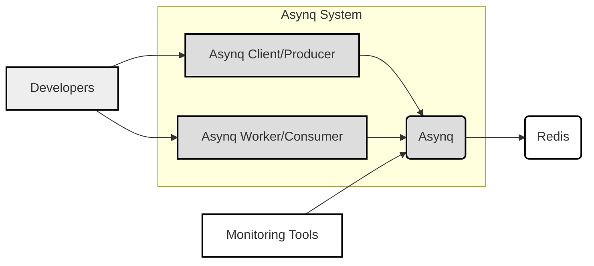
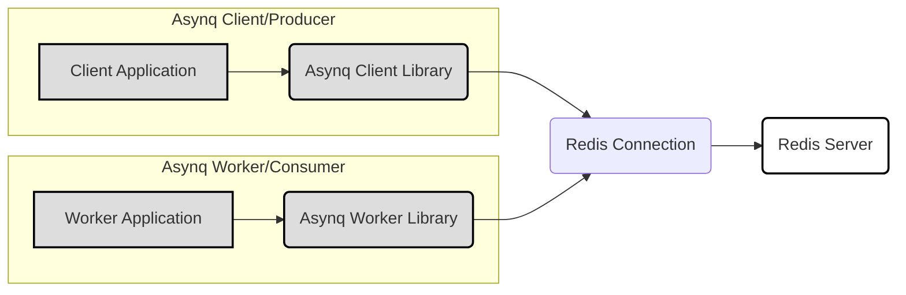
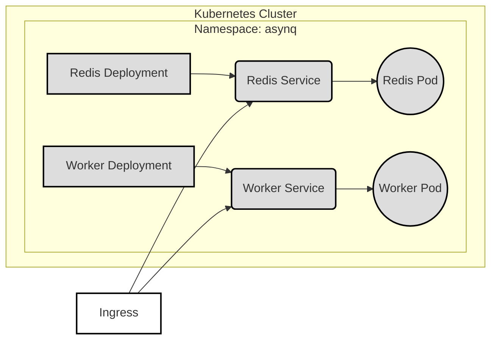
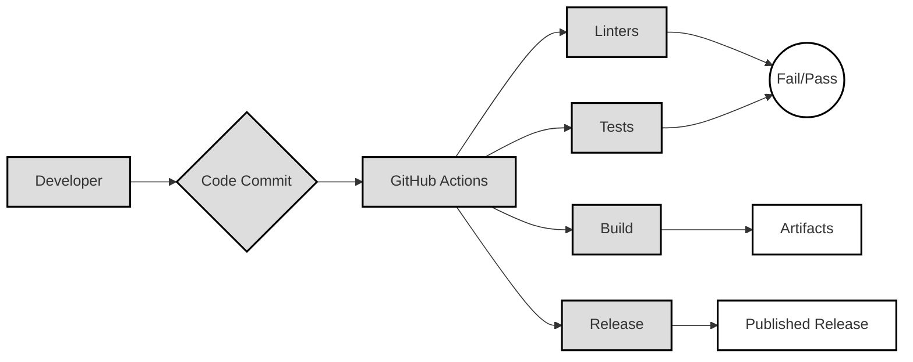

Okay, let's create a design document for the Asynq project, focusing on aspects relevant for threat modeling.

# BUSINESS POSTURE

Asynq is a Go library for asynchronous task processing.  It's designed to be a robust, scalable, and reliable alternative to other task queue systems.  It appears to be targeted at developers and organizations building applications that require background job processing.  The project's maturity suggests a focus on stability and production-readiness, rather than rapid feature iteration.

Priorities:

- Reliability: Ensuring tasks are processed, even in the face of failures.
- Scalability: Handling a large volume of tasks and workers.
- Performance: Processing tasks efficiently with minimal overhead.
- Operability:  Providing tools for monitoring and managing the system.
- Maintainability:  Keeping the codebase clean and easy to understand.
- Security: Protecting against unauthorized access and malicious tasks.

Goals:

- Provide a stable and reliable task queue system for Go applications.
- Offer a simple and intuitive API for developers.
- Support a variety of use cases, from simple background jobs to complex workflows.
- Be a viable alternative to existing task queue solutions.

Business Risks:

- Data Loss:  Loss of tasks due to system failures or vulnerabilities. This is a critical risk, as lost tasks can represent lost business operations (e.g., unsent emails, unprocessed orders).
- Data Corruption:  Modification or corruption of task data, leading to incorrect processing.
- Service Disruption:  Denial-of-service attacks or system overloads that prevent task processing.
- Unauthorized Access:  Unauthorized access to the task queue, allowing attackers to submit malicious tasks or steal sensitive data.
- Supply Chain Attacks: Vulnerabilities introduced through compromised dependencies.
- Code Injection:  Vulnerabilities that allow attackers to inject malicious code into tasks.

# SECURITY POSTURE

Existing Security Controls:

- security control: Input Validation: The library likely performs some input validation on task data, although the extent is not immediately clear from a cursory review.  (Needs further investigation in the codebase).
- security control: Error Handling:  The library includes robust error handling to prevent crashes and data loss. (Visible throughout the codebase).
- security control: Testing:  The project has a comprehensive test suite, which helps to identify and prevent security vulnerabilities. (Visible in the test files).
- security control: Dependency Management: Go modules are used for dependency management, allowing for version pinning and vulnerability scanning. (go.mod file)
- security control: Atomic Operations: Uses Redis atomic operations to prevent race conditions. (Visible in the codebase using Redis commands like `LMOVE`, `SADD`, etc.)

Accepted Risks:

- accepted risk: Reliance on Redis Security: The security of Asynq is heavily dependent on the security of the underlying Redis instance.  If Redis is compromised, Asynq is also compromised.
- accepted risk: Limited Built-in Authentication/Authorization: Asynq itself does not appear to provide built-in authentication or authorization mechanisms.  It relies on the application using it to implement these controls.
- accepted risk: Potential for Code Injection: If task payloads are not properly sanitized by the application, there is a potential for code injection vulnerabilities.

Recommended Security Controls:

- security control: Implement robust input validation and sanitization for all task data. This should include checks for data type, length, and format.
- security control: Consider adding support for task signing and verification to prevent task tampering.
- security control: Provide documentation and guidance on securing the Redis instance used by Asynq.
- security control: Integrate with security scanning tools (SAST, DAST, SCA) to identify vulnerabilities in the codebase and dependencies.
- security control: Implement monitoring and alerting for suspicious activity, such as a high rate of failed tasks or unusual task payloads.
- security control: Consider adding support for encryption of task data at rest and in transit.

Security Requirements:

- Authentication:  Asynq itself does not require authentication, but the applications using it should implement appropriate authentication mechanisms to control access to the task queue.
- Authorization:  Applications should implement authorization checks to ensure that only authorized users can submit, retrieve, or modify tasks.  This might involve restricting access to certain task types or queues based on user roles.
- Input Validation:  All task data should be validated to prevent injection attacks and ensure data integrity. This includes:
    - Type checking
    - Length restrictions
    - Format validation (e.g., using regular expressions)
    - Whitelisting allowed characters
- Cryptography:
    - If sensitive data is included in task payloads, it should be encrypted at rest (in Redis) and in transit (between the application and Redis).
    - Consider using digital signatures to verify the integrity and authenticity of tasks.
    - Use strong, industry-standard cryptographic algorithms and libraries.
    - Securely manage cryptographic keys.

# DESIGN

## C4 CONTEXT

Element Descriptions:

- 1. Name: Asynq Client/Producer
   - 2. Type: System
   - 3. Description:  The application code that creates and enqueues tasks.
   - 4. Responsibilities:
        - Creating tasks with appropriate payloads.
        - Enqueuing tasks to the Asynq system.
        - Handling any errors returned by Asynq.
   - 5. Security controls:
        - Input validation of task data.
        - Authentication and authorization to control access to task creation.
        - Potentially encrypting sensitive data in task payloads.

- 1. Name: Asynq
   - 2. Type: System
   - 3. Description: The Asynq library itself, providing the core task queue functionality.
   - 4. Responsibilities:
        - Managing task queues in Redis.
        - Scheduling tasks for execution.
        - Handling task retries and failures.
        - Providing an API for clients and workers.
   - 5. Security controls:
        - Input validation (limited, relies mostly on client/producer).
        - Error handling.
        - Atomic operations to prevent race conditions.

- 1. Name: Asynq Worker/Consumer
   - 2. Type: System
   - 3. Description:  The application code that processes tasks from the queue.
   - 4. Responsibilities:
        - Retrieving tasks from the Asynq system.
        - Executing tasks.
        - Handling task results and errors.
   - 5. Security controls:
        - Input validation of task data (critical here).
        - Authentication and authorization (if tasks require specific permissions).
        - Secure handling of task results (e.g., storing data securely).
        - Potentially decrypting sensitive data in task payloads.

- 1. Name: Redis
   - 2. Type: External System
   - 3. Description:  The Redis database used by Asynq to store task queues and related data.
   - 4. Responsibilities:
        - Storing task data.
        - Providing atomic operations for queue management.
   - 5. Security controls:
        - Redis authentication (REQUIRED).
        - Network access control (limiting access to Redis).
        - Data encryption at rest (if supported by Redis and required).
        - Regular security updates and patching.

- 1. Name: Monitoring Tools
   - 2. Type: External System
   - 3. Description:  Tools used to monitor the health and performance of Asynq and Redis.
   - 4. Responsibilities:
        - Collecting metrics on task processing.
        - Alerting on errors or performance issues.
        - Providing dashboards for visualization.
   - 5. Security controls:
        - Secure access to monitoring data.
        - Authentication and authorization for access to monitoring tools.

- 1. Name: Developers
    - 2. Type: Person
    - 3. Description: Developers who create and maintain applications that use Asynq.
    - 4. Responsibilities: Writing, testing, and deploying Asynq clients and workers.
    - 5. Security controls: Secure coding practices, code reviews, security training.

## C4 CONTAINER

Element Descriptions:

- 1. Name: Client Application
   - 2. Type: System
   - 3. Description:  The application code that uses the Asynq client library.
   - 4. Responsibilities:  Creating and enqueuing tasks.
   - 5. Security controls:  Input validation, authentication, authorization.

- 1. Name: Asynq Client Library
   - 2. Type: System
   - 3. Description:  The Asynq client library code.
   - 4. Responsibilities:  Providing an API for interacting with Redis.
   - 5. Security controls:  Limited input validation, error handling.

- 1. Name: Worker Application
   - 2. Type: System
   - 3. Description:  The application code that uses the Asynq worker library.
   - 4. Responsibilities:  Processing tasks.
   - 5. Security controls:  Input validation, authentication, authorization, secure task handling.

- 1. Name: Asynq Worker Library
   - 2. Type: System
   - 3. Description:  The Asynq worker library code.
   - 4. Responsibilities:  Retrieving and executing tasks from Redis.
   - 5. Security controls:  Error handling, retry logic.

- 1. Name: Redis Connection
   - 2. Type: System
   - 3. Description: The connection between the Asynq library and the Redis server.
   - 4. Responsibilities: Sending commands and receiving responses from Redis.
   - 5. Security controls: TLS encryption (if required), connection pooling.

- 1. Name: Redis Server
   - 2. Type: External System
   - 3. Description: The Redis server instance.
   - 4. Responsibilities: Storing and managing task data.
   - 5. Security controls: Redis authentication, network access control, data encryption (if required).

## DEPLOYMENT

Possible Deployment Solutions:

1.  Bare Metal/Virtual Machines:  Deploying Redis and Asynq workers directly on servers.
2.  Docker Containers:  Packaging Redis and Asynq workers into Docker containers for easier deployment and management.
3.  Kubernetes:  Using Kubernetes to orchestrate the deployment and scaling of Redis and Asynq workers.
4.  Cloud-Specific Services:  Using managed Redis services (e.g., AWS ElastiCache, Azure Cache for Redis, Google Cloud Memorystore) and serverless functions or container services to run Asynq workers.

Chosen Solution (for detailed description): Kubernetes

Element Descriptions:

- 1.  Name: Kubernetes Cluster
    - 2.  Type: Infrastructure
    - 3.  Description: The Kubernetes cluster where Asynq and Redis are deployed.
    - 4.  Responsibilities: Managing the lifecycle of pods and services.
    - 5.  Security controls: Kubernetes RBAC, network policies, pod security policies, regular security updates.

- 1.  Name: Namespace: asynq
    - 2.  Type: Logical Grouping
    - 3.  Description: A Kubernetes namespace to isolate the Asynq deployment.
    - 4.  Responsibilities: Providing a scope for names and resources.
    - 5.  Security controls: Resource quotas, network policies.

- 1.  Name: Redis Deployment
    - 2.  Type: Kubernetes Resource
    - 3.  Description: A Kubernetes Deployment for managing the Redis pods.
    - 4.  Responsibilities: Ensuring the desired number of Redis pods are running.
    - 5.  Security controls:  Pod security policies, resource limits.

- 1.  Name: Redis Service
    - 2.  Type: Kubernetes Resource
    - 3.  Description: A Kubernetes Service for exposing the Redis pods.
    - 4.  Responsibilities: Providing a stable endpoint for accessing Redis.
    - 5.  Security controls:  Network policies.

- 1.  Name: Redis Pod
    - 2.  Type: Kubernetes Resource
    - 3.  Description: A pod running the Redis container.
    - 4.  Responsibilities: Running the Redis server.
    - 5.  Security controls:  Redis authentication, container security context.

- 1.  Name: Worker Deployment
    - 2.  Type: Kubernetes Resource
    - 3.  Description: A Kubernetes Deployment for managing the Asynq worker pods.
    - 4.  Responsibilities: Ensuring the desired number of worker pods are running.
    - 5.  Security controls:  Pod security policies, resource limits.

- 1.  Name: Worker Service
    - 2.  Type: Kubernetes Resource
    - 3.  Description: A Kubernetes Service for exposing the worker pods (optional, depending on whether external access is needed).
    - 4.  Responsibilities: Providing a stable endpoint for accessing workers (if needed).
    - 5.  Security controls:  Network policies.

- 1.  Name: Worker Pod
    - 2.  Type: Kubernetes Resource
    - 3.  Description: A pod running the Asynq worker container.
    - 4.  Responsibilities: Processing tasks from the queue.
    - 5.  Security controls:  Container security context, input validation in worker code.

- 1. Name: Ingress
    - 2. Type: External
    - 3. Description: Kubernetes Ingress to expose services to external traffic (optional, depending on access requirements).
    - 4. Responsibilities: Routing external traffic to the appropriate services.
    - 5. Security controls: TLS termination, authentication (if required).

## BUILD

The Asynq project uses Go modules for dependency management and GitHub Actions for continuous integration.

Build Process Description:

1.  Developer commits code to the GitHub repository.
2.  GitHub Actions workflow is triggered.
3.  Linters (e.g., `golangci-lint`) are run to check code style and identify potential issues.
4.  Tests are run to ensure code correctness and prevent regressions.
5.  The code is built, producing the Asynq library.
6.  If the build is successful and triggered by a tag, a release is created and published on GitHub.

Security Controls:

- security control: Dependency Management: Go modules ensure that dependencies are tracked and versioned, allowing for vulnerability scanning.
- security control: Linting: Linters help to identify potential code quality and security issues.
- security control: Testing: Comprehensive tests help to prevent vulnerabilities and ensure code correctness.
- security control: GitHub Actions: Provides a secure and automated build environment.
- security control: (Recommended) Integrate SAST (Static Application Security Testing) tools into the GitHub Actions workflow to scan for vulnerabilities in the Asynq codebase.
- security control: (Recommended) Integrate SCA (Software Composition Analysis) tools to scan for vulnerabilities in dependencies.
- security control: (Recommended) Implement code signing for releases to ensure their integrity.

# RISK ASSESSMENT

Critical Business Processes:

- Asynchronous task execution: The core business process is the reliable and efficient execution of background tasks. Failure to execute tasks can lead to significant business disruption.

Data Sensitivity:

- Task Payloads: The data within task payloads can range from non-sensitive to highly sensitive, depending on the application using Asynq.  This is the primary data to protect.
- Queue Metadata:  Metadata about the queues (e.g., queue names, task IDs) is generally less sensitive, but could be used in reconnaissance attacks.

# QUESTIONS & ASSUMPTIONS

Questions:

- What are the specific security requirements of applications that are expected to use Asynq? (This will vary widely.)
- What level of security auditing has been performed on the Asynq codebase?
- Are there any plans to add built-in authentication or authorization features to Asynq?
- What is the expected threat model for typical Asynq deployments? (e.g., internal applications, public-facing services)
- What are the specific data retention policies for task data?

Assumptions:

- BUSINESS POSTURE:  It is assumed that users of Asynq prioritize reliability and performance, and are willing to implement necessary security controls in their applications.
- SECURITY POSTURE: It is assumed that users will properly secure their Redis instances, including authentication and network access control. It is also assumed that users will perform input validation on task data within their applications.
- DESIGN: It is assumed that a Kubernetes-based deployment is a common and representative deployment model for Asynq.  Other deployment models are possible, but the security principles remain similar.