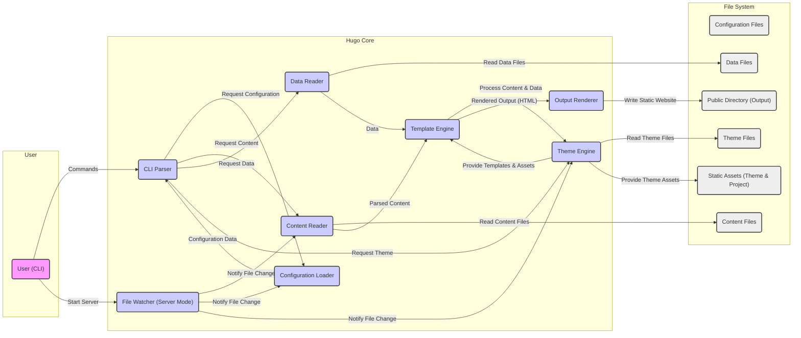

# Project Design Document: Hugo Static Site Generator

**Version:** 1.1
**Date:** October 26, 2023
**Author:** AI Architecture Expert

## 1. Introduction

This document provides a detailed architectural design of the Hugo static site generator. It outlines the key components, data flows, and interactions within the system. This document is intended to serve as a robust foundation for subsequent threat modeling activities, enabling a comprehensive understanding of potential security vulnerabilities.

Hugo is a fast and flexible static site generator, written in Go, that transforms content and templates into static HTML websites. Its speed and flexibility make it a popular choice for building various types of websites, from blogs to documentation sites.

## 2. Goals and Objectives

*   Provide a clear, comprehensive, and well-structured overview of Hugo's architecture.
*   Identify and describe the key components of Hugo and their specific responsibilities and interactions.
*   Illustrate the data flow within the system, highlighting key transformation points.
*   Elaborate on potential areas of security concern, providing specific examples for future threat modeling.
*   Serve as a definitive reference point for security assessments, development discussions, and onboarding new team members.

## 3. Architectural Overview

Hugo's architecture is modular and event-driven, centered around processing content and rendering templates. The core areas are:

*   **Initialization:** Setting up the Hugo environment and loading configurations.
*   **Content Processing:** Reading, parsing, and organizing content.
*   **Data Handling:** Loading and making external data available.
*   **Template Rendering:** Applying layouts and logic to content and data.
*   **Output Generation:** Writing the final static website files.
*   **Development Server (Optional):** Providing a live-reload development environment.

## 4. Detailed Component Description

*   **Command-Line Interface (CLI):**
    *   **Responsibility:** The primary interface for user interaction, accepting commands and arguments.
    *   **Functionality:** Parses commands (e.g., `hugo`, `hugo server`, `hugo new`), validates input, and orchestrates the execution of other components.
    *   **Interaction:** Invokes the Configuration Loader, Content Reader, Template Engine, and Output Renderer based on the command.

*   **Configuration Loader:**
    *   **Responsibility:** Loads and merges configuration settings from various sources.
    *   **Functionality:** Reads `config.toml`, `config.yaml`, or `config.json` files, command-line flags, and environment variables. Applies precedence rules to merge configurations.
    *   **Interaction:** Provides configuration data as a central source of truth to other components.

*   **Content Reader:**
    *   **Responsibility:** Discovers, reads, and parses content files.
    *   **Functionality:** Scans the `content` directory, identifies files based on extensions (Markdown, Asciidoc, HTML), parses front matter (YAML, TOML, JSON), and extracts content. Organizes content into pages, sections, and taxonomies.
    *   **Interaction:** Provides structured content data to the Template Engine.

*   **Data Reader:**
    *   **Responsibility:** Reads and makes available data files for use in templates.
    *   **Functionality:** Reads JSON, YAML, or CSV files from the `data` directory. Structures the data for easy access within templates using Go's templating syntax.
    *   **Interaction:** Provides data structures to the Template Engine.

*   **Template Engine:**
    *   **Responsibility:** Renders content and data into HTML using templates.
    *   **Functionality:** Utilizes Go's `html/template` and `text/template` packages. Loads layout files, partials, and base templates from the `layouts` directory and themes. Executes template functions, shortcodes, and logic to generate the final HTML output for each page.
    *   **Interaction:** Receives content and data from the Content Reader and Data Reader. Interacts with the Theme Engine to load theme-specific templates and assets.

*   **Theme Engine:**
    *   **Responsibility:** Manages the loading and application of themes.
    *   **Functionality:** Locates and loads themes specified in the configuration. Handles template lookup order (project layouts override theme layouts). Provides access to theme-specific assets (CSS, JavaScript, images).
    *   **Interaction:** Provides templates and assets to the Template Engine.

*   **Output Renderer:**
    *   **Responsibility:** Writes the rendered HTML and static assets to the output directory.
    *   **Functionality:** Takes the output from the Template Engine and writes it to individual HTML files in the `public` directory. Copies static assets from the `static` directory and themes to the `public` directory. Performs optional post-processing like minification.
    *   **Interaction:** Receives rendered HTML from the Template Engine.

*   **File Watcher (for `hugo server`):**
    *   **Responsibility:** Monitors file system changes for live reloading during development.
    *   **Functionality:** Watches for modifications, additions, or deletions in content, configuration, layout, and static asset directories. Triggers a rebuild of the site when changes are detected.
    *   **Interaction:** Notifies the Content Reader, Configuration Loader, and Template Engine to refresh their data.

## 5. Data Flow Diagram

## 6. Security Considerations (Detailed)

This section expands on potential security concerns, providing more specific examples for threat modeling.

*   **Input Validation Vulnerabilities:**
    *   **Content Files:** Malicious users could inject JavaScript or other executable code within Markdown or HTML content. If not properly sanitized during template rendering, this could lead to Cross-Site Scripting (XSS) vulnerabilities for visitors of the generated website. Example: Embedding `` in a Markdown file.
    *   **Configuration Files:** While less direct, incorrect configuration settings could expose sensitive information or weaken security measures. Example: Disabling security headers or setting insecure cache policies.
    *   **Data Files:** If data files are sourced from untrusted locations, they could contain malicious content that, when processed by templates, could lead to unexpected behavior or information disclosure. Example: A malicious JSON file designed to exploit template logic.

*   **Template Injection Vulnerabilities:**
    *   If user-provided data (e.g., from front matter or data files) is directly embedded into templates without proper escaping, attackers could inject malicious template code. This could allow them to execute arbitrary code on the server during the build process or manipulate the generated output. Example: Using `{{ .Param }}` in a template where `.Param` comes directly from user input without sanitization.

*   **Theme Security Risks:**
    *   Themes, especially those from untrusted sources, can contain malicious code (JavaScript, CSS with exploits) or vulnerabilities. A compromised theme could inject malicious scripts into the generated website or expose sensitive information. Example: A theme containing JavaScript that steals user credentials.

*   **Dependency Vulnerabilities:**
    *   Hugo relies on various Go libraries. Vulnerabilities in these dependencies could be exploited if not patched. Regularly updating Hugo is crucial to mitigate this risk. Example: A known vulnerability in the Markdown parsing library.

*   **Output Security Best Practices:**
    *   Hugo generates static websites, but the security of the deployed site depends on proper configuration of the hosting environment. Ensuring appropriate security headers (Content Security Policy, HTTP Strict Transport Security, etc.) is crucial.

*   **Command-Line Injection:**
    *   While less common in typical usage, if Hugo were extended to execute external commands based on user input (e.g., through a hypothetical plugin system), improper sanitization of command-line arguments could lead to command injection vulnerabilities.

*   **File System Access Control:**
    *   Hugo requires read access to project files and write access to the output directory. Incorrect file permissions could allow unauthorized modification of the website or access to sensitive project files.

## 7. Dependencies

*   **Go Standard Library:** Provides fundamental building blocks for the application.
*   **`github.com/spf13/cobra`:**  A library for creating modern CLI applications, used for Hugo's command structure.
*   **`github.com/spf13/viper`:** A rich configuration solution for Go applications, used for managing Hugo's configuration.
*   **Content Parsing Libraries (e.g., `github.com/yuin/goldmark` or `github.com/alecthomas/chroma`):** Used for parsing Markdown and handling syntax highlighting.
*   **Template Engines (`html/template`, `text/template`):** Built-in Go packages for template processing.
*   **Potentially other third-party Go modules:** For specific functionalities like image processing or asset minification.

## 8. Deployment Considerations

The static nature of Hugo's output offers inherent security advantages. However, deployment choices still impact security:

*   **Web Servers (Nginx, Apache):** Proper configuration is essential, including setting appropriate security headers, managing TLS certificates, and restricting access.
*   **Cloud Storage (AWS S3, Google Cloud Storage, Azure Blob Storage):** Ensure proper access controls (e.g., bucket policies) to prevent unauthorized access or modification of the website content.
*   **Content Delivery Networks (CDNs):** While CDNs enhance performance and availability, consider the CDN's security practices and ensure secure origin connections.
*   **Static Site Hosting Platforms (Netlify, Vercel, GitHub Pages):** These platforms often handle many security aspects, but understanding their specific security models and configurations is still important.

## 9. Future Considerations

*   **Enhanced Plugin System:** If a more extensive plugin system is introduced, careful consideration of plugin security, permissions, and sandboxing will be crucial to prevent malicious plugins from compromising the build process or generated website.
*   **Remote Theme Handling:** Downloading themes directly from remote repositories introduces risks. Implementing secure download mechanisms and integrity checks (e.g., verifying signatures) would be necessary.
*   **Advanced Asset Processing Pipelines:** More complex asset processing (e.g., image manipulation, CSS preprocessing) might introduce new dependencies and potential vulnerabilities in those tools.
*   **Integration with External Data Sources:** If Hugo were to directly fetch data from external APIs during the build process, secure handling of API keys and data validation would be critical.

This improved design document provides a more detailed and nuanced understanding of Hugo's architecture, laying a stronger foundation for comprehensive threat modeling activities. The specific examples provided in the security considerations section aim to guide the identification of potential vulnerabilities and the development of appropriate mitigation strategies.