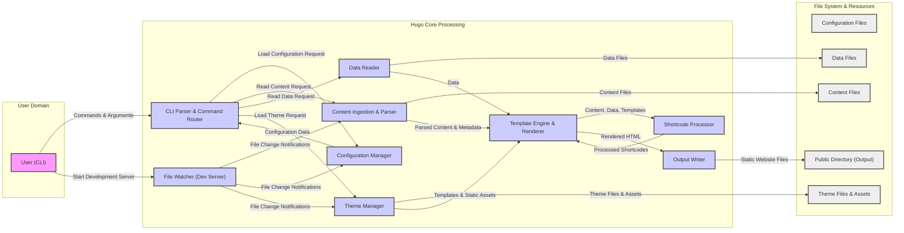

# Project Design Document: Hugo Static Site Generator

**Version:** 1.1
**Date:** October 26, 2023
**Author:** AI Architecture Expert

## 1. Introduction

This document provides an enhanced architectural design of the Hugo static site generator, focusing on aspects relevant to security threat modeling. It details the key components, data flows, and interactions within the system, with a specific emphasis on potential security boundaries and vulnerabilities. This document serves as a crucial input for subsequent threat modeling activities, enabling a deeper understanding of the attack surface.

Hugo is a high-performance static site generator written in Go. It transforms content files and templates into a complete static website, optimized for speed and deployability.

## 2. Goals and Objectives

*   Provide a detailed and precise architectural overview of Hugo, optimized for security analysis.
*   Clearly delineate the responsibilities and interactions of key components, highlighting potential trust boundaries.
*   Thoroughly describe the data flow within the system, identifying potential points of data manipulation or interception.
*   Proactively identify potential areas of security concern and suggest initial threat vectors for future modeling.
*   Serve as a definitive reference for security assessments, penetration testing, and secure development practices related to Hugo.

## 3. Architectural Overview

Hugo's architecture is centered around a pipeline that processes input content and configuration to generate static output. The core areas are:

*   **Content Ingestion and Processing:**  Reading, parsing, and structuring input content.
*   **Templating and Rendering:** Applying layouts and logic to generate HTML output.
*   **Configuration and Data Management:** Handling site settings and external data sources.
*   **Output Generation and Asset Handling:** Creating the final static website and managing associated assets.
*   **User Interface (CLI):** Providing the primary means of interaction and control.

## 4. Detailed Component Description

*   **Command-Line Interface (CLI):**
    *   The primary interface for user interaction, accepting commands and arguments.
    *   Responsible for parsing user input and invoking the appropriate Hugo functionalities.
    *   Potential attack surface: Command injection vulnerabilities if input is not properly sanitized.
    *   Manages the overall build process and server lifecycle.

*   **Configuration Loader:**
    *   Loads and merges configuration settings from various sources (files, command-line flags, environment variables).
    *   Establishes global settings that influence the behavior of other components.
    *   Potential attack surface: Maliciously crafted configuration files could alter Hugo's behavior or expose sensitive information.

*   **Content Reader & Parser:**
    *   Locates and reads content files from the designated content directories.
    *   Supports multiple content formats (Markdown, Asciidoc, HTML) and parses them accordingly.
    *   Extracts front matter (metadata) associated with content files.
    *   Potential attack surface:  Vulnerabilities in parsing libraries could be exploited with specially crafted content files.

*   **Data Reader:**
    *   Reads external data files (JSON, YAML, CSV) from the `data` directory.
    *   Makes this data accessible within templates for dynamic content generation.
    *   Potential attack surface: Malicious data files could introduce unexpected behavior or vulnerabilities when processed by templates.

*   **Template Engine:**
    *   Utilizes Go's `html/template` and `text/template` packages for rendering.
    *   Applies layouts, partials, and shortcodes to content and data.
    *   Executes template functions and logic to generate the final HTML structure.
    *   Critical security component: Improperly escaped data within templates can lead to Cross-Site Scripting (XSS) vulnerabilities.

*   **Theme Engine:**
    *   Manages the loading and application of themes, which define the visual presentation of the site.
    *   Handles template inheritance and allows users to override theme templates.
    *   Includes static assets (CSS, JavaScript, images) that are part of the theme.
    *   Potential attack surface: Malicious themes could contain harmful scripts or expose vulnerabilities if not reviewed carefully.

*   **Shortcode Handler:**
    *   Processes shortcodes embedded within content files, allowing for dynamic content inclusion.
    *   Executes Go functions associated with shortcodes.
    *   Potential attack surface:  Insecurely implemented shortcodes could introduce vulnerabilities, including remote code execution if they interact with external resources without proper sanitization.

*   **Output Renderer:**
    *   Takes the rendered HTML content and writes it to the `public` directory.
    *   Handles the generation of other static assets and performs post-processing tasks.
    *   Ensures the final output is structured correctly for deployment.

*   **File Watcher (for `hugo server`):**
    *   Monitors changes in content, configuration, and theme files during development.
    *   Triggers rebuilds and refreshes the development server to reflect changes.
    *   Potential security consideration: While primarily for development, vulnerabilities in the file watching mechanism could potentially be exploited in specific scenarios.

## 5. Data Flow Diagram

## 6. Security Considerations and Potential Threats

This section expands on potential security concerns, providing more specific examples of potential threats.

*   **Input Validation and Sanitization:**
    *   **Threat:** Malicious actors could inject harmful scripts or code through content files (e.g., XSS in Markdown or HTML content).
    *   **Threat:**  Crafted configuration files could overwrite settings, leading to unexpected behavior or information disclosure.
    *   **Threat:**  Malicious data in data files could be used to manipulate template logic or inject harmful content.

*   **Template Injection Vulnerabilities:**
    *   **Threat:** If user-controlled data is directly embedded into templates without proper escaping, attackers could inject arbitrary HTML or JavaScript, leading to XSS.
    *   **Threat:**  Server-Side Template Injection (SSTI) could occur if template logic allows execution of arbitrary code on the server (less likely in a static site generator but worth considering in complex shortcodes).

*   **Theme Security Risks:**
    *   **Threat:**  Third-party themes might contain malicious JavaScript or CSS that could compromise users visiting the generated website.
    *   **Threat:**  Themes could have vulnerabilities that expose sensitive information or allow for unauthorized actions.

*   **Shortcode Security:**
    *   **Threat:**  Insecurely implemented shortcodes could allow for arbitrary code execution if they interact with external systems or execute shell commands without proper sanitization.
    *   **Threat:**  Shortcodes that fetch remote data could be exploited to perform Server-Side Request Forgery (SSRF) attacks.

*   **Dependency Vulnerabilities:**
    *   **Threat:**  Vulnerabilities in Go libraries used by Hugo (e.g., Markdown parsers, YAML/JSON libraries) could be exploited if not kept up-to-date.

*   **Command Injection:**
    *   **Threat:** If Hugo uses external commands based on user input without proper sanitization, attackers could inject malicious commands.

*   **File System Security:**
    *   **Threat:**  If Hugo is run with excessive permissions, attackers could potentially read or write arbitrary files on the system.

*   **Output Security:**
    *   **Threat:**  The generated static website might lack necessary security headers (e.g., Content Security Policy) if not configured correctly, making it vulnerable to client-side attacks.

## 7. Dependencies

*   **Go Standard Library:**  Fundamental to Hugo's operation; vulnerabilities here would have widespread impact.
*   **spf13/cobra:**  Used for CLI creation; vulnerabilities could affect command parsing and execution.
*   **spf13/viper:**  Used for configuration; vulnerabilities could allow manipulation of settings.
*   **Content Parsing Libraries (e.g., Blackfriday, Goldmark):** Vulnerabilities in these libraries could allow for injection attacks through crafted content.
*   **Data Parsing Libraries (e.g., `encoding/json`, `gopkg.in/yaml.v2`):** Vulnerabilities could allow for manipulation or injection through data files.
*   **Template Engine Libraries (`html/template`, `text/template`):** While part of the standard library, understanding their security implications is crucial for preventing XSS and SSTI.
*   **Potentially other third-party Go modules:** Each dependency introduces a potential point of failure if it contains security vulnerabilities.

## 8. Deployment Considerations and Security Implications

The chosen deployment method significantly impacts the overall security posture of a Hugo-generated website.

*   **Direct Web Server Deployment (Nginx, Apache):** Requires careful configuration of the web server to prevent access to sensitive files and ensure proper security headers are set.
*   **Cloud Storage (AWS S3, Google Cloud Storage, Azure Blob Storage):** Security relies on the access control policies and security features provided by the cloud platform. Misconfigured buckets can lead to data breaches.
*   **Content Delivery Networks (CDNs):**  While improving performance, CDNs introduce a third-party dependency and require careful configuration to prevent unauthorized access or manipulation of cached content.
*   **Static Site Hosting Platforms (Netlify, Vercel, GitHub Pages):** These platforms often handle security configurations, but understanding their shared responsibility model is crucial. Vulnerabilities in the platform itself could impact hosted sites.

## 9. Future Considerations and Potential Security Impacts

Anticipating future developments can help proactively address potential security challenges.

*   **Enhanced Plugin/Module System:**  Introducing a more robust plugin system could significantly expand Hugo's functionality but also increase the attack surface if plugin security is not carefully managed. Plugin sandboxing and permission models would be critical.
*   **Remote Theme Capabilities:**  Allowing themes to be fetched from remote repositories introduces the risk of malicious themes being distributed. Secure theme verification and auditing mechanisms would be necessary.
*   **Advanced Asset Processing Pipelines:**  More complex asset processing (e.g., image optimization, CSS/JS bundling) might introduce vulnerabilities if external tools or libraries are used insecurely.
*   **Integration with External Data Sources at Build Time:**  Fetching data from external APIs during the build process could introduce risks related to API security and data integrity.

This enhanced design document provides a more detailed and security-focused view of Hugo's architecture. It serves as a solid foundation for conducting thorough threat modeling and implementing appropriate security measures.