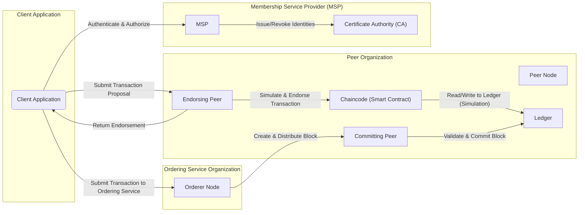
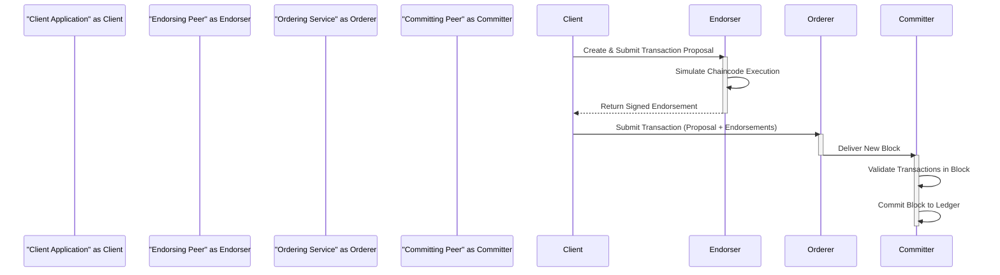

## Project Design Document: Hyperledger Fabric (Improved)

**1. Introduction**

This document provides an enhanced architectural design of the Hyperledger Fabric platform, specifically tailored for comprehensive threat modeling. It offers a detailed breakdown of the core components, their intricate interactions, and the flow of data within the system. The primary aim is to furnish a clear and in-depth understanding of the system's structure and functionality, with a strong emphasis on security considerations.

**2. Goals and Objectives**

The overarching goal of this document is to serve as a robust foundation for the identification and analysis of potential security vulnerabilities and threats inherent within the Hyperledger Fabric ecosystem. The specific objectives include:

*   Providing granular definitions of the major components constituting Hyperledger Fabric.
*   Clearly illustrating the interactions and data flow pathways between these components.
*   Pinpointing key security-relevant aspects associated with each component and their interactions.
*   Offering a more detailed overview of the various deployment considerations and their security implications.

**3. High-Level Architecture**

Hyperledger Fabric is an enterprise-grade, modular blockchain platform distinguished by its permissioned architecture. This design ensures controlled participation and granular data visibility. The synergistic operation of its core components delivers a secure and dependable distributed ledger system.

**4. Component Details**

This section provides a detailed examination of the key components within the Hyperledger Fabric architecture, with a particular focus on their functionalities and security implications.

*   **Client Application:**
    *   Represents an external entity (e.g., user, application, service) that initiates interactions with the Fabric network.
    *   Responsible for constructing and submitting transaction proposals, as well as querying the ledger for information.
    *   Authenticates and authorizes itself with the network using cryptographic credentials managed by the MSP.
    *   Security Relevance:
        *   A compromised client application can submit unauthorized transactions or leak sensitive data.
        *   Vulnerable to attacks like key theft, replay attacks, and man-in-the-middle attacks if not properly secured.
        *   Requires secure storage of private keys and careful handling of sensitive data.

*   **Peer Node:**
    *   A fundamental building block of the Fabric network, maintaining a copy of the ledger and executing chaincode.
    *   Performs critical functions including transaction endorsement, ledger commitment, and state management.
    *   Can assume different roles within a channel:
        *   **Endorsing Peer:** Executes chaincode in response to transaction proposals and cryptographically signs the execution results (endorsement). This signifies agreement with the proposed state change.
        *   **Committing Peer:** Validates the order and validity of transactions within a block received from the ordering service and appends the block to its local copy of the ledger.
        *   **Anchor Peer:**  A peer on a channel whose information is known to peers in other organizations, facilitating cross-organizational communication and private data sharing.
    *   Security Relevance:
        *   Compromise of a peer node can lead to data manipulation, denial of service, or exposure of sensitive information.
        *   Requires robust access controls, secure storage for ledger data, and protection against network-based attacks.
        *   The integrity of the endorsing peer is crucial for preventing fraudulent endorsements.

*   **Chaincode (Smart Contract):**
    *   Contains the executable business logic that governs interactions with the ledger.
    *   Deployed and executed on peer nodes, specifically endorsing peers during the transaction proposal phase.
    *   Interacts with the ledger's world state to read and write data based on the defined business rules.
    *   Security Relevance:
        *   Vulnerabilities in chaincode can lead to unauthorized access to or manipulation of ledger data.
        *   Requires rigorous security audits and secure coding practices to prevent issues like reentrancy, access control bypasses, and data leaks.
        *   The logic within the chaincode directly impacts the security and integrity of the data stored on the ledger.

*   **Ledger:**
    *   The distributed and immutable record of all state transitions (transactions) within the Fabric network.
    *   Consists of two logically distinct but interconnected components:
        *   **World State:** A key-value store representing the current state of assets and other relevant data on the blockchain. It provides efficient access to the latest values.
        *   **Blockchain:** An append-only, ordered sequence of blocks, where each block contains a batch of validated transactions. This provides a historical record of all changes.
    *   Security Relevance:
        *   Maintaining the integrity and confidentiality of the ledger is paramount.
        *   Cryptographic hashing and digital signatures ensure immutability and prevent tampering.
        *   Access control policies, enforced through chaincode and MSP, restrict unauthorized read and write access.
        *   Considerations for data encryption at rest and in transit are crucial for protecting sensitive information.

*   **Ordering Service:**
    *   Responsible for establishing a total order of transactions and packaging them into blocks.
    *   A foundational component ensuring consistency across the distributed ledger by providing a shared communication channel.
    *   Different implementations exist, each with varying fault-tolerance and performance characteristics:
        *   **Solo:** A single orderer node (primarily for development and testing, not recommended for production).
        *   **Kafka:** A distributed, fault-tolerant ordering service leveraging Apache Kafka.
        *   **Raft:** A crash fault-tolerant ordering service based on the Raft consensus protocol, offering a more decentralized approach.
    *   Security Relevance:
        *   Critical for ensuring the consistent and tamper-proof ordering of transactions.
        *   Compromise of the ordering service can lead to transaction reordering, censorship, or denial of service.
        *   Requires robust authentication and authorization mechanisms to prevent unauthorized participation.
        *   The chosen consensus mechanism directly impacts the security and resilience of the ordering service.

*   **Membership Service Provider (MSP):**
    *   Manages identities and defines the rules that govern participation within the Hyperledger Fabric network.
    *   Abstracts away the underlying identity management implementation, allowing for flexibility and interoperability.
    *   Associates digital identities with roles and permissions, enabling fine-grained access control.
    *   Security Relevance:
        *   Crucial for access control, ensuring only authorized entities can interact with the network.
        *   Secure management of cryptographic keys and certificates is essential.
        *   Vulnerabilities in the MSP can lead to unauthorized access and impersonation.

*   **Certificate Authority (CA):**
    *   Issues and revokes digital certificates, which are used to establish identities and authenticate participants within the network.
    *   Typically associated with an MSP, providing the infrastructure for managing digital identities.
    *   Security Relevance:
        *   The security of the CA is fundamental to the overall security of the network.
        *   Compromise of the CA can lead to the issuance of fraudulent identities, allowing unauthorized access and actions.
        *   Requires strong physical and logical security controls, including secure key generation and storage, and robust certificate revocation mechanisms.

**5. Data Flow (Detailed)**

This section provides a more granular breakdown of the typical data flow for a transaction in Hyperledger Fabric, highlighting the interactions and data exchanged between components.

*   **Transaction Proposal Creation:**
    *   The client application constructs a transaction proposal, specifying the chaincode to be invoked, the function to be executed, and the arguments for that function.
    *   The client digitally signs the transaction proposal using its private key, ensuring non-repudiation.
*   **Proposal Submission to Endorsing Peers:**
    *   The client application sends the signed transaction proposal to a set of endorsing peers, as specified by the channel's endorsement policy.
*   **Chaincode Execution and Simulation:**
    *   Upon receiving the proposal, the endorsing peer verifies the client's signature and simulates the transaction by executing the specified chaincode.
    *   During simulation, the chaincode interacts with a local copy of the world state but does not commit any changes.
    *   The endorsing peer records the read set (keys read from the world state) and the write set (proposed changes to the world state).
*   **Endorsement Generation:**
    *   If the simulation is successful, the endorsing peer signs the proposal response, which includes the proposed read and write sets, along with its endorsement.
*   **Endorsement Collection:**
    *   The client application gathers the signed endorsements from the required number of endorsing peers, as defined by the channel's endorsement policy.
*   **Transaction Submission to Ordering Service:**
    *   Once a sufficient number of valid endorsements are collected, the client application submits the transaction (containing the proposal and the endorsements) to the ordering service.
*   **Block Creation and Ordering:**
    *   The ordering service receives transactions from various clients and orders them into a block based on its configured consensus mechanism.
    *   The ordering service does not validate the transaction logic itself but ensures the consistent ordering of transactions.
*   **Block Distribution:**
    *   The ordering service broadcasts the newly created block to all peers on the channel.
*   **Block Validation:**
    *   Committing peers receive the block and perform several validation checks:
        *   Verification of transaction signatures.
        *   Enforcement of the channel's endorsement policy (ensuring the required number of valid endorsements are present).
        *   Validation of read/write sets to prevent conflicts with concurrent transactions.
*   **Ledger Commitment:**
    *   If all validation checks pass, the committing peer appends the block to its local copy of the blockchain and updates the world state based on the validated write sets.

**6. Security Considerations (Expanded)**

This section provides a more comprehensive overview of security considerations, categorized for clarity.

*   **Authentication and Authorization:**
    *   **Threats:** Unauthorized access, impersonation, privilege escalation.
    *   **Considerations:** Strong identity management using MSP and CAs, secure key management practices, robust access control policies defined in chaincode and channel configurations, mutual TLS (mTLS) for secure communication.

*   **Data Confidentiality:**
    *   **Threats:** Unauthorized data access, data breaches, information leakage.
    *   **Considerations:** Private data collections for restricting data visibility, data encryption at rest and in transit, zero-knowledge proofs for selective disclosure, careful design of chaincode to avoid exposing sensitive data unnecessarily.

*   **Data Integrity:**
    *   **Threats:** Data tampering, fraudulent transactions, ledger corruption.
    *   **Considerations:** Cryptographic hashing and digital signatures for immutability and non-repudiation, endorsement policies to ensure transaction validity, validation of read/write sets to prevent conflicts, robust consensus mechanisms to ensure agreement on the ledger state.

*   **Availability:**
    *   **Threats:** Denial-of-service (DoS) attacks, network outages, component failures.
    *   **Considerations:** Redundancy and fault tolerance in the ordering service and peer infrastructure, robust network security measures, monitoring and alerting systems, disaster recovery planning.

*   **Chaincode Security:**
    *   **Threats:** Vulnerabilities leading to unauthorized access or manipulation, reentrancy attacks, business logic flaws.
    *   **Considerations:** Secure coding practices, thorough testing and auditing of chaincode, formal verification techniques, access control mechanisms within chaincode, input validation.

*   **Key Management:**
    *   **Threats:** Key compromise, unauthorized key usage, loss of access to keys.
    *   **Considerations:** Secure generation, storage, and rotation of cryptographic keys, use of Hardware Security Modules (HSMs) for sensitive keys, adherence to key management best practices.

*   **Network Security:**
    *   **Threats:** Man-in-the-middle attacks, eavesdropping, unauthorized network access.
    *   **Considerations:** Mutual TLS (mTLS) for secure communication between all components, firewall configurations to restrict network access, intrusion detection and prevention systems, network segmentation.

**7. Deployment Considerations (Enhanced)**

The security implications of different deployment models are significant and must be carefully considered.

*   **On-Premise Deployment:**
    *   **Security Advantages:** Greater control over the physical and logical security of the infrastructure.
    *   **Security Challenges:** Requires significant investment in security infrastructure and expertise, responsibility for all aspects of security.

*   **Cloud-Based Deployment:**
    *   **Security Advantages:** Leverage the security features and expertise of the cloud provider.
    *   **Security Challenges:** Reliance on the cloud provider's security posture, potential for misconfigurations, data sovereignty concerns. Requires careful selection of a reputable cloud provider and adherence to their security best practices.

*   **Hybrid Deployment:**
    *   **Security Advantages:** Potential to combine the benefits of on-premise and cloud deployments.
    *   **Security Challenges:** Increased complexity in managing security across different environments, ensuring consistent security policies.

**8. Future Considerations**

The Hyperledger Fabric ecosystem is continuously evolving. Future security considerations include:

*   **Enhanced Privacy Features:** Further development and adoption of technologies like zero-knowledge proofs and secure multi-party computation.
*   **Formal Verification of Smart Contracts:** Increased use of formal methods to mathematically prove the correctness and security of chaincode.
*   **Interoperability Security:** Addressing the security challenges associated with cross-chain communication and data exchange.
*   **Quantum-Resistant Cryptography:** Exploring and implementing cryptographic algorithms resistant to attacks from quantum computers.

This improved design document provides a more detailed and security-focused understanding of Hyperledger Fabric's architecture, serving as a valuable resource for comprehensive threat modeling activities.