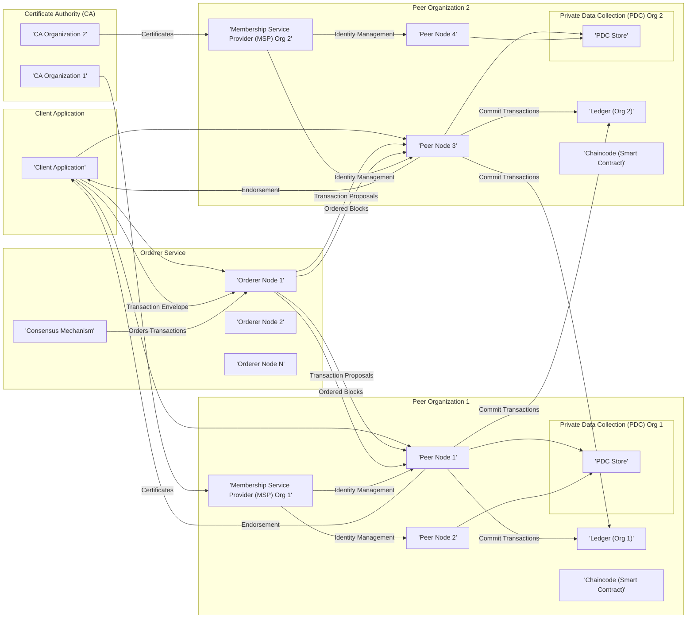
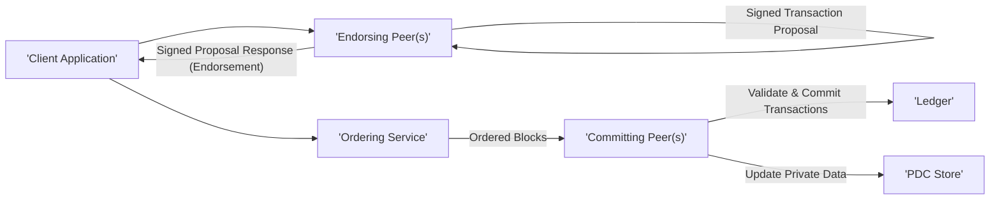

## Project Design Document: Hyperledger Fabric (Improved)

**1. Introduction**

This document provides an enhanced architectural overview of Hyperledger Fabric, a modular and extensible blockchain platform designed for enterprise solutions. It details the core components, their interactions, and the flow of data within a Fabric network, serving as a crucial foundation for subsequent threat modeling activities. This document emphasizes aspects relevant to security analysis.

**2. Project Goals**

Hyperledger Fabric aims to deliver a permissioned blockchain platform with the following key objectives:

*   **Enhanced Confidentiality:**  To enable private and confidential transactions through the use of channels and private data collections, restricting data access to authorized participants.
*   **Scalable Performance:** To achieve high transaction throughput and scalability via a distributed ledger architecture and efficient transaction processing mechanisms.
*   **Modular and Extensible Design:** To offer pluggable components for critical functionalities such as consensus protocols, identity management systems, and cryptographic algorithms, allowing for customization and future adaptability.
*   **Enterprise-Grade Performance:** To provide optimized performance characteristics, including rapid transaction finality, suitable for demanding enterprise use cases.
*   **Flexible Governance Models:** To support the implementation of complex organizational structures and governance policies within the blockchain network.

**3. Architectural Overview**

Hyperledger Fabric employs a modular architecture where distinct components collaborate to provide blockchain functionalities. The diagram below illustrates the high-level interactions between these components:

**4. Component Details**

This section provides a detailed description of the key components within the Hyperledger Fabric architecture:

*   **Client Application:**
    *   Represents an external application or system that interacts with the Fabric network.
    *   Utilizes the Hyperledger Fabric SDK (available in various languages) to communicate with peers and the orderer service.
    *   Manages user identities, including private keys, and is responsible for signing transaction proposals.
    *   Security considerations include secure key storage and protection against application-level vulnerabilities.

*   **Peers:**
    *   Fundamental building blocks of the network, maintaining a copy of the ledger and executing chaincode.
    *   **Endorsing Peers:**  A subset of peers within an organization responsible for simulating transactions and endorsing the results based on chaincode logic and endorsement policies. They play a critical role in transaction validation.
    *   **Committing Peers:** All peers on a channel ultimately validate and commit blocks of transactions to their local ledger.
    *   Maintain the blockchain ledger, which includes the immutable transaction history, and the world state database, representing the current state of assets.
    *   Host and execute chaincode (smart contracts) within secure containers (e.g., Docker).
    *   Security considerations involve securing access to the peer's file system, protecting private keys used for signing, and mitigating risks associated with chaincode execution.

*   **Ledger:**
    *   The distributed and synchronized record of all transactions within a channel.
    *   **Blockchain:** An append-only, immutable sequence of blocks, where each block contains a batch of ordered transactions. Blocks are cryptographically linked.
    *   **World State:** A key-value database (typically LevelDB or CouchDB) that holds the current values of assets on the blockchain. It is derived from the transaction log in the blockchain.
    *   Security considerations include ensuring the integrity and immutability of the blockchain and protecting the confidentiality of data stored in the world state (especially when using private data collections).

*   **Chaincode (Smart Contract):**
    *   Self-executing code, written in languages like Go, Java, or Node.js, that defines the business logic and rules for interacting with the ledger.
    *   Deployed and executed within isolated environments (containers) on peer nodes.
    *   Interacts with the ledger to read and write data, implementing the core functionality of the blockchain application.
    *   Security is paramount: vulnerabilities in chaincode can lead to significant exploits. Secure coding practices, thorough testing, and formal verification are crucial.

*   **Orderer Service:**
    *   A collection of nodes forming the transaction ordering service.
    *   Responsible for establishing a total order of transactions and packaging them into blocks.
    *   Implements a pluggable consensus mechanism (e.g., Raft, Kafka) to ensure agreement on the order of transactions.
    *   Does not execute chaincode or maintain the world state. Its primary function is transaction ordering and block creation.
    *   Security considerations focus on the robustness of the consensus mechanism against attacks and ensuring the integrity and availability of the ordering service.

*   **Membership Service Provider (MSP):**
    *   A component that provides an abstraction for managing identities and permissions within the Fabric network.
    *   Defines the rules and structures for validating identities and authenticating network participants (clients, peers, orderers).
    *   Typically relies on a Certificate Authority (CA) for issuing digital certificates.
    *   Security of the MSP configuration and the underlying CA is critical for maintaining the integrity of the permissioned network.

*   **Certificate Authority (CA):**
    *   Issues digital certificates to network participants, which are used for identity verification and authentication.
    *   Forms the root of trust for the Fabric network's Public Key Infrastructure (PKI).
    *   Compromise of a CA can have severe security implications, allowing unauthorized entities to impersonate legitimate participants.

*   **Channels:**
    *   Private and isolated communication subnetworks within a Hyperledger Fabric network.
    *   Provide data segregation and confidentiality by allowing only specific sets of peers to participate in transactions and maintain a shared ledger for that channel.
    *   Peers can be members of multiple channels, enabling complex organizational structures and data access control.
    *   Channel configuration and access control policies are crucial for maintaining data privacy.

*   **Private Data Collections (PDC):**
    *   A mechanism for storing private and confidential data within a channel, restricting access to only authorized organizations.
    *   The actual private data is stored off-chain in a private database on authorized peers. A hash of the private data is committed to the channel's ledger for auditability and immutability.
    *   Security considerations involve securing the off-chain private data stores and managing access control policies for the PDC.

**5. Data Flow (Detailed)**

The following steps outline a typical transaction flow in Hyperledger Fabric, highlighting security-relevant interactions:

1. **Transaction Proposal Creation:**
    *   The `'Client Application'` constructs a transaction proposal, specifying the chaincode function to invoke and its arguments. This proposal is digitally signed using the client's private key for non-repudiation.

2. **Proposal Endorsement Request:**
    *   The `'Client Application'` sends the signed transaction proposal to the designated `'Endorsing Peer(s)'` of the relevant organizations, as defined by the chaincode's endorsement policy. Communication should occur over secure channels (e.g., gRPC with TLS).

3. **Transaction Simulation and Endorsement:**
    *   The `'Endorsing Peer(s)'` verify the client's signature and simulate the transaction by executing the specified chaincode function in an isolated environment.
    *   They produce a read-write set (the proposed changes to the world state) and sign the proposal response (endorsement) using their private key. The endorsement indicates the peer's agreement with the proposed changes.

4. **Collection of Endorsements:**
    *   The `'Client Application'` gathers the signed proposal responses (endorsements) from the endorsing peers. It verifies the signatures to ensure the responses are valid and originate from the expected peers.

5. **Transaction Envelope Assembly:**
    *   Once the client has collected sufficient valid endorsements (as per the endorsement policy), it assembles a transaction envelope. This envelope contains the original transaction proposal, the collected endorsements, and other metadata.

6. **Transaction Submission to Orderer:**
    *   The `'Client Application'` submits the transaction envelope to the `'Ordering Service'`. This communication should be secured (e.g., TLS).

7. **Transaction Ordering and Block Creation:**
    *   The `'Ordering Service'` receives transactions from various clients and orders them into blocks based on the configured consensus mechanism. The consensus process ensures agreement among the orderer nodes on the order of transactions.

8. **Block Distribution:**
    *   The `'Ordering Service'` distributes the newly formed blocks to all `'Committing Peer(s)'` on the channel.

9. **Block Validation and Transaction Commitment:**
    *   Each `'Committing Peer'` validates the block. This includes verifying the signatures of the transactions, checking the endorsement policy, and ensuring there are no read-write set conflicts.
    *   Valid transactions are committed to the peer's local `'Ledger'`, and the `'World State'` is updated accordingly. Peers also update their `'PDC Store'` if the transaction involves private data.

**6. Security Considerations (Expanded)**

This section expands on the security considerations relevant to Hyperledger Fabric, providing more specific examples:

*   **Identity and Access Management (IAM):**
    *   **Threat:** Compromise of the `'Membership Service Provider (MSP)'` or `'Certificate Authority (CA)'` could allow unauthorized entities to join the network or impersonate legitimate members.
    *   **Mitigation:** Implement strong security measures for the CA, including hardware security modules (HSMs) for key protection, and enforce strict access control policies for MSP configuration. Regular auditing of IAM configurations is essential.
    *   **Threat:** Weak or compromised private keys of network participants can lead to unauthorized transaction submissions or data access.
    *   **Mitigation:** Mandate secure key generation and storage practices. Consider using hardware wallets or secure enclaves. Implement key rotation policies.

*   **Transaction Confidentiality:**
    *   **Threat:** Unauthorized access to channel data or private data collections.
    *   **Mitigation:** Properly configure channel membership and private data collection access control policies. Employ encryption for data at rest and in transit. Carefully design chaincode to avoid unintentionally exposing sensitive information.
    *   **Threat:** Vulnerabilities in chaincode logic could leak sensitive data or bypass access controls.
    *   **Mitigation:** Implement secure coding practices, perform thorough security audits and penetration testing of chaincode. Consider using formal verification methods.

*   **Transaction Integrity:**
    *   **Threat:** Attacks on the consensus mechanism could lead to the ordering of invalid or malicious transactions.
    *   **Mitigation:** Choose a robust consensus mechanism (e.g., Raft) and properly configure the orderer service. Implement monitoring and alerting for suspicious activity.
    *   **Threat:** Manipulation of endorsements could allow invalid transactions to be committed.
    *   **Mitigation:** Carefully define and enforce endorsement policies. Ensure that a sufficient number of trusted organizations endorse transactions.

*   **Chaincode Security:**
    *   **Threat:** Common smart contract vulnerabilities like reentrancy, integer overflows, and access control flaws can be exploited.
    *   **Mitigation:** Employ secure coding practices, conduct thorough static and dynamic analysis of chaincode, and perform regular security audits. Consider using smart contract development frameworks that offer built-in security features.
    *   **Threat:** Malicious chaincode could be deployed to steal data or disrupt network operations.
    *   **Mitigation:** Implement strict governance processes for chaincode deployment and upgrades. Utilize chaincode lifecycle management features to control access and approval.

*   **Network Security:**
    *   **Threat:** Man-in-the-middle (MITM) attacks could compromise communication between network components.
    *   **Mitigation:** Enforce the use of TLS for all communication channels between peers, orderers, and clients. Use strong cipher suites.
    *   **Threat:** Denial of Service (DoS) attacks could overwhelm network resources.
    *   **Mitigation:** Implement rate limiting, firewalls, and intrusion detection/prevention systems. Consider using a content delivery network (CDN) for client-facing applications.

*   **Key Management:**
    *   **Threat:** Improper storage or handling of cryptographic keys can lead to compromise.
    *   **Mitigation:** Utilize hardware security modules (HSMs) for storing sensitive keys. Implement secure key generation, rotation, and revocation procedures.

**7. Assumptions and Constraints**

*   This design document assumes a basic understanding of distributed systems and cryptography.
*   The focus is on the logical architecture of Hyperledger Fabric. Specific deployment configurations and infrastructure choices are not detailed.
*   The threat model derived from this document will primarily focus on a permissioned blockchain network. Public blockchain considerations are outside the scope.
*   This document does not cover specific integrations with external systems or legacy applications.

**8. Future Considerations**

*   Detailed diagrams illustrating the internal architecture of individual components (e.g., peer node structure, orderer node structure).
*   In-depth analysis of specific security mechanisms within Hyperledger Fabric, such as the gossip protocol's security features.
*   Considerations for integrating Hyperledger Fabric with hardware security technologies and confidential computing platforms.
*   Exploration of advanced security features like zero-knowledge proofs for enhanced privacy.

This improved design document provides a more detailed and security-focused overview of Hyperledger Fabric's architecture, serving as a robust foundation for subsequent threat modeling activities. The enhanced descriptions of components, data flows, and security considerations aim to facilitate a comprehensive analysis of potential vulnerabilities and the development of effective mitigation strategies.